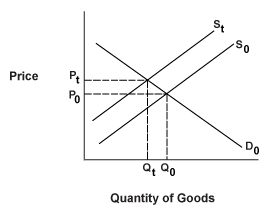

## Table of Contents

## What is a supply shock?

A supply shock is when something unexpected happens that changes how much of a product or service is available. This can make the supply go up or down suddenly. For example, if a big storm destroys a lot of crops, there will be less food available, which is a negative supply shock. On the other hand, if a new technology makes it easier to produce something, there might be more of it available, which is a positive supply shock.

These shocks can affect prices and the economy. If there's less of something, like in the case of the storm destroying crops, the price of that product might go up because people still want it but there's not enough to go around. If there's more of something, like with the new technology, the price might go down because there's plenty to go around. Supply shocks can cause big changes and sometimes lead to inflation or deflation, depending on whether prices go up or down.

## What are the main types of supply shocks?

There are two main types of supply shocks: positive supply shocks and negative supply shocks. A positive supply shock happens when something unexpected makes it easier to produce more of a good or service. This can happen because of new technology, like a new way to grow crops faster, or because of a good event, like finding a new source of oil. When this happens, there's more of the product available, which can make prices go down and help the economy grow.

A negative supply shock is the opposite. It happens when something unexpected makes it harder to produce goods or services. This can be because of a bad event, like a natural disaster that destroys factories, or because of a sudden increase in the cost of making something, like a big jump in oil prices. When this happens, there's less of the product available, which can make prices go up and can slow down the economy or even cause a recession if it's bad enough.

## Can you give examples of events that cause supply shocks?

A negative supply shock can happen when a natural disaster, like a hurricane or earthquake, destroys factories or farms. For example, if a hurricane hits a big oil-producing area, it can damage the oil rigs and pipelines, which means there will be less oil available. This can make gas prices go up because people still need gas but there's not as much to go around. Another example is when a disease affects crops, like when a fungus destroys a lot of wheat in a country that grows a lot of wheat. This can make the price of bread and other wheat products go up because there's less wheat to make them.

A positive supply shock can happen when new technology makes it easier to produce things. For example, if scientists invent a new way to grow more food using less water, farmers can produce more food, which can make food prices go down because there's more food available. Another example is finding a new source of a resource, like discovering a new oil field. This can make more oil available, which can lower gas prices because there's more oil to go around.

Both types of supply shocks can have big effects on the economy. Negative supply shocks can make things more expensive and can slow down the economy, while positive supply shocks can make things cheaper and can help the economy grow. It's important for people who make decisions about the economy to understand these shocks so they can help manage their effects.

## How do supply shocks affect the economy?

Supply shocks can have a big impact on the economy. When there's a negative supply shock, like a natural disaster that destroys a lot of factories, it means there's less stuff available. This can make prices go up because people still want the things that are now harder to get. For example, if a big storm wrecks a lot of oil rigs, there will be less oil, and gas prices might go up. This can slow down the economy because people and businesses have to pay more for things, and they might not be able to buy as much as before.

On the other hand, a positive supply shock can help the economy grow. This happens when something makes it easier to produce more stuff, like a new technology that helps farmers grow more food. When there's more food available, the price of food might go down because there's plenty to go around. This can make people and businesses happier because they can buy more things with their money. So, positive supply shocks can make the economy stronger by making things cheaper and easier to get.

## What is the difference between a positive and a negative supply shock?

A positive supply shock is when something unexpected happens that makes it easier to produce more of a product or service. This can be because of a new technology that helps make things faster or cheaper, or because of finding a new resource, like a new oil field. When this happens, there's more of the product available, which can make prices go down. This is good for the economy because people and businesses can buy more things with their money, and it can help the economy grow.

A negative supply shock is when something unexpected happens that makes it harder to produce goods or services. This can happen because of a natural disaster, like a hurricane that destroys factories, or because the cost of making something goes up a lot, like a big increase in oil prices. When this happens, there's less of the product available, which can make prices go up. This can slow down the economy because people and businesses have to pay more for things, and they might not be able to buy as much as before.

## How do supply shocks impact inflation?

Supply shocks can have a big effect on inflation. When there's a negative supply shock, like a natural disaster that destroys factories or farms, it means there's less stuff available. This can make prices go up because people still want the things that are now harder to get. For example, if a big storm wrecks a lot of oil rigs, there will be less oil, and gas prices might go up. When prices go up like this, it can cause inflation, which means the overall level of prices in the economy is rising.

On the other hand, a positive supply shock can help lower inflation. This happens when something makes it easier to produce more stuff, like a new technology that helps farmers grow more food. When there's more food available, the price of food might go down because there's plenty to go around. This can make the overall level of prices in the economy go down, which is called deflation, or at least slow down the rate of inflation. So, positive supply shocks can help keep inflation in check by making things cheaper and easier to get.

## What role do supply shocks play in business cycles?

Supply shocks can have a big impact on business cycles. A business cycle is the ups and downs that happen in the economy over time. When there's a negative supply shock, like a natural disaster that destroys factories, it means there's less stuff available. This can make prices go up and can slow down the economy because people and businesses have to pay more for things. This can lead to a downturn in the business cycle, where the economy is not doing as well and might even go into a recession.

On the other hand, a positive supply shock can help the economy grow and can lead to an upswing in the business cycle. This happens when something makes it easier to produce more stuff, like a new technology that helps farmers grow more food. When there's more food available, the price of food might go down because there's plenty to go around. This can make people and businesses happier because they can buy more things with their money, which can help the economy get stronger and move into a period of growth. So, supply shocks can play a big role in moving the economy through its ups and downs.

## How can governments and central banks respond to supply shocks?

When a negative supply shock happens, like a hurricane destroying factories, governments can help by giving money or resources to the affected areas to help them recover faster. They can also change laws to make it easier for businesses to keep producing things. For example, they might lower taxes or give special loans to help businesses get back on their feet. Central banks, which control the money supply, can also help by lowering interest rates. This makes it cheaper for businesses to borrow money, which can help them keep going even when things are tough.

On the other hand, when a positive supply shock happens, like a new technology making it easier to produce more food, governments and central banks might not need to do as much. But they can still help by making sure the economy stays stable. They might keep an eye on prices to make sure they don't go down too fast, which can cause problems too. Central banks might adjust interest rates to keep the economy growing at a steady pace, making sure that the positive shock helps everyone without causing too much change too quickly.

## What are the long-term effects of supply shocks on an economy?

Supply shocks can have big effects on an economy that last a long time. When a negative supply shock happens, like a big storm destroying factories, it can make prices go up for a while. This can slow down the economy because people and businesses have to pay more for things. If the shock is really bad, it can even cause a recession, where the economy shrinks and a lot of people lose their jobs. Over time, the economy might recover, but it can take years, and some businesses might never come back. This can change how the economy works in the long run, making it harder for some industries to grow again.

On the other hand, a positive supply shock can help the economy grow in the long term. When something makes it easier to produce more stuff, like a new way to grow food faster, it can make prices go down. This can make people and businesses happier because they can buy more things with their money. Over time, this can help the economy get stronger and can lead to more jobs and better living standards. But it's important for the government and central banks to make sure the economy stays stable and doesn't grow too fast, which can cause other problems. So, while positive supply shocks can be good, they need to be managed carefully to make sure they help the economy in the long run.

## How do supply shocks influence international trade and global markets?

Supply shocks can really change how countries trade with each other and affect global markets. When a negative supply shock happens in one country, like a big storm destroying farms, it can mean that country has less to sell to other countries. This can make the price of that product go up all over the world because there's less of it to go around. For example, if a country that grows a lot of wheat has a bad harvest, wheat prices might go up everywhere, and countries that import wheat might have to pay more for it. This can cause problems for other countries' economies because they have to spend more money on imports, which can make their own prices go up and slow down their economies.

On the other hand, a positive supply shock can help international trade and global markets. If a country finds a new way to produce more of something, like a new technology that helps make cars cheaper, it can sell more of that product to other countries. This can make the price of that product go down all over the world because there's more of it available. For example, if a country starts making more oil because of new technology, gas prices might go down everywhere, and countries that import oil might save money. This can help other countries' economies grow because they can spend less on imports and have more money to spend on other things. So, supply shocks can have big effects on how countries trade with each other and how well global markets do.

## What are some historical case studies of significant supply shocks?

One big example of a negative supply shock happened in the 1970s. It was called the oil crisis. Back then, a group of countries that made a lot of oil, called OPEC, decided to stop selling oil to some countries because they were mad about political stuff. This made the price of oil go way up all over the world because there was suddenly less oil to go around. People had to pay a lot more for gas, and it caused big problems for economies everywhere. Many countries had high inflation, which means prices went up a lot, and some even had recessions, which means their economies got smaller and a lot of people lost their jobs.

Another example of a supply shock was the positive one that happened in the 1990s with the internet. Before the internet, it was hard for people and businesses to share information quickly. But when the internet came along, it made it a lot easier to do things like buy and sell things online, and it made it easier for businesses to work with each other from far away. This helped the economy grow a lot because it made it easier for people to start new businesses and for existing businesses to make more money. The internet changed how the world worked and helped make a lot of new jobs and opportunities.

These two examples show how supply shocks, whether they make things harder or easier to produce, can have big effects on the economy. The oil crisis showed how a negative supply shock can cause problems like high prices and recessions, while the internet showed how a positive supply shock can help the economy grow and create new opportunities.

## How can predictive models and economic indicators help anticipate supply shocks?

Predictive models and economic indicators can help anticipate supply shocks by looking at patterns and data that might show when something big is going to happen. For example, scientists can use weather models to predict if a big storm is coming that could destroy farms or factories. Economists can also look at things like how much stuff a country is making and how much it's using to see if there might be problems coming up. If a country is using up a lot of its resources really fast, it might run out soon, which could cause a supply shock. By keeping an eye on these things, people can get ready for supply shocks before they happen.

Economic indicators like inflation rates, employment numbers, and production levels can also give clues about supply shocks. If prices are going up really fast, it might mean there's a negative supply shock happening, like when oil prices went up during the oil crisis. On the other hand, if prices are going down a lot, it might mean there's a positive supply shock, like when the internet made it easier for businesses to work together. By watching these indicators, governments and businesses can make plans to deal with supply shocks better, like finding new ways to make things or helping people who might lose their jobs.

## References & Further Reading

[1]: Kilian, L. (2008). ["The Economic Effects of Energy Price Shocks."](https://www.aeaweb.org/articles?id=10.1257/jel.46.4.871) Journal of Economic Literature, 46(4), 871-909.

[2]: Hamilton, J. D. (1983). ["Oil and the Macroeconomy since World War II."](https://www.jstor.org/stable/1832055) Journal of Political Economy, 91(2), 228-248.

[3]: Blanchard, O. J., & Galí, J. (2007). ["The Macroeconomic Effects of Oil Price Shocks: Why are the 2000s so Different from the 1970s?"](https://www.nber.org/papers/w13368) National Bureau of Economic Research Working Paper Series (No. 13368).

[4]: Lopez de Prado, M. (2018). ["Advances in Financial Machine Learning."](https://www.amazon.com/Advances-Financial-Machine-Learning-Marcos/dp/1119482089) Wiley Finance.

[5]: Shapiro, M. D., & Watson, M. W. (1988). ["Sources of Business Cycle Fluctuations."](https://www.princeton.edu/~mwatson/papers/Shapiro_Watson_NBERMA_1988.pdf) NBER Macroeconomics Annual, 3, 111-148.

[6]: Yergin, D. (1991). ["The Prize: The Epic Quest for Oil, Money & Power."](https://www.amazon.com/Prize-Epic-Quest-Money-Power/dp/1439110123) Free Press.