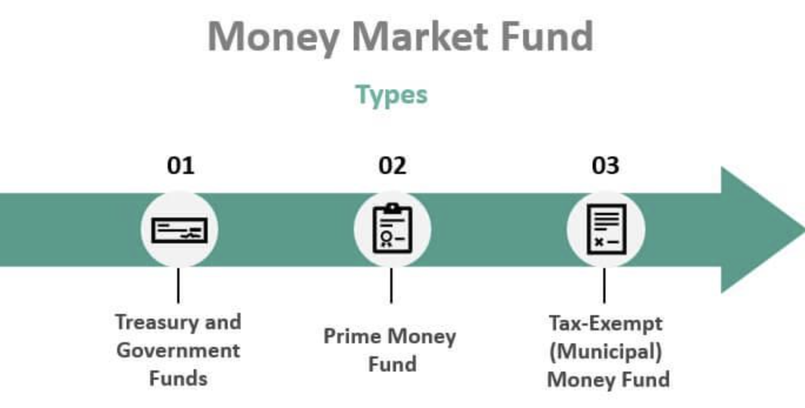

## Table of Contents

## What is a money market fund?

A money market fund is a type of investment where you pool your money with other investors to buy safe, short-term securities. These securities include things like government bonds, treasury bills, and commercial paper from companies. The goal is to keep your money safe while earning a small amount of interest.

Money market funds are often seen as a low-risk place to keep your cash. They aim to keep the value of your investment stable, usually at $1 per share. This makes them a good choice if you want to park your money somewhere safe for a short time, like a few months, while still earning a bit of interest.

## What does NAV (Net Asset Value) mean in the context of money market funds?

In money market funds, NAV stands for Net Asset Value. It's a way to measure how much each share of the fund is worth. You find the NAV by taking the total value of all the investments in the fund and dividing it by the number of shares that people own. This number is important because it shows you the price of one share at any given time.

Money market funds usually try to keep their NAV at $1 per share. This is called a "stable NAV." They do this by investing in very safe and short-term securities, so the value of the fund doesn't go up and down a lot. If the NAV ever drops below $1, it's a big deal and is called "breaking the buck." But this is rare because money market funds are designed to be very safe.

## How is the NAV of a money market fund typically calculated?

The NAV of a money market fund is calculated by taking the total value of all the investments the fund owns and subtracting any liabilities or expenses the fund has. This gives you the net value of the fund. Then, you divide this net value by the total number of shares that investors own in the fund. The result is the NAV per share, which tells you how much one share of the fund is worth.

Money market funds aim to keep their NAV at $1 per share. They do this by investing in very safe and short-term securities like government bonds and treasury bills. These investments are less likely to lose value, which helps keep the NAV stable. If the value of the investments goes down a lot, the NAV could drop below $1, but this is rare because money market funds are designed to be very safe.

## What are common causes of NAV deviation in money market funds?

NAV deviation in money market funds can happen when the value of the securities the fund holds goes up or down a lot. This can be caused by changes in interest rates. If interest rates go up, the value of the securities the fund owns might go down, which could lower the NAV. Also, if a company that issued a security the fund owns has financial problems, the value of that security could drop, affecting the NAV.

Another reason for NAV deviation could be if a lot of people want to take their money out of the fund at the same time. This is called a "run on the fund." If the fund has to sell securities quickly to give people their money, it might have to sell them for less than they are worth, which can lower the NAV. But money market funds are designed to be very safe, so these big changes in NAV are rare.

## How do interest rate changes affect the NAV of money market funds?

When interest rates change, it can affect the value of the securities that a money market fund owns. If interest rates go up, the value of the securities the fund holds, like bonds, usually goes down. This happens because new bonds will be issued with higher interest rates, making the older bonds with lower rates less attractive to investors. So, if the fund has to sell these older bonds, it might get less money for them than it paid, which can make the NAV of the fund go down.

On the other hand, if interest rates go down, the value of the securities in the fund usually goes up. This is because the older bonds with higher interest rates become more attractive to investors compared to the new bonds with lower rates. If the fund needs to sell these securities, it can get more money for them than it paid, which can help keep the NAV stable or even make it go up a little. But remember, money market funds try to keep their NAV at $1 per share, so these changes are usually small.

## What role do credit events play in causing NAV deviations?

Credit events can cause the NAV of a money market fund to deviate from its target of $1 per share. A credit event happens when a company that issued a security the fund owns has financial problems. For example, if a company can't pay back its debt, the value of the security it issued goes down. If the money market fund owns that security, the fund's overall value drops, which can lower the NAV.

Money market funds try to avoid big NAV changes by investing in very safe securities. But if a credit event happens, it can still affect the fund's NAV. The fund managers might have to sell the affected security at a lower price, which can cause the NAV to drop. This is why money market funds are careful about the securities they buy, to keep the risk of credit events as low as possible.

## Can operational errors lead to NAV deviations, and if so, how?

Yes, operational errors can lead to NAV deviations in money market funds. These errors can happen when the people managing the fund make mistakes, like entering the wrong numbers into their systems or not keeping track of the fund's assets correctly. If they make a mistake, the NAV they calculate might not be right. For example, if they forget to include some of the fund's money or securities in the calculation, the NAV might be lower than it should be.

These errors can also happen if the fund's systems fail or if there is a problem with how the fund's transactions are processed. For instance, if a transaction is recorded at the wrong time or not at all, it can affect the total value of the fund. This can make the NAV go up or down in a way that doesn't reflect the true value of the fund's investments. Money market funds have rules and checks in place to try to avoid these errors, but sometimes they can still happen.

## How do liquidity issues impact the NAV of money market funds?

Liquidity issues can affect the NAV of money market funds when a lot of people want to take their money out of the fund at the same time. This is called a "run on the fund." When this happens, the fund might have to sell its investments quickly to give people their money back. If the fund has to sell these investments at a lower price than they are worth, it can lower the NAV. This is because the total value of the fund goes down when the investments are sold for less.

Money market funds try to avoid this problem by keeping some of their money in very liquid securities, like government bonds, that can be sold quickly without losing much value. But if too many people want their money back at once, even these liquid securities might not be enough. This can cause the NAV to drop if the fund has to sell other, less liquid securities at a loss. So, [liquidity](/wiki/liquidity-risk-premium) issues can make the NAV of a money market fund go down if not managed well.

## What are the regulatory requirements concerning NAV stability in money market funds?

Money market funds have to follow rules set by the government to keep their NAV stable. In the United States, the main rule is from the Securities and Exchange Commission (SEC). The rule says that money market funds need to keep their NAV at $1 per share. They do this by investing in safe, short-term securities like government bonds and treasury bills. The SEC also wants funds to have enough cash or easy-to-sell securities on hand, so they can handle it if a lot of people want their money back at the same time.

If a money market fund's NAV drops below $1, it's a big deal and called "breaking the buck." To avoid this, the SEC has rules about how much risk a fund can take. For example, funds can't invest too much money in one company's securities. They also have to check the credit quality of the securities they buy. These rules help make sure that money market funds stay safe and keep their NAV stable, even when things like interest rates or credit events happen.

## How do money market funds manage and mitigate NAV deviations?

Money market funds work hard to keep their NAV at $1 per share. They do this by choosing very safe investments like government bonds and treasury bills. These investments are less likely to lose value, which helps keep the NAV stable. Fund managers also watch the market closely and adjust their investments if they think something might affect the NAV. They make sure to spread their investments across many different securities to lower the risk of any one investment causing a big problem.

If there's a chance the NAV might change, money market funds have rules to follow. They keep some money in very liquid securities, so they can sell them quickly if a lot of people want their money back at the same time. This helps them avoid having to sell other investments at a loss. The fund managers also check the credit quality of the securities they buy and make sure not to put too much money into one company's securities. By following these rules, money market funds can manage and reduce the chances of their NAV going up or down too much.

## What advanced tools and models are used to predict and manage NAV deviations?

Money market funds use special tools and models to help predict and manage changes in their NAV. These tools look at things like interest rates, how much money people might want to take out of the fund, and the credit quality of the securities the fund owns. By using these models, fund managers can see what might happen to the NAV if something changes in the market. This helps them make smart choices about which securities to buy or sell, so they can keep the NAV stable.

One important tool is called a risk management model. This model helps the fund managers understand how different risks, like changes in interest rates or a company having financial problems, could affect the fund's NAV. They use this information to adjust their investments and make sure they have enough safe, easy-to-sell securities on hand. This way, if a lot of people want their money back at once, the fund can handle it without losing value.

Another tool is called stress testing. This involves running different scenarios to see how the fund would do if something bad happened, like a big drop in the value of securities or a rush of people wanting their money back. By doing these tests, fund managers can plan ahead and take steps to protect the fund's NAV. These advanced tools and models help money market funds stay safe and keep their NAV at $1 per share.

## How have historical events like the 2008 financial crisis influenced strategies for managing NAV deviations in money market funds?

The 2008 financial crisis had a big impact on how money market funds manage their NAV. During the crisis, a money market fund called the Reserve Primary Fund "broke the buck" when its NAV dropped below $1 because it owned a lot of Lehman Brothers securities that lost value. This scared a lot of people and caused a run on many money market funds, where investors wanted their money back all at once. After this, the government made new rules to make money market funds safer. Now, funds have to keep more of their money in very safe and easy-to-sell securities, and they can't invest too much in one company's securities.

Because of the 2008 crisis, money market funds also started using more advanced tools and models to predict and manage NAV changes. They do things like stress testing, which means they run different bad scenarios to see how the fund would do if something went wrong. This helps them plan ahead and make sure they can handle it if a lot of people want their money back at the same time. By learning from the past, money market funds now work harder to keep their NAV stable and protect investors' money.

## References & Further Reading

[1]: Investment Company Institute. (2011). ["Report of the Money Market Working Group."](https://www.ici.org/system/files/attachments/pdf/ppr_09_mmwg_sec_7.pdf)

[2]: Kacperczyk, M., & Schnabl, P. (2013). ["How Safe Are Money Market Funds?"](https://academic.oup.com/qje/article-abstract/128/3/1073/1850594) The Quarterly Journal of Economics, 128(3), 1073-1122.

[3]: McCabe, P. E. (2010). ["The Cross Section of Money Market Fund Risks and Financial Crises."](https://www.federalreserve.gov/Pubs/feds/2010/201051/201051pap.pdf) Board of Governors of the Federal Reserve System.

[4]: SEC. (2014). ["Money Market Fund Reform; Amendments to Form PF."](https://www.sec.gov/files/rules/final/2014/33-9616.pdf) Securities and Exchange Commission.

[5]: Lopez de Prado, M. (2018). ["Advances in Financial Machine Learning"](https://www.amazon.com/Advances-Financial-Machine-Learning-Marcos/dp/1119482089) by Marcos Lopez de Prado.

[6]: SIFMA. (2020). ["Money Market Funds: A Resource for Institutional Investors."](https://www.sifma.org/resources/submissions/letters/potential-reform-measures-for-money-market-funds/)