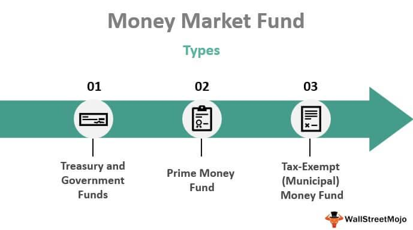

Money market funds have long been a cornerstone for investors pursuing safety and liquidity. These funds are managed portfolios that invest in short-term, high-quality instruments such as government securities, certificates of deposit, and commercial paper. The primary objective of money market funds is to maintain a stable net asset value (NAV) of $1, which they achieve by holding highly liquid assets that are considered low-risk. Despite their reputation for stability, specific market events can disrupt this stability, leading to a scenario known as "breaking the buck," where the NAV falls below $1, resulting in losses for investors.

The stability of money market funds is crucial for the financial system, and their management requires constant vigilance, especially during periods of economic uncertainty. One emerging factor profoundly influencing money market funds is algorithmic trading. Algorithmic trading uses automated systems and sophisticated mathematical models to execute trades. This technology can provide efficiencies and speed but also introduces new dynamics and potential vulnerabilities to money markets.

This article will explore the complex landscape of breaking the buck in money market funds, examining historical instances where this has occurred and analyzing the influence of algorithmic trading. Understanding these elements is essential for investors aiming to mitigate risks while preserving the benefits of money market funds.

## Table of Contents

## Understanding Money Market Funds

Money market funds, a staple in investment portfolios, are designed to provide safety and liquidity by investing in low-risk, highly liquid, short-term financial instruments. These funds typically include assets like government securities, certificates of deposit, and high-grade commercial paper. The primary objective of money market funds is to offer investors a slightly higher yield compared to traditional savings accounts while maintaining a high degree of stability.

One of the defining characteristics of these investment vehicles is their target net asset value (NAV) of $1 per share. This stable NAV is achieved through careful selection of assets that mature in a short timeframe, generally less than one year. While money market funds are not backed by the Federal Deposit Insurance Corporation (FDIC), they have maintained a strong track record of preserving principal by limiting exposure to higher-risk securities.

Investors are attracted to money market funds due to their potential for better returns compared to standard savings accounts, driven by the interest income generated from the underlying short-term instruments. The funds' assets are managed to ensure that they align with short-term interest rates, providing returns that are generally responsive to market movements while still aiming to avoid any erosion of principal.

## What Does 'Breaking the Buck' Mean?

Breaking the buck refers to a situation where the net asset value (NAV) of a money market fund drops below the conventional value of $1 per share, resulting in a loss of principal for investors. Money market funds typically maintain a stable NAV of $1, aiming to offer a safe haven for investors by investing in short-term, high-quality financial instruments. When a fund breaks the buck, it signals potential economic distress, contrary to the expectation of near-zero risk associated with these funds.

This situation generally arises from significant investment losses. For example, a sudden decline in the credit quality of the securities held by the fund could reduce their market value. Additionally, a sharp decrease in market interest rates might generate lower returns from new investments, insufficient to cover the fund's operating expenses. These scenarios can lead to the NAV dropping below the $1 threshold, indicating not only a failure to provide returns but also an erosion of the invested principal.

Breaking the buck serves as a caution that money market funds, despite their relative safety, are susceptible to market conditions and financial tides that threaten their stability. Understanding the triggers and mechanics of this phenomenon is essential for both fund managers and investors to protect assets and maintain confidence in this financial instrument.

## Historical Instances of Breaking the Buck

Breaking the buck, a term describing the decline of a money market fund's net asset value (NAV) below $1, has been a rare occurrence throughout the history of money market funds. Before the financial turmoil of 2008, this event had only one significant precedent in 1994 when the Community Bankers U.S. Government Money Market Fund faced a similar situation. Despite its rarity, the implications of breaking the buck are profound, as it signals a departure from the perception of money market funds as nearly risk-free investments.

The most prominent case of breaking the buck occurred during the 2008 financial crisis with the Reserve Primary Fund, a hallmark event in the history of money market funds. On September 15, 2008, Lehman Brothers Holdings Inc. filed for bankruptcy, leading to the devaluation of Lehman’s commercial paper holdings within the Reserve Primary Fund. This devaluation prompted a significant drop in the NAV of the fund, which ultimately fell to $0.97 per share, officially "breaking the buck."

The repercussions of this event were widespread, instigating panic among investors and triggering a run on money market funds. Investors, worried about the safety of their investments, rapidly withdrew funds, causing [liquidity](/wiki/liquidity-risk-premium) pressures across the entire money market sector. This situation highlighted the systemic risks associated with money market funds, traditionally viewed as safe havens for cash-equivalent investments.

The U.S. government recognized the potential for a broader financial contagion and swiftly implemented measures to stabilize the market. One such measure was the U.S. Treasury's Temporary Guarantee Program for Money Market Funds, which protected the holdings in participating funds up to the fund’s balance as of September 19, 2008. This intervention aimed to restore investor confidence and halt the run on money market funds by providing a temporary safety net.

The 2008 crisis underscored the interconnectedness of financial institutions and the susceptibility of money market funds to systemic shocks, despite their conservative investment strategies. It also emphasized the critical need for regulatory frameworks to address vulnerabilities within these funds. The lessons learned from this event have continued to shape regulations and reforms in the financial markets, aimed at enhancing the resilience and liquidity management of money market funds to prevent such occurrences in the future.

## The Role of Algorithmic Trading

Algorithmic trading, often referred to as algo trading, leverages automated, complex mathematical models and algorithms to manage investments. This method significantly enhances the speed and efficiency of trading by enabling rapid execution of orders based on pre-programmed instructions. The algorithms in use analyze vast amounts of data, detect patterns, and execute trades at a pace far beyond human capabilities.

In the context of money market funds, algo trading presents both benefits and challenges. On the one hand, it introduces efficiency by reducing transaction costs and minimizing time delays through high-frequency trading. The capacity of algorithms to monitor and react to market conditions in real time can potentially stabilize fund performance if managed prudently.

However, the dependency on algorithm-driven strategies can induce [volatility](/wiki/volatility-trading-strategies) in financial markets, particularly under stress conditions. Algorithms, designed primarily to maximize short-term gains, might react to volatile phases by rapidly adjusting investment positions, potentially destabilizing fund valuations. This behavior can be problematic for money market funds, as it risks devaluation of their assets and, in extreme situations, may contribute to the scenario known as "breaking the buck"—where the fund's net asset value falls below the critical $1 mark.

The interaction of [algorithmic trading](/wiki/algorithmic-trading) with the market is complex, especially during financial turbulence. Algorithms can amplify market stress if their actions are triggered en masse in reaction to short-term fluctuations. For example, a sudden market downturn could prompt numerous algorithmic systems to sell off assets simultaneously to mitigate losses, thereby exacerbating the downturn—a phenomenon often referred to as a "flash crash."

By studying these responses, funds and regulators could potentially devise strategies to avoid "breaking the buck." For instance, adjusting algorithmic parameters to emphasize long-term stability rather than short-term gains during periods of market stress could help. Implementing safety measures such as circuit breakers can also curtail excessive trading activity triggered by algorithms under volatile conditions.

Understanding and managing algorithmic trading's impact on money market funds requires a balance between harnessing its speed and efficiency while mitigating its potential to disrupt fund stability. As algorithmic methods continue to evolve, ongoing analysis and adaptation will be crucial to safeguarding the resilience of money market funds amidst the challenges posed by technological advancements.

## Mitigation Strategies for Investors

Investors aiming to mitigate the risks associated with money market funds, particularly in periods of economic instability, should prioritize conducting thorough due diligence on the portfolio holdings of these funds. An essential aspect of this evaluation involves regularly reviewing both the credit quality and the maturity profile of a fund's assets. The credit quality of holdings reflects the likelihood of default, and it is crucial for funds to maintain investments in high-grade, short-term securities to minimize risk. The maturity profile should ideally consist of securities with shorter durations, as this enhances liquidity and reduces exposure to [interest rate](/wiki/interest-rate-trading-strategies) fluctuations.

Diversification emerges as another key strategy, allowing investors to spread risk across different funds. By holding positions in multiple money market funds, investors can reduce the impact of an individual fund's performance on their overall portfolio. This approach not only disperses risk but also takes advantage of the varying management strategies and asset allocations inherent in different funds. Additionally, investors might consider options with enhanced regulatory protections, such as funds that adhere to stricter guidelines set forth by regulatory bodies. These funds potentially offer more stability due to their compliance with higher safety and liquidity standards.

Implementing these strategies requires a proactive approach to monitoring and adjusting investments based on market conditions. Investors should stay informed about macroeconomic indicators and be prepared to reallocate resources as necessary to maintain their portfolio's integrity and ensure alignment with their financial goals. Furthermore, leveraging technological tools for tracking fund performance and conducting in-depth analysis can aid investors in making informed decisions, potentially safeguarding against adverse outcomes like breaking the buck.

## Conclusion

Money market funds (MMFs), though traditionally perceived as low-risk investments, are not entirely impervious to market volatilities. The concept of 'breaking the buck', while infrequent, highlights the underlying risks associated with these funds, especially when influenced by factors such as algorithmic trading. Investors should remain vigilant about these risks and stay informed about market dynamics to safeguard their investments. 

Algorithmic trading, with its rapid execution and complex strategies, has introduced new dimensions to the market environment, potentially affecting the stability of MMFs. Its ability to amplify market movements can accelerate shifts in asset prices, which, during stress periods, could lead to scenarios where MMFs might experience significant downward pressure on their net asset value (NAV).

Despite these risks, money market funds remain a viable option for investors seeking liquidity and relative stability. They provide better returns than traditional savings accounts and retain the potential for capital preservation when managed judiciously. Investors should undertake thorough analysis of individual fund portfolios, assessing the creditworthiness of the securities held and the overall maturity profile. This diligence coupled with strategic diversification can significantly mitigate risks associated with market upheavals.

Moreover, understanding the impact of technological advancements like algorithmic trading on financial markets can empower investors to make informed decisions, thereby enhancing the resilience of their investment portfolios. This involves not only staying abreast of market trends and regulatory changes but also being proactive in adapting investment strategies to counteract potential threats posed by technological disruptions. Through these measures, investors can continue to leverage the benefits of money market funds while remaining prepared for potential market perturbations.

## References & Further Reading

[1]: Investment Company Institute. (2011). ["Report of the Money Market Working Group."](https://www.ici.org/system/files/attachments/pdf/ppr_09_mmwg_sec_7.pdf)

[2]: Kacperczyk, M., & Schnabl, P. (2013). ["How Safe Are Money Market Funds?"](https://academic.oup.com/qje/article-abstract/128/3/1073/1850594) The Quarterly Journal of Economics, 128(3), 1073-1122.

[3]: McCabe, P. E. (2010). ["The Cross Section of Money Market Fund Risks and Financial Crises."](https://www.federalreserve.gov/Pubs/feds/2010/201051/201051pap.pdf) Board of Governors of the Federal Reserve System.

[4]: SEC. (2014). ["Money Market Fund Reform; Amendments to Form PF."](https://www.sec.gov/files/rules/final/2014/33-9616.pdf) Securities and Exchange Commission.

[5]: Lopez de Prado, M. (2018). ["Advances in Financial Machine Learning"](https://www.amazon.com/Advances-Financial-Machine-Learning-Marcos/dp/1119482089) by Marcos Lopez de Prado.

[6]: SIFMA. (2020). ["Money Market Funds: A Resource for Institutional Investors."](https://www.sifma.org/resources/submissions/letters/potential-reform-measures-for-money-market-funds/)