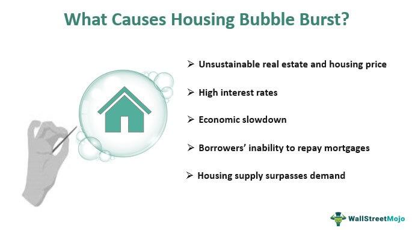

Economic bubbles are complex phenomena characterized by rapid escalation in asset prices followed by a swift collapse. These events reflect a situation where asset prices significantly deviate from their intrinsic values, ultimately leading to market corrections and economic disruptions. Historically, bubbles have been triggered and amplified by various elements including speculative investing, market sentiment, and economic policies.

The primary causes of economic bubbles can often be traced back to human behavior and market dynamics. Speculative investing frequently plays a central role, driven by investor optimism and the expectation of selling overvalued assets for a profit. This behavior is usually coupled with herding, where investors follow the actions of their peers rather than basing decisions on fundamentals. Economic policies, such as low-interest rates or deregulation, can also contribute by providing the liquidity needed for such speculative behavior to flourish.

In recent years, the advent of algorithmic trading has introduced new dimensions to market behavior and the potential for bubbles. Algorithmic trading, which involves the use of computer algorithms to execute trades at high speeds, can exacerbate volatility and influence the momentum of asset prices. This trading strategy can lead to both the rapid inflation of prices and severe downturns, as algorithms react to market signals and amplify existing trends.

Understanding these elements is crucial in today's financial markets, which are heavily reliant on technology and fast-paced decision making. By appreciating the interplay between human psychology, market dynamics, and technological tools such as algorithmic trading, stakeholders can better anticipate and mitigate the risks associated with economic bubbles. This knowledge is essential for creating strategies that can protect economic stability and enhance market resilience in the face of potential crises.

## Table of Contents

## Understanding Economic Bubbles

Economic bubbles are periods in which the price of an asset, such as stocks, real estate, or commodities, rise significantly above their intrinsic value. These phenomena often culminate in a sharp decline or crash when investors and market participants collectively recognize the overvaluation. The concept of economic bubbles is deeply rooted in financial history, serving as cautionary tales of collective hysteria and the consequences of speculative excess.

Historically, several notable economic bubbles have left lasting impacts on the markets and economics. One of the earliest recorded examples is Tulip Mania, which occurred in the Dutch Republic during the 1630s. During this period, the prices of tulip bulbs skyrocketed to astronomical levels before collapsing abruptly in February 1637. This event is often cited as one of the first major financial bubbles despite debates among scholars regarding the impact and scale of the economic consequence.

The Dot-com Bubble is another prominent example, occurring in the late 1990s and early 2000s. Fueled by speculation in Internet-based companies, stock valuations soared without corresponding profits or sustainable business models. The bubble burst in 2000, leading to significant losses and the collapse of many Internet startups. Similarly, the Housing Bubble in the United States, peaking around 2006, was characterized by rapidly increasing housing prices driven largely by subprime mortgage lending. The eventual bust contributed to the 2008 global financial crisis, underscoring the interplay between financial instruments and real estate speculation.

Economic bubbles share characteristic traits that differentiate them from typical market fluctuations. One prominent feature is irrational exuberance, a term popularized by former Federal Reserve Chairman Alan Greenspan. This occurs when asset prices continue to rise solely on the belief that they will keep increasing, despite lacking sound financial justification. Herding behavior is another defining aspect, wherein individuals mimic the investment actions of others, often driven by fear of missing out on potential gains or the assumption that the collective group cannot be wrong.

A deeper understanding of these characteristics is crucial for identifying and mitigating bubbles before they culminate in economic collapses. It also highlights the need for stakeholders in financial markets to approach periods of rapid asset price inflation with a critical and analytical mindset.

## Causes of Economic Bubbles

Economic bubbles are complex phenomena driven by multiple factors that combine to inflate asset prices beyond their intrinsic value. Understanding the causes of economic bubbles is crucial for preventing future financial crises. This section explores the key elements leading to bubble formation, with a focus on speculative investing, economic policies, technological advancements, and market sentiment.

### Speculative Investing and Economic Policies

Speculative investing plays a central role in the emergence of economic bubbles. Investors, driven by the belief of rapid financial gain, often pour money into assets without thorough analysis of their real worth. This herd mentality, fueled by the fear of missing out, can cause a rapid escalation in asset prices, known as "irrational exuberance," a term popularized by economist Alan Greenspan. As more investors engage in speculation, the demand for assets rises, pushing prices even higher and forming a bubble.

Economic policies also significantly impact bubble formation. For example, low interest rates can stimulate borrowing and investing activities, leading to increased market [liquidity](/wiki/liquidity-risk-premium). While intended to boost economic activity, such policies can inadvertently encourage excessive risk-taking and speculation. The availability of cheap credit enables investors to channel more funds into asset markets, inflating prices further. A pertinent example is the 2008 financial crisis, where lax lending standards and innovative financial products contributed to the U.S. housing bubble (Shiller, 2008).

### Influence of Technological Advancements and Market Sentiment

Technological advancements often contribute to the formation of economic bubbles by creating new opportunities for investment and speculation. During the late 1990s, rapid advancements in internet technology led to the Dot-com Bubble. Companies, often with unsustainable business models, saw their stock prices skyrocket amidst widespread speculation about the transformative potential of the internet. The disconnect between the expected and actual economic value of these companies resulted in a severe market correction (Cassidy, 2002).

Market sentiment is another critical [factor](/wiki/factor-investing) influencing bubble dynamics. Investor psychology and emotions, such as optimism and overconfidence, often drive market sentiment. Positive sentiment can lead to an upward spiral in asset prices, while negative sentiment might trigger panic selling and sharp declines. Behavioral finance studies emphasize the role of cognitive biases, such as over-optimism and hindsight bias, in shaping investors' perceptions and decisions during bubbles (Akerlof & Shiller, 2009).

In summary, economic bubbles are fueled by speculative investing, economic policies, technological advances, and market sentiment. These factors interact to propel asset prices to unsustainable levels, eventually leading to market corrections and economic instability. Understanding these causes is vital for crafting regulatory measures and strategies to prevent the recurrence of such financial disruptions in the future.

### References

- Shiller, R. J. (2008). *The Subprime Solution: How Today's Global Financial Crisis Happened, and What to Do about It*. Princeton University Press.
- Cassidy, J. (2002). *Dot.con: The Greatest Story Ever Sold*. Harper Business.
- Akerlof, G. A., & Shiller, R. J. (2009). *Animal Spirits: How Human Psychology Drives the Economy, and Why It Matters for Global Capitalism*. Princeton University Press.

## Algorithmic Trading and Its Impact

Algorithmic trading, often regarded as a cornerstone of modern financial markets, involves the use of computer algorithms to execute trading decisions at speeds and frequencies that are impossible for human traders. These algorithms assess various market variables and execute orders based on predefined criteria. This allows firms to capitalize on market inefficiencies and trends across multiple asset classes. The core functions of [algorithmic trading](/wiki/algorithmic-trading) include [market making](/wiki/market-making), [trend following](/wiki/trend-following), [arbitrage](/wiki/arbitrage), and execution strategies, all of which aim to enhance trading efficiency and minimize transaction costs.

However, the rapid execution and high-frequency nature of algorithmic trading have a pronounced impact on market [volatility](/wiki/volatility-trading-strategies). During times of economic unease, this can lead to increased market fragility. One of the primary ways algorithmic trading can exacerbate volatility is through the creation of feedback loops. In such scenarios, algorithms may react to falling stock prices by executing sell orders, thereby further depressing prices. This self-reinforcing mechanism can magnify the intensity of market downturns, transforming moderate fluctuations into significant drops.

Historically, the dual nature of algorithmic trading has been evidenced in various instances. On the beneficial side, algorithmic trading contributes to market liquidity by ensuring a continuous flow of trades. It also aids in price discovery, where prices adjust more swiftly to reflect new information. Furthermore, the cost advantages of algorithmic trading, particularly in minimizing bid-ask spreads and execution costs, cannot be overstated.

Conversely, the risks associated with algorithmic trading are significant. A notable example of its downsides occurred during the Flash Crash of May 6, 2010. On this day, the U.S. stock market experienced an unprecedented drop, with the Dow Jones Industrial Average plunging nearly 1,000 points within minutes. The brief but intense volatility was largely attributed to algorithmic trading and high-frequency trading systems overwhelming the market with a surge of sell orders. This incident underscored the potential for algorithms to trigger sharp declines in asset prices, leading to substantial economic disruptions.

Furthermore, algorithmic trading strategies that rely heavily on historical data and pre-determined models may struggle to adjust to unforeseen market conditions. This rigidity can result in substantial financial losses during periods of rapid market shifts or economic crises.

In conclusion, while algorithmic trading enhances market operations through its efficiencies and cost-saving capabilities, it also introduces significant risks, particularly in terms of market volatility. Balancing these benefits and risks is crucial for maintaining financial stability, necessitating ongoing oversight and regulatory measures tailored to mitigate potential negative impacts.

## The Interplay Between Algo Trading and Bubbles

Algorithmic trading has become a formidable force in modern financial markets, characterized by the use of computer programs to execute trades at speeds and frequencies far surpassing human capabilities. This approach to trading can significantly influence financial market dynamics, particularly during economic downturns when it can act as a catalyst for exacerbating market declines. The interplay between algorithmic trading and economic bubbles is complex, often involving feedback loops that can amplify volatility and deepen financial crises.

Feedback loops are a critical aspect of how algorithmic trading can influence market behavior. These loops occur when the output of a system feeds back into it as an input, potentially leading to runaway effects. In financial markets, algorithmic systems may employ strategies that react to price changes by initiating trades designed to capitalize on short-term price movements. During unstable market conditions, such as those seen in economic bubbles or crises, these algorithms can intensify price fluctuations. For example, when algorithms detect a downward trend, they might trigger more sell orders, amplifying the decline and thus creating a self-reinforcing cycle of selling pressure.

Moreover, algorithmic trading systems often rely on similar data inputs and employ comparable strategies, especially when using trend-following or [momentum](/wiki/momentum)-based algorithms. This herding behavior among algorithms can lead to synchronized actions that magnify market movements. As a result, during periods of economic stress, these systems can cause markets to react irrationally, moving beyond what fundamentals would dictate.

Historical case studies provide insight into how algorithmic trading has exacerbated market declines. The "Flash Crash" of May 6, 2010, serves as a prime example. On that day, the Dow Jones Industrial Average plunged approximately 1,000 points within minutes, only to recover soon after. Investigations into the event revealed that algorithmic trading contributed significantly to the sudden crash. Automated trading systems initiated a sequence of rapid sell-offs in response to an increase in market volatility, which traditional buyers could not absorb quickly enough. The feedback loops created by these algorithmic responses led to sharp price declines across various asset classes.

Another illustrative case is the 2018 Volatility Squeeze, where algorithmic trading played a role in the extreme fluctuations of the CBOE Volatility Index (VIX). During this period, a surge in volatility triggered algorithms that traded derivative products linked to market indices. The aggressive liquidation of positions caused a cascade of price actions, feeding into further volatility and affecting global financial markets. Such instances highlight how algorithmic trading can inadvertently foster panic and exacerbate market instability, especially when unchecked by effective risk management protocols.

In summary, while algorithmic trading offers numerous advantages in terms of market efficiency and liquidity, it also introduces significant risks, particularly in the context of economic bubbles and market downturns. The feedback loops inherent to algorithmic systems can amplify market volatility, creating challenges for regulators and financial institutions tasked with maintaining market stability. Understanding and mitigating these risks is essential for ensuring the resilience and fairness of financial markets in the face of technological advancements.

## Mitigating Risks and Learning from Past Bubbles

Mitigating the risks associated with algorithmic trading and learning from past economic bubbles is crucial for ensuring stability in financial markets. Algorithmic trading, while beneficial in enhancing market liquidity and efficiency, poses significant risks if not properly managed. These risks can be addressed through strategic measures and by learning from historical economic bubbles.

### Strategies to Mitigate Risks Associated with Algorithmic Trading

#### Regulatory Measures

One of the primary strategies to mitigate the risks of algorithmic trading involves implementing effective regulatory measures. Regulatory bodies have introduced several tools designed to curb excessive market volatility and protect investors. Among these measures are circuit breakers, which temporarily halt trading on stock exchanges to prevent panic selling during significant market downturns. Circuit breakers act as a pause, allowing market participants to gather more information and make informed decisions, thereby reducing irrational market reactions.

Enhanced oversight is also essential in monitoring the activities of algorithmic trading firms. Regulators must ensure that these entities adhere to strict compliance measures, including transparency in trading algorithms and risk management practices. This oversight helps prevent manipulative practices such as spoofing and layering, which can distort market prices and harm investors.

### Lessons from Historical Economic Bubbles

Historical economic bubbles provide valuable lessons for building future market resilience. The analysis of past bubbles reveals common patterns of speculative behavior and market sentiment that can serve as early warning signs for regulators and investors. For instance, the Dutch Tulip Mania in the 17th century and the more recent Dot-com and Housing bubbles demonstrated how irrational exuberance and speculative investing lead to unsustainable asset prices.

Understanding these patterns allows stakeholders to develop better predictive models and risk assessment tools, which can help identify and mitigate the risks of developing bubbles. Algorithms can be adjusted to incorporate historical data, identifying anomalies indicative of bubble-like conditions. 

Furthermore, past bubbles emphasize the need for diversified investment strategies. Investors should avoid over-reliance on a single asset class, which can lead to significant losses during market corrections. Education in financial literacy and risk management is critical for both individual investors and institutional players to make informed decisions.

In conclusion, mitigating the risks associated with algorithmic trading and learning from historical economic bubbles requires a combination of regulatory intervention, stringent oversight, and education. By implementing circuit breakers and enhancing oversight, regulators can protect markets from excessive volatility. Learning from past bubbles enables market participants to recognize early warning signs and adopt more robust investment strategies, fostering long-term financial stability.

## Conclusion

Economic bubbles are complex phenomena characterized by the rapid escalation of asset prices followed by a contraction. Such bubbles are often driven by psychological factors such as irrational exuberance, where investors buy assets at inflated prices with the expectation that they can sell them at even higher prices. This speculative behavior can be fueled by various causes, including economic policies, speculative investments, and technological advances. Algorithmic trading, a significant force in modern markets, can both contribute to and amplify these bubbles.

Algorithmic trading is designed to execute trades automatically based on pre-defined criteria, allowing for rapid and high-frequency trading. While this provides market liquidity and efficiency, it can also exacerbate volatility, particularly during financial downturns. The high-speed nature of algorithmic trading can lead to feedback loops where initial market movements are intensified, increasing the severity of economic bubbles and subsequent crashes. Case studies, such as the Flash Crash of 2010, demonstrate how algorithmic systems can significantly impact market stability.

Understanding the relationships between economic bubbles, their causes, and algorithmic trading is crucial for financial market stability. Robust regulations are essential to mitigate the risks associated with algorithmic trading. Regulatory measures, such as circuit breakers and enhanced oversight, can help prevent runaway market scenarios and enhance investor confidence. Moreover, informed trading decisions based on comprehensive data analysis and risk assessment can safeguard against the formation and escalation of bubbles.

Balancing the advantages of technological advancements in trading with financial stability is vital. While automation and algorithmic trading have improved market efficiencies, they necessitate robust regulatory frameworks to ensure they do not compromise market integrity. Future resilience in financial markets depends on learning from past economic bubbles, recognizing the signals of overvaluation, and implementing strategies that promote sustainable growth. By harmonizing technological progress with prudent risk management practices, stakeholders can foster a more stable and prosperous financial environment.

## References & Further Reading

[1]: Shiller, R. J. (2008). ["The Subprime Solution: How Today's Global Financial Crisis Happened, and What to Do about It"](https://www.jstor.org/stable/j.cttq94jd). Princeton University Press.

[2]: Cassidy, J. (2002). ["Dot.con: The Greatest Story Ever Sold"](https://www.amazon.com/Dot-Greatest-Story-Ever-Sold/dp/0060008806). Harper Business.

[3]: Akerlof, G. A., & Shiller, R. J. (2009). ["Animal Spirits: How Human Psychology Drives the Economy, and Why It Matters for Global Capitalism"](https://www.sciencedirect.com/science/article/pii/S1477388015300748). Princeton University Press.

[4]: Kindleberger, C. P., & Aliber, R. Z. (2011). ["Manias, Panics, and Crashes: A History of Financial Crises"](https://archive.org/details/maniaspanicscras0000alib). Palgrave Macmillan.

[5]: MacKenzie, D. (2006). ["An Engine, Not a Camera: How Financial Models Shape Markets"](https://academic.oup.com/mit-press-scholarship-online/book/20588). MIT Press.