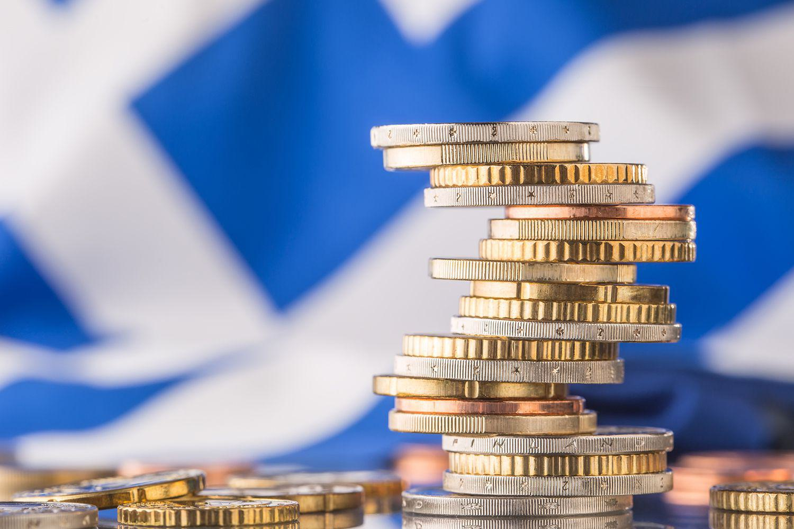

## Table of Contents

## What is a debt crisis?

A debt crisis happens when a country, company, or person has too much debt and can't pay it back. It's like when you borrow money from a friend, but then you can't give it back when they ask for it. This can cause big problems because people start to worry that they won't get their money back, and they might stop lending more money.

For a country, a debt crisis can mean they have to cut back on important things like schools and hospitals. It can also make the country's money worth less, which can make things more expensive for people living there. When a debt crisis happens, it can affect not just the country with the problem, but other countries too, because they are all connected through trade and finance.

## When did Greece's debt crisis begin?

Greece's debt crisis started around 2009. That year, the new Greek government found out that the country's debt was much bigger than they thought. They had been borrowing a lot of money and spending more than they were earning. When they told everyone about the true size of the debt, people got worried. They were scared that Greece wouldn't be able to pay back what it owed.

This made things really hard for Greece. Other countries and banks didn't want to lend them more money because they were afraid they wouldn't get it back. Greece had to ask for help from places like the European Union and the International Monetary Fund. They gave Greece money, but in return, Greece had to make some tough choices. They had to cut back on spending and raise taxes, which made life harder for people living in Greece.

## What were the initial signs of Greece's debt crisis?

The first signs of Greece's debt crisis started showing up in late 2009. The new Greek government announced that the country's budget deficit was much bigger than they had thought. Instead of being around 6% of the country's economy, it was actually over 12%. This shocked a lot of people because it meant Greece had been borrowing and spending a lot more money than it was making.

When this news came out, people and other countries started to worry. They were afraid that Greece wouldn't be able to pay back all the money it had borrowed. This fear made it harder for Greece to borrow more money, and the cost of borrowing went up. It was like when you have a hard time getting a loan because people think you might not pay it back. This was the beginning of the crisis, and it led to a lot of problems for Greece and its people.

## How did Greece's government spending contribute to the debt crisis?

Greece's government spent a lot of money on things like pensions, salaries for people working for the government, and other public services. They spent more money than they were getting from taxes and other ways of making money. This made them borrow more and more money to keep paying for everything. Over time, the amount of money they owed got really big. It was like spending more than you earn and using credit cards to pay for it, but on a much bigger scale.

When the global financial crisis hit in 2008, it made things even harder for Greece. The country's economy was not doing well, and it was harder to borrow money. The government found out that their spending had been much higher than they had told everyone. This made people and other countries really worried that Greece wouldn't be able to pay back all the money it owed. So, the spending habits of the Greek government played a big part in causing the debt crisis because they were spending too much and borrowing too much without a way to pay it back.

## What role did tax evasion play in Greece's debt crisis?

Tax evasion was a big problem in Greece and made the debt crisis worse. A lot of people and businesses in Greece didn't pay all the taxes they were supposed to. This meant the government wasn't getting enough money from taxes to pay for things like schools and hospitals. When the government doesn't get enough tax money, it has to borrow more to keep everything running, which adds to the debt.

The scale of tax evasion in Greece was huge. Some people say that up to one-third of the money that should have been collected in taxes was not paid. This made the government's financial situation even harder because they were already spending a lot and borrowing a lot. The money lost to tax evasion could have helped the government pay back some of its debt or at least not have to borrow so much. So, tax evasion played a big role in making Greece's debt crisis worse.

## How did the global financial crisis of 2008 impact Greece's economy?

The global financial crisis of 2008 hit Greece's economy really hard. Before the crisis, Greece was already spending more money than it was making, and it was borrowing a lot to cover the difference. When the crisis started, it made it even harder for Greece to borrow money because banks and other countries were scared that Greece wouldn't be able to pay it back. This fear made the cost of borrowing go up, which made Greece's debt problem even worse.

Because of the crisis, Greece's economy slowed down a lot. People lost their jobs, and businesses were struggling. The government had less money coming in from taxes because people were [earning](/wiki/earning-announcement) less. At the same time, the government still had to pay for things like hospitals and schools, so they had to borrow even more money. This made Greece's debt grow even bigger and made it harder for them to pay it back, leading to the debt crisis.

## What were the effects of Greece joining the Eurozone on its debt levels?

When Greece joined the Eurozone in 2001, it made it easier for them to borrow money. Before joining, Greece had its own money, the drachma. But after joining, they used the euro, which is used by many other countries. This made people and banks feel safer about lending money to Greece because they thought the euro was more stable. So, Greece could borrow more money at lower interest rates. This led to Greece borrowing a lot more money than before, which made their debt grow bigger.

Joining the Eurozone also meant that Greece couldn't just print more money to pay off its debts like they could with the drachma. This made it harder for them to deal with their growing debt. When the global financial crisis hit in 2008, it made things even worse. People started to worry that Greece might not be able to pay back all its debt. This made it even harder for Greece to borrow money, and their debt problems got a lot worse. So, joining the Eurozone helped Greece borrow more at first, but it also made it harder for them to manage their debt when things went wrong.

## How did inaccurate economic statistics contribute to Greece's debt crisis?

Inaccurate economic [statistics](/wiki/bayesian-statistics) played a big part in Greece's debt crisis. Before the crisis, the Greek government was not telling the whole truth about how much money they were spending and how much debt they had. They made it look like their budget deficit was smaller than it really was. This made people and other countries think that Greece's economy was doing better than it actually was. Because of these false numbers, Greece was able to borrow more money at lower interest rates, which made their debt grow even bigger.

When the new Greek government came into power in 2009, they found out the real numbers were much worse. They told everyone that the budget deficit was over 12% of the country's economy, not the 6% that was reported before. This shocked everyone and made them lose trust in Greece. People and other countries got scared that Greece wouldn't be able to pay back all its debt. This made it much harder for Greece to borrow more money, and the cost of borrowing went up. So, the inaccurate statistics hid the true size of Greece's debt problem until it was too late, making the crisis even worse when it finally came out.

## What austerity measures were implemented by Greece in response to the crisis?

When Greece's debt crisis got really bad, they had to do something called austerity measures. These were tough choices to try and fix their money problems. Greece had to cut back on a lot of things they were spending money on. They reduced the money they gave to people for pensions and salaries, especially for people working for the government. They also had to cut back on spending for things like schools and hospitals. This made life harder for a lot of people in Greece because they had less money and fewer services.

Greece also had to raise taxes to try and get more money. They made taxes higher on things like food, gas, and even electricity. This made everything more expensive for people living in Greece. The government did these things because they needed help from other countries and the International Monetary Fund. These groups gave Greece money to help with their debt, but only if Greece promised to do these austerity measures. It was a hard time for Greece, but they had to do it to try and fix their big debt problem.

## How did international bailouts affect Greece's debt situation?

International bailouts helped Greece a lot because they gave the country money when it was in big trouble. Greece couldn't borrow money from banks anymore because everyone was scared they wouldn't pay it back. So, other countries and the International Monetary Fund stepped in and gave Greece big loans. This money helped Greece keep paying for important things like hospitals and schools, and it also helped them avoid going completely broke. But there was a catch: in return for the money, Greece had to follow strict rules and make tough choices about cutting back on spending and raising taxes.

Even though the bailouts helped Greece in the short term, they also made the debt situation more complicated. The loans from the bailouts added to Greece's already big debt. So, while the money helped them get by, it also meant they owed even more money. Greece had to work hard to follow the rules set by the countries and the International Monetary Fund that gave them the money. This meant making life harder for people in Greece with things like less money for pensions and higher taxes. Over time, these efforts helped Greece slowly start to get its debt under control, but it was a long and painful process.

## What were the social and political impacts of the debt crisis in Greece?

The debt crisis in Greece had big effects on people's lives. Many people lost their jobs because the economy was doing badly. This made it hard for them to pay for things like food and rent. The government had to cut back on spending for things like schools and hospitals, which made life even harder. Pensions got smaller, and taxes went up, so people had less money to spend. This led to a lot of anger and frustration among the people, and many of them took to the streets to protest. The crisis also made a lot of young people leave the country to find better opportunities elsewhere.

Politically, the crisis shook things up a lot in Greece. People lost trust in the government because they felt it had not been honest about the country's money problems. This led to big changes in who was in charge. New political parties came into power that promised to do things differently. There were also a lot of arguments and disagreements about what to do to fix the crisis. Some people wanted to stay in the Eurozone and follow the rules to get more help, while others wanted to leave and do things their own way. All of this made the political situation in Greece very tense and unstable during the crisis.

## What long-term strategies has Greece adopted to prevent future debt crises?

Greece has been working hard to make sure they don't have another debt crisis. One of the big things they've done is to try and keep their spending under control. They've been making budgets that are more realistic and sticking to them. This means they're not spending more money than they have. They've also been trying to make their economy stronger by helping businesses grow and creating more jobs. This helps them earn more money from taxes, which they can use to pay off their debt.

Another important thing Greece has done is to be more honest about their money situation. They've been working to make their economic statistics more accurate so people can trust them. This helps everyone know exactly how much money Greece has and how much they owe. They've also been working on making their tax system better so more people pay their taxes. This gives the government more money to use without having to borrow as much. By doing these things, Greece hopes to keep their debt under control and avoid another crisis in the future.

## References & Further Reading

[1]: Featherstone, Kevin. (2011). ["The Greek Sovereign Debt Crisis and EMU: A Failing State in a Skewed Regime."](https://www.researchgate.net/publication/227763184_The_Greek_Sovereign_Debt_Crisis_and_EMU_A_Failing_State_in_a_Skewed_Regime) Journal of Common Market Studies.

[2]: Arghyrou, Michael G., and Tsoukalas, John D. (2011). ["The Greek Debt Crisis: Likely Causes, Mechanics and Outcomes."](https://onlinelibrary.wiley.com/doi/abs/10.1111/j.1467-9701.2011.01328.x) The World Economy.

[3]: European Union. ["Protocol (No 12) on the Excessive Deficit Procedure."](https://eur-lex.europa.eu/legal-content/EN/ALL/?uri=CELEX:12008M/PRO/12) Treaty on the Functioning of the European Union, Official Journal of the European Union. 

[4]: Lopez de Prado, Marcos. (2018). ["Advances in Financial Machine Learning."](https://www.amazon.com/Advances-Financial-Machine-Learning-Marcos/dp/1119482089) Wiley.

[5]: Jansen, Stefan. (2020). ["Machine Learning for Algorithmic Trading."](https://github.com/stefan-jansen/machine-learning-for-trading) Packt Publishing.

[6]: Wójcik, Dariusz, and MacDonald-Korth, Daniel. (2015). ["The British and the Greek Financial Crises Through the Eyes of the Media: A Sisterly Care."](https://www.theochem.ru.nl/cgi-bin/dbase/pass5.cgi?query=Marieke+de+Vries) Journal of Common Market Studies.