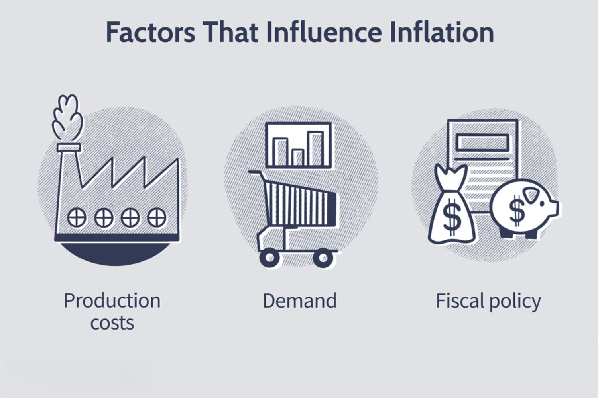

Economic factors, inflation, price increases, and algorithmic trading are intricately interconnected components that play pivotal roles in shaping financial markets and influencing economic strategies. Investors and policymakers are increasingly recognizing the importance of understanding these connections to make informed decisions and implement effective policies. This article aims to unpack these complex relationships, demonstrating how each element influences the others in the broader financial ecosystem.

Inflation is a fundamental economic concept characterized by the rate at which the general level of prices for goods and services rises, subsequently eroding purchasing power. Central banks attempt to control inflation through monetary policy, aiming to maintain price stability and foster economic growth. Rapid or uncontrolled inflation can lead to economic instability, affecting both consumer behavior and business operations.



Algorithmic trading, a technology-driven process utilizing complex algorithms, has become prevalent in modern financial markets. These algorithms analyze market data and execute trade orders at speeds and frequencies that are impossible for human traders. Leveraging vast datasets, algorithmic trading strategies can optimize decision-making processes and capitalize on market efficiencies.

The focus of this article is to explore the intricate dynamics between these elements: how inflation and economic factors lead to price changes, and how these, in turn, influence algorithmic trading strategies. Understanding these relationships is crucial for stakeholders aiming to anticipate market trends and adjust their investment or policy strategies accordingly.

The forthcoming sections will delve into various aspects, starting with defining and explaining economic factors and their influence on market conditions. We will then discuss the dynamics of inflation, its causes, and impacts on purchasing power. The article will also examine the reasons behind price increases, apart from inflation, and their effects on different sectors of the economy. We will further explore the role of algorithmic trading, highlighting its prevalence, advantages, and also the challenges it presents. Lastly, we will consider how inflation and price changes impact algorithmic trading strategies, and provide a future outlook on economic trends and the evolution of trading technologies. Through these analyses, the article will underscore the necessity for adaptive strategies to navigate the complexities of modern financial markets.

## Table of Contents

## Understanding Economic Factors

Economic factors are the various elements that contribute to the functioning and performance of an economy. These factors encompass a wide range of financial and non-financial components that are interrelated and influence market behavior and economic health. Understanding these factors is crucial for both policymakers, who develop economic policies, and market participants, such as investors and traders, who leverage this information to make informed decisions.

Key economic indicators are metrics that offer insights into the current state of the economy and help predict future economic performance. Some key indicators that influence inflation and market conditions include:

1. **Gross Domestic Product (GDP):** GDP measures the total value of all goods and services produced over a specific time period within a country. It is a critical indicator of economic growth and health. A rising GDP typically signals a growing economy, while a declining GDP indicates economic contraction.

2. **Unemployment Rate:** This indicator measures the percentage of the total labor force that is unemployed but actively seeking employment. High unemployment rates can suggest underutilization of labor resources and potential economic distress, whereas low rates often correlate with economic expansion.

3. **Consumer Price Index (CPI):** The CPI measures changes in price levels of a basket of consumer goods and services, serving as a primary indicator of inflation. A consistently rising CPI indicates inflationary pressures in the economy.

4. **Interest Rates:** Set by central banks, interest rates dictate the cost of borrowing and the return on savings. Lower interest rates can stimulate economic activity by making borrowing cheaper, while higher rates can have a cooling effect.

5. **Trade Balance:** This measures the difference between a country's exports and imports. A trade surplus indicates a positive trade balance, while a deficit suggests more imports than exports, impacting currency valuation and economic stability.

These indicators are pivotal for predicting market trends. For instance, a combination of rising GDP, low unemployment, and increasing CPI might suggest a strengthening economy, possibly leading to higher interest rates to curb inflation. Conversely, a declining GDP with rising unemployment could signal an economic downturn, prompting stimulus measures.

In [algorithmic trading](/wiki/algorithmic-trading), monitoring economic factors is essential for developing strategies that respond to market conditions effectively. Algorithms analyze vast datasets, including these economic indicators, to identify patterns and execute trades with speed and precision. For example, a strategy might incorporate the predictive power of GDP trends and [interest rate](/wiki/interest-rate-trading-strategies) changes to forecast asset price movements. 

Algorithmic trading systems need to adjust to changing economic conditions, such as inflation, which directly affects market [volatility](/wiki/volatility-trading-strategies) and asset pricing. As these systems recognize and adapt to shifts indicated by economic indicators, they can optimize trading decisions and manage risks more effectively.

In conclusion, economic factors and their key indicators serve as the foundation for assessing economic health and guiding investment strategies. The ability to interpret these indicators allows traders and economists to anticipate market dynamics and deploy adaptive strategies to leverage economic trends.

## The Dynamics of Inflation

Inflation is a pivotal concept in economics, often characterized as the rate at which the general level of prices for goods and services rises, resulting in a fall in the purchasing power of money. It is quantitatively measured by examining changes in price indices such as the Consumer Price Index (CPI) or the Producer Price Index (PPI). The causes of inflation can be categorized into three primary types: demand-pull inflation, cost-push inflation, and built-in inflation. Demand-pull inflation occurs when aggregate demand in an economy outpaces aggregate supply, often described by the equation:

$$
\text{Inflation} = \text{Aggregate Demand} - \text{Aggregate Supply}
$$

Cost-push inflation arises when the cost of production increases, leading producers to raise prices to maintain profit margins. Built-in inflation, also known as wage-price inflation, occurs when workers demand higher wages, leading to increased production costs and consequently higher prices.

The impact of inflation on consumer purchasing power is significant. As price levels rise, the real value of money decreases, meaning consumers can buy less with the same amount of money. This erosion of purchasing power is an essential consideration for both consumers and policymakers. For instance, if wages do not increase at the same rate as inflation, individuals experience a reduction in their real income.

Central banks play a vital role in managing inflation through monetary policy. These institutions, such as the Federal Reserve in the United States or the European Central Bank, utilize tools like interest rate adjustments and open market operations to control money supply and influence inflation. By increasing interest rates, central banks can reduce spending and borrowing, subsequently decreasing inflationary pressures. Conversely, lowering interest rates can stimulate the economy in deflationary periods.

Historical instances highlight inflation's profound economic impacts. During the 1970s, the United States experienced stagflation, characterized by high inflation combined with unemployment and stagnant demand. The period was marked by an oil embargo, which significantly increased production costs and, consequently, consumer prices. More recently, Zimbabwe's hyperinflation in the late 2000s demonstrated the destructive potential of unchecked inflation, causing severe shortages of goods and a collapse of the national currency.

Analyzing these dynamics underscores the importance of understanding inflation's multifaceted nature. It is crucial for investors, businesses, and policymakers to keep abreast of inflationary trends to make informed decisions and adapt strategies that mitigate adverse economic impacts.

## Price Increases: Causes and Effects

Price increases, often perceived synonymously with inflation, can occur due to various factors beyond the general rise in prices associated with inflationary pressures. Understanding these causes is essential for comprehensively analyzing their effects on both economic sectors and overall economic stability.

### Factors Leading to Price Increases

Several factors can contribute to price increases beyond inflation:

1. **Supply Chain Disruptions**: Events such as natural disasters, geopolitical tensions, or pandemics can cause significant disruptions, resulting in reduced supply against constant or increased demand. For instance, the COVID-19 pandemic severely affected global supply chains, leading to scarcity and, consequently, price hikes in many sectors.

2. **Demand Surges**: Sudden increases in demand can outpace supply, particularly if production capabilities are limited or inelastic in the short term. This imbalance pushes prices upward, as seen in housing markets in rapidly growing urban areas.

3. **Production Costs**: Rising costs of raw materials, labor, or energy can trigger price increases as businesses pass these costs onto consumers. For example, a surge in oil prices directly affects the cost of goods requiring transportation or manufacturing processes reliant on petroleum-based inputs.

4. **Regulatory Changes and Tariffs**: New regulations or tariffs can increase the cost of doing business, leading companies to adjust pricing structures to maintain profit margins.

### Impact on Different Sectors

The impact of price increases varies across economic sectors:

- **Consumer Goods**: Price increases in essential goods such as food and fuel can lead to a decrease in disposable income, affecting consumer spending patterns. Non-essential goods often see a larger reduction in demand during price hikes.

- **Manufacturing**: Higher production costs can erode profit margins if companies are unable to pass the costs onto consumers, potentially leading to reduced investment in new technologies or workforce reductions.

- **Services**: Service sectors, particularly those dependent on consumer spending, may experience decreased demand, affecting growth and employment rates in these industries.

### Consumer Behavior and Business Strategies

Consumers and businesses often adapt their behaviors and strategies in response to price rises:

- **Consumer Behavior**: Price increases generally lead to changes in spending habits, with consumers prioritizing essential purchases and seeking cheaper alternatives or discounts. This "trade-down" effect is often observed in sectors like retail and food.

- **Business Strategies**: Companies may employ strategies such as diversifying suppliers, adopting cost-cutting measures, or investing in technology to enhance efficiency. Additionally, businesses might raise prices strategically or innovate product offerings to sustain demand.

### Long-term Consequences on Economic Stability

Sustained price increases can have substantial long-term impacts on economic stability:

- **Wage-Price Spiral**: Persistently high prices can lead to demands for higher wages, which, if granted, increase production costs further, potentially causing additional price rises in a self-reinforcing cycle.

- **Inflation Expectations**: If consumers and businesses begin to expect continuous price increases, it can alter spending and investment behavior, leading to reduced economic growth.

- **Competitiveness**: Regions or countries experiencing prolonged price hikes may lose competitiveness in global markets, as higher local costs can make exports less attractive on the international stage.

In conclusion, while inflation is a well-recognized [factor](/wiki/factor-investing) in price increases, other elements such as supply chain issues, demand dynamics, and production costs play crucial roles. Understanding these factors and their effects is essential for policymakers and businesses seeking to mitigate potential adverse impacts on economic stability.

## The Role of Algorithmic Trading in Modern Markets

Algorithmic trading, also known as algo trading, refers to the use of computer algorithms to execute trading orders. This practice has revolutionized financial markets by allowing traders to make rapid decisions based on complex data analysis. The prevalence of algorithmic trading has grown significantly, with estimates suggesting that it now accounts for a substantial portion of trades in major financial markets.

Algorithmic trading systems leverage economic factors and data analysis to identify potential trading opportunities. These systems process vast amounts of data, including economic indicators, market conditions, and historical price data, to develop predictive models. By incorporating a variety of inputs, such as interest rates, GDP growth, and unemployment rates, algorithms can predict market trends and make execution decisions in milliseconds. This data-driven approach enables traders to respond swiftly to market changes and optimize their trading strategies.

The advantages of algorithmic trading are numerous. One of the primary benefits is speed. Automated systems can execute trades far quicker than human traders, capturing opportunities in rapidly changing markets. Additionally, algorithms bring accuracy in executing trades, adhering to specified criteria without human error. Data-driven decisions reduce emotional influence in trading, often leading to more consistent results. Complex strategies that would be infeasible for manual execution can be run seamlessly using algorithms.

Despite these benefits, algorithmic trading also faces challenges and limitations. Market volatility can pose a significant risk. Rapid price fluctuations due to unforeseen economic events or geopolitical tensions can lead to substantial losses if algorithms are not properly calibrated to handle such volatility. Moreover, regulatory considerations are increasingly important. Authorities globally are scrutinizing algorithmic trading due to concerns about market fairness and stability. For instance, the European Union's Markets in Financial Instruments Directive (MiFID II) and the U.S. Securities and Exchange Commission (SEC) both impose strict guidelines on algorithmic trading practices.

Thus, while algorithmic trading offers remarkable potential for efficiency and precision in the financial markets, it requires careful management of risks and adherence to regulatory frameworks to ensure its benefits are fully realized. The evolution of these technologies continues to shape the landscape of modern markets, demanding that traders and investors stay informed and strategically agile.

## Impact of Inflation and Price on Algorithmic Trading Strategies

Inflation and price changes significantly influence algorithmic trading strategies, necessitating their continuous adaptation to the evolving economic landscape. Algorithmic trading, which relies on complex mathematical models and high-speed computations, inherently depends on economic indicators, such as inflation rates, to inform its strategies. Inflation, defined as the rate at which the general level of prices for goods and services rises, eroding purchasing power, directly impacts market volatility and asset pricing, thereby affecting algorithmic trading.

### Influence of Inflation on Algorithmic Trading Strategies

Algorithmic trading strategies often incorporate inflation as a critical factor, influencing the selection and timing of trades. Inflationary trends can trigger adjustments in asset allocation models, leading to shifts towards assets that traditionally hedge against inflation, such as commodities or inflation-protected securities. The alterations in strategy can be modeled by algorithms to maximize returns or minimize risks associated with rising inflation.

For example, consider the Fisher equation which relates nominal interest rates ($i$), real interest rates ($r$), and inflation ($\pi$):

$$
i = r + \pi
$$

Algorithmic trading models utilize this equation to adjust expected returns on investments, particularly in interest-sensitive securities like bonds.

### Algorithms Responding to Inflationary Trends

Algorithms designed to respond to inflationary trends typically incorporate predictive analytics and [machine learning](/wiki/machine-learning) models. These models analyze historical economic data, forecast future inflation rates, and adjust trading parameters accordingly. A common approach is to use regression models to predict the impact of inflation on asset classes, allowing the algorithm to alter its buy or sell signals.

A basic Python model might look like the following:

```python
import numpy as np
from sklearn.linear_model import LinearRegression

# Historical data for inflation and asset returns
inflation_data = np.array([...])
asset_returns = np.array([...])

# Regression model to predict asset returns based on inflation
model = LinearRegression().fit(inflation_data.reshape(-1, 1), asset_returns)

predicted_returns = model.predict(np.array([future_inflation]).reshape(-1, 1))
```

### Case Studies and Examples

In practice, during periods of high inflation, such as the 1970s oil crisis or more recent inflationary pressures post-2020, algorithmic traders have adjusted strategies to minimize exposure to inflation-sensitive sectors. One notable example involved algorithms pivoting towards energy stocks and away from fixed-income securities as inflation eroded bond yields.

### Importance of Adaptive Strategies

The dynamic nature of inflation necessitates adaptive algorithmic strategies. Static models, fixated on a single set of assumptions, often falter when economic conditions deviate from expectations. Thus, algorithms must be designed to learn and adapt, employing machine learning techniques to recalibrate in real time. This adaptability is crucial for maintaining competitive advantage and ensuring robust performance in volatile markets. Employing techniques such as [reinforcement learning](/wiki/reinforcement-learning) can enable algorithms to iteratively learn from market data, adjusting strategies dynamically.

Ultimately, the intersection of inflation, price changes, and algorithmic trading emphasizes the importance of employing flexible models that can react to economic indicators. The integration of predictive tools and adaptive learning technologies within trading algorithms ensures readiness to tackle the uncertainties inherent in economic fluctuations.

## Future Outlook: Economic Trends and Algorithmic Trading

Predicting future trends in inflation and global economic factors is crucial for investors and policymakers. Inflation dynamics are influenced by a myriad of factors including central bank policies, geopolitical events, technological advancements, and supply chain innovations. Looking ahead, central banks might continue to use a mix of traditional and innovative monetary policies to manage inflation rates, opting for tools like digital currencies and real-time data analysis to make more informed decisions.

Algorithmic trading technologies are set to evolve significantly in response to these economic changes. The increasing availability of big data, coupled with advances in processing power, will enhance the capabilities of algorithms to predict market trends more accurately. These technologies are expected to further integrate data from non-traditional resources, such as social media and alternative market signals, providing a more comprehensive view of market conditions.

Artificial Intelligence (AI) and Machine Learning (ML) are poised to play a pivotal role in enhancing trading strategies. AI algorithms can automatically adjust to new information, learning and evolving as market conditions change. They can analyze vast datasets for patterns humans might miss and optimize trading decisions in real-time. Machine learning techniques such as reinforcement learning are particularly beneficial, as they enable systems to learn optimal strategies through trial and error in simulated environments before applying these strategies to real-world trading [1].

Here's a simple example of how machine learning might be integrated into a trading algorithm using Python:

```python
import numpy as np
from sklearn.ensemble import RandomForestClassifier
from sklearn.model_selection import train_test_split

# Sample market data
data = np.random.rand(1000, 10)  # features
prices = np.random.randint(0, 2, 1000)  # target prices (0 or 1)

# Split data
X_train, X_test, y_train, y_test = train_test_split(data, prices, test_size=0.2, random_state=42)

# Initialize and train the model
model = RandomForestClassifier(n_estimators=100, random_state=42)
model.fit(X_train, y_train)

# Evaluate the model
accuracy = model.score(X_test, y_test)
print(f"Model Accuracy: {accuracy:.2f}")
```

The necessity for continuous adaptation in both economic policies and trading algorithms cannot be overstated. Economic policies must remain flexible to accommodate rapid global changes, while trading algorithms need to constantly evolve to encapsulate new data types and market influences. The incorporation of AI allows algorithms to be more adaptive and predictive, helping traders stay ahead in the market.

In conclusion, the future of economic trends and algorithmic trading is intertwined with advancements in technology and data analysis. Staying updated with these trends will be imperative for stakeholders aiming to optimize their strategies in increasingly complex financial markets.

[1] Sutton, R. S., & Barto, A. G. (2018). "Reinforcement Learning: An Introduction" (2nd ed.). MIT Press.

## Conclusion

The intricate relationship between economic factors, inflation, price increases, and algorithmic trading underscores the complexity of modern financial markets. Economic factors such as GDP growth, employment rates, and consumer spending are pivotal in shaping market dynamics. Inflation, influenced by these factors, intrinsically alters purchasing power and affects economic stability, prompting price adjustments across sectors. Algorithmic trading, leveraging advanced data analysis, reacts to these economic cues, aiming to optimize trading strategies.

Investors and businesses must remain vigilant and strategically plan for market shifts driven by these interconnected elements. Awareness of economic indicators and inflationary trends is crucial for making informed decisions. Algorithmic trading, while advantageous for its speed and precision, demands robust strategies to navigate inflatory impacts and resulting price fluctuations effectively. The integration of AI and machine learning offers tremendous potential for these technologies to manage emerging economic challenges, allowing for enhanced adaptability and precision.

To harness the full potential of algorithmic trading in mitigating economic challenges, continuous research and adaptation to market changes are imperative. As global economic trends evolve, so too must the strategies employed by trading algorithms. This demands a concerted effort in both policy formulation and technological innovation to ensure resilience in the face of economic volatility.

## References & Further Reading

[1]: Sutton, R. S., & Barto, A. G. (2018). ["Reinforcement Learning: An Introduction"](https://web.stanford.edu/class/psych209/Readings/SuttonBartoIPRLBook2ndEd.pdf) (2nd ed.). MIT Press.

[2]: John Hull, (2018). ["Options, Futures, and Other Derivatives"](https://www-2.rotman.utoronto.ca/~hull/ofod/index.html) (9th ed.). Pearson.

[3]: De Prado, M. L. (2018). ["Advances in Financial Machine Learning"](https://www.amazon.com/Advances-Financial-Machine-Learning-Marcos/dp/1119482089). Wiley.

[4]: Arnott, R. D., & Bernstein, P. L. (2002). ["What Risk Premium Is “Normal”?"](https://www.researchaffiliates.com/content/dam/ra/publications/pdf/p-2002-mar-what-risk-premium-is-normal.pdf) Financial Analysts Journal.

[5]: Chan, E. P. (2008). ["Quantitative Trading: How to Build Your Own Algorithmic Trading Business"](https://github.com/ftvision/quant_trading_echan_book). Wiley.