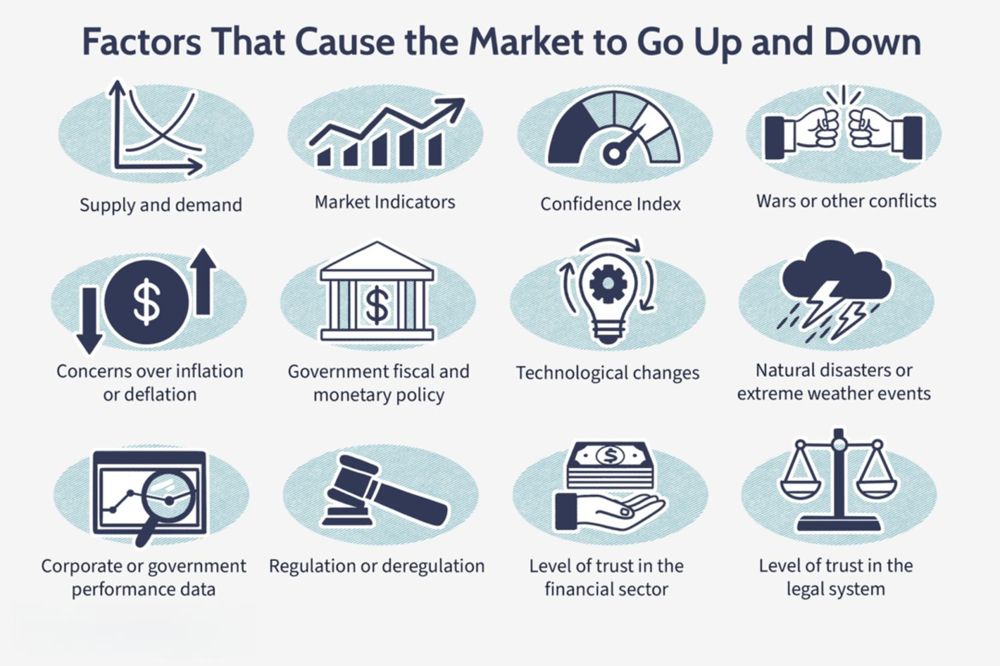

Financial markets operate in a complex and ever-changing environment, heavily influenced by a multitude of economic factors. These markets are platforms for the exchange of financial instruments, where prices are determined based on supply and demand dynamics. Key economic factors such as interest rates, inflation, and economic indicators play a critical role in shaping market behavior. For instance, a change in central bank policies regarding interest rates can lead to significant adjustments in asset prices as investors reassess future economic outlooks.

Market fluctuation and market volatility are central concepts for anyone engaged in financial markets. Market fluctuations refer to the changes in price levels of financial instruments over time, while market volatility measures the degree of variation of trading prices. Volatility is often perceived as a risk measure, reflecting the uncertainty about the size of asset price changes. High volatility often indicates turbulent market conditions, which can be triggered by economic announcements, geopolitical tensions, or natural disasters.

Algorithmic trading, also known as algo trading, involves using computer algorithms to execute trades based on predefined criteria. Its relevance has grown substantially in recent years due to advancements in technology and the need for speed and efficiency in executing trades. Algo trading contributes to improved market liquidity and reduced transaction costs. Firms employ complex mathematical models and sophisticated software to make trading decisions at speeds and frequencies impossible for human traders. The rise of algo trading has significantly altered the market landscape, necessitating a deeper understanding of both opportunities and risks.

This article aims to provide insight into the interplay between economic factors and market fluctuations, delve into the causes and effects of market volatility, and explore the influence of algorithmic trading on market dynamics. Readers will gain an understanding of how these elements interact to shape market conditions and learn strategies to navigate this complex environment effectively.

## Table of Contents

## Understanding Economic Factors Influencing Market Fluctuation

Economic factors play a crucial role in influencing market fluctuations, driven by a complex interplay of various elements such as supply and demand, interest rates, inflation, and diverse economic indicators.

### Supply and Demand

The foundational economic principle of supply and demand dictates the movement of prices in financial markets. When demand exceeds supply, prices tend to rise, while an oversupply typically leads to price reductions. This balance is dynamic and subject to shifts due to consumer preferences, technological advancements, and global trade relations. For instance, a sudden increase in the demand for electric vehicles can lead to a spike in the prices of lithium or cobalt, essential components in batteries, reflecting in the financial markets.

### Interest Rates

Interest rates, determined by central banks, are a pivotal economic [factor](/wiki/factor-investing) affecting market conditions. Changes in interest rates can influence borrowing costs, consumer spending, and investment levels. When interest rates rise, borrowing becomes more expensive, potentially dampening economic activity and leading to market bearishness. Conversely, lower interest rates can stimulate borrowing and investment, driving up stock prices. A notable example was the impact of the U.S. Federal Reserve's [interest rate](/wiki/interest-rate-trading-strategies) hikes in the mid-2010s, which led to significant market adjustments.

### Inflation

Inflation reflects the rate at which the general level of prices for goods and services rises, eroding purchasing power. Moderate inflation is typically a sign of a growing economy, but excessive inflation can lead to uncertainty and disrupt financial markets. Investors often seek to hedge against inflation by investing in assets like commodities or real estate, which can cause fluctuations in these markets. An historical case is the hyperinflation experienced by Zimbabwe in the late 2000s, which led to severe economic instability and market disarray.

### Economic Indicators

Economic indicators, such as Gross Domestic Product (GDP), unemployment rates, and consumer confidence indices, provide insights into the health of an economy and its future trajectory. Positive economic indicators generally boost investor confidence, leading to market rallies, while negative reports can trigger sell-offs. For instance, during the Global Financial Crisis of 2007-2008, deteriorating economic indicators fueled market [volatility](/wiki/volatility-trading-strategies) as investor uncertainty grew.

### Influencing Market Fluctuations

The interplay of these economic factors results in varying market conditions, often requiring investors to adapt their strategies. For example, during periods of high inflation and rising interest rates, investors might shift towards bonds or other fixed-income securities that offer more stable returns. Alternatively, in low-interest environments, equities often become more attractive due to the potential for higher returns.

### Real-World Examples

Economic events have historically triggered significant market fluctuations. The 2008 financial crisis was precipitated by the collapse of the housing market, largely driven by subprime mortgage defaults and excessive risk-taking in financial markets. This led to immense volatility and a sharp decline in global markets.

In 2020, the COVID-19 pandemic caused massive disruptions across global supply chains, leading to unprecedented market volatility. Lockdown measures reduced consumer demand sharply in several sectors, while others, like technology and healthcare, experienced a surge in demand, resulting in significant shifts in stock valuations.

Understanding these economic factors and their impacts on market fluctuation is vital for investors looking to navigate the complex landscape of financial markets effectively.

## Market Volatility: Causes and Effects

Market volatility refers to the degree of variation in the price of a financial instrument over time. It is a statistical measure commonly represented by the standard deviation or variance of returns. High volatility indicates large swings in prices over short periods, while low volatility suggests more stable prices. For investors, volatility is a double-edged sword. It offers opportunities for substantial profits but also carries the risk of significant losses. Understanding volatility is essential as it impacts risk management, asset allocation, and investment strategy.

Several factors contribute to market volatility:

1. **Political Events**: Elections, policy changes, and geopolitical tensions can create uncertainty in markets. For instance, Brexit, the United Kingdom's decision to leave the European Union, led to heightened volatility in global financial markets due to concerns over economic and regulatory consequences.

2. **Natural Disasters**: Events such as earthquakes, hurricanes, and tsunamis can disrupt economic activity, causing abrupt market movements. The 2011 earthquake and tsunami in Japan, for example, significantly affected global supply chains and markets.

3. **Economic News**: Announcements related to employment rates, inflation, GDP growth, and central bank policies can shift market sentiment rapidly. Positive news may boost investor confidence and decrease volatility, whereas negative surprises can lead to market turmoil.

The relationship between market volatility and investor confidence is closely intertwined. High volatility often leads to decreased investor confidence, resulting in a risk-averse stance where investors may pull back from equity markets to seek safer assets, such as bonds or gold. Conversely, low volatility can enhance confidence, encouraging investors to engage more actively in the market, potentially overextending themselves when conditions shift unexpectedly.

Understanding market volatility is crucial for investors to manage risks effectively and capitalize on potential gains, emphasizing the importance of staying informed and adaptable in ever-changing financial landscapes.

## Algorithmic Trading: Role in Market Dynamics

Algorithmic trading, often referred to as algo trading, utilizes computer algorithms to manage trading decisions with minimal human intervention. These algorithms execute trades at high speeds and frequencies based on pre-determined criteria like timing, price, or [volume](/wiki/volume-trading-strategy). The foundational mechanisms of [algorithmic trading](/wiki/algorithmic-trading) involve statistical models and quantitative analysis to determine optimal trading strategies. Algorithms can swiftly analyze vast datasets, react to market conditions, and simultaneously handle multiple markets.

The impact of algorithmic trading on market [liquidity](/wiki/liquidity-risk-premium) and volatility is notable. By its design, algorithmic trading can significantly enhance market liquidity. Algorithms can constantly place buy and sell orders, ensuring that there is always a counterparty to trade with. This continuous placing of orders contributes to narrower bid-ask spreads and enhances overall market efficiency. Furthermore, algorithms can quickly capitalize on [arbitrage](/wiki/arbitrage) opportunities, aligning prices across different markets and maintaining market consistency.

However, algorithmic trading also influences market volatility. While it can create liquidity, high-frequency trading may result in erratic market behavior due to the sheer volume and speed of trades. During high-pressure market situations, such as unexpected economic news or political events, algorithms can react in concert, leading to rapid and significant price movements. Such instances exacerbate market volatility and can lead to market disruptions, as seen in events like the "Flash Crash" of May 6, 2010, where the Dow Jones Industrial Average dropped about 1,000 points within minutes before rebounding.

To illustrate the effects of algorithms on recent market events, consider the Flash Crash, which was partially attributed to algorithmic trading system malfunctions. A massive sell order executed by an algorithm initiated a cascade of automated selling by other high-frequency algorithms, amplifying the downward spiral. It highlights the potential risks associated with algorithmic trading, where automated decision-making processes may conflict or react unexpectedly, causing dramatic market shifts.

Despite these risks, algorithmic trading continues to play a pivotal role in market dynamics. Its ability to provide liquidity and execute trades with precision offers significant advantages. Market participants are increasingly deploying sophisticated algorithms using [artificial intelligence](/wiki/ai-artificial-intelligence) and [machine learning](/wiki/machine-learning) to predict price movements and optimize return profiles, navigating the complexities of modern financial markets efficiently. As the market structure evolves, so too will the tools and strategies used to harness algorithmic trading's potential.

## Managing Market Volatility: Strategies and Tools

Investors employ several strategies to manage market volatility, with diversification and hedging playing prominent roles. Diversification involves spreading investments across various asset classes to reduce risk. By allocating funds among different stocks, bonds, and other assets, investors can mitigate the impact of a downturn in any single investment or sector [1]. Portfolio theory suggests that diversification is an optimal strategy for balancing risk and return, as it minimizes the portfolio's overall volatility without necessarily sacrificing potential returns [2].

Hedging is another strategy frequently employed to protect against adverse price movements. This involves using financial instruments such as options, futures, and derivatives to offset potential losses. For instance, an investor holding a significant position in a stock might purchase a put option, which provides the right to sell the stock at a predetermined price. This acts as insurance against a potential decline in stock value, thereby reducing the portfolio's exposure to volatility [3].

Algorithmic trading (algo trading) has become an essential tool for managing portfolio risks and optimizing returns amidst market volatility. Algorithms can execute trades at speeds and frequencies that are impossible for human traders, allowing for the rapid response to market changes. By using statistical models and historical data, algo trading can identify optimal entry and [exit](/wiki/exit-strategy) points, execute trades that maximize returns, and minimize potential losses [4].

Moreover, the integration of artificial intelligence (AI) and machine learning enhances these strategies by providing sophisticated data analysis and predictive modeling capabilities. AI can analyze vast datasets to identify patterns and predict future market movements with higher accuracy than traditional methods. For instance, machine learning models can dynamically assess risk by learning from new data over time, adjusting strategies in real-time based on current market conditions [5].

The use of AI in trading strategies can be illustrated through the deployment of neural networks or decision trees that analyze market signals and economic indicators to predict the likelihood of market shifts. These models help investors and traders make informed decisions, leveraging AI to refine their trading strategies continually.

Overall, by combining traditional risk management strategies like diversification and hedging with advanced algorithmic and AI-driven trading systems, investors can better navigate market volatility, safeguard their portfolios, and seek optimized returns.

References:
1. Bodie, Z., Kane, A., and Marcus, A. J. (2011). Investments and Portfolio Management. McGraw-Hill.
2. Markowitz, H. (1952). Portfolio Selection. The Journal of Finance, 7(1), 77-91.
3. Hull, J. C. (2012). Options, Futures, and Other Derivatives. Prentice Hall.
4. Narang, R. K. (2013). Inside the Black Box: A Simple Guide to Quantitative and High-Frequency Trading. Wiley.
5. Agrawal, A., Gans, J. S., and Goldfarb, A. (2018). Prediction Machines: The Simple Economics of Artificial Intelligence. Harvard Business Review Press.

## The Future of Market Dynamics and Algo Trading

The future of market dynamics and algorithmic trading is likely to be shaped by the ongoing evolution of economic factors, technological advancements, and regulatory frameworks. Economic factors, such as global economic growth patterns, demographic changes, and environmental concerns, will continue to influence market trends. As economies diversify and digitalize, new asset classes, such as cryptocurrencies, may play a more prominent role. Moreover, global events such as climate change and geopolitical tensions could create new economic pressures, affecting investment strategies.

Emerging technologies are set to revolutionize algorithmic trading further. Advances in artificial intelligence (AI), particularly machine learning (ML) and [deep learning](/wiki/deep-learning), offer new ways to analyze large datasets, identify patterns, and forecast market movements with unprecedented accuracy. Quantum computing is also gaining attention, with potential applications in optimizing trading algorithms due to its superior processing power. As these technologies mature, they are expected to enhance the efficiency and efficacy of trading strategies by enabling real-time data processing and decision-making.

However, the increased reliance on automated trading systems raises ethical considerations and necessitates robust regulatory oversight. The use of AI in trading poses challenges, such as decision-making transparency and accountability. Algorithms may inadvertently heighten market volatility or contribute to flash crashes if not properly monitored. Therefore, regulatory bodies globally are likely to implement stricter controls to ensure that the deployment of algorithms aligns with market stability and investor protection. Regulators may focus on aspects such as algorithm robustness, the prevention of market manipulation, and the management of systemic risks.

In conclusion, as markets evolve, the role of algorithmic trading will become even more crucial. Investors and regulators must keep pace with these changes, balancing the benefits of technological innovation with the imperative to maintain a fair and stable trading environment.

## Conclusion

As we conclude this exploration of financial markets and their complexities, it is crucial to reiterate the interconnectedness of economic factors and market dynamics. Understanding how elements such as supply and demand, interest rates, inflation, and various economic indicators shape market fluctuations is fundamental for investors. These variables not only influence individual investment decisions but also collectively drive the broader movements seen across financial markets. An accurate grasp of these concepts allows investors to make informed choices, adapt to market conditions, and optimize their portfolios effectively.

In addressing market volatility, we have acknowledged its dual role as both a challenge and an opportunity for investors. Volatility, influenced by diverse factors including political events, economic announcements, and even natural disasters, affects investor confidence and requires careful navigation. Strategies like diversification and hedging, along with the integration of algorithmic trading, offer pathways to manage and mitigate the risks associated with unpredictable market swings. The use of algorithmic trading in this context highlights its growing significance not only in fostering market liquidity but also in employing sophisticated mechanisms driven by AI and machine learning to enhance decision-making processes.

The future of market dynamics will likely see continued evolution, spurred by technological advances in algorithmic trading. Emerging technologies promise to further refine how market data is analyzed and utilized, improving the precision of trading strategies and risk management techniques. However, this advancement comes with ethical and regulatory considerations, emphasizing the need for balanced frameworks that ensure fair and transparent market operations.

In summary, understanding the intricate tapestry of economic factors and mastering the tools to manage volatility are essential components of successful investment strategies. As we progress further into an era dominated by algorithmic trading, the fusion of human insight and technological prowess promises to shape a new landscape for financial markets. Staying informed and adaptable will be key for investors seeking to thrive in this evolving environment.

## References & Further Reading

[1]: Bodie, Z., Kane, A., & Marcus, A. J. (2011). ["Investments and Portfolio Management."](https://www.mheducation.com/highered/product/investments-bodie-kane/M9781264412662.html) McGraw-Hill.

[2]: Markowitz, H. (1952). ["Portfolio Selection."](https://onlinelibrary.wiley.com/doi/abs/10.1111/j.1540-6261.1952.tb01525.x) The Journal of Finance, 7(1), 77-91.

[3]: Hull, J. C. (2012). ["Options, Futures, and Other Derivatives."](https://www.semanticscholar.org/paper/Options%2C-Futures%2C-and-Other-Derivatives-Hull/89bdee500c8623864fc9eb7a471546aa713acc44) Prentice Hall.

[4]: Narang, R. K. (2013). ["Inside the Black Box: A Simple Guide to Quantitative and High-Frequency Trading."](https://onlinelibrary.wiley.com/doi/book/10.1002/9781118662717) Wiley.

[5]: Agrawal, A., Gans, J. S., & Goldfarb, A. (2018). ["Prediction Machines: The Simple Economics of Artificial Intelligence."](https://dl.acm.org/doi/book/10.5555/3239975) Harvard Business Review Press.