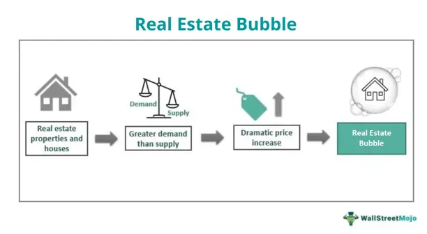

In recent years, economic bubbles have become subjects of intense discussion, particularly in the context of real estate and algorithmic trading. The potential impacts of these bubbles are profound, often resulting in significant economic disruptions. Economists and investors frequently debate these phenomena, examining how they arise, their effects, and the ways investors and policymakers can respond to mitigate their impacts.

Economic bubbles occur when the prices of assets rise rapidly to levels far above their intrinsic value, driven by exuberant market behavior and speculative investments. In real estate, housing bubbles develop from a rapid increase in property prices fueled by high demand and speculation, often propelled by easy access to credit and favorable lending policies. These bubbles can lead to severe economic consequences when they burst, as seen in historical instances like the U.S. housing bubble in the 2000s.

Algorithmic trading, which involves the use of complex algorithms and high-speed computational processes to execute trades, has added a new dimension to the landscape of economic bubbles. While it can enhance market efficiency and liquidity, algorithmic trading can also amplify market volatility and the severity of bubbles, particularly in highly speculative environments.

This article explores how real estate housing bubbles interact with the broader spectrum of economic bubbles, delving into the intricacies of each. By examining historical examples, such as the 2007–08 housing market crash, and analyzing current market conditions, we aim to understand the potential for future bubbles and the strategies investors can employ to navigate these volatile market phases. Understanding these phenomena is crucial for fostering a more stable and informed investment environment.

## Table of Contents

## Understanding Real Estate Housing Bubbles

A real estate housing bubble is characterized by a significant and rapid increase in property prices that far exceed their intrinsic values. This phenomenon is driven primarily by surges in demand coupled with speculative investment behavior. Speculative investments occur when investors purchase properties primarily with the expectation that prices will continue to rise, enabling them to sell at a profit later on. This behavior creates an artificial inflation of property values.

Several key characteristics define a real estate housing bubble. Rapid price increases are typically the most observable sign, where property values soar in short periods. Speculative buying further fuel these increases, as more investors enter the market, buoyed by the belief in the asset's undying appreciation. The availability of easy credit also underpins these bubbles, as low-interest rates and lax lending standards make borrowing more accessible. This facilitation of credit often leads to over-leveraging by buyers who may not have otherwise qualified for loans.

Overbuilding is another frequent consequence and characteristic of housing bubbles. In anticipation of continued demand, developers ramp up construction efforts, often exceeding actual future demand levels. This can eventually lead to a surplus of housing stock, contributing to a market imbalance once the bubble bursts.

A notable historical instance of a housing bubble is the U.S. housing bubble of the 2000s. This bubble was a major [factor](/wiki/factor-investing) leading to the 2007–08 financial crisis. Driven by subprime mortgage lending and complex financial derivatives that obscured risk levels, housing prices escalated rapidly before experiencing a sharp decline, resulting in widespread economic fallout. The aftermath highlighted the severe economic consequences that can accompany the collapse of housing bubbles, including a significant recession, loss of jobs, and numerous foreclosures. 

Understanding these dynamics is crucial for predicting potential bubbles and mitigating their impacts on the economy. By monitoring indicators such as housing price trends, credit conditions, and building rates, stakeholders can better assess and respond to the likelihood of housing bubbles forming.

## Causes and Indicators of a Housing Bubble

A housing bubble is characterized by a rapid escalation in property prices that exceed their intrinsic value, primarily driven by certain financial and economic factors. Among the significant causes of housing bubbles is the prevailing low-[interest rate](/wiki/interest-rate-trading-strategies) environment. When central banks set low-interest rates, borrowing becomes cheaper, encouraging more individuals to take out mortgages and increasing the demand for real estate. This surge in demand often results in elevated property prices, potentially inflating a bubble.

Another contributing factor is lax lending standards. Financial institutions, during periods of economic optimism, may lower their lending requirements, such as minimum credit scores or down payments, to expand their pool of borrowers. This practice can lead to an increase in subprime lending, where loans are made to borrowers with higher credit risk. Such practices played a notable role in the U.S. housing bubble during the 2000s, which culminated in the 2007-08 financial crisis [Mian & Sufi, 2009].

High levels of speculative investment further fuel housing bubbles. When property prices begin to rise, investors may enter the market not to occupy the homes but to profit from the anticipated continuous appreciation in property values. This speculative buying can further inflate prices and contribute to bubble formation.

Government policies aimed at promoting homeownership can also be a double-edged sword. While these policies, such as tax incentives, subsidized loans, or relaxed zoning laws, may have positive intentions of boosting housing accessibility, they can inadvertently encourage excessive borrowing and building, thereby inflating property prices.

Identifying indicators of potential housing bubbles is crucial for preemptive action. A primary indicator is a rapid acceleration of home prices relative to local income levels. When housing costs rise significantly faster than household incomes, a disconnect forms, making properties unaffordable for the average buyer, which is a classic bubble warning signal.

The prevalence of subprime mortgages can also signal a looming housing bubble. As more loans are issued to borrowers with risky credit profiles, the likelihood of defaults increases, setting the stage for a potential market collapse if the bubble bursts.

Another indicator is an environment of increasing interest rates following a period of historically low rates. As central banks raise rates to combat inflation or other economic concerns, the cost of borrowing rises, which can cool down the housing market and reveal the overvaluation of properties.

Monitoring these indicators—home price to income ratios, the proportion of subprime mortgages, and interest rate movements—enables policymakers and investors to gauge the health of the housing market. By remaining aware of these factors, stakeholders can implement measures to either prevent the bubble from expanding further or mitigate its adverse effects when it inevitably bursts.

## Economic Bubbles Beyond Real Estate

Economic bubbles are characterized by the rapid escalation of asset prices followed by a contraction, and they are not exclusive to the real estate sector. They also occur in various financial markets, including stocks and commodities, often driven by investor speculation and market exuberance.

One of the most well-documented bubbles outside real estate is the dotcom bubble of the late 1990s. This bubble was fueled by speculations around internet-based companies in the late 1990s and early 2000s. Investors poured capital into IT companies, expecting unprecedented growth in the nascent internet industry. As a result, the NASDAQ index peaked in March 2000, reflecting excessive valuations compared to the actual earnings of the companies. When the bubble burst, it led to a significant market crash, with many companies going bankrupt, causing substantial economic repercussions and a loss of approximately $5 trillion in market value between March 2000 and October 2002[^1^].

Cryptocurrency markets offer another contemporary example of economic bubbles. The speculative nature of these assets, combined with highly volatile price movements, exemplifies bubble characteristics. During 2017, Bitcoin's value soared from under $1,000 to almost $20,000, driven by a surge in speculative investment and media hype. However, by the end of 2018, Bitcoin's price fell to below $4,000, demonstrating the typical rise-and-fall pattern of a speculative bubble[^2^].

Such bubbles are often explained by behavioral economic theories, which suggest that investor psychology plays a crucial role. During speculative bubbles, herd behavior and the fear of missing out (FOMO) often drive prices far beyond their intrinsic value. When market sentiment changes, these bubbles can rapidly deflate, causing dramatic price corrections.

Market analysts and economists study these phenomena not only to understand past events but also to identify potential future bubbles. Key aspects they monitor include sharp price increases, excessive investment influx, and disproportionate valuations compared to an asset's intrinsic value. Adopting such a vigilant approach helps mitigate the adverse effects of future bubbles on the broader economy.

[^1^]: Cassidy, J. (2002). *Dot.con: How America Lost Its Mind and Money in the Internet Era*. Harper Perennial.

[^2^]: Nakamoto, S. (2008). Bitcoin: A Peer-to-Peer Electronic Cash System. *Bitcoin.org*.

## Impact of Algorithmic Trading on Economic Bubbles

Algorithmic trading, also known as algo trading, employs sophisticated algorithms and high-speed computational processes to automate and optimize trading decisions. This technology is often associated with enhanced market efficiency due to its ability to execute trades at speeds and frequencies that are not feasible for human traders. However, the influence of [algorithmic trading](/wiki/algorithmic-trading) on market dynamics is a subject of significant interest, particularly concerning economic bubbles.

One of the main advantages of algorithmic trading is its potential to improve [liquidity](/wiki/liquidity-risk-premium) and tighten bid-ask spreads. By executing large volumes of trades quickly, algorithms facilitate a more continuous market flow, potentially reducing transaction costs for all market participants. But while these benefits are notable, the inherent characteristics of algorithmic trading can also lead to increased market [volatility](/wiki/volatility-trading-strategies).

Algorithms are designed to capitalize on small price discrepancies and market inefficiencies. When many algorithms react simultaneously to market signals, they can inadvertently create feedback loops. For example, if an algorithm detects a price drop and triggers a cascade of sell orders, this can intensify the price decline, leading to more sell signals being triggered in a chain reaction. Such occurrences can exacerbate market turbulence and contribute to the formation and bursting of bubbles.

Furthermore, algorithmic trading can amplify the effects of market sentiment. During periods of bullish sentiment, for instance, buying algorithms can drive prices upwards rapidly and unsustainably. This speculation-driven price increase, divorced from the underlying asset values, is a hallmark of economic bubbles. Conversely, in a bearish market, algorithmic trading can accelerate price declines, hastening the collapse of an existing bubble and aggravating losses.

The Flash Crash of May 6, 2010, offers a pertinent example of how algorithmic trading can impact market stability. During this event, major U.S. stock indices dropped and recovered thousands of points within minutes, largely due to high-frequency trading algorithms operating on conflicting data inputs. This incident highlighted the potential for algorithms to contribute to extreme market fluctuations, with broader implications for market confidence and systemic risk.

To mitigate the potential adverse effects of algorithmic trading, regulatory measures and advanced monitoring techniques are essential. Market regulators need to ensure that proper risk management protocols are in place for firms utilizing these technologies. Additionally, circuit breakers and other mechanisms can be employed to temporarily halt trading during extreme volatility, giving time for rational assessment and reducing the chance of a market spiral.

For investors, understanding the implications of algorithmic trading on economic bubbles is paramount. Savvy investors recognize that while algorithms can offer new opportunities, they also introduce complexities that require careful strategy adjustments. Emphasizing diversified portfolios and adhering to disciplined investment strategies can provide a buffer against the unpredictable nature of markets influenced by algorithmic trading.

## Case Study: The 2007–08 Housing Market Crash

The 2007–08 housing market crash stands as a significant event in economic history, primarily induced by the bursting of a housing bubble rooted in subprime mortgage lending. This crash not only impacted the real estate sector but also triggered a global financial crisis, highlighting vulnerabilities in economic systems and financial markets.

A primary factor contributing to the housing bubble was the relaxation of credit standards. During this period, financial institutions began to lower their criteria for granting loans, making it easier for borrowers with poor credit histories to obtain mortgages. These subprime mortgages were often characterized by high interest rates and adjustable-rate terms, which initially appeared affordable but became costly as interest rates increased.

High-risk mortgage products further exacerbated the issue. Lenders developed complex financial products, such as mortgage-backed securities (MBS) and collateralized debt obligations (CDOs), which were sold to investors. These products were often poorly understood by both buyers and those involved in their creation. The assumption was that housing prices would continue to rise, enabling borrowers to refinance or sell at a profit. However, when the housing market cooled and prices began to fall, many homeowners found themselves with properties worth less than their outstanding mortgage balances.

Moreover, the financial incentives tied to these high-risk mortgages played a substantial role in the collapse. Lenders were motivated by the potential for high commissions and fees, leading to aggressive marketing and sales tactics that placed borrowers into unsuitable mortgage agreements. As these loans defaulted, the effects rippled through the financial system, impacting investors and financial institutions globally.

The repercussions of the 2007–08 housing market crash emphasize the importance of stringent credit standards and the potential risks associated with complex mortgage products. Financial reform and regulatory oversight emerged as necessary measures to mitigate the risk of similar occurrences in the future, aiming to safeguard economic stability and consumer protection in mortgage markets.

## Strategies for Navigating Market Bubbles

Investors aiming to navigate the complexities of market bubbles can adopt several strategic approaches to mitigate risks and protect their investments. One foundational strategy involves diversifying portfolios. By spreading investments across various asset classes, sectors, or geographical regions, investors can reduce the risk of significant losses that may occur if a bubble bursts in a single market. For instance, if an investor holds assets not only in real estate but also in stocks, bonds, or commodities, a downturn in the housing market might have less impact on their overall portfolio.

Risk management is another crucial strategy. This involves setting clear investment goals, determining risk tolerance, and actively monitoring and adjusting the portfolio to maintain an acceptable level of risk. For example, using stop-loss orders can help manage potential losses by automatically selling an asset once it reaches a certain price threshold. Hedging strategies, such as options or futures contracts, can also be employed to offset potential losses in a bubble scenario.

Avoiding speculative investments based solely on recent market trends is a prudent approach as well. Speculative investments, which often involve betting on rapid price increases without regard to intrinsic value, can be particularly risky in bubble environments. By focusing on long-term value and [fundamental analysis](/wiki/fundamental-analysis) rather than short-term price movements, investors can make more informed decisions that are less vulnerable to the volatility of bubbles.

Education plays a critical role in navigating market bubbles. Understanding market fundamentals and historical patterns allows investors to better recognize the signs of potential bubbles and make informed choices. Regularly reviewing economic indicators, such as price-to-earnings ratios in equities or price-to-rent ratios in real estate, provides valuable insights into whether asset prices are justified by underlying economic conditions.

Investors may also benefit from exploring historical case studies of past bubbles and their aftermaths. This understanding equips investors with the knowledge to anticipate and react appropriately to bubble-like conditions. Furthermore, staying informed about global economic trends, monetary policies, and market sentiment helps investors align their strategies with current and emerging market environments.

In summary, successfully navigating market bubbles involves a combination of portfolio diversification, meticulous risk management, restraint from speculative investments, and continued education on market dynamics. These strategies collectively help investors safeguard their assets and capitalize on opportunities even in potentially unstable market conditions.

## Conclusion

Understanding real estate and economic bubbles, along with the role of algorithmic trading, is vital for informed investment and risk management. Economic bubbles, particularly in real estate, can lead to significant market disruptions, impacting financial stability and having far-reaching effects on economies. Algorithmic trading, while contributing to market efficiency, can also exacerbate price volatility, potentially intensifying bubble conditions.

Effective regulation plays a critical role in ensuring market stability. Prudent policies that address lending standards and speculative investment can mitigate bubble formation. Governments and financial institutions should enforce stringent regulatory frameworks to monitor and control excessive risk-taking activities, thereby reducing the likelihood of bubbles.

For investors, adopting informed investment strategies is crucial. This includes diversifying investment portfolios to spread risk, focusing on long-term market fundamentals rather than short-term speculative gains, and implementing robust risk management practices. Education on historical market patterns and economic indicators can further equip investors to identify potential bubbles and make sound investment decisions.

Recognizing the signs of impending bubbles, such as rapid price increases and inflated asset valuations, is essential. By staying vigilant and responsive to these indicators, investors and regulatory bodies can act preemptively to prevent or reduce the impact of bubble-induced market corrections.

In conclusion, the interplay between real estate bubbles, economic bubbles, and algorithmic trading requires careful scrutiny and strategic response. The future stability of financial markets will hinge on effective regulation, investor education, and proactive measures to identify and address the precursors of economic bubbles.

## References & Further Reading

[1]: Shiller, R. J. (2000). ["Irrational Exuberance."](https://www.jstor.org/stable/j.ctt7st4s) Princeton University Press.

[2]: Mian, A., & Sufi, A. (2009). ["The Consequences of Mortgage Credit Expansion: Evidence from the U.S. Mortgage Default Crisis."](https://academic.oup.com/qje/article-abstract/124/4/1449/1917185) American Economic Review.

[3]: Cassidy, J. (2002). *Dot.con: How America Lost Its Mind and Money in the Internet Era*. Harper Perennial.

[4]: Nakamoto, S. (2008). Bitcoin: A Peer-to-Peer Electronic Cash System. *Bitcoin.org*.

[5]: Fabozzi, F. J., Shiller, R. J., & Tunaru, R. (2010). ["Mortgage-Backed Securities: Products, Structuring, and Analytical Techniques."](http://aida.econ.yale.edu/~shiller/pubs/property-derivatives2010.pdf) Wiley.

[6]: Brunnermeier, M. K., & Oehmke, M. (2013). ["Bubbles, Financial Crises, and Systemic Risk."](https://www.nber.org/papers/w18398) In G. M. Constantinides, M. Harris, & R. M. Stulz (Eds.), Handbook of the Economics of Finance.