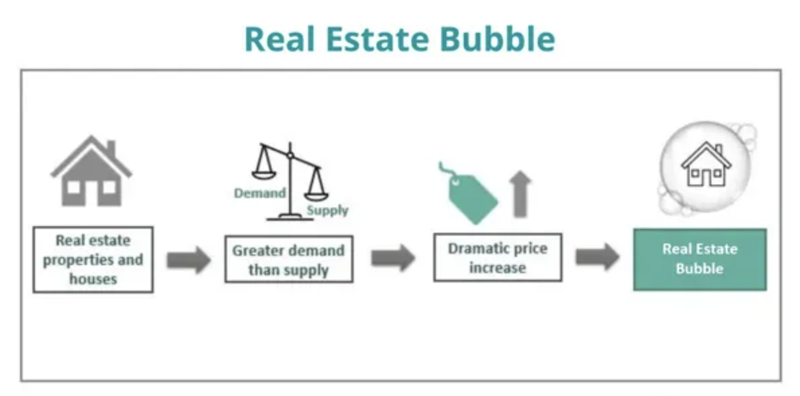

## Table of Contents

## What is a real estate bubble?

A real estate bubble is when the prices of homes and buildings go up a lot, but the prices are not based on what the homes are really worth. It happens because people think the prices will keep going up, so they keep buying and selling homes at higher prices. This makes the prices go up even more, even though the homes are not really worth that much.

When the bubble bursts, the prices of homes suddenly drop a lot. This can happen if people realize that the homes are not worth as much as they were paying. When the prices drop, people who bought homes at high prices can lose a lot of money. It can also make it hard for people to sell their homes, and it can cause problems for the whole economy.

## What are the basic economic factors that contribute to real estate bubbles?

Real estate bubbles often start when there is a lot of demand for homes and not enough homes to buy. This can happen when a lot of people want to live in a certain area, like a city that is growing quickly. When there are more buyers than homes, the prices go up. Banks and lenders might also make it easier for people to borrow money to buy homes, which can make more people able to buy, pushing prices up even more. Investors can also play a big role, as they buy homes hoping to sell them later for a higher price, which adds to the demand and pushes prices up.

But, if the prices keep going up and up, they can become much higher than what the homes are really worth. This is when a bubble forms. The bubble can burst if something changes, like if people start to think the prices won't keep going up, or if interest rates go up and it becomes harder to borrow money. When the bubble bursts, the prices can drop quickly, and people who bought homes at high prices can lose money. This can also affect the whole economy, as people might spend less money and businesses might struggle.

## How do low interest rates influence the formation of real estate bubbles?

Low interest rates make it cheaper for people to borrow money to buy homes. When interest rates are low, the monthly payments on a home loan are smaller, so more people can afford to buy homes. This increases the demand for homes, which can push up the prices. If lots of people are buying homes because of the low interest rates, it can create a situation where home prices go up faster than they should, leading to a real estate bubble.

But, if interest rates suddenly go up, it can make borrowing money more expensive. People might not be able to afford the higher monthly payments on their home loans, and they might stop buying homes. This can cause the demand for homes to drop, and the prices can fall quickly. When the prices fall, it can burst the real estate bubble, causing problems for people who bought homes at the high prices and for the whole economy.

## What role does speculation play in real estate bubbles?

Speculation is when people buy things hoping to sell them later for more money. In real estate, speculators buy homes not to live in them, but to sell them later at a higher price. When a lot of people start doing this, it can push up the demand for homes and make the prices go up faster than they should. This can help create a real estate bubble, where the prices are much higher than what the homes are really worth.

But, speculation can also make the bubble burst. If speculators start to think the prices won't keep going up, they might try to sell their homes quickly to make money before the prices drop. When a lot of people try to sell at the same time, it can cause the prices to fall quickly. This can burst the bubble and cause problems for people who bought homes at the high prices and for the whole economy.

## How do government policies and regulations affect real estate bubbles?

Government policies and regulations can have a big impact on real estate bubbles. If the government makes it easier for people to borrow money to buy homes, like by lowering interest rates or making fewer rules for loans, more people might buy homes. This can push up the demand for homes and make the prices go up faster than they should. The government might also give tax breaks or other benefits to people who buy homes, which can make more people want to buy and push up the prices even more. If the government does not do enough to make sure there are enough homes being built, it can also help create a bubble, as there will be more people wanting to buy than there are homes available.

On the other hand, the government can also help stop real estate bubbles from forming or bursting. If the government sees that home prices are going up too fast, it can make it harder for people to borrow money by raising interest rates or making stricter rules for loans. This can slow down the demand for homes and help keep the prices from going up too fast. The government can also build more homes or make it easier for builders to build more homes, which can help make sure there are enough homes for everyone who wants to buy. By doing these things, the government can help keep the real estate market stable and prevent bubbles from forming or bursting.

## Can excessive lending and credit availability lead to real estate bubbles?

Yes, when banks and lenders give out too many loans and make it easy for people to borrow money, it can lead to real estate bubbles. If people can easily get loans to buy homes, more people will want to buy. This can push up the demand for homes and make the prices go up faster than they should. When the prices go up a lot, it can create a bubble, where the prices are much higher than what the homes are really worth.

But, if the banks and lenders suddenly stop giving out so many loans, or if they make it harder to borrow money, it can cause problems. People might not be able to buy homes anymore, and the demand for homes can drop quickly. This can make the prices fall fast and burst the bubble. When the bubble bursts, it can cause big problems for people who bought homes at the high prices and for the whole economy.

## What impact does foreign investment have on real estate markets and bubbles?

Foreign investment can make a big difference in real estate markets. When people from other countries buy homes in a place, it can push up the demand for homes and make the prices go up. If a lot of foreign investors start buying homes in an area, it can make the prices go up faster than they should. This can help create a real estate bubble, where the prices are much higher than what the homes are really worth. Foreign investors might buy homes to live in them, but they might also buy them to rent out or to sell later for a higher price. Either way, their buying can push up the prices and help create a bubble.

But, foreign investment can also help stop real estate bubbles from bursting. If foreign investors keep buying homes even when the prices start to drop, it can help keep the demand for homes up and stop the prices from falling too fast. But, if foreign investors suddenly stop buying homes, it can cause the demand to drop quickly. This can make the prices fall fast and burst the bubble. When the bubble bursts, it can cause big problems for people who bought homes at the high prices and for the whole economy.

## How do psychological factors contribute to the creation of real estate bubbles?

Psychological factors play a big role in creating real estate bubbles. People often get caught up in the excitement of rising home prices. When they see the prices going up, they might think the prices will keep going up forever. This can make them want to buy homes quickly, hoping to make money by selling them later at a higher price. This kind of thinking can push up the demand for homes and make the prices go up even faster. When a lot of people start thinking this way, it can help create a bubble, where the prices are much higher than what the homes are really worth.

But, psychological factors can also make the bubble burst. If people start to think the prices won't keep going up, they might get scared and try to sell their homes quickly to make money before the prices drop. When a lot of people try to sell at the same time, it can cause the prices to fall quickly. This can burst the bubble and cause big problems for people who bought homes at the high prices and for the whole economy. So, the way people think and feel about the real estate market can have a big impact on whether a bubble forms and when it bursts.

## What are the effects of urbanization and population growth on real estate bubbles?

Urbanization and population growth can make real estate bubbles more likely to happen. When a lot of people move to cities, there are more people who want to buy homes in those places. If there are not enough homes for everyone who wants to buy, the prices can go up a lot. This can make a bubble, where the prices are much higher than what the homes are really worth. People might buy homes hoping to sell them later for more money, which can push the prices up even more.

But, if something changes, like if people stop moving to the city or if more homes get built, the demand for homes can drop. This can make the prices fall quickly and burst the bubble. When the bubble bursts, it can cause big problems for people who bought homes at the high prices. They might lose money, and it can also make it hard for them to sell their homes. This can affect the whole economy, as people might spend less money and businesses might struggle.

## How can market manipulation and fraud contribute to real estate bubbles?

Market manipulation and fraud can make real estate bubbles bigger and more dangerous. Some people might lie about how much homes are worth or how good the homes are to make more people want to buy them. They might also use fake information to make it look like the demand for homes is higher than it really is. This can trick more people into buying homes at high prices, pushing the prices up even more and making the bubble grow.

When the bubble gets too big, it can burst and cause big problems. If people find out that the homes are not worth as much as they thought, or that the information they were given was fake, they might try to sell their homes quickly. This can make the prices fall fast and burst the bubble. When the bubble bursts, people who bought homes at the high prices can lose a lot of money, and it can also make it hard for them to sell their homes. This can hurt the whole economy, as people might spend less money and businesses might struggle.

## What are some historical examples of real estate bubbles and their causes?

One famous real estate bubble was the Japanese asset price bubble in the late 1980s. During this time, the prices of homes and land in Japan went up a lot. People thought the prices would keep going up, so they kept buying and selling homes at higher and higher prices. Banks also made it easy for people to borrow money to buy homes. But, in the early 1990s, the bubble burst. The prices of homes and land fell quickly, and people who bought homes at the high prices lost a lot of money. This caused big problems for Japan's economy, and it took a long time for the country to recover.

Another big real estate bubble was the United States housing bubble in the early 2000s. During this time, home prices in the U.S. went up a lot. Banks made it easy for people to borrow money to buy homes, even if they could not really afford them. A lot of people bought homes hoping to sell them later for more money. But, in 2006, the bubble burst. The prices of homes fell quickly, and many people could not pay back their loans. This caused the 2008 financial crisis, which hurt the whole world's economy. It took a long time for the U.S. to recover from the crisis.

A third example is the Irish property bubble from the late 1990s to the mid-2000s. During this time, Ireland's economy was growing fast, and a lot of people wanted to buy homes. Banks made it easy for people to borrow money, and the government also helped by giving tax breaks to people who bought homes. This pushed up the demand for homes and made the prices go up a lot. But, in 2007, the bubble burst. The prices of homes fell quickly, and many people could not pay back their loans. This caused big problems for Ireland's economy, and it took a long time for the country to recover.

## How can advanced economic models predict and prevent real estate bubbles?

Advanced economic models can help predict real estate bubbles by looking at a lot of different information, like how many homes are being sold, how much people are borrowing to buy homes, and how fast the prices are going up. These models use math and computers to find patterns and signs that a bubble might be forming. For example, if the models see that the prices are going up a lot faster than people's incomes, it might mean a bubble is starting. By watching these signs, the models can warn people and the government that a bubble might be coming, so they can do something to stop it before it gets too big.

To prevent real estate bubbles, the government and banks can use the information from these models to make rules and policies that keep the real estate market stable. For example, if the models show that people are borrowing too much money to buy homes, the government might make it harder to borrow by raising interest rates or making stricter rules for loans. This can slow down the demand for homes and help keep the prices from going up too fast. By using these models to watch the market and make smart decisions, the government and banks can help stop bubbles from forming and protect the economy from big problems.

## References & Further Reading

[1]: Shiller, R. J. (2000). ["Irrational Exuberance."](https://www.jstor.org/stable/j.ctt7st4s) Princeton University Press.

[2]: Mian, A., & Sufi, A. (2009). ["The Consequences of Mortgage Credit Expansion: Evidence from the U.S. Mortgage Default Crisis."](https://academic.oup.com/qje/article-abstract/124/4/1449/1917185) American Economic Review.

[3]: Cassidy, J. (2002). *Dot.con: How America Lost Its Mind and Money in the Internet Era*. Harper Perennial.

[4]: Nakamoto, S. (2008). Bitcoin: A Peer-to-Peer Electronic Cash System. *Bitcoin.org*.

[5]: Fabozzi, F. J., Shiller, R. J., & Tunaru, R. (2010). ["Mortgage-Backed Securities: Products, Structuring, and Analytical Techniques."](http://aida.econ.yale.edu/~shiller/pubs/property-derivatives2010.pdf) Wiley.

[6]: Brunnermeier, M. K., & Oehmke, M. (2013). ["Bubbles, Financial Crises, and Systemic Risk."](https://www.nber.org/papers/w18398) In G. M. Constantinides, M. Harris, & R. M. Stulz (Eds.), Handbook of the Economics of Finance.