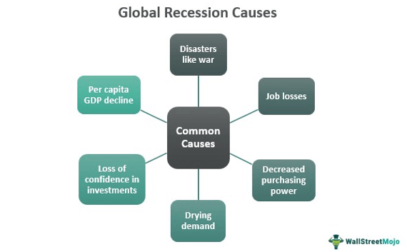

## Table of Contents

## What is a recession?

A recession is when the economy of a country slows down a lot. It happens when people buy less stuff, businesses make less money, and more people lose their jobs. Usually, a recession is said to start when the economy shrinks for two quarters in a row. That means for six months, things are getting worse instead of better.

During a recession, it can be hard for people to find work, and the value of things like houses and stocks can go down. Governments and banks try to help by lowering interest rates or giving out money to help people and businesses. Recessions don't last forever, though. Eventually, the economy starts to grow again, and things get better. But while a recession is happening, it can be a tough time for a lot of people.

## How is a recession officially defined?

A recession is officially defined by a group of people called the National Bureau of Economic Research (NBER) in the United States. They look at a lot of different things to decide if the country is in a recession. The main thing they look at is if the economy is shrinking, which means less stuff is being made and sold. They also look at how many people have jobs, how much people are spending, and how well businesses are doing. If all these things are getting worse for a while, the NBER might say that the country is in a recession.

Sometimes, people say a recession starts when the economy shrinks for two quarters in a row. A quarter is three months, so two quarters is six months. This is a simple way to think about it, but the NBER uses more information than just this. They want to make sure they are right before they say the country is in a recession. So, while the two-quarter rule is easy to remember, the official definition is more complicated and looks at many parts of the economy.

## What are the common economic indicators of a recession?

Common economic indicators of a recession include a drop in Gross Domestic Product (GDP), which means the total value of all goods and services produced in a country is going down. When GDP falls for two quarters in a row, many people start to think a recession might be happening. Another big sign is rising unemployment rates. When more people lose their jobs and fewer people are working, it's a clear signal that the economy is slowing down. Businesses also start to see their profits shrink because people are buying less stuff, which can lead to even more job cuts.

Other indicators include a drop in consumer spending, which means people are not buying as many things as before. This can happen because people are worried about the future and want to save their money instead of spending it. Another sign is falling business investments, where companies are not spending as much on new projects or equipment because they are not sure about the future. Lastly, a drop in housing prices and stock market values can also show that a recession might be coming, as people feel less confident about their money and the economy.

All these signs together help economists and the National Bureau of Economic Research figure out if a recession is happening. No single indicator is enough by itself, but when many of them start to show problems at the same time, it's a strong hint that the economy is in trouble.

## What role do interest rates play in causing a recession?

Interest rates can play a big role in causing a recession. When interest rates go up, it becomes more expensive for people and businesses to borrow money. This can slow down the economy because people might decide to buy fewer things, like houses or cars, if they have to pay more interest on loans. Businesses might also cut back on spending because the cost of borrowing money for new projects or equipment goes up. When spending goes down, it can lead to less business activity and fewer jobs, which are signs of a recession.

On the other hand, if interest rates are too low for a long time, it can also lead to problems. Low interest rates can encourage people and businesses to borrow and spend more than they should. This can create bubbles, like in the housing market, where prices go up a lot but are not based on real value. When these bubbles burst, it can cause a sharp drop in spending and investment, pushing the economy into a recession. So, interest rates need to be managed carefully to help keep the economy stable and avoid a recession.

## How can inflation lead to a recession?

Inflation can lead to a recession when prices go up too fast. When things get more expensive, people start to feel like their money is worth less. They might spend less because they want to save their money for important things. When people buy less, businesses sell less and might have to cut jobs or close down. This can make the economy slow down, which is what happens in a recession.

Also, if inflation is high, the government or the central bank might raise interest rates to try to slow it down. Higher interest rates make it more expensive to borrow money. People and businesses might borrow less because of this, which means they spend less on things like houses, cars, or new projects. When spending goes down a lot, it can push the economy into a recession. So, if inflation is not controlled well, it can lead to big problems for the economy.

## What impact does consumer confidence have on the economy during a recession?

Consumer confidence is really important during a recession. It's like how people feel about the future of the economy. If people are feeling good and think things will get better, they might keep spending money on things like cars, houses, or going out to eat. This spending helps businesses stay open and keeps people working. But if people are worried and think things will get worse, they might stop spending and start saving their money instead. When a lot of people do this, it can make the recession worse because businesses sell less and might have to let people go.

During a recession, low consumer confidence can make the economy shrink even more. When people are scared about their jobs or money, they cut back on buying things they don't need. This means businesses make less money, and they might have to cut jobs or close down. Fewer jobs make people even more worried, and they spend even less. It's like a circle that keeps going around, making the recession last longer. So, helping people feel better about the future can be really important to get the economy growing again.

## Can government policies cause or contribute to a recession?

Yes, government policies can cause or contribute to a recession. If the government spends too much money and builds up a big debt, it might have to raise taxes or cut spending later on. This can make people and businesses feel like they have less money to spend, which can slow down the economy. Also, if the government makes rules that make it harder for businesses to make money or grow, like high taxes or strict regulations, businesses might cut back on hiring or investing, which can lead to fewer jobs and less economic activity.

Another way government policies can contribute to a recession is through how they handle interest rates. If the central bank, which is part of the government, raises interest rates too high, it can make borrowing money more expensive. This can stop people from buying things like houses or cars, and businesses from starting new projects. When spending goes down a lot, it can push the economy into a recession. So, the government needs to be careful with its policies to help keep the economy stable and avoid making a recession worse.

## How do global economic factors influence the likelihood of a recession?

Global economic factors can have a big impact on whether a country goes into a recession. When big economies like the United States, China, or Europe are doing badly, it can affect the whole world. If these countries are buying less stuff from other countries, it can hurt those countries' economies. Also, if there's a big problem like a financial crisis in one part of the world, it can spread to other places. For example, if banks in one country are in trouble, it can make people in other countries worried about their own banks, which can lead to less spending and more problems.

Another way global factors can influence a recession is through trade. If countries start putting up barriers like tariffs or quotas, it can make it harder for businesses to sell their products around the world. This can slow down the economy because businesses make less money and might have to cut jobs. Also, things like oil prices can affect the whole world. If oil prices go up a lot, it can make everything more expensive and hurt the economy. So, what happens in one part of the world can have a big effect on whether other countries go into a recession.

## What is the relationship between housing markets and recessions?

The housing market can play a big role in causing a recession. When housing prices go up a lot, people might think it's a good time to buy a house. Banks might give out more loans because they think housing prices will keep going up. But if prices get too high and people can't afford to buy houses anymore, the market can crash. When this happens, people who bought houses at high prices might lose money, and banks might have trouble getting their loans back. This can lead to less spending and more problems for the economy, pushing it into a recession.

On the other hand, during a recession, the housing market can also get worse. When people are worried about their jobs and money, they might not want to buy a house. This means fewer people are buying and selling homes, which can make housing prices go down. When prices fall a lot, people who own homes might feel like they have less money, so they spend less on other things. This can make the recession last longer because when people spend less, businesses make less money and might have to cut jobs. So, the housing market and recessions can affect each other in big ways.

## How do business cycles contribute to the onset of a recession?

Business cycles are like the ups and downs that happen in the economy over time. They go through periods of growth, where businesses are doing well and people are buying more stuff, and periods of slowdown, where things are not going as well. When the economy is growing, businesses might hire more people and invest in new projects. But if the growth goes on for too long, it can lead to problems like inflation or too much borrowing. When these problems get big enough, they can cause the economy to slow down a lot, which is what happens at the start of a recession.

When the economy starts to slow down, it can turn into a recession if it keeps going for a while. During the slowdown part of the business cycle, businesses might start to sell less and make less money. They might have to cut jobs or stop investing in new projects. When a lot of businesses do this at the same time, it can make the economy shrink. If the economy shrinks for too long, like for two quarters in a row, it can officially become a recession. So, the ups and downs of business cycles can lead to a recession if the slowdown gets too bad.

## What are the effects of technological changes on economic stability and recessions?

Technological changes can affect economic stability in big ways. When new technology comes out, it can help businesses do things better and faster. This can make the economy grow because businesses can make more stuff and sell it for less money. But sometimes, new technology can also cause problems. If a new machine or computer program can do a job that people used to do, those people might lose their jobs. This can make the economy slow down because when people don't have jobs, they spend less money. So, while technology can help the economy grow, it can also make things unstable if it causes a lot of people to lose their jobs.

Also, big changes in technology can lead to a recession if they happen too fast. If a lot of businesses start using new technology all at once, it can make some old businesses go out of business because they can't keep up. This can lead to fewer jobs and less spending, which can push the economy into a recession. But if the economy can adjust to the new technology over time, it can start to grow again. So, how fast technology changes and how well the economy can handle those changes can make a big difference in whether a recession happens or not.

## How can structural economic changes lead to a recession?

Structural economic changes can lead to a recession when big shifts happen in how the economy works. For example, if a country used to make a lot of one thing, like cars, but then people start buying fewer cars and more electric bikes, the car factories might have to close down. This means a lot of people could lose their jobs. When people don't have jobs, they spend less money, and this can make the whole economy slow down. If the economy can't adjust quickly to make new things that people want, like electric bikes, it can lead to a recession.

Another way structural changes can cause a recession is if they happen too fast for the economy to keep up. Imagine if a lot of jobs that used to be done by people start being done by machines or computers. This can happen in places like factories or offices. If the people who lose their jobs can't find new ones quickly, they might not have money to spend. When a lot of people are spending less, businesses make less money and might have to cut more jobs. This cycle can push the economy into a recession if it goes on for too long.

## References & Further Reading

1. **National Bureau of Economic Research (NBER)** - For comprehensive insights into how U.S. recessions are determined and their historical significance, refer to the NBER's official website: [www.nber.org](https://www.nber.org/).

2. **The Great Depression** - A foundational text on this catastrophic economic decline is "The Great Crash 1929" by John Kenneth Galbraith, which provides an in-depth analysis of the causes and consequences of the Great Depression.

3. **The Global Financial Crisis of 2007–2008** - For a critical examination of the causes and aftermath of the 2007-2008 financial crisis, "Too Big to Fail" by Andrew Ross Sorkin offers detailed narratives.

4. **Algorithmic Trading** - "Algorithmic Trading and DMA: An introduction to direct access trading strategies" by Barry Johnson is a definitive guide that covers various facets of algorithmic trading, from concepts to practical applications.

5. **Flash Crash of May 2010** - "Broken Markets: How High Frequency Trading and Predatory Practices on Wall Street Are Destroying Investor Confidence and Your Portfolio" by Sal Arnuk and Joseph Saluzzi provides thorough coverage of the May 2010 Flash Crash and the role of high-frequency trading.

6. **AI and Machine Learning in Finance** - For advanced studies on how machine learning is applied in financial markets, consider "Advances in Financial Machine Learning" by Marcos López de Prado, highlighting algorithms and predictive models.

7. **Quantum Computing and Blockchain** - "Quantum Computing for Everyone" by Chris Bernhardt offers an accessible introduction to quantum computing, while "Blockchain Basics: A Non-Technical Introduction in 25 Steps" by Daniel Drescher provides foundational knowledge on blockchain technology.

8. **General Economic Theory** - For a broader perspective on economic theory and its application to financial crises, "Economics" by Paul Samuelson and William Nordhaus is a well-regarded classic.

These references serve as a foundational base for understanding economic downturns, financial crises, and the evolving role of [algorithmic trading](/wiki/algorithmic-trading).

