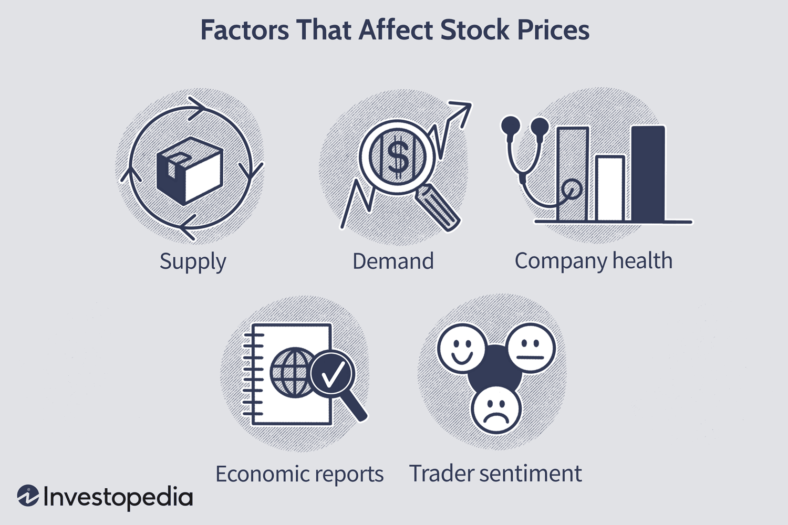

The stock market is a crucial component of the global financial system, serving as a platform where equities, bonds, and other securities are traded. It provides companies the opportunity to raise capital and investors the potential to earn returns. Stock markets facilitate economic activity by enabling the efficient allocation of resources, thereby supporting economic growth and development. According to the World Bank, the total market capitalization of listed domestic companies worldwide reached $93 trillion in 2019, highlighting the pivotal role that stock markets play in global finance.

Understanding the dynamics of stock market declines is essential for investors, policymakers, and economists. Market declines, often referred to as bear markets when sustained, can have far-reaching implications. They can erode individual wealth, affect retirement savings, and even trigger broader economic downturns by reducing consumer confidence and spending. The 2008 financial crisis is a prominent example of how stock market declines can lead to severe economic consequences. During declines, market sentiment and investor psychology, characterized by fear and uncertainty, often exacerbate price movements, creating a self-perpetuating cycle that magnifies losses.



Algorithmic trading, commonly referred to as algo trading, has revolutionized the way stock markets operate. It employs computer algorithms to automate the trading process, often executing orders at speeds and frequencies that are impossible for human traders. Algorithms can analyze vast amounts of data to identify trading opportunities, executing strategies based on predefined conditions. This development has introduced a new layer of complexity to financial markets, as algorithmic trading now accounts for a significant portion of trading volume.

The interplay between economic factors and algorithmic trading is influencing stock market behavior. The purpose of this article is to explore how various economic factors, such as monetary policies, inflation, and geopolitical events, contribute to stock market declines. Additionally, it examines how the rise of algorithmic trading can amplify these declines, leading to increased volatility. By understanding these elements, investors can better navigate the challenges posed by stock market fluctuations, leveraging economic analyses and advanced trading tools to achieve informed investment decisions.

## Table of Contents

## Understanding Stock Market Declines

Stock market declines, also known as market corrections or bear markets, are periods where the prices of securities fall significantly across the market. These declines can be characterized by a drop of at least 10% from a recent high for a correction, and a 20% or more decrease for a bear market. They are often marked by heightened volatility, increased trading volumes, and a pervasive negative sentiment among investors.

Historically, the stock market has experienced several significant declines. The Wall Street Crash of 1929, which led to the Great Depression, saw the Dow Jones Industrial Average fall nearly 90% from its peak. The 1987 crash, known as Black Monday, witnessed the largest single-day percentage drop in the Dow's history with a 22.6% decline. More recently, the 2008 financial crisis triggered a protracted bear market as major indices like the S&P 500 fell approximately 57% from their October 2007 highs.

The repercussions of stock market declines on individual investors can be profound. These downturns can erode retirement savings, reduce investment portfolios' value, and increase the sense of financial insecurity among investors. For the broader economy, substantial market declines may lead to reduced consumer spending, tight credit conditions, and lower investment by businesses due to diminished confidence and decreased asset values.

Market sentiment and investor psychology play critical roles in the movement of stock prices during declines. Behavioral finance suggests that emotions such as fear and greed, along with cognitive biases like overconfidence and herd mentality, can drive irrational decision-making among investors. This can exacerbate market declines as panic selling ensues, further pushing prices down in a self-reinforcing cycle. The concept of "animal spirits," as described by economist John Maynard Keynes, highlights the influence of psychological factors on investors' decisions and, consequently, on economic cycles.

In essence, understanding stock market declines involves analyzing both quantitative factors, such as price movements and market indices, and qualitative elements, which include investor psychology and market sentiment. Such an understanding is crucial for developing strategies to mitigate the impact of these declines on individual wealth and the broader economic landscape.

## Key Economic Factors Affecting Stock Decline

Stock market declines can result from a myriad of economic factors, each influencing investor confidence and market stability. A key driver is monetary policy, chiefly through [interest rate](/wiki/interest-rate-trading-strategies) changes. Central banks, like the Federal Reserve in the United States, adjust interest rates to manage economic growth and inflation. When interest rates rise, borrowing costs for individuals and businesses increase, potentially slowing economic activity. Conversely, lower interest rates can stimulate borrowing and investment but may also lead to inflation if not managed carefully.

Inflation levels and economic growth indicators are intimately connected with stock market performance. Inflation erodes purchasing power, which can dampen consumer spending, a critical component of gross domestic product (GDP). When inflation is high, central banks might raise interest rates to contain it, impacting corporate profits and thus, stock valuations. Economic growth indicators, such as GDP growth rates, unemployment figures, and consumer confidence indices, provide insights into the health of the economy, influencing investor sentiment and stock market trends. For instance, high GDP growth typically leads to higher corporate earnings, making stocks more attractive.

Global economic events and geopolitical instability can also precipitate stock market declines. Events such as Brexit, trade tensions between major economies, or unpredictable political developments can create uncertainty, leading investors to sell off stocks as they seek safer assets. The interconnectedness of global markets means that economic disruptions in one region often ripple across others, affecting investor perceptions globally.

Corporate earnings reports serve as barometers for company health and can significantly influence stock prices. Positive earnings surprises can lead to stock price increases, while negative results often result in declines. Furthermore, shifting industry trends, driven by technological advances or changes in consumer behavior, can impact entire sectors. For example, the transition to renewable energy sources affects the traditional energy sector, while the rise of e-commerce continues to redefine retail.

Finally, government policies and regulatory changes can have profound impacts on the stock market. Tax policy changes, for example, can alter corporate profitability and investment incentives. Stricter regulations in industries, such as banking or telecommunications, might increase operational costs or limit growth potential, affecting stock valuations. Conversely, deregulation can lead to increased competition and innovation, potentially boosting stock performance.

These economic factors are interconnected and can collectively create a complex landscape for investors to navigate. Understanding their potential impacts provides a foundation for analyzing stock market dynamics and anticipating possible declines.

## Algorithmic Trading in the Stock Market

Algorithmic trading, often referred to as algo trading, involves the use of computer algorithms to execute a large number of orders at high speed and frequency based on predetermined criteria such as timing, price, or [volume](/wiki/volume-trading-strategy). This form of trading harnesses the power of mathematics and technology to achieve trades that would be impossible for human traders to execute manually. The roots of [algorithmic trading](/wiki/algorithmic-trading) trace back to the early 1970s with the introduction of computer-based trading systems, but it gained significant prominence in the 1990s with advancements in technology and electronic markets.

Algorithmic trading can be categorized into several strategies, each designed to achieve distinct objectives. Common strategies include:

1. **Market Making**: This involves placing buy and sell orders to capture the bid-ask spread, thus providing liquidity to the markets.
2. **Statistical Arbitrage**: This strategy exploits pricing inefficiencies between correlated securities to achieve profit.
3. **Trend Following**: Algorithms identify and capitalize on trends in stock prices using indicators like moving averages.
4. **Mean Reversion**: This approach is based on the assumption that stock prices eventually revert to their historical mean or average level.

The primary advantage of algorithmic trading is its efficiency and precision. Algorithms can process vast amounts of data and execute trades at optimal prices without human error. They also enable high-frequency trading ([HFT](/wiki/high-frequency-trading-strategies)), which capitalizes on short-term market inefficiencies faster than any human. However, algorithmic trading poses several challenges. The reliance on complex algorithms and rapid execution can lead to situations where defects in the algorithms cause significant market disruptions, such as the "Flash Crash" of 2010. Additionally, the competitive nature of algorithmic trading creates an environment where speed and technology supremacy are imperative, leading to increased operational costs.

Technology and data play a pivotal role in driving algorithmic trading. The availability of real-time data and historical market data guides the development and optimization of trading algorithms. Advancements in [machine learning](/wiki/machine-learning) and [artificial intelligence](/wiki/ai-artificial-intelligence) (AI) further enhance the ability of algorithms to identify patterns and make predictions. The continuous evolution of data processing technologies and the expansion of available datasets suggest a growing capacity for algorithmic trading systems to make more informed and complex decisions.

In conclusion, algorithmic trading stands as a transformative force in modern financial markets, offering both opportunities and challenges. Its reliance on technology and data is both its strength and its vulnerability, making ongoing adaptation crucial to maintain its efficacy and ensure market stability.

## Impact of Algorithmic Trading on Stock Market Declines

Algorithmic trading, also known as algo trading, utilizes computational algorithms to execute a flurry of trading tasks at speeds and frequencies beyond human capabilities. While this technology brings efficiency and [liquidity](/wiki/liquidity-risk-premium) to the market, it is also capable of exacerbating stock market declines under certain conditions.

### How Algorithmic Trading Can Exacerbate Stock Market Declines

Algorithmic trading strategies often involve high-frequency trading (HFT), [arbitrage](/wiki/arbitrage), and market-making. These strategies, while typically profitable, can contribute to market instability during times of stress. For example, algorithms might be programmed to sell off stocks rapidly when a set trigger, such as a specific price threshold or market indicator, is hit. This can initiate a cascade effect, amplifying price drops and deepening market declines. 

The market dynamics during a rapid decline are primarily driven by the sheer volume and speed of trades executed by algos. When multiple algorithms operate on similar triggers, they may all act simultaneously, causing a sharp decline in stock prices. This phenomenon can be likened to a feedback loop—where the trading actions initially caused by a decline, further exacerbate that decline.

### Cases Where Algo Trading Has Led to Market Volatility

Historical instances illustrate the volatile nature of HFT during market declines. The "Flash Crash" of May 6, 2010, is a significant example. During this event, the Dow Jones Industrial Average experienced its largest one-day point decline at the time, plummeting nearly 1,000 points within minutes, only to recover much of the loss by the day's end. Investigations revealed that a confluence of algorithmic trades, including a large sell order executed by trading algorithms, contributed to the crash.

Another example is the [volatility](/wiki/volatility-trading-strategies) experienced in the aftermath of the 2015 Chinese stock market crash. High-frequency algorithms reacting to rapid declines exacerbated volatility and played a role in the market's struggle to stabilize.

### Regulatory Perspectives on Algorithmic Trading and Market Stability

Regulators around the world recognize the challenges posed by high-frequency trading, particularly in volatile market conditions. The U.S. Securities and Exchange Commission (SEC) and the Commodity Futures Trading Commission (CFTC) have implemented measures such as the "Limit Up-Limit Down" mechanism, which prevents trades from occurring outside specified price bands, effectively curbing sudden market swings.

Internationally, the European Securities and Markets Authority (ESMA) enforces the Markets in Financial Instruments Directive II (MiFID II), which places stringent rules on algorithmic trading to maintain fair and orderly markets.

### Measures to Mitigate Negative Impacts of Algorithmic Trading

Mitigating the adverse effects of algo trading involves a multifaceted approach:

1. **Circuit Breakers**: These are automatic halts in trading when significant declines occur, allowing time for market correction.

2. **Order-to-Trade Ratios**: Limiting the number of orders an algorithm can place in relation to actual trades, reducing excess volatility.

3. **Pre-Trade Risk Controls**: Implementing risk checks before executions can prevent erroneous trades from impacting the market.

4. **Transparency and Reporting**: Increased transparency in algo strategies and comprehensive reporting requirements can help regulators monitor and manage systemic risks.

Adopting these strategies can help balance the benefits of algorithmic trading with the need to maintain market stability, ultimately allowing for a more resilient financial ecosystem.

## Integration of Economic Factors and Algorithmic Trading

The integration of economic factors with algorithmic trading has become a focal point for investors seeking to enhance predictive accuracy and optimize strategies within stock markets. Economic indicators, such as GDP growth, unemployment rates, inflation, and interest rates, serve as essential inputs for algorithmic models designed to project stock market behavior. Algorithmic traders leverage these indicators to create models that can predict price movements or volatility changes, often utilizing machine learning techniques to refine their predictions continuously.

Predicting stock market movements through algorithmic models often involves the application of quantitative techniques. One common method is time-series analysis, where historical economic and stock market data are used to forecast future trends. Machine learning algorithms, including linear regression, decision trees, or neural networks, are frequently employed to handle the complex, non-linear relationships between economic indicators and stock prices. An example of this could involve using a [neural network](/wiki/neural-network) model to predict future stock prices:

```python
from sklearn.model_selection import train_test_split
from sklearn.preprocessing import MinMaxScaler
from tensorflow.keras.models import Sequential
from tensorflow.keras.layers import Dense, LSTM

# Assuming 'economic_data' is a DataFrame containing essential economic indicators and stock prices
X = economic_data[['GDP_growth', 'unemployment_rate', 'inflation', 'interest_rate']].values
y = economic_data['stock_prices'].values

# Scale data
scaler = MinMaxScaler(feature_range=(0, 1))
X_scaled = scaler.fit_transform(X)
y_scaled = scaler.fit_transform(y.reshape(-1, 1))

# Split data into training and test sets
X_train, X_test, y_train, y_test = train_test_split(X_scaled, y_scaled, test_size=0.2, random_state=42)

# Build LSTM model
model = Sequential()
model.add(LSTM(50, return_sequences=True, input_shape=(X_train.shape[1], 1)))
model.add(LSTM(50))
model.add(Dense(1))

model.compile(optimizer='adam', loss='mean_squared_error')
model.fit(X_train, y_train, epochs=100, batch_size=32)

# Predicting stock prices
predictions = model.predict(X_test)
```

One challenge that algorithmic traders face in rapidly changing economic landscapes is the model's ability to adapt to new data and maintain accuracy. This requires continuous model training and adjustments as new economic data become available or as economic conditions shift unexpectedly, such as during financial crises or sudden geopolitical events. Additionally, the rapid pace of technological advancements requires traders to continuously upgrade their infrastructure to remain competitive.

Future trends influencing economic factors in algorithmic trading may include further integration of real-time data analytics and artificial intelligence to enhance decision-making processes. As computational power increases and data processing becomes more sophisticated, algorithmic traders are likely to incorporate more diverse sets of data, including non-traditional indicators like social media sentiment analysis, climate change impacts, and political risk assessments, into their models. This evolution will provide a more holistic view of market conditions and further refine predictive capabilities.

Ultimately, the successful integration of economic factors with algorithmic models in trading hinges on the continuous evolution of mathematical and computational techniques, along with a robust understanding of the shifting economic landscape.

## Conclusion

Economic factors play a pivotal role in influencing stock market declines. Key elements such as monetary policies, interest rate fluctuations, inflation levels, and geopolitical events substantially impact market dynamics. Central banks adjusting interest rates, for instance, can affect corporate borrowing costs, influencing investment decisions and overall economic growth. High inflation can erode consumer purchasing power, thereby dampening corporate revenues and affecting stock prices. Global events, like trade conflicts or political instability, also contribute to market volatility, highlighting the interconnectedness of global economies.

Algorithmic trading has transformed the landscape of stock markets by introducing automated, high-speed trading mechanisms that respond instantaneously to market changes. While algorithmic trading facilitates liquidity and tighter bid-ask spreads, it can also exacerbate stock market declines. The rapid execution of trades based on predefined algorithms often intensifies price movements during volatile periods, occasionally leading to market disruptions known as flash crashes.

Investors navigating stock market declines must adopt strategies that prioritize risk management and diversification. Portfolio diversification across various asset classes can mitigate the risk of significant losses. Implementing stop-loss orders can protect gains by automatically selling stocks when they drop to a predetermined price. Staying informed about economic indicators and geopolitical developments can enable investors to anticipate market trends better and adjust their portfolios accordingly.

Integrating economic analysis with algorithmic trading offers promising prospects for deeper market insights. By utilizing advanced data analytics and machine learning models, traders can incorporate economic indicators into their trading algorithms to enhance predictive accuracy. However, the rapidly changing economic landscape presents challenges, requiring adaptive and flexible trading strategies. The synthesis of economic analysis with algorithmic models may pave the way for more resilient market strategies, enabling better anticipation and management of stock market declines.

## References & Further Reading

[1]: Adrian, T., & Shin, H. S. (2010). ["The Changing Nature of Financial Intermediation and the Financial Crisis of 2007–2009."](https://www.newyorkfed.org/research/staff_reports/sr439.html) Federal Reserve Bank of New York Staff Reports.

[2]: Aldridge, I. (2013). ["High-Frequency Trading: A Practical Guide to Algorithmic Strategies and Trading Systems."](https://www.ahmetbeyefendi.com/wp-content/uploads/2020/07/High-Frequency-Trading-Irene-Aldridge.pdf) John Wiley & Sons.

[3]: Johnson, B., & Schwartz, R. A. (2010). ["Electronic vs. Floor-based Trading: Growth Challenges and Outlook."](https://link.springer.com/book/10.1007/0-387-29910-6) CFA Institute.

[4]: Keynes, J. M. (1936). ["The General Theory of Employment, Interest, and Money."](http://keynes-general-theory.com/generaltheory.pdf) Palgrave Macmillan.

[5]: Zigrand, J. P., Hviid, S., & Cliff, D. (2010). ["The Future of Computer Trading in Financial Markets: An International Perspective."](https://www.researchgate.net/publication/263888781_The_Future_of_Computer_Trading_in_Financial_Markets) Government Office for Science.