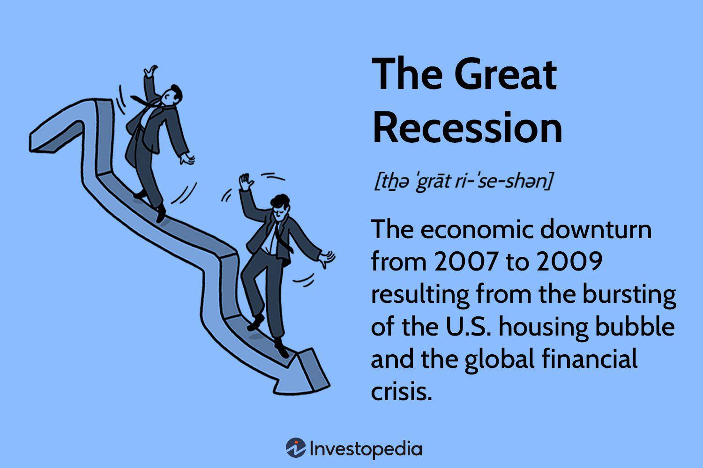

The 2008 financial crisis stands as a significant episode in modern economic history, marking a period of extreme instability with long-lasting effects on global markets and economies. This crisis, often referred to as the Great Recession, unfolded due to a complex amalgamation of factors, including the bursting of major economic bubbles and the extensive utilization of algorithmic trading. An economic bubble occurs when the prices of assets rise significantly above their fundamental value, driven by speculative demand—a phenomenon that was observed in the housing market leading up to the financial collapse. The rapid price inflation in the housing sector eventually gave way to a sharp decline, setting off a chain reaction across financial systems worldwide.

Algorithmic trading, which involves using advanced mathematical models and computer algorithms to make high-frequency trading decisions, also played a crucial role in exacerbating market volatility during the crisis. The sheer speed and volume of trades executed through these automated systems allowed for massive and rapid fluctuations in asset prices, which, when coupled with the fragile economic conditions, led to heightened levels of uncertainty and risk in global financial markets.

The purpose of this article is to explore the multitude of causes, effects, and lessons learned from the 2008 financial collapse. By examining these aspects, we aim to develop a comprehensive understanding of the crisis, its implications for financial systems, and how it forever altered international economic policies and trading practices. Addressing the intricate interplay of economic bubbles and algorithmic trading within this context is pivotal for crafting strategies to prevent similar events in the future.

## Table of Contents

## Understanding Economic Bubbles

Economic bubbles represent a complex and often destructive phenomenon within financial markets, characterized by a rapid escalation in asset prices followed by a sudden crash. These bubbles form when asset prices significantly exceed their intrinsic values, driven primarily by exuberant market behavior, widespread speculation, and at times, unsustainable levels of indebtedness.

**Formation of Economic Bubbles**

The formation of economic bubbles typically begins with a displacement or a change in the economic environment that makes certain assets more attractive. This change might be due to technological innovation, regulatory shifts, or broader economic growth prospects. Speculation intensifies as initial increases in asset prices lead to higher investor demand, often fueled by the fear of missing out (FOMO). This demand drives prices even higher, further attracting more investors. During this phase, market participants often rely heavily on future growth expectations rather than present valuation fundamentals.

**Historical Examples of Economic Bubbles**

Historically, economic bubbles have been observed across various sectors and time periods. One of the earliest recorded instances is the Dutch Tulip Mania of the 1630s, where tulip bulb prices soared to extraordinary levels before abruptly collapsing. Another notable example is the South Sea Bubble in the early 18th century, characterized by rapid inflation and subsequent deflation of stock prices tied to speculation in the South Sea Company's prospects. The most famous 20th-century example is the Dot-com Bubble of the late 1990s, where speculative investments in internet-based companies led to a dramatic rise and collapse in technology stock valuations.

**Economic Bubbles and the 2008 Financial Crisis**

Leading up to the 2008 financial crisis, the U.S. housing market experienced characteristics similar to an economic bubble. Fueled by low interest rates, lax lending standards, and the proliferation of subprime mortgages, housing prices soared. Financial innovations, including mortgage-backed securities (MBS) and collateralized debt obligations (CDOs), obscured the underlying risks and spread them throughout the global financial system. As housing prices began to fall, defaults on subprime mortgages increased, triggering the unwinding of these complex financial instruments and exposing the vulnerabilities of major financial institutions. The bursting of the housing bubble thus spread significant financial strain across global markets, underscoring how intertwined and impactful such bubbles can be.

Understanding economic bubbles is crucial, as they can lead to severe economic disruptions, requiring comprehensive intervention and regulatory reforms to restore stability. Through historical patterns and the 2008 crisis, it becomes evident that vigilance, sound regulatory frameworks, and prudent investment practices are key in mitigating the risks posed by economic bubbles.

## The Genesis of the 2008 Crisis

The 2008 financial crisis, one of the most devastating economic collapses in recent history, originated from a complex interplay of factors, with subprime mortgages and excessive risk-taking at its core. The crisis ultimately stemmed from the collapse of the housing market, where financial institutions played a leading role.

Subprime mortgages were home loans granted to individuals with poor credit histories, making them high-risk borrowers. During the early 2000s, a significant rise in housing prices encouraged lenders to offer these high-risk mortgages, often with low initial interest rates and minimal documentation requirements. Financial institutions, driven by the prospect of high returns, securitized these loans into complex financial products known as mortgage-backed securities (MBS) and collateralized debt obligations (CDO).

The housing market thus became a significant contributor to the crisis. As housing values continued to increase, financial institutions and investors alike became overly optimistic, underestimating the potential for a reversal. These institutions, fueled by speculative fervor and inadequate risk assessment, engaged in excessive leveraging, with the ratio of a firm's debt to its equity reaching unprecedented levels. This behavior amplified their exposure to the housing market downturn.

The interconnectedness of global markets meant that when the U.S. housing bubble burst, it set off a domino effect. Borrowers, unable to meet mortgage payments, defaulted in large numbers. This caused the value of MBS and CDOs to plummet, leading to significant losses for financial institutions worldwide. Investment banks, laden with these toxic assets, faced [liquidity](/wiki/liquidity-risk-premium) crises and insolvency. The collapse of Lehman Brothers in September 2008 is emblematic of this period, marking a severe escalation of the crisis.

As banks struggled, confidence in the financial system eroded, resulting in a credit crunch that affected businesses globally. The immediate consequence was a sharp decline in global trade, investment, and consumer spending, leading to severe economic contraction. The crisis effectively underscored the systemic risks posed by interconnected financial markets, high leverage, and inadequate regulation, leaving a lasting impact on global economic policies and practices.

## Algorithmic Trading and Its Impact

Algorithmic trading, a method where computer algorithms execute trades based on pre-defined criteria, became prominent in the early 2000s. This trading approach leveraged advancements in computer processing power, networks, and data analysis to execute orders at speeds and frequencies far surpassing human capabilities. Algorithms assess market conditions, identify trading opportunities, and execute orders within milliseconds, leading to efficiency and liquidity improvements.

During the 2008 financial crisis, [algorithmic trading](/wiki/algorithmic-trading) was both a beneficiary and a contributor to market [volatility](/wiki/volatility-trading-strategies). The crisis saw increased trading volumes and rapid market movements, with algorithms amplifying the speed and magnitude of price changes. Their ability to execute high-frequency trades led to increased short-term volatility, as algorithms would often react similarly to market signals, amplifying trends and resulting in quick, large-scale buying or selling without regard to underlying asset values or long-term fundamentals.

A limitation of algorithmic trading lies in its reliance on historical data and pre-set instructions, meaning that these systems may not adequately respond to unprecedented market conditions or black swan events. During the crisis, algorithms often failed to adapt to the rapidly changing landscape, exacerbating price swings and liquidity issues. Additionally, the lack of human oversight in decision-making processes can lead to cascading issues if a malfunction or oversight occurs within the algorithms, potentially triggering unintended market consequences.

The risks associated with algorithmic trading also include the potential for "flash crashes," where errant algorithms can cause sudden, severe market dips in seconds. A notable instance is the May 6, 2010, flash crash, where the Dow Jones Industrial Average dropped nearly 1,000 points in minutes before recovering. This event underscored the market's vulnerability to automated trading systems and the potential systemic risk they pose.

Mitigating these risks involves implementing robust risk management protocols and regular oversight to ensure algorithms behave as intended. Ideally, trading systems should incorporate real-time monitoring and adaptive algorithms capable of contextual market analysis. However, these measures must balance maintaining market efficiency and avoiding excessive regulation that could stifle innovation in financial technologies. Understanding algorithmic trading's role in markets is essential for both investors and regulators to safeguard against future crises stemming from automated trading systems.

## Key Events During the Crisis

The 2008 financial crisis, often described as the worst economic downturn since the Great Depression, included a series of significant events that unfolded rapidly, leaving severe impacts on both national and global economies. A key event was the collapse of Lehman Brothers, an esteemed financial services firm, which marked a critical turning point in the crisis. On September 15, 2008, Lehman Brothers filed for bankruptcy after the U.S. government decided against a bailout, leading to unprecedented market turmoil. The firm's failure was a result of excessive exposure to subprime mortgages, mirroring a broader systemic issue within financial institutions.

The implosion of Lehman Brothers triggered a chain reaction of market instability. The immediate market reaction was one of panic, causing the Dow Jones Industrial Average to plummet by 504 points, its largest drop since September 11, 2001. The uncertainty in financial markets led to a liquidity crisis, as trust in key financial institutions eroded quickly. This situation was exacerbated by interbank lending markets freezing, as banks feared counterparty defaults, leading to a tightening of credit availability worldwide.

In response to the collapse, governments and central banks worldwide undertook extraordinary interventions to stabilize financial systems. In the U.S., the Federal Reserve slashed interest rates and introduced facilities to provide liquidity, such as the Primary Dealer Credit Facility and the Term Asset-Backed Securities Loan Facility. Moreover, the U.S. Treasury launched the Troubled Asset Relief Program (TARP), allowing up to $700 billion to purchase distressed assets, injecting capital directly into banks to restore confidence and solvency.

Internationally, similar interventions were initiated. The United Kingdom nationalized several banks, including Northern Rock, and announced a £500 billion rescue package to bolster its banking system. Elsewhere, the European Central Bank (ECB) provided unprecedented liquidity support to Eurozone banks. The crisis's ripple effects were felt globally, with economies entering recessions and international stock markets experiencing significant downturns.

A timeline of major milestones during the financial collapse highlights the rapid progression of the crisis:

- **March 2008**: Bear Stearns, an investment bank, was acquired by JPMorgan Chase with Federal Reserve backing due to liquidity issues.
- **September 7, 2008**: The U.S. government placed Fannie Mae and Freddie Mac, major mortgage financing entities, into conservatorship.
- **September 15, 2008**: Lehman Brothers declared bankruptcy, sparking global financial panic.
- **September 16, 2008**: The Federal Reserve bailed out American International Group (AIG) with an $85 billion loan due to the insurer's heavy losses on credit default swaps.
- **October 3, 2008**: The Emergency Economic Stabilization Act was enacted, introducing TARP.
- **November 2008**: Global stock markets reached multi-year lows, reflecting deepening economic concerns.

The international response underscored the interconnectedness of modern financial systems and the necessity for coordinated global action to manage financial crises. The lessons learned from these events have had lasting impacts on financial regulation and risk management practices worldwide.

## The Aftermath: Economic and Regulatory Changes

The 2008 financial crisis left a profound impact on the global economy, manifesting in widespread recession and elevated unemployment levels. This economic downturn was characterized by a sharp contraction in financial markets, leading to a staggering decline in global trade and industrial production. The International Labour Organization reported that by the end of 2009, approximately 34 million people had lost their jobs globally, pushing the unemployment rate in advanced economies to 8.4% in 2009 from 5.7% in 2007.

In response to the crisis, significant regulatory reforms were introduced to stabilize the financial system and prevent future occurrences of similar economic disruptions. In the United States, one of the most comprehensive legislative responses was the Dodd-Frank Wall Street Reform and Consumer Protection Act, signed into law in July 2010. This act aimed to curb the excessive risk-taking and lack of transparency that had contributed to the crisis. Key provisions of Dodd-Frank included the establishment of the Financial Stability Oversight Council to identify and mitigate systemic risks, and the Volcker Rule, which restricted banks from making certain kinds of speculative investments.

The crisis underscored the critical need for robust regulatory frameworks and enhanced oversight of financial institutions. It highlighted several lessons that have since shaped future financial policies. These include the importance of maintaining adequate capital reserves by financial institutions to cushion against unforeseen shocks, the necessity for transparency in financial dealings to avoid information asymmetry, and the implementation of stress testing to evaluate the resilience of banks under adverse economic conditions.

Furthermore, the crisis exemplified the interconnectedness of global financial markets, which necessitated a coordinated international regulatory approach. The Basel III accords, developed by the Basel Committee on Banking Supervision, introduced enhanced banking regulations on capital adequacy, stress testing, and market liquidity risk with the aim of strengthening bank capital requirements.

While significant progress has been made in reforming the financial system, challenges remain. Continuous innovation in financial products and technologies calls for vigilant regulatory oversight to manage emerging risks effectively. The lessons from the 2008 crisis thus serve as a pivotal guide for policymakers and financial institutions, emphasizing the importance of adaptability and resilience in financial systems to safeguard against future crises.

## Lessons from the Crisis on Modern Trading Practices

The 2008 financial crisis served as a critical lesson for the financial sector, particularly highlighting vulnerabilities in algorithmic trading. Algorithmic trading, which uses complex algorithms to make high-frequency decisions at a speed and frequency beyond human capability, gained popularity in the early 2000s. However, the crisis underscored significant weaknesses in risk management and oversight among automated trading systems, prompting a reevaluation of practices in modern financial markets.

**Improvements in Risk Management and Oversight**

Post-crisis, the financial industry has made substantial strides in enhancing risk management for algorithmic trading. One significant development is the implementation of more rigorous stress testing procedures. These tests simulate extreme market conditions to ensure trading algorithms can withstand unforeseen volatility without contributing to market instability. Additionally, firms are investing in better real-time monitoring systems that provide continuous oversight of trading activities, allowing for rapid intervention when anomalies are detected.

Enhancements in algorithmic logic also play a crucial role in improving risk management. Algorithms are now designed to incorporate risk factors that were previously overlooked, such as liquidity risk and counterparty risks. This development has pushed for an integrated risk assessment approach where algorithms are regularly reviewed and updated to align with prevailing market conditions and regulatory requirements.

Furthermore, regulatory bodies have established stricter regulations governing algorithmic trading. For instance, regulators require firms to maintain comprehensive records of algorithmic decisions and their outcomes, facilitating thorough post-trade analysis. Regulatory frameworks such as the Markets in Financial Instruments Directive II (MiFID II) in Europe mandate transparency and accountability, requiring firms to register their trading algorithms and validate their safety and reliability before deployment.

**Ongoing Challenges and Vigilance in Financial Innovation**

Despite these advancements, algorithmic trading continues to pose challenges. One major concern is the potential for systemic risk, where flawed algorithms can amplify market disruptions. As algorithms often operate on similar strategies based on market signals, there is a risk of synchronized behavior across multiple trading platforms, leading to substantial market impacts.

Moreover, the technology-driven nature of algorithmic trading necessitates constant vigilance to prevent cyber threats and data breaches. Ensuring the integrity and security of data inputs and outputs used by trading algorithms remains a critical focus for firms to safeguard against manipulative practices and unauthorized access.

Additionally, the rapid evolution of technology presents a continuous challenge for regulatory oversight. Regulators must adapt to emerging technologies such as [artificial intelligence](/wiki/ai-artificial-intelligence) and [machine learning](/wiki/machine-learning) that are increasingly integrated into algorithmic trading strategies. These technologies, while offering increased sophistication in trading decisions, require novel regulatory approaches to ensure they do not exacerbate market vulnerabilities.

To address these ongoing challenges, there is a need for collaborative efforts between financial institutions, technologists, and regulators. Establishing a culture of transparency, continuous improvement, and proactive risk management is essential to harness the benefits of algorithmic trading while mitigating its associated risks. The lessons learned from the 2008 financial crisis emphasize that as financial innovation progresses, so must the frameworks that govern and oversee its application, ensuring the stability and resilience of global markets.

## Conclusion

The 2008 financial crisis marked a significant turning point in global economic history, underscoring the complexities and vulnerabilities of modern financial systems. Key takeaways from the crisis reveal crucial insights into the mechanisms through which unchecked financial risks and improper market dynamics can lead to widespread economic turmoil. At its core, the crisis highlighted the catastrophic impact of excessive risk-taking, poorly understood financial products, and the interconnectedness of global markets. 

The importance of thoroughly understanding financial risks and market dynamics cannot be overstated. Financial institutions, policymakers, and investors must recognize the potential for economic bubbles and the role of leveraged financial products in escalating financial instability. Additionally, the crisis demonstrated the dangers of inadequate regulatory frameworks, emphasizing the need for robust oversight to ensure market transparency and protect against system-wide failures.

Continuous improvement in financial practices is essential to avoid repeating past mistakes. This involves implementing stringent regulatory measures, such as those established by post-crisis reforms like the Dodd-Frank Act, to mitigate systemic risks. Moreover, the advancements in technology and the increasing reliance on algorithmic trading necessitate enhanced risk management strategies and comprehensive oversight to address the unique challenges posed by automated systems.

To safeguard future financial stability, there must be an ongoing commitment to learning from the past. Financial institutions and regulators alike must strive for innovation in their practices while maintaining a vigilant stance towards emerging risks. By doing so, the global financial system can better withstand shocks and maintain resilience in an ever-evolving economic landscape.

## References & Further Reading

[1]: Gorton, G. (2010). ["Slapped by the Invisible Hand: The Panic of 2007."](https://papers.ssrn.com/sol3/papers.cfm?abstract_id=1401882) Oxford University Press.

[2]: Minsky, H. P. (2008). ["Stabilizing an Unstable Economy."](https://archive.org/details/stabilizingunsta0000mins_d5y8) McGraw-Hill.

[3]: Lewis, M. (2010). ["The Big Short: Inside the Doomsday Machine."](https://books.google.com/books/about/The_Big_Short_Inside_the_Doomsday_Machin.html?id=eParwQ0YdrcC) W. W. Norton & Company.

[4]: Shiller, R. J. (2005). ["Irrational Exuberance."](https://www.jstor.org/stable/j.ctt7st4s) Princeton University Press.

[5]: Johnson, S. & Kwak, J. (2010). ["13 Bankers: The Wall Street Takeover and the Next Financial Meltdown."](https://www.emerald.com/insight/content/doi/10.1108/17422041111149543/full/html) Vintage Books.

[6]: Tett, G. (2009). ["Fool's Gold: The Inside Story of J.P. Morgan and How Wall St. Greed Corrupted Its Bold Dream and Created a Financial Catastrophe."](https://link.springer.com/chapter/10.1007/978-3-031-69610-7_5) Free Press.

[7]: Brunnermeier, M. K. (2009). ["Deciphering the Liquidity and Credit Crunch 2007-2008."](https://www.aeaweb.org/articles?id=10.1257/jep.23.1.77) Journal of Economic Perspectives, 23(1), 77-100.

[8]: Bernanke, B. (2015). ["The Courage to Act: A Memoir of a Crisis and Its Aftermath."](https://archive.org/details/couragetoactmemo0000bern) W. W. Norton & Company.

[9]: Sornette, D. (2003). ["Why Stock Markets Crash: Critical Events in Complex Financial Systems."](https://archive.org/details/whystockmarketsc00sorn) Princeton University Press.