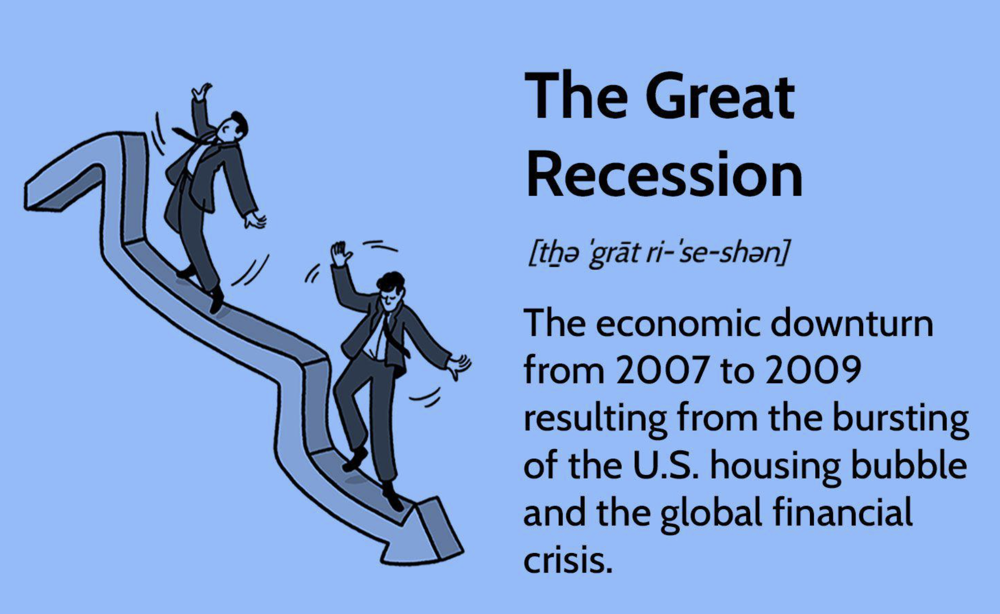

## Table of Contents

## What was the 2008 Financial Crisis?

The 2008 Financial Crisis, also known as the Global Financial Crisis, was a major economic disaster that started in the United States and spread around the world. It began when many people could not pay back their home loans, causing banks to lose a lot of money. These loans were called subprime mortgages, and they were given to people who could not afford them. Banks had been selling these risky loans to investors, and when the borrowers defaulted, the value of these investments crashed. This led to a big drop in the stock market and many banks failing or needing government help to stay open.

The crisis had a huge impact on the world economy. Many people lost their jobs, and businesses closed down. Governments around the world had to spend a lot of money to help their economies recover. In the United States, the government passed a big rescue plan called the Troubled Asset Relief Program (TARP) to help banks and other financial institutions. The crisis showed that the financial system was not as strong as people thought and led to new rules and regulations to try to prevent something like this from happening again. It took years for the world economy to fully recover from the effects of the 2008 Financial Crisis.

## What were the immediate triggers of the 2008 Financial Crisis?

The immediate trigger of the 2008 Financial Crisis was the bursting of the housing bubble in the United States. For years, banks had been giving out loans to people who wanted to buy houses, even if they couldn't afford them. These loans were called subprime mortgages. Banks thought it was safe to give these loans because they believed house prices would keep going up. But in 2006, house prices started to fall, and many people couldn't pay back their loans. This caused a lot of problems for the banks because they had been selling these risky loans to investors.

When the housing bubble burst, it led to a big problem called the subprime mortgage crisis. Banks had created complex financial products called mortgage-backed securities, which were bundles of these risky loans. When people couldn't pay their mortgages, these securities lost a lot of value. This caused a panic in the financial markets. In September 2008, Lehman Brothers, a big investment bank, went bankrupt because it had too many of these bad investments. This event scared everyone and made the crisis even worse. The failure of Lehman Brothers was a key moment that turned the subprime mortgage crisis into a full-blown global financial crisis.

## How did the housing market contribute to the 2008 Financial Crisis?

The housing market played a big role in causing the 2008 Financial Crisis. For many years, banks were giving out loans called subprime mortgages to people who wanted to buy houses, even if they couldn't really afford them. These loans had low interest rates at first, but then the rates would go up. Banks thought it was okay to give these loans because they believed that house prices would keep going up. But in 2006, house prices started to fall. This meant that many people who had taken out these loans couldn't pay them back because their houses were now worth less than what they owed.

When people couldn't pay their mortgages, it caused a lot of problems for the banks. Banks had been selling these risky loans to investors in the form of mortgage-backed securities. When the housing bubble burst, these securities lost a lot of value because so many people were defaulting on their loans. This led to a big drop in the value of these financial products, causing a panic in the financial markets. The failure of Lehman Brothers, a big bank that had a lot of these bad investments, was a key moment that turned the housing market problems into a full-blown global financial crisis.

## What role did subprime mortgages play in the crisis?

Subprime mortgages were a big reason for the 2008 Financial Crisis. These were loans given to people who couldn't afford to buy houses. Banks thought it was safe to give these loans because they believed house prices would keep going up. But when house prices started to fall in 2006, many people couldn't pay back their loans. This caused big problems for the banks because they had been selling these risky loans to investors.

When people couldn't pay their mortgages, the value of the investments that were based on these loans dropped a lot. These investments were called mortgage-backed securities. The drop in value caused a panic in the financial markets. A big bank called Lehman Brothers had a lot of these bad investments and went bankrupt in September 2008. This made the crisis even worse and turned it into a global financial crisis.

## How did financial deregulation contribute to the 2008 Financial Crisis?

Financial deregulation played a big part in the 2008 Financial Crisis. Before the crisis, rules that used to control banks and other financial companies were changed or taken away. This meant banks could take more risks. One big change was the Gramm-Leach-Bliley Act in 1999, which let banks do more than just banking, like selling insurance and investing in risky things. This made banks want to take bigger risks to make more money.

Because of deregulation, banks started giving out a lot of risky loans, like subprime mortgages. They thought they could make a lot of money by selling these loans to investors. But when the housing market crashed, these risky loans caused big problems. Banks lost a lot of money, and some even went bankrupt. If there had been stricter rules, banks might not have taken such big risks, and the crisis might not have been so bad.

## What was the impact of credit default swaps and other derivatives on the crisis?

Credit default swaps and other derivatives played a big role in making the 2008 Financial Crisis worse. Credit default swaps were like insurance policies that people bought to protect themselves if a loan went bad. But they were risky because they let banks and investors take even bigger risks. If a bank had a lot of bad loans, they could buy a credit default swap to protect themselves. But if too many loans went bad at the same time, the people who sold the swaps couldn't pay everyone back. This made the crisis spread to other parts of the financial system.

Derivatives, which are financial products based on other assets, also added to the crisis. They were very complicated and hard to understand. Many banks and investors used derivatives to bet on the housing market. When the housing market crashed, these bets went bad, causing big losses. The problems with derivatives made people lose trust in the whole financial system. This made the crisis even worse because no one knew who was safe and who was in trouble.

## How did the shadow banking system influence the 2008 Financial Crisis?

The shadow banking system was a big part of what made the 2008 Financial Crisis so bad. It's called "shadow banking" because it's not like regular banks that people use every day. Instead, it includes things like investment banks, hedge funds, and money market funds. These groups were doing a lot of risky things, like lending money and creating complex financial products, but they didn't have the same rules and protections that regular banks have. Because they were not watched as closely, they could take bigger risks. When the housing market crashed, these shadow banks were hit hard because they had a lot of money tied up in risky loans and investments.

When the shadow banking system started to fail, it made the crisis much worse. Many of these groups were deeply connected to the regular banking system. So when they started to lose money, it caused problems for regular banks too. For example, when Lehman Brothers, a big investment bank, went bankrupt, it scared everyone and made people lose trust in the whole financial system. This led to a big panic where no one wanted to lend money to anyone else. The problems in the shadow banking system helped spread the crisis from the housing market to the whole world economy.

## What was the role of global imbalances in causing the crisis?

Global imbalances played a big part in causing the 2008 Financial Crisis. Countries like China and Germany were saving a lot of money and not spending enough. They were sending this extra money to countries like the United States, where people were spending more than they were [earning](/wiki/earning-announcement). This created a big difference between countries that were saving and countries that were borrowing. The United States was borrowing a lot of money from other countries to keep spending and buying things, especially houses. This helped create the housing bubble because there was so much money available for loans.

When the housing bubble burst, these global imbalances made the crisis worse. The United States needed to borrow even more money to fix its problems, but other countries were not as willing to lend. This made it hard for the U.S. to recover quickly. The imbalances also caused problems in other countries because they had put a lot of their money into the U.S. economy. When the U.S. economy crashed, these countries lost a lot of money too. So, the global imbalances helped spread the crisis from the United States to the rest of the world.

## How did excessive leverage and risk-taking by financial institutions contribute to the crisis?

Excessive leverage and risk-taking by financial institutions were major causes of the 2008 Financial Crisis. Leverage means borrowing money to make bigger investments. Banks and other financial companies were borrowing a lot of money to invest in risky things like subprime mortgages. They thought they could make a lot of money this way. But when the housing market crashed, these risky investments lost a lot of value. Because the banks had borrowed so much money, they couldn't pay it back and started to fail. This caused a big problem because many banks were in trouble at the same time.

The risk-taking was also a big problem. Banks were creating and selling complex financial products like mortgage-backed securities and credit default swaps. These products were very risky, but banks didn't understand the risks well enough. They thought they could make a lot of money by selling these products to investors. But when the housing market crashed, these products lost a lot of value. This caused a panic in the financial markets because no one knew who was safe and who was in trouble. The excessive leverage and risk-taking by financial institutions helped turn the housing market problems into a global financial crisis.

## What were the effects of the crisis on the global economy?

The 2008 Financial Crisis had a huge impact on the global economy. It started in the United States but quickly spread to other countries. Many people lost their jobs, and businesses closed down. Banks stopped lending money because they were scared, which made it hard for people and companies to borrow. This led to a big slowdown in the world economy. Countries like Greece and Iceland had big problems and needed help from other countries to fix their economies. The crisis showed that the world's financial systems were connected, and a problem in one place could cause trouble everywhere.

Governments around the world had to spend a lot of money to help their economies recover. In the United States, the government passed a big rescue plan called the Troubled Asset Relief Program (TARP) to help banks and other financial institutions. Other countries did similar things to try to stop the crisis from getting worse. It took years for the world economy to get back to normal. People started to trust banks less, and new rules were made to try to prevent another crisis. The effects of the 2008 Financial Crisis were felt for a long time and changed how people thought about the global economy.

## How did government policies and interventions fail to prevent the 2008 Financial Crisis?

Government policies and interventions failed to prevent the 2008 Financial Crisis because they did not do enough to stop banks from taking big risks. Before the crisis, rules that used to control banks were changed or taken away. This let banks do more than just banking, like selling insurance and investing in risky things. The government did not watch the banks closely enough to make sure they were not taking too many risks. They thought the banks knew what they were doing, but the banks were making a lot of risky loans and investments that ended up causing big problems.

Also, the government did not do enough to stop the housing bubble from getting too big. They did not see how dangerous it was for so many people to be buying houses they could not afford. The government thought that house prices would keep going up, so they did not try to stop the bubble. When the bubble burst, the government had to step in with big rescue plans to help the banks and the economy, but it was too late to stop the crisis from happening.

## What lessons have been learned from the 2008 Financial Crisis to prevent future crises?

The 2008 Financial Crisis taught us a lot about how to keep the economy safe. One big lesson is that we need better rules to stop banks from taking too many risks. After the crisis, governments made new laws like the Dodd-Frank Act in the United States. These laws make banks keep more money in reserve and be more careful with their investments. They also set up special groups to watch the banks more closely and make sure they are not doing anything too risky. This way, if banks start to have problems, the government can step in earlier to stop it from becoming a big crisis.

Another lesson is that we need to be more careful about the housing market. The government now watches the housing market more closely to stop another bubble from happening. They try to make sure that people are not buying houses they can't afford and that banks are not giving out too many risky loans. Also, the crisis showed us that the world's economies are connected, so countries need to work together to keep the global economy safe. By learning from the 2008 Financial Crisis, we hope to prevent another big crisis from happening in the future.

## References & Further Reading

[1]: Gorton, G. (2010). ["Slapped by the Invisible Hand: The Panic of 2007."](https://papers.ssrn.com/sol3/papers.cfm?abstract_id=1401882) Oxford University Press.

[2]: Minsky, H. P. (2008). ["Stabilizing an Unstable Economy."](https://archive.org/details/stabilizingunsta0000mins_d5y8) McGraw-Hill.

[3]: Lewis, M. (2010). ["The Big Short: Inside the Doomsday Machine."](https://books.google.com/books/about/The_Big_Short_Inside_the_Doomsday_Machin.html?id=eParwQ0YdrcC) W. W. Norton & Company.

[4]: Shiller, R. J. (2005). ["Irrational Exuberance."](https://www.jstor.org/stable/j.ctt7st4s) Princeton University Press.

[5]: Johnson, S. & Kwak, J. (2010). ["13 Bankers: The Wall Street Takeover and the Next Financial Meltdown."](https://www.emerald.com/insight/content/doi/10.1108/17422041111149543/full/html) Vintage Books.

[6]: Tett, G. (2009). ["Fool's Gold: The Inside Story of J.P. Morgan and How Wall St. Greed Corrupted Its Bold Dream and Created a Financial Catastrophe."](https://link.springer.com/chapter/10.1007/978-3-031-69610-7_5) Free Press.

[7]: Brunnermeier, M. K. (2009). ["Deciphering the Liquidity and Credit Crunch 2007-2008."](https://www.aeaweb.org/articles?id=10.1257/jep.23.1.77) Journal of Economic Perspectives, 23(1), 77-100.

[8]: Bernanke, B. (2015). ["The Courage to Act: A Memoir of a Crisis and Its Aftermath."](https://archive.org/details/couragetoactmemo0000bern) W. W. Norton & Company.

[9]: Sornette, D. (2003). ["Why Stock Markets Crash: Critical Events in Complex Financial Systems."](https://archive.org/details/whystockmarketsc00sorn) Princeton University Press.