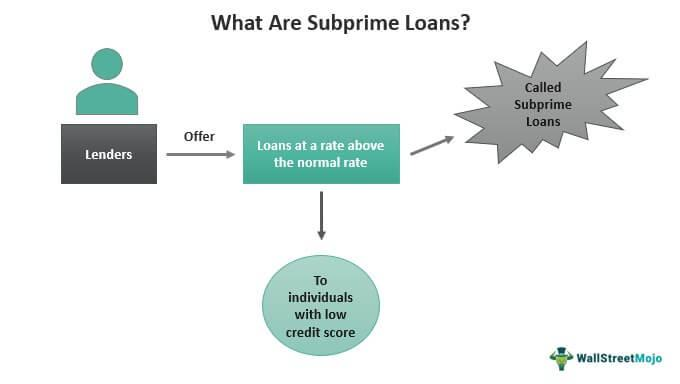

The mortgage crisis, subprime crisis, and financial crisis are terms frequently associated with periods of significant economic instability that have have far-reaching repercussions on global economies and financial markets. These crises are intricately linked by common elements such as risky borrowing practices, financial innovations, and the propagation of systemic risks that transcended national boundaries. Understanding the interactions between these crises is essential for deciphering past economic failures and preparing for future uncertainties.

The mortgage crisis was driven by high-risk lending practices in the housing sector, where subprime mortgages were extended to borrowers with poor credit histories, leading to widespread defaults. These lending practices eroded the stability of the financial system as mortgage-backed securities turned toxic, creating ripples across the economy. The subprime crisis served as the precipitator of a larger financial crisis, revealing critical vulnerabilities in risk assessment, inadequate regulatory frameworks, and poor financial oversight. Its aftermath necessitated a reevaluation of lending policies and underscored the importance of robust financial governance.

The financial crisis of 2007-2008 was characterized by unparalleled global repercussions, leading to severe recessions and increasing unemployment rates across countries. The highly interconnected nature of global financial markets meant that the crisis could spread rapidly, challenging major financial institutions and government bodies to implement measures for economic recovery. Post-crisis, significant reforms were introduced to reinforce the stability of financial systems and prevent future crises.

Algorithmic trading, which uses sophisticated algorithms for executing trades at high speeds, has been debated for its potential role in either exacerbating or mitigating financial crises. While its proponents emphasize its ability to enhance market efficiency and liquidity, critics argue it might introduce volatility and systemic risks, exemplified during periods of market stress.

As we navigate through these complex financial phenomena, lessons learned from the past provide critical insights into forming a resilient economic framework. By analyzing the causes and consequences of these crises, stakeholders can better understand the interconnectedness of modern financial systems and implement preventive measures against future disruptions. Vigilant adaptation and innovation in financial practices are imperative to ensuring a stable economic landscape in the years to come.

## Table of Contents

## Understanding the Mortgage Crisis

The mortgage crisis, which emerged in the mid-2000s, was characterized by high-risk lending practices within the housing sector, ultimately leading to significant economic instability. Central to this crisis were subprime mortgages, which were loans extended to borrowers with poor credit histories. These financial products were inherently risky due to the increased likelihood of borrower default, as lenders often failed to accurately assess the repayment capabilities of subprime borrowers.

The instability in the mortgage market was exacerbated by several key players, notably financial institutions that aggressively pursued profits through securitization. Securitization is the process by which mortgage debts were packaged into complex financial products known as mortgage-backed securities (MBS). These securities were then sold to investors on a global scale. While securitization initially appeared to be a mechanism for distributing risk, it inadvertently amplified it by spreading subprime mortgage exposures across international financial markets.

Financial institutions, motivated by short-term gains, facilitated the rapid proliferation of mortgage-backed securities. This proliferation was intensified by the real estate bubble, a period characterized by rapidly increasing housing prices. The bubble was driven by speculative investments and the widespread belief that real estate values would continue to rise indefinitely. As housing prices soared, lenders relaxed their standards, offering subprime mortgages to a growing number of high-risk borrowers without adequate verification of incomes or financial stability.

The unsustainable increase in housing prices eventually led to their sharp decline, marking the burst of the real estate bubble. As property values dropped, many borrowers found themselves in a position known as negative equity, where the outstanding mortgage balance exceeded the market value of their homes. This situation precipitated a wave of defaults, particularly among those holding subprime mortgages, which in turn destabilized the mortgage-backed securities market.

The repercussions of these defaults permeated the global financial system, as investors holding MBS faced substantial losses. The complexities of these securities, compounded by their opaque nature, left many investors unaware of the extent of their exposure to subprime mortgages. As the crisis unfolded, confidence in financial institutions eroded, leading to a credit crunch. This chain of events underscored the systemic risks inherent in high-risk lending and the interwoven nature of global financial systems.

Ultimately, the mortgage crisis serves as a stark reminder of the dangers associated with aggressive lending practices and inadequate risk management. It highlighted the need for enhanced transparency and regulation within the financial sector to safeguard against similar crises in the future.

## The Subprime Crisis Unveiled

The subprime crisis emerged as a pivotal trigger for the broader financial crisis that unfolded in 2007-2008. At the heart of this crisis were the lax lending standards and inadequate risk assessments that characterized subprime mortgages. These loans were extended to borrowers with poor credit histories, insufficient income verification, or high debt-to-income ratios, leading to a massive proliferation of high-risk financial products.

The housing boom was significantly fueled by these subprime lending practices. Financial institutions, incentivized by high returns, aggressively marketed these loans, leading to a rapid increase in homeownership and soaring real estate prices. The mistaken belief that housing prices would continue to rise indefinitely created a speculative bubble. When housing prices eventually began to decline, a cascade of defaults ensued as borrowers found themselves unable to refinance or sell their homes at a profit.

Regulatory oversight during this period was notably deficient. The lack of stringent regulations allowed lenders to lower their underwriting standards, while complex financial instruments like mortgage-backed securities (MBS) and collateralized debt obligations (CDOs) masked the true extent of risk. These securities, often held by financial institutions worldwide, were largely rated based on optimistic models that failed to account for a nationwide downturn in the housing market.

The collapse of the housing bubble revealed critical flaws in risk assessment. Credit rating agencies, which played a pivotal role in assessing these securities, were criticized for potential conflicts of interest and overly optimistic ratings that did not match the underlying asset quality. Moreover, the widespread belief in the diversification of risk through securitization proved to be an illusion, as interconnected financial products led to high systemic risk.

In response to the subprime crisis, there has been a substantial evolution in lending policies and financial oversight. Lessons learned have driven reforms designed to enhance transparency and risk management. For instance, the Dodd-Frank Wall Street Reform and Consumer Protection Act, enacted in the United States in 2010, sought to address many of these issues by imposing stricter regulations on lending practices and improving the accountability of financial institutions and credit rating agencies.

These reforms underscore the necessity of robust risk assessment and comprehensive regulatory frameworks in preventing future financial disruptions. By understanding and implementing the lessons of the subprime crisis, stakeholders aim to prevent a recurrence of such systemic failures and enhance the stability of global financial markets.

## The Global Financial Crisis: A Domino Effect

The financial crisis of 2007-2008 marked a pivotal moment in global economic history, illustrating the intricacies and vulnerabilities of interconnected financial systems. This period was characterized by widespread financial instability, which rapidly spread across the globe, triggering recessions, soaring unemployment rates, and significant reductions in consumer wealth.

**Interconnected Financial Systems and the Crisis**

The global financial system's complex web of interdependencies was a major [factor](/wiki/factor-investing) in the crisis's rapid dissemination. The proliferation of financial instruments, such as mortgage-backed securities (MBS) and collateralized debt obligations (CDOs), allowed risks associated with subprime mortgages to infiltrate financial institutions worldwide. When the U.S. housing bubble burst, it led to massive devaluations of these securities, causing losses not only across American banks but also financial institutions in Europe and beyond. The failure of Lehman Brothers in September 2008 exemplified how the collapse of a significant financial player could have cascading effects, leading to a [liquidity](/wiki/liquidity-risk-premium) crisis as institutions became reluctant to lend, fearing counterparty risks.

**Role of Major Financial Institutions**

Major financial institutions played a dual role in both precipitating and responding to the crisis. Prior to the crisis, many banks and financial entities engaged in aggressive leveraging and risk-taking, largely fueled by the profit motives associated with trading complex derivatives. These activities were inadequately regulated and often lacked comprehensive risk assessments, which led to significant systemic vulnerabilities.

Once the crisis unfolded, several leading financial institutions faced insolvency or severe liquidity crunches, prompting urgent interventions. Governments and central banks worldwide enacted extraordinary measures to bolster financial stability. Some, like the U.S. Treasury's Troubled Asset Relief Program (TARP), aimed to recapitalize banks and restore market confidence. The Federal Reserve and European Central Bank also slashed interest rates and injected liquidity into the financial system to avert a total collapse.

**Regulations and Reforms Post-Crisis**

The aftermath of the financial crisis prompted a rigorous reevaluation of financial regulatory frameworks. Policymakers sought to enhance the resilience of the financial system and prevent a recurrence of similar crises through comprehensive reforms. Key regulatory measures included the Dodd-Frank Wall Street Reform and Consumer Protection Act in the United States, which introduced stringent oversight of banking activities, derivatives markets, and consumer financial products.

Globally, the Basel III framework was introduced, emphasizing stronger capital requirements, improved risk management, and enhanced transparency for banks. These reforms aimed to ensure that financial institutions maintain sufficient capital buffers to absorb shocks, thereby reducing systemic risk.

The financial crisis of 2007-2008 highlighted the necessity for robust financial regulation and oversight. By understanding the interconnected nature of global financial systems and recognizing the pivotal role of major institutions, governments and regulatory bodies have taken significant steps to stabilize and secure financial markets against future threats.

## Algorithmic Trading: Amplifying or Averting Crises?

Algorithmic trading employs complex algorithms to execute trades at speeds and volumes that are impossible for human traders. As these algorithms grow more sophisticated, their role in financial markets has expanded significantly. During the 2007-2008 financial crisis, there was substantial debate on whether [algorithmic trading](/wiki/algorithmic-trading) amplified the crisis's impacts. Proponents argue that algorithmic trading enhances market efficiency by providing liquidity and narrowing bid-ask spreads. However, critics point to increased market [volatility](/wiki/volatility-trading-strategies) and systemic risks associated with these rapid, high-frequency trading strategies.

One of the primary concerns with algorithmic trading during market crises is its potential to exacerbate volatility. Algorithms are designed to react quickly to market changes, and in times of high stress, this can lead to a phenomenon known as a "flash crash," where prices plummet precipitously before recovering, causing extreme market instability. A notable example occurred on May 6, 2010, when the Dow Jones Industrial Average plunged nearly 1,000 points in minutes, largely driven by automated trading systems.

Case studies indicate that algorithmic trading can have unintended consequences during market crises. For instance, during the 2007-2008 financial crisis, some high-frequency trading strategies unintentionally contributed to liquidity shocks. Algorithms designed to execute large trades by slicing them into smaller transactions inadvertently exacerbated sell-offs as they rapidly offloaded assets in plunging markets.

Despite these concerns, the ongoing evolution of algorithmic trading reflects significant technological advancements. Modern algorithms incorporate sophisticated models that consider a multitude of market signals, aiming to predict price movements with greater accuracy. Moreover, regulatory bodies have enacted various measures to mitigate systemic risks, such as circuit breakers that halt trading if market indices fall precipitously within a short time frame, helping reduce the likelihood of panic-driven flash crashes.

From a technological perspective, [machine learning](/wiki/machine-learning) and [artificial intelligence](/wiki/ai-artificial-intelligence) are increasingly integral to algorithmic trading, allowing for more adaptive and resilient trading strategies. These algorithms are capable of analyzing vast datasets in real time, adjusting their strategies based on prevailing market conditions. While this enhances efficiency, it also raises questions about accountability and transparency, as the complexity of these algorithms can obscure their decision-making processes to regulators and even their developers.

In conclusion, algorithmic trading poses both opportunities and challenges for financial markets. The technology has the potential to improve efficiency and liquidity, yet it also introduces new risks that can amplify the effects of financial crises. As algorithms become more prevalent, understanding and managing these risks will be crucial for ensuring stable and resilient financial markets.

## Lessons Learned and the Path Forward

The mortgage, subprime, and financial crises have provided indispensable lessons for shaping the future of global financial systems. Enhanced risk management remains one of the fundamental principles derived from these economic downturns. Financial institutions have recognized the necessity of accurately assessing credit risks and managing exposure to avoid cascading defaults that can trigger widespread financial panic. Improving the transparency of financial products, particularly those involving complex derivatives and securitized assets, has become a priority. Increasing transparency can aid in rebuilding trust among investors and ensuring that market players have full comprehension of the risks involved.

Regulatory frameworks across the globe have undergone significant transformation post-crisis. Policymakers have implemented stricter guidelines to safeguard the integrity of financial markets. Regulations such as the Dodd-Frank Wall Street Reform and Consumer Protection Act in the United States exemplify efforts to address the vulnerabilities exposed by the crises. The establishment of institutions like the Financial Stability Board (FSB) seeks to enhance global financial coordination and ensure that systemic risks are mitigated proactively.

The evolution of financial markets since the crisis offers valuable insights into economic transformations. Financial institutions have become more resilient, largely through increased capital reserves and improved liquidity management practices. Moreover, the banking sector's shift towards more sustainable practices has been supported by advancements in financial technology. Technological innovation plays a critical role not only in reshaping financial markets but also in preventing future crises. Fintech solutions, blockchain technology, and artificial intelligence contribute to more secure and efficient operations, promising greater resilience against economic disruptions.

Proactive measures and policies form the backbone of crisis aversion strategies. Stress testing, for instance, has become a common practice to evaluate how financial institutions can withstand economic shocks. The implementation of macroprudential policies aims to monitor and address systemic risks before they culminate in a wide-scale crisis. Such policies are essential in evaluating the interconnectedness of global financial systems and managing the intricate balance between financial innovation and stability.

Emerging technologies present both challenges and opportunities for financial markets. Machine learning algorithms analyze vast amounts of data, identifying potential risk indicators before they lead to systemic issues. Furthermore, digital currencies and decentralized finance offer innovative solutions to traditional financial challenges. However, they require careful regulation to prevent their misuse and the emergence of new risks.

In summary, the mortgage, subprime, and financial crises have underscored the need for continuous vigilance in managing financial systems. A collaborative approach that unites regulatory bodies, financial institutions, and technological innovation is essential for maintaining economic stability and preventing future crises. By integrating these lessons into policy and practice, we can build stronger, more resilient financial infrastructures.

## Conclusion

The mortgage, subprime, and financial crises of the early 21st century highlight the intricate nature of global finance. These events reveal how interconnected lending practices, financial innovation, and market dynamics can lead to widespread economic instability. Central to this understanding is the critical role that high-risk lending and inadequate regulatory oversight played in precipitating these crises. 

Algorithmic trading, while offering the potential for heightened market efficiency, also introduces complexities and risks, such as increased market volatility and systemic challenges. Its dual nature as both a potential stabilizer and destabilizer underscores the need for meticulous oversight and thoughtful integration within financial systems. For example, high-frequency trading can lead to "flash crashes," where rapid selling triggers a large drop in market prices within seconds.

The way forward involves leveraging the lessons from past financial disruptions. Key to this is the development and maintenance of resilient financial infrastructures that can absorb shocks and continue to function effectively during times of stress. This requires a multifaceted approach, including enhanced risk management protocols, greater transparency, and stronger regulatory frameworks.

Sustainability in global financial markets can only be achieved through a collaborative effort. Regulators, financial institutions, and investors must work in unison to address vulnerabilities and foster a stable economic environment. This collaboration should aim to create clear guidelines and robust systems that prevent unchecked risk-taking and unsustainable financial practices.

As we navigate future economic landscapes, continuous vigilance and adaptation are imperative. The evolving nature of financial technologies and market dynamics demands that all stakeholders remain alert and responsive to emerging challenges. By doing so, we can not only avert future financial crises but also harness opportunities for growth and innovation, ensuring long-term economic stability and prosperity.

## References & Further Reading

[1]: Reinhart, C. M., & Rogoff, K. S. (2009). ["This Time is Different: Eight Centuries of Financial Folly."](https://www.nber.org/system/files/working_papers/w13882/w13882.pdf) Princeton University Press.

[2]: Shiller, R. J. (2008). ["The Subprime Solution: How Today's Global Financial Crisis Happened, and What to Do about It."](https://www.jstor.org/stable/j.cttq94jd) Princeton University Press.

[3]: Lewis, M. (2010). ["The Big Short: Inside the Doomsday Machine."](https://www.amazon.com/Big-Short-Inside-Doomsday-Machine/dp/0141043539) W. W. Norton & Company.

[4]: Financial Crisis Inquiry Commission. (2011). ["The Financial Crisis Inquiry Report."](https://www.govinfo.gov/app/details/GPO-FCIC/) United States Government Printing Office.

[5]: Brunnermeier, M. K. (2009). ["Deciphering the Liquidity and Credit Crunch 2007-2008."](https://www.princeton.edu/~markus/research/papers/liquidity_credit_crunch.pdf) Journal of Economic Perspectives, 23(1), 77-100.

[6]: Gorton, G. B. (2010). ["Slapped by the Invisible Hand: The Panic of 2007."](https://papers.ssrn.com/sol3/papers.cfm?abstract_id=1401882) Oxford University Press.

[7]: Mian, A., & Sufi, A. (2015). ["House of Debt: How They (and You) Caused the Great Recession, and How We Can Prevent It from Happening Again."](https://press.uchicago.edu/ucp/books/book/chicago/H/bo20832545.html) University of Chicago Press.