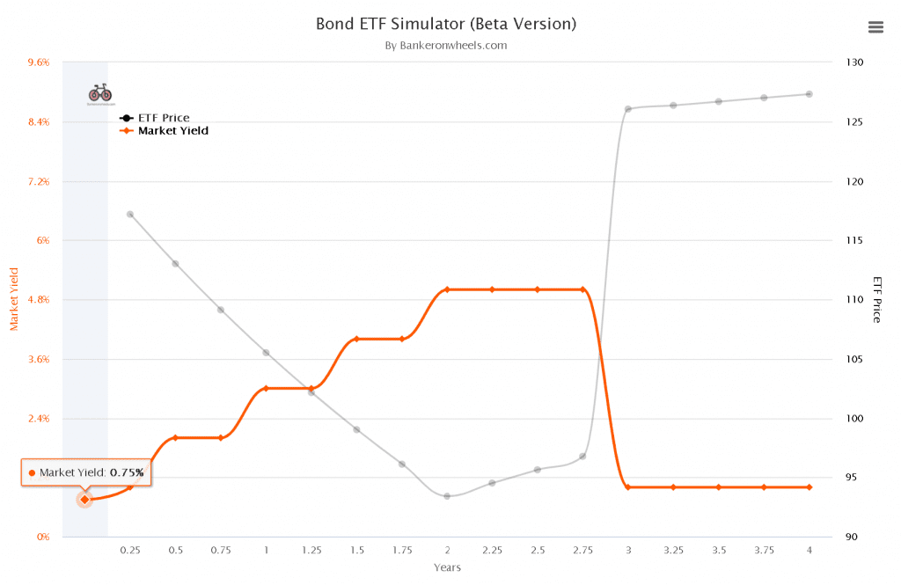

## Table of Contents

## What are bond ETFs and how do they work?

Bond ETFs, or Exchange-Traded Funds, are investment funds that hold a collection of bonds and trade on stock exchanges, just like stocks. They are designed to give investors easy access to the bond market without having to buy individual bonds. By investing in a bond ETF, you are essentially buying a small piece of many different bonds all at once. This diversification can help reduce risk compared to owning just one or a few bonds.

When you buy shares of a bond ETF, you receive a portion of the income generated by the bonds in the fund, usually in the form of monthly dividends. The value of the ETF can go up or down based on the performance of the bonds it holds and changes in interest rates. Bond ETFs can be a good choice for investors looking for regular income and a way to spread out their risk in the bond market. They are also more liquid than individual bonds, meaning you can buy and sell them more easily throughout the trading day.

## Why are bond ETF values important to investors?

The value of bond ETFs is important to investors because it shows how much their investment is worth at any time. When the value of a bond ETF goes up, the price of each share goes up too. This means that if an investor decides to sell their shares, they can get more money than they paid for them. On the other hand, if the value goes down, the price of each share goes down, and the investor might get less money if they sell.

Bond [ETF](/wiki/etf-trading-strategies) values also affect the income investors get from their investments. Bond ETFs usually pay out the interest they earn from the bonds they hold as dividends to the investors. If the value of the bonds in the ETF goes up, the ETF might be able to pay higher dividends. If the value goes down, the dividends might be lower. This is important for investors who rely on the income from their investments to help them meet their financial goals.

## What are the basic factors that can cause bond ETF values to decline?

One main reason bond ETF values can go down is because of changes in interest rates. When interest rates go up, the value of existing bonds usually goes down. This happens because new bonds that are issued will have higher interest rates, making the older bonds with lower rates less attractive to investors. Since bond ETFs hold a bunch of these bonds, their value will also go down when interest rates rise.

Another factor that can cause bond ETF values to decline is if the credit quality of the bonds in the ETF gets worse. If the companies or governments that issued the bonds start to look like they might have trouble paying back their debts, the value of those bonds will drop. This makes the bond ETF, which holds these bonds, less valuable too.

Lastly, general market conditions can also affect bond ETF values. If there's a lot of uncertainty or fear in the market, investors might sell their bonds and move their money into safer investments. This selling pressure can push down the value of bond ETFs. So, even though bond ETFs are often seen as safer than stocks, they can still lose value because of what's happening in the broader market.

## How do interest rate changes affect bond ETF values?

When interest rates go up, the value of bond ETFs usually goes down. This happens because new bonds that are issued will have higher interest rates. Older bonds with lower rates become less attractive to investors because they can get better returns from the new bonds. Since bond ETFs hold a bunch of these older bonds, their value drops when interest rates rise. It's like when you have an old phone and a new, better one comes out; people want the new one more.

On the flip side, when interest rates go down, the value of bond ETFs usually goes up. This is because the older bonds in the ETF now have higher interest rates compared to the new bonds being issued. Investors see these older bonds as more valuable because they offer better returns than what's available with new bonds. So, the value of the bond ETF goes up because people are willing to pay more for the shares that hold these now more attractive bonds.

## What role does inflation play in the decline of bond ETF values?

Inflation can make bond ETF values go down because it affects interest rates. When inflation goes up, central banks often raise interest rates to try to slow down the economy and keep prices from rising too fast. When interest rates go up, new bonds that are issued will have higher rates. This makes the older bonds in a bond ETF, which have lower rates, less attractive to investors. So, the value of the bond ETF goes down because people are not as interested in buying those older bonds.

Also, inflation can eat away at the purchasing power of the money that bond ETFs pay out as dividends. If inflation is high, the money you get from your bond ETF might not be worth as much as it used to be. This can make bond ETFs less appealing to investors who are looking for income. When investors start selling their bond ETF shares because they're worried about inflation, the value of the bond ETF can go down even more.

## How can credit risk impact bond ETF performance?

Credit risk is when the companies or governments that issued the bonds in a bond ETF might not be able to pay back their debts. If investors start to think that these issuers are more likely to have trouble paying back, the value of those bonds goes down. Since a bond ETF holds many of these bonds, the whole ETF's value can go down too. This makes the bond ETF less valuable, and investors might lose money if they need to sell their shares.

When the credit quality of the bonds in the ETF gets worse, it can also mean that the bond ETF has to pay out less money to investors. This is because the bonds might not be paying as much interest as before, or they might even stop paying interest altogether. Investors who are counting on the income from their bond ETF might get less money than they expected, which can make them want to sell their shares. This selling can push the value of the bond ETF down even more.

## What are the effects of market liquidity on bond ETFs?

Market [liquidity](/wiki/liquidity-risk-premium) is about how easy it is to buy or sell something without the price changing a lot. For bond ETFs, if the market is very liquid, it means you can buy or sell shares of the ETF quickly and at a fair price. This is good for investors because they can get in and out of their investments easily. But if the market is not very liquid, it can be harder to sell your bond ETF shares. You might have to wait longer or accept a lower price, which can make the value of your investment go down.

When the market is not liquid, it can also affect the bond ETF's value in another way. If a lot of people want to sell their shares at the same time and there aren't enough buyers, the price of the ETF can drop a lot. This is because sellers might have to lower their prices to find someone willing to buy. So, low liquidity can make bond ETFs riskier because their values can change more suddenly and by larger amounts.

## How do macroeconomic conditions influence bond ETF values?

Macroeconomic conditions, like how well the whole economy is doing, can really affect bond ETF values. When the economy is doing great, people might think that companies and governments will have no problem paying back their debts. This makes the bonds in the ETF look safer, and their value can go up. But if the economy starts to slow down or there's a lot of uncertainty, people might worry that those same companies and governments won't be able to pay back their debts. This worry can make the bonds less valuable, and the bond ETF's value goes down too.

Another big thing that can change bond ETF values is what central banks do with interest rates. If the economy is growing too fast and prices are going up a lot (that's inflation), central banks might raise interest rates to cool things down. When interest rates go up, new bonds will have higher rates, making the older bonds in the ETF less attractive. This can make the bond ETF's value drop. On the other hand, if the economy is doing badly, central banks might lower interest rates to help it grow. When rates go down, the older bonds in the ETF look better compared to new bonds, and the ETF's value can go up.

## What advanced strategies can investors use to mitigate risks associated with declining bond ETF values?

One advanced strategy to manage the risk of falling bond ETF values is called laddering. This means you buy bond ETFs that mature at different times. Imagine you have a ladder with steps at different heights. Each step is a bond ETF that matures at a different time. If interest rates go up and the value of your bond ETFs goes down, you won't lose as much money because some of your ETFs will be maturing soon. You can then use the money from those matured ETFs to buy new ones with higher interest rates. This way, you spread out the risk and can still get good returns over time.

Another strategy is called diversification. This means you don't put all your money in just one type of bond ETF. Instead, you spread your money across different kinds of bond ETFs, like ones that hold government bonds, corporate bonds, or even bonds from different countries. If one type of bond ETF loses value because of changes in the economy or interest rates, the other types might not be affected as much. This can help protect your overall investment from big losses. By having a mix of different bond ETFs, you can balance out the risks and keep your investment safer.

A third strategy is to use active management. Instead of just buying a bond ETF and holding onto it, you can work with a financial advisor or use a managed fund that actively changes what bonds are in the ETF. These managers watch the market closely and can switch out bonds that are losing value for ones that might do better. This can help your bond ETF perform better even when the market is tough. Active management can be more expensive, but it might be worth it if it helps you avoid big losses.

## How can diversification within a bond ETF portfolio help manage declining values?

Diversification within a bond ETF portfolio means you spread your money across different types of bond ETFs. Instead of putting all your money into one kind of bond ETF, like one that only holds government bonds, you can also invest in ETFs that hold corporate bonds, municipal bonds, or even bonds from different countries. If one type of bond ETF starts to lose value because of changes in the economy or interest rates, the other types might not be affected as much. This way, if one part of your investment goes down, the other parts can help balance it out, so your overall investment doesn't lose as much value.

For example, if interest rates in the U.S. go up and the value of your U.S. government bond ETF goes down, your ETFs that hold bonds from other countries might not be affected as much. Or if a certain industry is having trouble and the corporate bonds in one of your ETFs lose value, your ETFs that hold different kinds of bonds might still be doing well. By having a mix of different bond ETFs, you can protect your investment from big losses. Diversification helps you manage the risk of declining bond ETF values by spreading out where your money is invested.

## What are the long-term trends affecting bond ETF values and how can investors prepare for them?

Long-term trends like rising interest rates and inflation can really affect bond ETF values. When interest rates go up over time, the value of older bonds in the ETF goes down because new bonds have higher rates. Inflation also plays a big role. If prices keep going up, central banks might raise interest rates to slow things down, which can make bond ETFs less valuable. Another trend is the overall health of the economy. If the economy grows a lot, people might think companies and governments will pay back their debts easily, making bonds safer and more valuable. But if the economy slows down, people might worry about those debts, and bond ETF values can drop.

Investors can prepare for these long-term trends in a few ways. One way is by using a strategy called laddering, where you buy bond ETFs that mature at different times. This helps you spread out the risk because if interest rates go up, you won't lose as much money since some of your ETFs will be maturing soon. You can then use that money to buy new ETFs with higher rates. Another way is diversification, where you invest in different kinds of bond ETFs. This means if one type of bond ETF loses value, the others might not be affected as much, balancing out your overall investment. Lastly, working with a financial advisor or using actively managed funds can help. These managers can switch out bonds that are losing value for ones that might do better, helping your bond ETF perform better even when the market is tough.

## What are some expert-level tools and analytics used to predict and respond to changes in bond ETF values?

One expert-level tool that investors use to predict and respond to changes in bond ETF values is called a yield curve analysis. This tool looks at the difference in interest rates for bonds that mature at different times. If the yield curve starts to change shape, like getting steeper or flatter, it can tell investors that interest rates might go up or down. This helps them decide whether to buy or sell their bond ETFs. For example, if the yield curve gets steeper, it might mean interest rates will go up, so investors might sell their bond ETFs to avoid losing value.

Another useful tool is duration analysis. Duration tells investors how sensitive a bond ETF is to changes in interest rates. If a bond ETF has a high duration, its value will go down a lot if interest rates go up. By knowing the duration, investors can choose bond ETFs that fit their risk level. If they think interest rates will rise, they might pick bond ETFs with lower durations to protect their investment. This helps them manage the risk of their bond ETFs losing value because of interest rate changes.

Lastly, investors can use credit spread analysis to predict how bond ETFs might perform. Credit spreads show the difference in interest rates between safe bonds, like government bonds, and riskier bonds, like corporate bonds. If credit spreads get wider, it means investors are worried about companies paying back their debts, which can make corporate bond ETFs lose value. By watching credit spreads, investors can decide when to buy or sell their bond ETFs to avoid losses. This tool helps them stay ahead of market changes and protect their investments.

## Why do Bond ETFs lose value?

The primary [factor](/wiki/factor-investing) contributing to a decline in the value of bond ETFs is the fluctuation of interest rates. This relationship is largely governed by the inverse correlation between bond prices and interest rates. When interest rates increase, the price of existing bonds tends to decrease. This inverse relationship can be expressed using the formula for the price of a bond:

$$
P = \frac{C}{(1 + r)^1} + \frac{C}{(1 + r)^2} + \ldots + \frac{C + F}{(1 + r)^n}
$$

where $P$ is the price of the bond, $C$ is the annual coupon payment, $r$ is the interest rate, and $F$ is the face value of the bond to be paid back at maturity. As $r$ increases, the present value of the bond's future cash flows decreases, leading to a drop in the bond's price.

For bond ETFs, which are composed of a portfolio of bonds, this mechanism can lead to a reduction in the ETF's net asset value (NAV). Since bond ETFs are traded on major stock exchanges, their market price can be directly impacted by real-time changes in interest rates.

Macroeconomic factors significantly influence the movement of interest rates and, consequently, bond prices. Central bank policies, such as changes in the federal funds rate by the Federal Reserve in the United States, can directly affect interest rates. When attempting to curb inflation, central banks may increase interest rates, leading to a subsequent fall in bond prices and a potential decrease in bond ETF values.

Moreover, economic indicators such as GDP growth rates, unemployment rates, and inflation figures can inform investors' expectations regarding future [interest rate](/wiki/interest-rate-trading-strategies) adjustments. For instance, robust economic growth may prompt central banks to raise rates to prevent overheating, thereby exerting downward pressure on bond ETFs.

To mitigate these risks, bond ETF investors may need to consider the duration of the bonds within their portfolio. The concept of duration measures a bond's sensitivity to changes in interest rates. A higher duration indicates greater sensitivity and a potentially more pronounced negative impact on price when rates rise.

In summary, understanding the inverse relationship between bond prices and interest rates, alongside the implications of macroeconomic factors, is crucial for investors in bond ETFs. This knowledge allows for more informed decisions and better strategies to manage the inherent risks associated with these investments.

## References & Further Reading

[1]: ["Advances in Financial Machine Learning"](https://www.amazon.com/Advances-Financial-Machine-Learning-Marcos/dp/1119482089) by Marcos Lopez de Prado

[2]: ["Quantitative Trading: How to Build Your Own Algorithmic Trading Business"](https://books.google.com/books/about/Quantitative_Trading.html?id=j70yEAAAQBAJ) by Ernest P. Chan

[3]: ["The Economics of Bond Markets"](https://www.investopedia.com/terms/b/bondmarket.asp) by William Perraudin and Bing Liang

[4]: ["Evidence-Based Technical Analysis: Applying the Scientific Method and Statistical Inference to Trading Signals"](https://www.amazon.com/Evidence-Based-Technical-Analysis-Scientific-Statistical/dp/0470008741) by David Aronson

[5]: ("The Handbook of Fixed Income Securities"](https://www.mhebooklibrary.com/doi/book/10.1036/9781260473902?contentTab=true) edited by Frank J. Fabozzi

[6]: ["Bond Markets, Analysis, and Strategies"](https://books.google.com/books/about/Bond_Markets_Analysis_and_Strategies_ten.html?id=bQpNEAAAQBAJ) by Frank J. Fabozzi

[7]: ["Algorithmic Trading: Winning Strategies and Their Rationale"](https://www.wiley.com/en-us/Algorithmic+Trading%3A+Winning+Strategies+and+Their+Rationale-p-9781118460146) by Ernie Chan