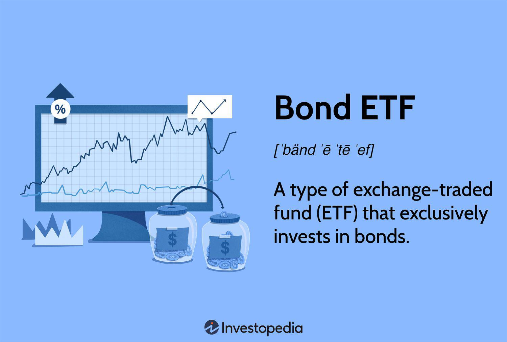

The world of investments is constantly evolving, and bond ETFs have emerged as a popular choice for investors seeking diversified exposure to fixed-income markets. Bond ETFs, short for bond exchange-traded funds, provide a versatile and accessible way for investors to engage with bonds without directly purchasing individual bond securities. These ETFs operate by pooling funds from numerous investors, which are then invested in a diversified portfolio of bonds. As a result, bond ETFs offer several advantages, including enhanced liquidity, lower transaction costs, and the ability to trade on major stock exchanges similarly to stocks.

While bond ETFs have grown in popularity due to these capabilities, they are not without risks. Understanding the potential for investment loss in bond ETFs is crucial for investors. The value of bond ETFs can fluctuate, primarily due to changes in interest rates. When rates rise, the value of existing bonds usually decreases, which can lead to a reduction in the value of bond ETFs. Additionally, macroeconomic factors such as inflation, economic growth, and geopolitical events can further influence bond prices and, by extension, bond ETFs. 



In response to these challenges, investors resort to not only traditional financial strategies but also modern techniques like algorithmic trading to navigate the complexities of bond ETF investments. Algorithmic trading uses computer programs and software to automate trading strategies based on established criteria, thus providing efficiencies and potential enhancements to portfolio management. Such strategies can optimize returns and mitigate risks associated with bond ETFs.

In this article, we aim to explore why bond ETFs may lose value and examine effective financial strategies that investors can use to withstand these market shifts. By gaining a deeper understanding of the intricacies of bond ETFs, their inherent risks, and the tools available to mitigate these risks, investors can better position themselves to achieve their financial objectives in an ever-evolving investment landscape.

## Table of Contents

## Understanding Bond ETFs

Bond ETFs are an innovative financial product that has gained significant traction among investors seeking broad and diversified exposure to fixed-income markets. These ETFs, or Exchange-Traded Funds, represent pooled investment vehicles that comprise a portfolio of bonds. Unlike traditional mutual funds, bond ETFs trade on major stock exchanges akin to individual stocks. This unique characteristic allows investors to buy and sell shares of bond ETFs throughout the trading day at market prices, providing greater flexibility and liquidity.

One of the primary advantages of bond ETFs is their ability to offer diversification. By investing in a single bond ETF, investors can gain access to a wide array of bonds, including government, municipal, and corporate bonds. This diversification reduces the risk associated with investing in individual bonds, as it spreads the investment across various issuers and bond types, thereby mitigating the impact of a potential default by any single entity.

Bond ETFs also offer enhanced [liquidity](/wiki/liquidity-risk-premium) compared to holding individual bonds directly. Because they are traded on exchanges, investors can enter or [exit](/wiki/exit-strategy) positions without the constraints associated with the bond market, which typically requires dealing with bond dealers and may involve higher transaction costs and longer settlement times.

Moreover, bond ETFs are designed to provide a steady income stream. Most bond ETFs distribute the interest income generated by the underlying bonds to investors in the form of regular dividends. This feature makes them particularly appealing to income-focused investors, such as retirees, who seek consistent cash flow. The yield offered by a bond [ETF](/wiki/etf-trading-strategies) is influenced by the yields of the bonds within its portfolio, providing an opportunity to tailor the investment to specific income objectives.

Additionally, the transparency of bond ETFs is a significant benefit. Daily disclosure of holdings by most ETFs allows investors to have a clear understanding of the underlying assets, enabling informed decision-making and risk assessment.

In summary, bond ETFs combine the benefits of stock-like liquidity with the diversified exposure of mutual funds, making them an attractive option for investors seeking accessibility, income, and diversification in their fixed-income investments.

## Why Bond ETFs Lose Value

The primary [factor](/wiki/factor-investing) contributing to a decline in the value of bond ETFs is the fluctuation of interest rates. This relationship is largely governed by the inverse correlation between bond prices and interest rates. When interest rates increase, the price of existing bonds tends to decrease. This inverse relationship can be expressed using the formula for the price of a bond:

$$
P = \frac{C}{(1 + r)^1} + \frac{C}{(1 + r)^2} + \ldots + \frac{C + F}{(1 + r)^n}
$$

where $P$ is the price of the bond, $C$ is the annual coupon payment, $r$ is the interest rate, and $F$ is the face value of the bond to be paid back at maturity. As $r$ increases, the present value of the bond's future cash flows decreases, leading to a drop in the bond's price.

For bond ETFs, which are composed of a portfolio of bonds, this mechanism can lead to a reduction in the ETF's net asset value (NAV). Since bond ETFs are traded on major stock exchanges, their market price can be directly impacted by real-time changes in interest rates.

Macroeconomic factors significantly influence the movement of interest rates and, consequently, bond prices. Central bank policies, such as changes in the federal funds rate by the Federal Reserve in the United States, can directly affect interest rates. When attempting to curb inflation, central banks may increase interest rates, leading to a subsequent fall in bond prices and a potential decrease in bond ETF values.

Moreover, economic indicators such as GDP growth rates, unemployment rates, and inflation figures can inform investors' expectations regarding future [interest rate](/wiki/interest-rate-trading-strategies) adjustments. For instance, robust economic growth may prompt central banks to raise rates to prevent overheating, thereby exerting downward pressure on bond ETFs.

To mitigate these risks, bond ETF investors may need to consider the duration of the bonds within their portfolio. The concept of duration measures a bond's sensitivity to changes in interest rates. A higher duration indicates greater sensitivity and a potentially more pronounced negative impact on price when rates rise.

In summary, understanding the inverse relationship between bond prices and interest rates, alongside the implications of macroeconomic factors, is crucial for investors in bond ETFs. This knowledge allows for more informed decisions and better strategies to manage the inherent risks associated with these investments.

## Algorithmic Trading in Bond ETFs

Algorithmic trading, commonly referred to as algo trading, is a mechanism whereby computer programs execute trades based on predetermined rules. This approach is increasingly employed in bond ETF trading, allowing for more efficient transactions and potentially enhancing portfolio returns. By leveraging algorithms, traders can assess vast datasets in real-time, identify lucrative trading opportunities, and execute trades at speeds far beyond human capability.

One of the primary advantages of algo trading in bond ETFs is its ability to improve liquidity. Bond markets are traditionally less liquid than equity markets, but the utilization of algorithmic systems can enhance the market-making process. By rapidly quoting bid and ask prices, algo trading ensures tighter spreads, thereby reducing the cost of trading for investors.

Algo trading also enables investors to implement complex strategies like statistical [arbitrage](/wiki/arbitrage), mean reversion, or [momentum](/wiki/momentum) strategies effectively. For example, a strategy might be programmed to buy a bond ETF when its price deviates significantly from its historical average—a technique known as mean reversion. In Python, this could be achieved with a simple script:

```python
import pandas as pd

def mean_reversion_strategy(data, window=20, threshold=1.5):
    data['moving_avg'] = data['price'].rolling(window=window).mean()
    data['std_dev'] = data['price'].rolling(window=window).std()
    data['z_score'] = (data['price'] - data['moving_avg']) / data['std_dev']

    buy_signal = data['z_score'] < -threshold
    sell_signal = data['z_score'] > threshold

    return buy_signal, sell_signal

# Example usage with hypothetical data
data = pd.DataFrame({'price': [100, 102, 101, 98, 97, 104, 102, 100]})
buy, sell = mean_reversion_strategy(data)
```

In this example, a moving average and standard deviation of bond ETF prices guide the trading strategy, generating buy and sell signals based on a predefined z-score threshold.

Furthermore, with the advent of [machine learning](/wiki/machine-learning) and [artificial intelligence](/wiki/ai-artificial-intelligence), algo trading is becoming more sophisticated. Machine learning models can uncover patterns that are not easily discernible through conventional quantitative techniques, providing a competitive edge in forecasting bond price movements.

Investors can complement algorithmic systems with risk management protocols to safeguard their portfolios from adverse market conditions. Algorithms can be programmed to adjust trading parameters dynamically in response to market [volatility](/wiki/volatility-trading-strategies), interest rate changes, or unexpected macroeconomic events.

Overall, [algorithmic trading](/wiki/algorithmic-trading) offers a powerful toolset for investors in bond ETFs, streamlining the trading process and opening avenues for sophisticated strategies. As technological advancements continue, the integration of machine learning and artificial intelligence will likely expand the capabilities and efficacy of algo trading within the bond ETF market.

## Strategies for Mitigating Investment Losses

Investors looking to mitigate investment losses in bond ETFs during periods of rising interest rates can consider several strategic approaches. Interest rates and bond prices share an inverse relationship, meaning that when interest rates rise, the value of existing bonds usually falls. This impact is directly felt by bond ETFs, which are collections of bonds traded on exchanges. Here are some strategies that investors can use to manage these losses effectively:

1. **Diversification Across Fixed-Income Assets**: One way to reduce risk is by diversifying investments across various fixed-income assets. Diversification involves spreading investments across different types of bonds, such as government, municipal, and corporate bonds, each with varying risk and return profiles. For example, short-duration bonds are typically less sensitive to interest rate changes compared to long-duration bonds. By holding a mix of bonds with different durations and credit qualities, investors can mitigate the impact of interest rate fluctuations.

2. **Reallocation to Money Market Accounts or High-Yield Savings**: During periods of rising interest rates, reallocating a portion of a bond ETF portfolio to money market accounts or high-yield savings accounts can be beneficial. These financial instruments typically offer higher interest rates compared to traditional savings accounts, helping to offset some of the losses incurred from declining bond prices. Moreover, such accounts provide liquidity and are generally considered safer, especially in a volatile interest rate environment.

3. **Understanding Interest Rate Cycles**: A key strategy in managing bond ETF investments is to gain a comprehensive understanding of interest rate cycles. This involves analyzing economic indicators and predictions from central banks regarding future interest rate movements. By anticipating potential rate hikes, investors can adjust their portfolios accordingly, potentially moving out of long-duration bond ETFs before rates rise or increasing exposure to floating-rate bonds.

Implementing these strategies requires ongoing analysis and adjustment based on market conditions and personal financial goals. Careful consideration of diversification, reallocating certain assets, and timing investments based on interest rate forecasts can help investors navigate the challenges of rising interest rates, ultimately enhancing the resilience of their bond ETF portfolios.

By employing these methods, investors can create robust strategies that minimize potential losses while also positioning themselves to benefit from stabilized or falling interest rate environments in the future.

## The Role of Financial Planning

Effective financial planning serves as a foundational element in managing the risks linked to bond ETFs. Investors navigate the complexities of bond markets by aligning their investment strategies with both financial goals and risk tolerance, which is essential for maintaining portfolio health during periods of market volatility.

### Aligning Investment Strategies with Financial Goals

Investors must first clearly define their financial objectives, which could range from wealth accumulation, income generation, to capital preservation. Understanding these goals enables investors to select bond ETFs that align with their risk appetite and investment horizon. For instance, a conservative investor seeking steady income might prefer ETFs focused on government or high-quality corporate bonds, which typically offer lower yields but also come with reduced risk.

Moreover, financial goals often dictate the required liquidity, impacting an investor's choice. Investors planning for long-term objectives such as retirement may allocate a larger portion of their portfolios to bond ETFs with longer durations. Conversely, those with short-term liquidity needs might opt for ETFs comprised of shorter maturity bonds, accepting lower yields in exchange for reduced price volatility.

### Assessing Risk Tolerance

Accurate assessment of an investor's risk tolerance is paramount in strategizing bond ETF investments. This involves evaluating both capacity and willingness to endure market fluctuations. Risk tolerance questionnaires and discussions with financial advisors can help in elucidating these aspects, leading to a tailored portfolio that withstands inevitable market swings.

The risk associated with bond ETFs primarily stems from interest rate changes. As interest rates rise, the value of existing bonds decrease, impacting ETFs negatively. An understanding of interest rate cycles can therefore aid in anticipating these changes and adjusting strategy accordingly. Utilizing diversification tactics, such as spreading investments across government, municipal, and corporate bond ETFs, further alleviates specific interest rate risks.

### Ensuring Long-Term Portfolio Health

Ultimately, maintaining a robust portfolio relies on dynamic adjustments in response to economic shifts. Regular portfolio reviews, rebalancing to adhere to investment goals, and incorporating insights from financial advisors can contribute to long-term portfolio stability. Investors should also remain open to incorporating newer investment tools and strategies, including algorithmic trading if suitable, to optimize returns.

Effective financial planning in the context of bond ETF investments focuses on achieving a harmonious balance between risk and return, tailored to individual goals and tolerance. This approach not only protects against volatility but also positions investors to take advantage of opportunities in evolving fixed-income markets.

## Conclusion

Bond ETFs provide a distinctive investment avenue characterized by particular risks and advantages. Understanding the intricacies of bond ETF pricing is crucial for investors aiming to navigate this financial landscape effectively. The fluctuation of interest rates remains a primary factor influencing bond ETF values, where an inverse relationship between bond prices and interest rates is notable. Additionally, macroeconomic factors can further complicate price dynamics, requiring investors to stay vigilant.

Employing algorithmic trading and strategic portfolio management can offer pathways to potentially optimize returns while mitigating associated risks. Algorithmic trading allows for the swift execution of trades based on pre-set conditions, enabling investors to capitalize on market opportunities and manage risks more efficiently. By utilizing algorithms, investors can adjust their strategies in response to market movements, aiding in maintaining portfolio stability.

Moreover, adopting a flexible and informed approach is vital in the constantly evolving market of bond investments. Keeping abreast of market trends, regulatory changes, and economic indicators will enable investors to make informed decisions. Diversification across different fixed-income assets and understanding interest rate trends are strategies that can assist in reducing potential losses during volatile periods.

In conclusion, navigating the complexities of bond ETFs requires a balanced blend of market awareness, strategic planning, and technological tools. By maintaining an adaptable investment strategy, investors can enhance their ability to thrive in the dynamic arena of bond ETFs.

## References & Further Reading

[1]: ["Advances in Financial Machine Learning"](https://www.amazon.com/Advances-Financial-Machine-Learning-Marcos/dp/1119482089) by Marcos Lopez de Prado

[2]: ["Quantitative Trading: How to Build Your Own Algorithmic Trading Business"](https://books.google.com/books/about/Quantitative_Trading.html?id=j70yEAAAQBAJ) by Ernest P. Chan

[3]: ["The Economics of Bond Markets"](https://www.investopedia.com/terms/b/bondmarket.asp) by William Perraudin and Bing Liang

[4]: ["Evidence-Based Technical Analysis: Applying the Scientific Method and Statistical Inference to Trading Signals"](https://www.amazon.com/Evidence-Based-Technical-Analysis-Scientific-Statistical/dp/0470008741) by David Aronson

[5]: ("The Handbook of Fixed Income Securities"](https://www.mhebooklibrary.com/doi/book/10.1036/9781260473902?contentTab=true) edited by Frank J. Fabozzi

[6]: ["Bond Markets, Analysis, and Strategies"](https://books.google.com/books/about/Bond_Markets_Analysis_and_Strategies_ten.html?id=bQpNEAAAQBAJ) by Frank J. Fabozzi

[7]: ["Algorithmic Trading: Winning Strategies and Their Rationale"](https://www.wiley.com/en-us/Algorithmic+Trading%3A+Winning+Strategies+and+Their+Rationale-p-9781118460146) by Ernie Chan