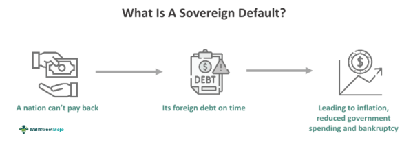

## Table of Contents

## What is a sovereign default?

A sovereign default happens when a country cannot pay back the money it borrowed. This can occur if the country has too much debt or if its economy is not doing well. When a country defaults, it might stop paying interest on its loans or it might delay payments. This can cause big problems because other countries and investors might not want to lend money to that country anymore.

When a country defaults, it can affect its people a lot. Prices might go up, making things more expensive to buy. It can also be harder for people to find jobs. Sometimes, the government has to cut spending on important things like schools and hospitals. Other countries or international organizations might step in to help, but the country usually has to make big changes to fix its problems.

## What are the common causes of sovereign defaults?

Sovereign defaults often happen when a country borrows too much money and can't pay it back. This can happen if the government spends more money than it earns from taxes and other sources. When a country's economy is not doing well, it might not be able to collect enough money to pay its debts. Sometimes, a country might borrow in a foreign currency, like dollars or euros, and if its own currency loses value, it becomes even harder to pay back those loans.

Another reason for sovereign defaults is when there are big shocks to the economy, like a financial crisis or a natural disaster. These events can make it hard for a country to keep up with its payments. Political problems can also lead to defaults. If a government is unstable or there is a lot of corruption, it might not manage its money well. In these cases, lenders might lose trust in the country and be less willing to lend more money, making the situation even worse.

## How do economic factors contribute to sovereign defaults?

Economic factors play a big role in causing sovereign defaults. When a country's economy is not doing well, it might not make enough money from taxes and other sources to pay back its debts. If a country is going through a recession, it means fewer people are working and businesses are making less money. This leads to less tax money coming in for the government. At the same time, the government might need to spend more money to help people and businesses, which can make the debt even bigger.

Another important economic [factor](/wiki/factor-investing) is the value of a country's currency. If a country borrows money in a foreign currency, like dollars or euros, and its own currency loses value, it becomes much harder to pay back those loans. For example, if a country borrowed $100 million when its currency was strong, but then its currency becomes weaker, it will need more of its own money to buy the same amount of dollars to pay back the loan. This can push the country towards default if it doesn't have enough money to cover the increased cost.

## What role does political instability play in sovereign defaults?

Political instability can make sovereign defaults more likely. When a country's government is not stable, it can have trouble managing money well. If there are a lot of changes in leadership or if there is corruption, the government might spend money on the wrong things or borrow too much. This can make the country's debt grow bigger and harder to pay back. Also, if people don't trust the government, they might not want to pay taxes or invest in the country, which makes it even harder for the government to get the money it needs.

Another way political instability can lead to defaults is by scaring away lenders. If a country's politics are always changing or if there is a lot of fighting, other countries and investors might not want to lend money to that country. They might think it's too risky. When lenders pull back, the country might not be able to borrow more money to cover its debts. This can push the country into a default because it doesn't have enough money coming in to keep up with its payments.

## Can external shocks like natural disasters lead to sovereign defaults?

Yes, external shocks like natural disasters can lead to sovereign defaults. When a country is hit by a big natural disaster like an earthquake or a hurricane, it can cause a lot of damage. The government might need to spend a lot of money to help people and fix things. This can make the country's debt bigger if it doesn't have enough money saved up or if it can't collect enough taxes.

After a natural disaster, a country might also have trouble making money. Businesses might close down, and people might lose their jobs. This means less tax money coming in for the government. If the country was already struggling with its debt before the disaster, this can push it over the edge and make it hard to pay back what it owes. In these cases, the country might have no choice but to default on its loans.

## How does high debt levels affect the likelihood of a sovereign default?

When a country has high debt levels, it means it has borrowed a lot of money and might have trouble paying it back. If a country owes more money than it can earn from taxes and other sources, it becomes harder to make the payments on its loans. This is especially true if the country's economy is not doing well. If people are out of work and businesses are struggling, the government might not get enough money to cover its debts. High debt levels can make it harder for the country to borrow more money because lenders might think it's too risky.

If a country with high debt levels faces other problems, like a natural disaster or a drop in the value of its currency, it can be pushed into a sovereign default. For example, if a country borrowed money in dollars and its own currency becomes weaker, it will need more of its own money to buy those dollars to pay back the loan. This can make the debt even harder to manage. When a country has high debt and can't pay it back, it might have to stop making payments or delay them, which is known as a sovereign default.

## What are the differences between defaulting on domestic versus foreign debt?

When a country defaults on its domestic debt, it means it can't pay back money it borrowed from people or businesses inside the country. This can cause big problems because people might lose trust in their own government. Banks and other businesses that lent money to the government might struggle, which can hurt the whole economy. On the other hand, the government might be able to use its power to control things like interest rates or print more money to help manage the situation. But this can also lead to inflation, making things more expensive for everyone.

Defaulting on foreign debt is when a country can't pay back money it borrowed from other countries or international investors. This can be even more serious because it can damage the country's reputation around the world. Other countries and investors might not want to lend money to that country anymore, making it hard to borrow in the future. The country might also face legal action from foreign lenders. While the government has less control over foreign debt, it might get help from international organizations like the IMF, but usually, it has to agree to make big changes to fix its problems.

## How have historical sovereign defaults influenced current policies?

Historical sovereign defaults have taught countries and international organizations important lessons about managing debt. When countries like Argentina and Greece defaulted in the past, it showed how important it is to keep debt levels under control. These events led to new rules and policies to help prevent future defaults. For example, the European Union set up stricter rules about how much debt countries can have. The International Monetary Fund (IMF) also changed its policies to help countries in trouble earlier, so they don't have to default.

These historical defaults also made countries more careful about borrowing money. Governments now often have to follow strict budget rules to make sure they don't borrow too much. They also keep a closer eye on their economies to spot problems early. International organizations have set up programs to help countries manage their debt better. Overall, the lessons from past defaults have led to better policies and more careful management of debt around the world.

## What are the economic theories explaining the timing of sovereign defaults?

One economic theory about when sovereign defaults happen is called the "debt intolerance" theory. This theory says that some countries are more likely to default because they have a history of doing it before. Even if a country doesn't have a lot of debt now, if it defaulted in the past, people might think it will happen again. This makes lenders more careful about lending money to that country. If the country can't borrow more money when it needs it, it might have to default again.

Another theory is the "sudden stop" theory. This theory says that defaults can happen suddenly when a country can't get money from other countries anymore. This might happen if there is a big financial crisis or if something bad happens to the country's economy. When the money stops coming in, the country might not be able to pay back its debts. This can lead to a default, even if the country was doing okay before the sudden stop happened.

A third theory is the "debt overhang" theory. This theory says that when a country has too much debt, it can slow down its economy. Businesses might not want to invest in the country because they think the government will use any new money to pay off old debts instead of helping the economy grow. This can make the economy weaker, making it harder for the country to pay back its debts. If the economy keeps getting worse, the country might have to default on its loans.

## How do international financial institutions impact the timing and causes of sovereign defaults?

International financial institutions like the International Monetary Fund (IMF) and the World Bank can affect when and why a country might default on its debts. These organizations often lend money to countries that are struggling. They also set rules and give advice about how countries should manage their money. If a country follows these rules, it might be able to avoid defaulting. But if a country doesn't follow the rules, or if it can't get help from these organizations when it needs it, it might be more likely to default. Sometimes, the conditions that come with loans from these institutions can make it harder for a country to manage its debt, pushing it closer to default.

For example, if a country is having trouble paying its debts, the IMF might step in and offer a loan. But this loan often comes with strict rules about how the country should spend its money. These rules can help the country fix its problems, but they can also make life harder for people in the country. If the country can't meet these rules, it might not get the help it needs, which can lead to a default. On the other hand, if the IMF or other institutions see that a country is about to default, they might act quickly to provide help and prevent it. This shows how these organizations can both cause and prevent sovereign defaults, depending on how they handle each situation.

## What predictive models are used to forecast sovereign defaults, and how accurate are they?

Predictive models used to forecast sovereign defaults often use a lot of different information to guess if a country might have trouble paying its debts. These models look at things like how much debt a country has, how well its economy is doing, and how stable its government is. They might also use past data to see if a country has defaulted before. Some common models include the "early warning system" models, which try to spot signs of trouble early, and "credit rating" models, which use scores given by agencies like Moody's or Standard & Poor's to predict defaults. These models often use math and computer programs to make their predictions.

The accuracy of these models can be hard to measure because predicting the future is tricky. Some studies have found that these models can be right about half the time, which is better than guessing but not perfect. The accuracy can depend on the type of model used and the specific country being looked at. For example, models might be better at predicting defaults in countries with a lot of data and a history of defaults. But even the best models can miss important signs or be thrown off by unexpected events like natural disasters or sudden changes in the world economy. So, while these models can be helpful, they are not always completely accurate.

## How do global economic conditions influence the timing and frequency of sovereign defaults?

Global economic conditions can make it more likely for countries to default on their debts. When the world economy is doing badly, like during a global recession, it can be harder for countries to sell their goods to other countries. This means they might not make as much money from exports, which can make it harder to pay back their debts. Also, if interest rates go up around the world, it can be more expensive for countries to borrow money. If a country was already struggling with its debt, these global problems can push it into a default.

Sometimes, big events in the world economy can cause a lot of countries to default at the same time. For example, if there is a financial crisis, like the one in 2008, many countries might find it hard to borrow money or pay back what they owe. This can lead to more defaults happening close together. On the other hand, when the global economy is doing well, countries might find it easier to manage their debts and avoid defaulting. So, the health of the world economy can have a big impact on when and how often sovereign defaults happen.

## References & Further Reading

[1]: Reinhart, C. M., & Rogoff, K. S. (2009). ["This Time is Different: Eight Centuries of Financial Folly."](https://www.nber.org/system/files/working_papers/w13882/w13882.pdf) Princeton University Press.

[2]: Stiglitz, J. E. (2003). ["Globalization and Its Discontents."](https://www.researchgate.net/publication/4755241_Joseph_E_Stiglitz_2002_Globalization_and_Its_Discontents) W. W. Norton & Company.

[3]: Bordo, M. D., & Eichengreen, B. (2002). ["Crises Now and Then: What Lessons from the Last Era of Financial Globalization."](https://www.nber.org/papers/w8716) National Bureau of Economic Research Working Paper No. 8716.

[4]: Lo, A. W. (2004). ["The Adaptive Markets Hypothesis: Market Efficiency from an Evolutionary Perspective."](https://papers.ssrn.com/sol3/papers.cfm?abstract_id=602222) Journal of Portfolio Management, 30(5), 15-29.

[5]: Hirtle, B., & Lopez, J. A. (1999). ["Supervisory Information and the Frequency of Bank Examinations."](https://www.frbsf.org/economic-research/wp-content/uploads/sites/4/hirtle.pdf) Staff Reports, Federal Reserve Bank of New York.

[6]: Gorton, G., & Metrick, A. (2012). ["Getting Up to Speed on the Financial Crisis: A One-Weekend-Reader's Guide."](https://www.nber.org/system/files/working_papers/w17778/w17778.pdf) Journal of Economic Literature, 50(1), 128-150.

[7]: Johnson, S. (2009). ["The Quiet Coup."](https://www.theatlantic.com/magazine/archive/2009/05/the-quiet-coup/307364/) The Atlantic.

[8]: Shleifer, A., & Vishny, R. W. (1997). ["A Survey of Corporate Governance."](https://onlinelibrary.wiley.com/doi/abs/10.1111/j.1540-6261.1997.tb04820.x) Journal of Finance, 52(2), 737-783. 

[9]: Malkiel, B. G., & Fama, E. F. (1970). ["Efficient Capital Markets: A Review of Theory and Empirical Work."](https://www.jstor.org/stable/2325486) Journal of Finance, 25(2), 383-417.

[10]: Barro, R. J. (2006). ["Rare Disasters and Asset Markets in the Twentieth Century."](https://www.jstor.org/stable/25098810) The Quarterly Journal of Economics, 121(3), 823-866.