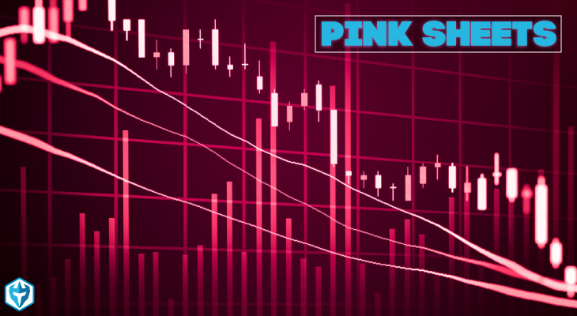

## Table of Contents

## What are pink market stocks?

Pink market stocks, also known as pink sheet stocks, are stocks that are not listed on major stock exchanges like the New York Stock Exchange or NASDAQ. Instead, they are traded over-the-counter (OTC) through a network of dealers. These stocks got their name from the pink paper that the National Quotation Bureau used to print stock price quotes on before the internet became popular.

These stocks are often from smaller companies that do not meet the requirements to be listed on major exchanges. Because they are not as regulated, pink market stocks can be riskier to invest in. They might offer high returns, but they also have a higher chance of losing money. It's important for investors to do a lot of research before buying pink market stocks.

## Why might someone be interested in trading pink market stocks?

People might be interested in trading pink market stocks because they can sometimes offer big rewards. These stocks are often from small companies that are just starting out. If one of these companies does really well, the value of its stock could go up a lot. This means that if you buy the stock early, you could make a lot of money. It's like betting on a new business that could become the next big thing.

However, trading pink market stocks can also be exciting for people who like to take risks. Because these stocks are not on big exchanges, they can be more unpredictable. This means the price can go up and down a lot in a short time. Some people enjoy the challenge of trying to predict these changes and make money from them. It's like a game where you try to guess what will happen next with the stock prices.

## What are the risks associated with trading pink market stocks?

Trading pink market stocks can be risky because these stocks are not listed on big exchanges like the NYSE or NASDAQ. They are traded over-the-counter, which means there are fewer rules and less information available about the companies. This makes it harder to know if a company is doing well or not. Because of this, there's a bigger chance that the stock price could drop a lot, and you could lose money.

Another risk is that some companies on the pink market might not be honest about their business. Since there's less regulation, some bad companies might lie about how much money they're making or other important details. If you find out the company was lying, the stock price could fall fast, and you could lose a lot of your investment. It's really important to do a lot of research and be careful when trading pink market stocks.

## How can a beginner identify pink market stocks?

A beginner can identify pink market stocks by looking at where the stock is traded. Pink market stocks are not listed on big stock exchanges like the New York Stock Exchange or NASDAQ. Instead, they are traded over-the-counter (OTC). You can find them on websites that list OTC stocks, like the OTC Markets Group website. If a stock's ticker symbol has a ".PK" or ".OB" at the end, it's a good sign that it's a pink market stock.

Another way to spot pink market stocks is by checking the company's size and how much information is available about it. Pink market stocks often come from smaller companies that don't meet the rules to be on big exchanges. These companies might not share as much information about their business, so it can be harder to find details about them. If you see a company with very little information available, it might be a pink market stock. Always do your homework and be careful when looking at these stocks.

## What are some common misconceptions about pink market stocks?

One common misconception about pink market stocks is that they are always a bad investment. People often think that because these stocks are not on big exchanges and have less regulation, they must be risky and not worth buying. But that's not always true. Some pink market stocks come from small companies that could grow a lot and make investors a lot of money. It's all about doing your research and understanding the risks.

Another misconception is that all pink market stocks are from shady or failing companies. While it's true that some companies on the pink market might not be honest or could be struggling, not all of them are like that. There are many legitimate small businesses on the pink market that just don't meet the rules to be on bigger exchanges yet. It's important to look at each company closely and not just assume they're all the same.

## What regulatory oversight exists for pink market stocks?

Pink market stocks have less regulatory oversight compared to stocks on big exchanges like the NYSE or NASDAQ. They are traded over-the-counter, which means they don't have to follow as many rules. The main regulator for pink market stocks is the Financial Industry Regulatory Authority (FINRA). FINRA makes sure that the companies trading on the pink market follow some basic rules, like reporting important information about their business.

Even though there is some oversight, it's not as strict as for stocks on bigger exchanges. This means that companies on the pink market might not have to share as much information about their finances or business plans. Investors need to be careful and do their own research because there's a higher chance of running into companies that might not be honest or could be struggling.

## How do liquidity and volatility affect trading in the pink market?

Liquidity and [volatility](/wiki/volatility-trading-strategies) can make trading in the pink market tricky. Liquidity means how easy it is to buy or sell a stock. In the pink market, stocks often have low [liquidity](/wiki/liquidity-risk-premium), which means there might not be many people wanting to buy or sell them at any given time. This can make it hard to sell your stocks quickly if you need to. You might have to wait longer or accept a lower price than you wanted.

Volatility means how much the price of a stock can change in a short time. Pink market stocks can be very volatile because they are not as regulated and often come from smaller companies. The price can go up and down a lot, which can be exciting but also risky. If you're not careful, you could buy a stock at a high price and then see it drop quickly, losing you money. So, it's important to understand both liquidity and volatility when trading in the pink market.

## What are the best practices for conducting due diligence on pink market stocks?

When you want to do due diligence on pink market stocks, start by looking at the company's financials. Check if they share their financial reports and see if they make money or lose it. You can find this information on the OTC Markets website or the company's own website. It's also good to read what other people say about the company. Look for news articles, reports, and what other investors think. This can give you clues about if the company is honest and doing well.

Another important thing is to look at the people running the company. Find out about the leaders and see if they have a good history of running businesses. Sometimes, a company might look good on paper, but if the people in charge have a bad past, it could be a red flag. Also, be careful of companies that promise big returns quickly. If it sounds too good to be true, it probably is. Always take your time and do a lot of research before you decide to buy a pink market stock.

## How can experienced traders mitigate risks when trading pink market stocks?

Experienced traders can lower the risks of trading pink market stocks by spreading out their money. Instead of putting all their money into one stock, they can buy many different pink market stocks. This way, if one stock does badly, they won't lose all their money. They can also use something called stop-loss orders. This is a rule they set up with their broker that says, "If the stock price drops to this point, sell it automatically." This helps them not lose too much money if the stock price falls a lot.

Another way to be safer is to do a lot of research. Experienced traders spend time looking at the company's financial reports, reading news about the company, and checking what other people say about it. They also look at the people running the company to see if they have a good history. By knowing a lot about the company, they can make better choices about which stocks to buy and when to sell them. This helps them avoid companies that might be lying or not doing well.

## What are some advanced strategies for trading pink market stocks?

One advanced strategy for trading pink market stocks is called "[momentum](/wiki/momentum) trading." This means looking for stocks that are going up fast and trying to buy them before they go up even more. Experienced traders use charts and numbers to see which stocks are moving a lot. They might buy a stock when it starts to go up and then sell it quickly when it reaches a high point. This can make them a lot of money if they guess right, but it's risky because the stock could also go down fast.

Another strategy is "sector rotation." This means looking at different parts of the economy, like tech or health care, and trying to guess which part will do well next. Traders might buy pink market stocks in a sector that they think will grow. They watch the news and trends to see where money is moving. If they think a sector is about to get popular, they buy stocks in that sector before everyone else does. This can help them make money if their guess about the sector is right.

## How does the global market impact trading pink market stocks?

The global market can really change how pink market stocks do. If something big happens in another country, like a new law or a big company going bankrupt, it can affect the whole world's economy. This can make people more or less willing to buy pink market stocks. For example, if the economy in a big country like China slows down, people might be scared to invest in risky stocks, including those on the pink market. On the other hand, if a new technology from another country becomes popular, it might make people excited about buying stocks in similar companies on the pink market.

Also, the global market can change how much money people have to invest. If the value of one country's money goes up or down compared to another country's money, it can make pink market stocks more or less expensive for people from different places. This can affect who is buying and selling these stocks. For example, if the U.S. dollar gets stronger, it might make pink market stocks cheaper for people in the U.S. but more expensive for people in other countries. So, traders need to keep an eye on what's happening around the world to make smart choices about pink market stocks.

## What are the tax implications of trading pink market stocks?

When you trade pink market stocks, you need to think about taxes. If you make money from selling your stocks, you have to pay capital gains tax. This tax depends on how long you held the stock before selling it. If you held it for less than a year, it's a short-term capital gain, and you'll pay tax at your regular income tax rate. If you held it for more than a year, it's a long-term capital gain, and the tax rate is usually lower. So, it's good to know how long you've had the stock to figure out how much tax you'll owe.

Another thing to think about is if you lose money on your pink market stocks. If you sell a stock for less than you paid for it, you can use that loss to lower your taxes. This is called a capital loss. You can use capital losses to reduce your capital gains, and if your losses are more than your gains, you can even use some of the loss to lower your regular income tax. But there are rules about how much you can use each year, so it's important to keep good records and maybe talk to a tax expert to make sure you're doing it right.

## References & Further Reading

[1]: Lopez de Prado, M. (2018). ["Advances in Financial Machine Learning."](https://www.amazon.com/Advances-Financial-Machine-Learning-Marcos/dp/1119482089) John Wiley & Sons.

[2]: Aronson, D. R. (2006). ["Evidence-Based Technical Analysis: Applying the Scientific Method and Statistical Inference to Trading Signals."](https://www.amazon.com/Evidence-Based-Technical-Analysis-Scientific-Statistical/dp/0470008741) Wiley.

[3]: Chan, E. P. (2008). ["Quantitative Trading: How to Build Your Own Algorithmic Trading Business."](https://github.com/ftvision/quant_trading_echan_book) John Wiley & Sons.

[4]: Jansen, S. (2020). ["Machine Learning for Algorithmic Trading."](https://github.com/stefan-jansen/machine-learning-for-trading) Packt Publishing.

[5]: Gomber, P., Arndt, B., Lutat, M., & Uhle, T. (2011). ["High-Frequency Trading."](https://papers.ssrn.com/sol3/papers.cfm?abstract_id=1858626) SSRN Electronic Journal.

[6]: SEC. (2010). ["Findings Regarding the Market Events of May 6, 2010."](https://www.sec.gov/news/studies/2010/marketevents-report.pdf) Security and Exchange Commission and Commodity Futures Trading Commission.