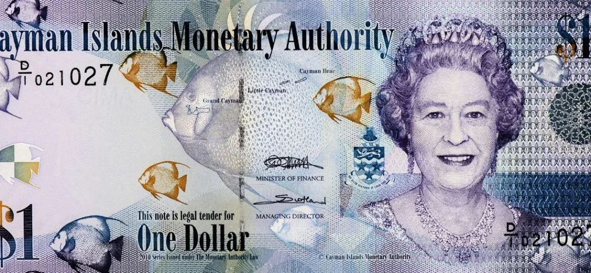

## Table of Contents

## What is the Cayman Islands Dollar?

The Cayman Islands Dollar is the official currency used in the Cayman Islands, a British Overseas Territory located in the Caribbean Sea. It is abbreviated with the symbol CI$ and the ISO code KYD. The currency is managed by the Cayman Islands Monetary Authority, which was established in 1997 to oversee the financial system and ensure its stability.

Introduced in 1972, the Cayman Islands Dollar replaced the Jamaican Dollar, which had been in use since 1840. The Cayman Islands Dollar is pegged to the United States Dollar at a fixed exchange rate of CI$1 to US$1.20. This peg helps maintain economic stability and makes it easier for tourists and businesses to conduct transactions. Banknotes are available in denominations of CI$1, CI$5, CI$10, CI$25, CI$50, and CI$100, while coins come in values of 1, 5, 10, and 25 cents, as well as CI$1.

## What is the currency code and symbol for the Cayman Islands Dollar?

The currency code for the Cayman Islands Dollar is KYD. This code is used internationally to identify the currency in financial transactions and on currency exchange platforms.

The symbol for the Cayman Islands Dollar is CI$. This symbol is used within the Cayman Islands to represent the currency on price tags, in shops, and in financial documents. It helps people easily recognize and use the currency in everyday transactions.

## When was the Cayman Islands Dollar introduced?

The Cayman Islands Dollar was introduced in 1972. Before that, the Cayman Islands used the Jamaican Dollar. The change to their own currency helped the Cayman Islands have more control over their money.

The Cayman Islands Monetary Authority was set up in 1997 to manage the Cayman Islands Dollar. They make sure the currency stays stable. The Cayman Islands Dollar is always worth the same amount of US dollars, which is CI$1 to US$1.20. This makes it easier for people to use the currency when they visit or do business in the Cayman Islands.

## What was the currency used in the Cayman Islands before the introduction of the Cayman Islands Dollar?

Before the Cayman Islands Dollar was introduced in 1972, the Cayman Islands used the Jamaican Dollar. The Jamaican Dollar had been the currency there since 1840. This was because the Cayman Islands were a part of Jamaica until 1962 when Jamaica became independent.

Using the Jamaican Dollar worked okay for a while, but the Cayman Islands wanted their own money. Having their own currency would help them control their economy better. So, in 1972, they switched to the Cayman Islands Dollar. This new currency made things easier for people living and doing business in the Cayman Islands.

## How is the Cayman Islands Dollar pegged to other currencies?

The Cayman Islands Dollar is pegged to the United States Dollar. This means that the value of the Cayman Islands Dollar stays the same compared to the US Dollar. The exchange rate is set at CI$1 to US$1.20. This peg helps keep the economy of the Cayman Islands stable. It makes it easier for tourists and businesses to know how much things cost in the Cayman Islands.

The Cayman Islands Monetary Authority is in charge of keeping this peg. They make sure that the value of the Cayman Islands Dollar does not change against the US Dollar. This is important because it helps people trust the currency. When people know the value will stay the same, they feel more comfortable using the Cayman Islands Dollar for buying things or saving money.

## What are the denominations of the Cayman Islands Dollar in both coins and banknotes?

The Cayman Islands Dollar comes in different sizes of coins and banknotes. The coins are worth 1 cent, 5 cents, 10 cents, 25 cents, and 1 dollar. These coins are used for smaller amounts of money, like buying a candy or a small snack.

The banknotes are bigger and come in values of 1 dollar, 5 dollars, 10 dollars, 25 dollars, 50 dollars, and 100 dollars. People use these notes for bigger purchases, like buying groceries or paying for a hotel stay. Each note has a different color and design to help tell them apart easily.

## How does the exchange rate of the Cayman Islands Dollar compare to the US Dollar?

The Cayman Islands Dollar is always worth the same amount of US Dollars. The exchange rate is set at CI$1 to US$1.20. This means if you have one Cayman Islands Dollar, you can get one dollar and twenty cents in US money. This fixed rate makes it easier for people to know how much their money is worth when they visit or do business in the Cayman Islands.

The Cayman Islands Monetary Authority makes sure this exchange rate stays the same. They control the amount of Cayman Islands Dollars in the economy to keep it stable. This helps people trust the currency because they know it won't change in value compared to the US Dollar. It's good for tourists and businesses because they can plan their money without worrying about changes in the exchange rate.

## What are the key factors influencing the value of the Cayman Islands Dollar?

The value of the Cayman Islands Dollar stays the same because it is pegged to the US Dollar. This means that one Cayman Islands Dollar is always worth US$1.20. The Cayman Islands Monetary Authority makes sure this rate does not change. They control how many Cayman Islands Dollars are in the economy to keep it stable. This helps people trust the currency because they know it won't lose or gain value compared to the US Dollar.

This fixed exchange rate helps tourists and businesses. When people visit the Cayman Islands, they know exactly how much their US Dollars are worth. Businesses can also plan their money without worrying about the exchange rate changing. This stability is good for the economy because it makes people more likely to spend and invest in the Cayman Islands.

## How does the monetary policy of the Cayman Islands affect the Cayman Islands Dollar?

The Cayman Islands Monetary Authority controls the monetary policy of the Cayman Islands. They make sure the Cayman Islands Dollar stays stable by pegging it to the US Dollar. This means one Cayman Islands Dollar is always worth US$1.20. The Monetary Authority watches how many Cayman Islands Dollars are in the economy and adjusts it to keep the currency stable. This helps keep prices steady and makes people trust the money.

Having a stable currency helps the economy of the Cayman Islands. When people know the value of their money won't change, they feel more comfortable spending and investing. This is good for tourists too, because they can easily figure out how much things cost in their own money. The Monetary Authority's work in keeping the exchange rate fixed makes the Cayman Islands a good place for business and travel.

## What role does tourism play in the economy and the stability of the Cayman Islands Dollar?

Tourism is really important for the economy of the Cayman Islands. A lot of people visit the islands every year because they like the beautiful beaches and clear waters. These tourists spend money on hotels, food, and fun activities. This spending helps businesses in the Cayman Islands make money and creates jobs for people who live there. When more tourists come, it makes the economy stronger.

The stability of the Cayman Islands Dollar also helps with tourism. Because the Cayman Islands Dollar is always worth the same amount of US Dollars, tourists know exactly how much things will cost. This makes it easier for them to plan their trips and spend money without worrying about the value of the currency changing. A stable currency makes tourists feel more comfortable and likely to visit, which keeps the economy of the Cayman Islands strong.

## How has the history of financial regulation in the Cayman Islands impacted the currency?

The history of financial regulation in the Cayman Islands has played a big role in keeping the Cayman Islands Dollar stable. Since the 1960s, the Cayman Islands started to become a big place for banks and financial businesses. They made rules to make sure these businesses followed the law and kept the money safe. In 1997, they created the Cayman Islands Monetary Authority to watch over the money system. This authority makes sure the Cayman Islands Dollar stays strong and the same value as the US Dollar.

These rules and the work of the Monetary Authority have helped the economy stay strong. Because the currency is stable, people trust it more. This is good for tourists who visit the islands and for businesses that want to work there. The good financial rules have made the Cayman Islands a safe place for money, which helps keep the Cayman Islands Dollar stable and reliable.

## What are the future prospects for the Cayman Islands Dollar in the global financial market?

The future of the Cayman Islands Dollar in the global financial market looks good because it is pegged to the US Dollar. This means the value of the Cayman Islands Dollar will always stay the same compared to the US Dollar, which makes it very stable. People around the world trust stable currencies, so this helps the Cayman Islands Dollar be seen as a safe choice for money. As long as the Cayman Islands keep their money pegged to the US Dollar and follow good financial rules, their currency should stay strong.

Tourism and the financial services industry are also important for the future of the Cayman Islands Dollar. More tourists coming to the islands means more money being spent there, which helps the economy grow. The financial services industry, like banks and investment companies, brings a lot of money into the Cayman Islands too. If these industries keep doing well, it will support the stability and strength of the Cayman Islands Dollar in the global market.

## References & Further Reading

[1]: ["Cayman Islands Monetary Authority (CIMA)"](https://www.cima.ky/) - The official website provides information on the monetary authority responsible for managing the Cayman Islands Dollar.

[2]: ["The Cayman Islands Financial Services Industry: Legislation and the Continuing Growth of the Financial Sector"](https://www.gov.ky/mfsc/) - An academic article detailing the development of the financial sector and the role of the Cayman Islands Dollar.

[3]: ["Currency Boards: The U.S. Dollar's Influence in Caribbean Economies"](https://www.federalreserve.gov/econres/notes/feds-notes/the-international-role-of-the-u-s-dollar-20211006.html) - An International Monetary Fund working paper discussing the use of fixed exchange rates in Caribbean economies, including the Cayman Islands.

[4]: ["Global Financial Stability Report"](https://www.imf.org/en/publications/gfsr) by the International Monetary Fund - A comprehensive report providing insights into global financial stability, with relevance to fixed exchange rate regimes.

[5]: ["Algorithmic and High-Frequency Trading"](https://assets.cambridge.org/97811070/91146/frontmatter/9781107091146_frontmatter.pdf) by Álvaro Cartea, Sebastian Jaimungal, and José Penalva - A book exploring the roles of algorithmic trading, which relates to the Cayman Islands' financial landscape.