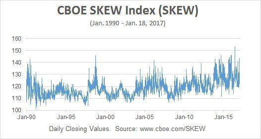

## Table of Contents

## What is Cboe Europe?

Cboe Europe is a stock exchange that operates in Europe. It is owned by Cboe Global Markets, which is a big company that runs several exchanges around the world. Cboe Europe helps people and companies buy and sell stocks, which are small pieces of ownership in a company. This exchange makes it easier for people to trade stocks from different European countries in one place.

The exchange offers trading in many different types of stocks and other financial products. It is known for being one of the first places to offer trading in ETFs, which are funds that can be bought and sold like stocks. Cboe Europe works to make trading fast and reliable, using modern technology to help traders do their work smoothly. This helps both big investors and regular people to trade more easily and with less cost.

## What types of financial instruments are traded on Cboe Europe?

Cboe Europe trades many different types of financial instruments. The main ones are stocks, which are shares in companies that people can buy and sell. They also trade Exchange Traded Funds (ETFs), which are like baskets of different investments that you can buy and sell like stocks. Another type is options, which give you the right to buy or sell a stock at a certain price before a certain date.

In addition to these, Cboe Europe also trades other financial products like futures, which are agreements to buy or sell something at a future date for a price agreed today. They also handle trading in bonds, which are loans to companies or governments that pay back with interest. All these instruments help people and companies manage their money and investments in different ways.

## How does Cboe Europe contribute to the European financial markets?

Cboe Europe plays a big role in the European financial markets by providing a place where people and companies can easily buy and sell different financial products like stocks, ETFs, and options. This helps make the markets more open and easier to use for everyone. By bringing together buyers and sellers from all over Europe, Cboe Europe helps create a busy and lively market where prices are fair and there is a lot of trading going on.

The exchange also helps make trading faster and cheaper with its modern technology. This is good for both big investors and regular people who want to trade. Cboe Europe is known for being one of the first to offer trading in ETFs in Europe, which has helped more people invest in a simple and cost-effective way. By doing all this, Cboe Europe helps keep the European financial markets strong and working well.

## What are the key differences between Cboe Europe and other European exchanges?

Cboe Europe stands out from other European exchanges because it focuses a lot on trading Exchange Traded Funds (ETFs). It was one of the first exchanges in Europe to offer [ETF](/wiki/etf-trading-strategies) trading, which has made it a popular choice for people who want to invest in these types of funds. This focus helps Cboe Europe attract a specific group of traders and investors who are interested in ETFs. Other exchanges might offer ETFs too, but they often focus more on traditional stocks and bonds.

Another key difference is that Cboe Europe uses advanced technology to make trading faster and more reliable. This technology helps traders do their work more easily and with less cost. While other exchanges also use technology, Cboe Europe has a reputation for being at the forefront of using tech to improve trading. This can make a big difference for traders who need speed and efficiency in their work.

## How can one start trading on Cboe Europe?

To start trading on Cboe Europe, you first need to open an account with a broker that is connected to Cboe Europe. A broker is a company that helps you buy and sell stocks and other financial products. You can find a list of brokers on the Cboe Europe website. Once you choose a broker, you'll need to fill out an application form and provide some personal information like your name, address, and ID. After your account is set up, you'll need to add money to it so you can start trading.

Once your account is ready and you have money in it, you can start trading on Cboe Europe through your broker's trading platform. This is usually a website or an app where you can see the prices of stocks and other financial products and decide what to buy or sell. You can place orders to buy or sell stocks, ETFs, options, or other products that are traded on Cboe Europe. It's a good idea to learn about the different types of financial products and how trading works before you start, so you can make smart decisions with your money.

## What are the trading hours of Cboe Europe?

Cboe Europe has regular trading hours from 9:00 AM to 5:30 PM Central European Time (CET). This is when most people and companies are buying and selling stocks, ETFs, and other financial products. During these hours, you can see a lot of activity and prices can change quickly.

Besides the regular hours, Cboe Europe also has pre-market and after-hours trading. Pre-market trading starts at 7:15 AM CET and goes until the regular market opens at 9:00 AM. After-hours trading happens from 6:00 PM to 10:00 PM CET. These extra hours let people trade when the main market is closed, but there might be less activity and bigger price changes.

## What are the fees associated with trading on Cboe Europe?

When you trade on Cboe Europe, you will have to pay some fees. The main fee is called a transaction fee, which you pay every time you buy or sell something on the exchange. The amount of this fee can change depending on what you are trading and how much you are trading. For example, trading stocks might have a different fee than trading ETFs. Your broker, the company that helps you trade, might also add their own fees on top of the exchange fees. These can include things like a commission fee, which is a charge for using their services.

Besides the transaction and commission fees, there might be other costs to think about. Some brokers charge a fee for keeping your account open, called an account maintenance fee. If you want to trade during pre-market or after-hours, there might be extra fees for that too. It's a good idea to check with your broker to understand all the fees you might have to pay before you start trading on Cboe Europe. Knowing all the costs can help you make better choices with your money.

## How does Cboe Europe ensure market integrity and transparency?

Cboe Europe works hard to make sure the market is fair and open for everyone. They do this by using rules and technology to watch over trading. They check trades to make sure no one is doing anything wrong, like trying to trick the market or use secret information. If they find something that looks bad, they can stop it from happening and might even tell the people who make the rules about it. This helps keep the market honest and safe for everyone who trades there.

Cboe Europe also shares a lot of information with the public. They show the prices of stocks and other things people can trade, and they tell everyone about big trades that happen. This way, everyone can see what is going on in the market and make smart choices. By being open about what is happening, Cboe Europe helps people trust the market and feel confident when they trade.

## What technological infrastructure supports Cboe Europe's operations?

Cboe Europe uses a strong and modern computer system to help people buy and sell stocks and other financial products. This system is called the Cboe Europe Equities Trading Platform. It can handle a lot of trades very quickly and makes sure that everything is fair and safe. The platform uses special technology to watch over trading and stop anything bad from happening. This helps keep the market honest and makes sure that everyone can trust the system.

The exchange also uses a system called Cboe LIS (Large in Scale) for big trades. This system lets people make big trades without affecting the prices too much. Cboe Europe's technology works well with other systems too, so traders can use different tools and software to do their work. All these technologies together help make trading on Cboe Europe fast, reliable, and easy for everyone.

## What are some of the recent developments or innovations introduced by Cboe Europe?

Cboe Europe has been working on making trading easier and more efficient. One of the big changes they made is starting a new system called Cboe BIDS Europe. This system helps people make big trades without moving the prices too much. It's good for people who want to buy or sell a lot of stocks or other things without everyone knowing right away. This makes the market fairer and helps big traders do their work better.

Another recent change is that Cboe Europe now offers trading in a new type of financial product called "fractional shares." This means people can buy small pieces of stocks instead of whole ones. It's helpful for people who don't have a lot of money to invest but still want to own part of a company. These new ways of trading show how Cboe Europe is always trying to make the market better for everyone.

## How does Cboe Europe handle regulatory compliance?

Cboe Europe follows many rules to make sure they do things the right way. They work with different groups who make the rules, like the Financial Conduct Authority (FCA) in the UK and the European Securities and Markets Authority (ESMA). These groups check to see if Cboe Europe is doing what they are supposed to do. If Cboe Europe finds anything wrong, they fix it quickly to keep the market fair and safe for everyone.

The exchange also has its own team that watches over trading all the time. This team uses special tools to look for anything that might not be right. They make sure no one is cheating or using secret information to trade. By doing this, Cboe Europe helps keep the market honest and makes sure people can trust it when they buy and sell stocks and other things.

## What future trends might impact Cboe Europe's operations and strategy?

In the future, Cboe Europe might see changes because of new technology. More people might start using computers and smart programs to trade, which could make trading faster and more automatic. This means Cboe Europe will need to keep updating their systems to handle these new ways of trading. They might also use new tools like blockchain to make trading even safer and easier to track. Keeping up with technology will be important for Cboe Europe to stay competitive and trusted by traders.

Another big trend could be more rules from governments and other groups that watch over the market. These rules might change how Cboe Europe can work and what they need to do to stay in line. For example, they might need to report more information about trades or be more careful about who can trade and how. Cboe Europe will need to keep a close eye on these rules and be ready to change how they do things to follow them. This will help them keep the market fair and safe for everyone.

## References & Further Reading

[1]: Hasbrouck, J. (2007). ["Empirical Market Microstructure: The Institutions, Economics, and Econometrics of Securities Trading"](https://academic.oup.com/book/52241) by Joel Hasbrouck

[2]: Menkveld, A. J. (2013). ["High Frequency Trading and the New Market Makers."](https://www.sciencedirect.com/science/article/pii/S1386418113000281) Journal of Financial Markets, 16(4), 712-740.

[3]: O'Hara, M. (2015). ["High Frequency Market Microstructure"](https://www.sciencedirect.com/science/article/pii/S0304405X15000045) Review of Financial Studies, 28(5), 1027-1072.

[4]: Gomber, P., Arndt, B., Lutat, M., & Uhle, T. (2011). ["High-Frequency Trading."](https://papers.ssrn.com/sol3/papers.cfm?abstract_id=1858626) SSRN Electronic Journal.

[5]: Cartea, Á., Jaimungal, S., & Penalva, J. (2015). ["Algorithmic and High-Frequency Trading"](https://assets.cambridge.org/97811070/91146/frontmatter/9781107091146_frontmatter.pdf) by Álvaro Cartea, Sebastian Jaimungal, and José Penalva