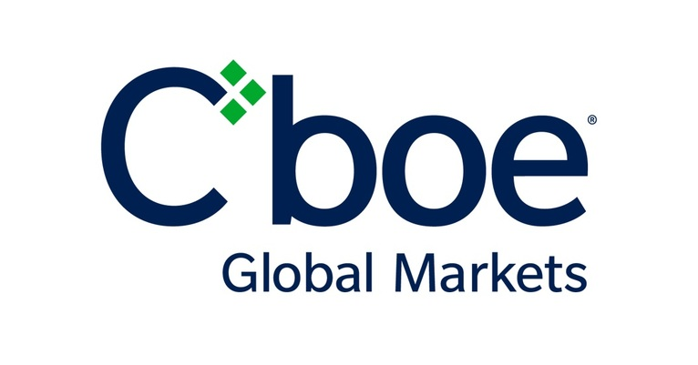

## Table of Contents

## What is the Cboe Futures Exchange?

The Cboe Futures Exchange, often called CFE, is a place where people can buy and sell futures contracts. Futures are agreements to buy or sell something at a set price on a future date. CFE is owned by Cboe Global Markets, a big company that runs several financial markets. It started in 2004 and is known for trading futures on the VIX, which measures how much people expect the stock market to move.

CFE is important because it helps people manage risk. For example, if you think the stock market will become more volatile, you can buy a VIX future to protect yourself. This exchange makes it easier for people to do this kind of trading. It's also a place where investors can try to make money by guessing how the market will move. Overall, CFE plays a key role in the world of finance by offering a place to trade these special contracts.

## When was the Cboe Futures Exchange established?

The Cboe Futures Exchange, or CFE, was established in 2004. It is owned by Cboe Global Markets, a company that runs several financial markets. CFE is a place where people can trade futures contracts, which are agreements to buy or sell something at a set price in the future.

CFE is well-known for trading futures on the VIX, which measures how much people expect the stock market to move. This helps people manage risk. For example, if someone thinks the stock market will become more volatile, they can buy a VIX future to protect themselves. CFE plays an important role in finance by providing a place for these trades.

## What types of futures contracts are traded on the Cboe Futures Exchange?

The Cboe Futures Exchange, or CFE, mainly trades futures contracts on the VIX. The VIX is a measure of how much people expect the stock market to move around. This is important because it helps people manage risk. If someone thinks the stock market will become more unpredictable, they can buy a VIX future to protect themselves from big swings in the market.

Besides VIX futures, CFE also trades futures on other indexes. These include the S&P 500, which is a big stock market index, and other indexes like the Russell 2000 and the MSCI EAFE. These futures help people bet on or protect against changes in these indexes. Overall, CFE offers a variety of futures contracts that are useful for investors looking to manage risk or make money from market movements.

## How does the Cboe Futures Exchange operate?

The Cboe Futures Exchange, or CFE, is a place where people buy and sell futures contracts. These contracts are agreements to buy or sell something at a set price on a future date. CFE is owned by Cboe Global Markets, a big company that runs several financial markets. CFE started in 2004 and is known for trading futures on the VIX, which measures how much people expect the stock market to move. People use these futures to manage risk or make money by guessing how the market will change.

CFE operates by providing a platform where traders can come together to trade futures. This happens electronically, meaning people use computers to buy and sell. The exchange sets rules to make sure trading is fair and open. For example, it has rules about how orders are matched and how prices are set. CFE also works with clearing firms to make sure trades are settled properly. This means after a trade, the clearing firm makes sure both sides of the deal get what they agreed to. Overall, CFE helps people manage risk and invest in the future movements of the market.

## What are the trading hours for the Cboe Futures Exchange?

The Cboe Futures Exchange, or CFE, has trading hours that let people trade futures at different times of the day. The main trading hours are from 9:30 AM to 4:15 PM Eastern Time, Monday through Friday. This is when most trading happens because it lines up with the regular stock market hours.

But CFE also has extended trading hours. These hours are from 4:15 PM to 9:15 PM Eastern Time, Monday through Thursday. On Sundays, trading starts at 6:00 PM Eastern Time and goes until 9:15 PM. These extra hours let people trade when the regular market is closed, which can be helpful for managing risk or making trades at different times.

## What are the benefits of trading futures on the Cboe Futures Exchange?

Trading futures on the Cboe Futures Exchange, or CFE, has several benefits. One big benefit is that it helps people manage risk. For example, if you think the stock market will become more unpredictable, you can buy a VIX future to protect yourself. This is important because it can save you money if the market does move a lot. CFE also offers futures on other indexes like the S&P 500 and Russell 2000, which gives people more options to manage their investments.

Another benefit is that CFE's trading hours are flexible. The main trading hours are from 9:30 AM to 4:15 PM Eastern Time, but there are also extended hours from 4:15 PM to 9:15 PM Eastern Time, Monday through Thursday, and from 6:00 PM to 9:15 PM on Sundays. This means you can trade when the regular stock market is closed, which can be really helpful if you need to make trades at different times. Plus, the electronic trading system makes it easy to buy and sell futures from anywhere.

## How does the Cboe Futures Exchange ensure market integrity and transparency?

The Cboe Futures Exchange, or CFE, works hard to keep the market fair and open for everyone. They do this by setting strict rules about how trading happens. For example, they have rules about how orders are matched and how prices are set. This means everyone gets a fair chance to buy and sell futures. CFE also watches the market closely to make sure no one is cheating or trying to trick other traders. If they see anything wrong, they can step in to stop it and keep the market honest.

Another way CFE keeps the market transparent is by sharing a lot of information with traders. They show real-time data about trades, so everyone can see what's happening. This helps traders make smart decisions because they have all the facts. CFE also works with clearing firms to make sure trades are settled correctly. After a trade, the clearing firm makes sure both sides of the deal get what they agreed to. This adds another layer of trust and openness to the market.

## What are the key differences between the Cboe Futures Exchange and other futures exchanges?

The Cboe Futures Exchange, or CFE, stands out from other futures exchanges mainly because of its focus on trading futures on the VIX. The VIX is a measure of how much people expect the stock market to move, and CFE is well-known for offering these futures. This is different from other exchanges that might focus more on commodity futures like oil or gold. CFE also trades futures on other indexes like the S&P 500 and Russell 2000, but the VIX is its specialty. This makes it a go-to place for people looking to manage risk related to stock market [volatility](/wiki/volatility-trading-strategies).

Another key difference is CFE's trading hours. While many futures exchanges have set hours that line up with the regular stock market, CFE offers extended trading hours. The main trading hours are from 9:30 AM to 4:15 PM Eastern Time, but there are also extended hours from 4:15 PM to 9:15 PM Eastern Time, Monday through Thursday, and from 6:00 PM to 9:15 PM on Sundays. This gives traders more flexibility to buy and sell futures when the regular market is closed. This can be really helpful for managing risk or making trades at different times of the day.

## What role does the Cboe Futures Exchange play in the global financial market?

The Cboe Futures Exchange, or CFE, plays an important role in the global financial market by providing a platform for trading futures on the VIX and other indexes. The VIX measures how much people expect the stock market to move, and CFE's focus on these futures helps people manage risk related to stock market volatility. This is important because it allows investors to protect themselves from big swings in the market. CFE also offers futures on other indexes like the S&P 500 and Russell 2000, which gives traders more options to manage their investments.

Another way CFE contributes to the global financial market is through its extended trading hours. While many futures exchanges have trading hours that line up with the regular stock market, CFE offers additional hours from 4:15 PM to 9:15 PM Eastern Time, Monday through Thursday, and from 6:00 PM to 9:15 PM on Sundays. This flexibility lets traders buy and sell futures when the regular market is closed, which can be really helpful for managing risk or making trades at different times. Overall, CFE's focus on VIX futures and its extended trading hours make it a key player in the global financial market.

## How can one start trading on the Cboe Futures Exchange?

To start trading on the Cboe Futures Exchange, or CFE, you first need to open an account with a brokerage firm that has access to CFE. You can find a list of these firms on the CFE website. Once you've chosen a brokerage, you'll need to fill out an application and provide some personal information, like your name, address, and social security number. The brokerage will also ask about your trading experience and financial situation to make sure you understand the risks of trading futures. After your application is approved, you'll need to fund your account with enough money to cover the margin requirements for the futures contracts you want to trade.

Once your account is set up and funded, you can start trading on CFE. You'll use the brokerage's trading platform to buy and sell futures. CFE offers futures on the VIX, which measures how much people expect the stock market to move, as well as other indexes like the S&P 500 and Russell 2000. You can trade during the main hours from 9:30 AM to 4:15 PM Eastern Time, but CFE also has extended hours from 4:15 PM to 9:15 PM Eastern Time, Monday through Thursday, and from 6:00 PM to 9:15 PM on Sundays. This gives you more flexibility to trade when the regular market is closed. Remember to always keep an eye on your positions and manage your risk carefully, as futures trading can be risky.

## What are the regulatory requirements for trading on the Cboe Futures Exchange?

To trade on the Cboe Futures Exchange, or CFE, you need to follow some rules set by regulators. First, you have to open an account with a brokerage firm that can trade on CFE. You'll need to fill out an application and give them information like your name, address, and social security number. The brokerage will also ask about your trading experience and how much money you have. This is to make sure you understand the risks of trading futures. Once your application is approved, you need to put money into your account to cover the margin requirements for the futures you want to trade.

Regulators also make sure that trading on CFE is fair and open. CFE has rules about how orders are matched and how prices are set, so everyone gets a fair chance to buy and sell. They also watch the market closely to stop any cheating or unfair practices. If something goes wrong, they can step in to fix it. Plus, CFE works with clearing firms to make sure trades are settled correctly. After you make a trade, the clearing firm makes sure both sides of the deal get what they agreed to. This helps keep the market honest and safe for everyone trading on CFE.

## What advanced trading strategies can be used on the Cboe Futures Exchange?

One advanced trading strategy on the Cboe Futures Exchange is called "straddles." This involves buying both a call option and a put option on the VIX at the same time, with the same strike price and expiration date. You do this when you think the market is going to move a lot, but you're not sure which way. If the VIX goes up a lot, the call option will make money. If it goes down a lot, the put option will make money. This strategy can help you make money from big moves in either direction, but it also costs more because you're buying two options.

Another strategy is "calendar spreads." With this, you buy and sell futures contracts on the VIX that have different expiration dates. For example, you might buy a VIX future that expires in one month and sell a VIX future that expires in three months. This strategy works well if you think the short-term VIX will be different from the long-term VIX. If the short-term VIX goes up more than the long-term VIX, you can make money. This can be a good way to bet on how the market's expectations of volatility will change over time.

## References & Further Reading

[1]: ["Advances in Financial Machine Learning"](https://www.amazon.com/Advances-Financial-Machine-Learning-Marcos/dp/1119482089) by Marcos Lopez de Prado

[2]: ["Algorithmic Trading and DMA: An introduction to direct access trading strategies"](https://www.amazon.com/Algorithmic-Trading-DMA-introduction-strategies/dp/0956399207) by Barry Johnson

[3]: ["Volatility Trading"](https://www.investopedia.com/articles/investing/021716/strategies-trading-volatility-options-nflx.asp) by Euan Sinclair

[4]: Harris, L. (2003). ["Trading and Exchanges: Market Microstructure for Practitioners"](https://academic.oup.com/book/52292). Oxford University Press.

[5]: ["High-Frequency Trading: A Practical Guide to Algorithmic Strategies and Trading Systems"](https://www.amazon.com/High-Frequency-Trading-Practical-Algorithmic-Strategies/dp/0470563761) by Irene Aldridge