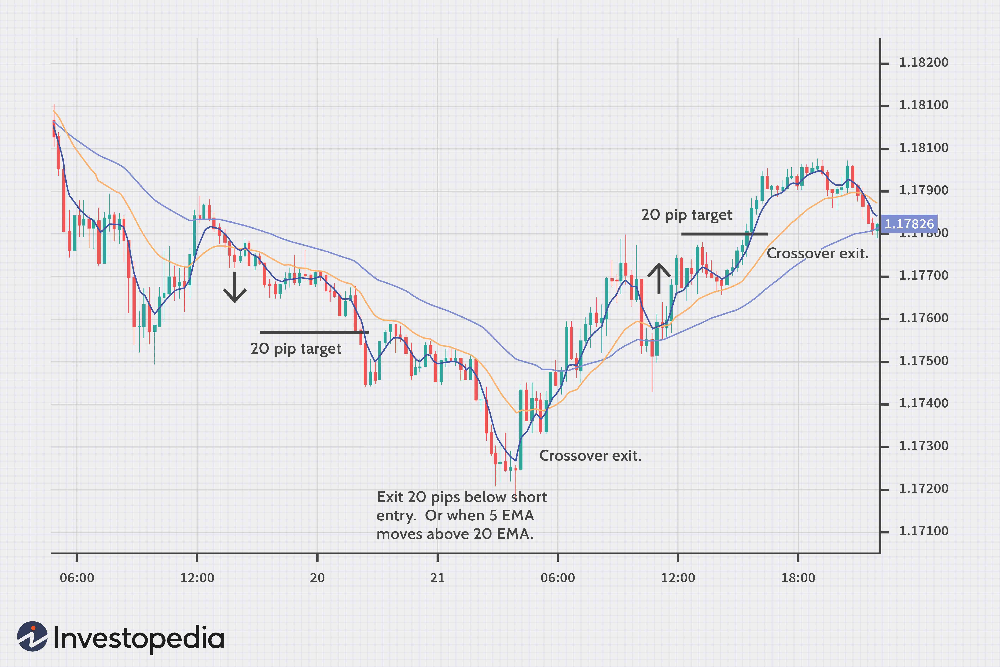

In today's dynamic financial markets, understanding and predicting volatility can be instrumental in developing successful trading strategies. The Cboe Volatility Index (VIX) serves as a vital tool in this regard, providing a measure of market expectations for volatility over the next 30 days. Often referred to as the 'fear index,' the VIX is derived from the prices of S&P 500 index options and reflects investor sentiment about future market uncertainty. A high VIX value typically indicates increased risk and potential downturns, while a low value suggests market stability and investor confidence.

VVIX, known as the VIX of VIX, extends the concept of volatility measurement by assessing the fluctuations in the VIX itself. Essentially, it measures the market's expectation of the volatility associated with the VIX, offering a second layer of insight into investor sentiment and market uncertainty. This can be particularly useful as VVIX captures the expected variability of the 'fear index,' indicating potential shifts in market dynamics before they occur.



This article aims to comprehensively explore the VVIX, its significance within Cboe Global Markets, and the ways in which algorithmic trading strategies leverage this index. By delving into the mechanics and applications of VVIX, traders and investors can gain enhanced perspectives on market conditions, improve risk management, and optimize trading performance.

## Table of Contents

## Understanding the VIX and VVIX

The VIX Index, often referred to as the "fear index," is a pivotal tool in understanding market volatility. It quantifies the market's anticipation of 30-day volatility, deriving its value from the option prices of the S&P 500 Index. This calculation involves complex mathematical models, integrating inputs from various option prices to estimate a single, implied volatility measure. The Chicago Board Options Exchange (Cboe) introduced the VIX in 1993, and since then, it has become the most recognized gauge for market stress and volatility expectations.

The formula for the VIX relies on the model of implied volatility from a range of S&P 500 options. It can be represented as:

$$
VIX = 100 \times \sqrt{\frac{2}{\pi} \cdot \sum_{i} \frac{\Delta K_i}{K_i^2} \cdot e^{RT} \cdot Q(K_i)}
$$

where:

- $\Delta K_i$ is the interval between strike prices,
- $K_i$ is the strike price,
- $R$ is the risk-free interest rate,
- $T$ is the time to expiration,
- $Q(K_i)$ is the average of the bid and ask quotes for options at strike $K_i$.

While the VIX reflects the anticipated [volatility](/wiki/volatility-trading-strategies) of the stock market over the next month, the VVIX takes this a step further by evaluating the variability of the VIX itself. The VVIX, often referred to as the "VIX of VIX," provides insights into the expected volatility of market volatility. This measure gauges how much the volatility (as measured by the VIX) is expected to vary, offering crucial insights into the potential for drastic shifts in volatility, which in turn can signal changes in market sentiment.

Higher levels of VVIX indicate increased volatility in the VIX, suggesting that the market is anticipating larger fluctuations in the perceived volatility of the S&P 500. These elevated VVIX levels often correspond with periods of market tension, signifying significant shifts in investor sentiment. As the VVIX rises, it signals to traders that the VIX may experience larger swings, reflecting a market environment where uncertainty is heightened. Understanding these dynamics allows traders to better gauge market conditions and adjust their strategies accordingly.

In summary, while the VIX measures the market's expectation of near-term volatility, the VVIX offers an additional layer of insight by assessing how volatile those expectations themselves might become. This dual-layer approach enhances a trader’s ability to navigate volatile markets and implement strategies aligned with anticipated market conditions.

## How VVIX Impacts Trading Strategies

VVIX can serve as a critical indicator for traders, highlighting potential opportunities or risks in volatile markets. The VVIX's primary function is to assess the variability of the VIX, which relates to anticipated fluctuations in the S&P 500's implied volatility. A high VVIX suggests significant variability in the VIX, indicating heightened investor uncertainty and potential for large market swings.

Traders leverage VVIX to evaluate pricing dynamics and potential risk premiums in VIX options. By understanding the VVIX level, traders can infer the expected volatility of volatility itself, which can influence the pricing of options based on the VIX. Pricing dynamics become crucial, as higher VVIX readings might lead to increased VIX option premiums, reflecting greater anticipated market volatility. Traders aim to position themselves advantageously, either by taking protective measures against rapid volatility shifts or by capitalizing on anticipated market movements.

Algorithmic traders incorporate VVIX data to enhance their volatility prediction models, refining trade executions. These traders rely on complex algorithms to process and interpret real-time VVIX data, allowing them to swiftly adapt trading strategies in response to emerging signals. For example, an algorithm might be designed to recognize patterns or anomalies in VVIX fluctuations, triggering automated adjustments to trading positions to optimize for risk-adjusted returns.

Understanding trends within the VVIX allows traders to better hedge their portfolios or exploit volatility spikes. By monitoring VVIX movements, traders can adjust their hedging strategies accordingly, ensuring their positions are protected against unexpected volatility surges or declines. Additionally, identifying potential volatility spikes enables traders to initiate positions that could benefit from short-lived market inefficiencies or discrepancies.

In summary, VVIX provides traders with actionable insights that are crucial for navigating markets marked by uncertain volatility. By leveraging these insights, traders can hone their strategies, ensuring they are effectively managing risk while seizing potential opportunities presented by fluctuations in market sentiment.

## Algorithmic Trading with VVIX

Algorithmic trading platforms employ complex models to analyze real-time VVIX data, facilitating the rapid exploitation of market opportunities. These platforms utilize algorithms that can swiftly adjust positions based on VVIX-driven signals, optimizing for risk-adjusted returns by dynamically responding to shifts in market conditions. The algorithms are designed to detect subtle changes in the VVIX, providing traders with actionable intelligence that might otherwise go unnoticed.

Machine learning techniques have become indispensable in this context. By applying [machine learning](/wiki/machine-learning) to VVIX data, traders can uncover intricate patterns in the volatility movements. This advantage is particularly noteworthy as these patterns are often less obvious to human traders. For example, clustering techniques or neural networks can be employed to classify periods of high and low volatility, enabling more informed decision-making.

A simple example of using Python to analyze VVIX trends might involve applying a random forest classifier to predict future volatility states:

```python
from sklearn.ensemble import RandomForestClassifier
import numpy as np

# Sample feature matrix (X) and target vector (y)
X = np.random.rand(100, 5) # features such as past VVIX values, moving averages, etc.
y = np.random.randint(0, 2, 100) # binary target for high/low volatility state

# Initialize and train model
model = RandomForestClassifier(n_estimators=100, random_state=42)
model.fit(X, y)

# Predicting future states
future_X = np.random.rand(10, 5) # new potential input values
predictions = model.predict(future_X)
```

VVIX-derived strategies allow traders to dynamically manage exposure to volatility risk in their portfolios. By tailoring responses based on real-time VVIX data, these strategies can adjust hedge ratios or modify option positions to optimize performance. This adaptability ensures that traders can mitigate losses during abrupt volatility spikes while capitalizing on periods of relative stability.

In conclusion, [algorithmic trading](/wiki/algorithmic-trading) with VVIX not only enhances the precision and effectiveness of trading strategies but also allows for more sophisticated risk management. By leveraging the computational power and analytical capabilities of algorithms, traders can navigate the complexities of financial markets with greater confidence and success.

## VVIX as a Hedging Tool

Investors and traders employ the VVIX index as a hedge against unexpected volatility shifts in financial markets. VVIX, often associated with the 'volatility of volatility,' offers insights into the expected fluctuations in the VIX, a critical gauge of market sentiment. By consistently monitoring VVIX levels, market participants can strategically position themselves using VIX options and futures, thus safeguarding their portfolios from abrupt volatility spikes.

The application of VVIX extends to volatility [arbitrage](/wiki/arbitrage) strategies, where traders aim to exploit the price discrepancies that arise within volatility indices. These strategies often involve taking positions that benefit from anticipated changes in volatility levels, guided by movements in the VVIX. As VVIX quantifies the market's anticipation of future volatility swings, it enables traders to predict and capitalize on shifts before they materialize.

Incorporating VVIX into risk management frameworks enhances the capacity to mitigate the adverse effects of unexpected market downturns. By establishing a proactive stance based on VVIX insights, investors can construct hedges that cushion against substantial market reversals. Such hedging strategies might include diversifying the portfolio with instruments that gain value during volatility upsurges or allocating resources to counter-cyclical assets.

Overall, VVIX functions as a barometer for the second-order risk embedded within the broader VIX framework, providing a sophisticated means of navigating uncertainty in financial markets. This utility renders it an indispensable tool for traders focusing on volatility dynamics.

## Limitations and Considerations

While VVIX stands as a potent tool in quantifying the volatility of volatility, its effectiveness can be significantly impacted by unpredictable geopolitical or economic events. Such occurrences can introduce sharp market movements that VVIX might not capture promptly, thereby affecting its reliability as a predictive measure. For instance, sudden geopolitical tensions or unforeseen economic data releases can lead to abrupt spikes in market volatility, which the VVIX may not anticipate accurately due to its retrospective basis.

Traders engaging with VIX derivatives influenced by VVIX must navigate the intricate landscape of associated costs and complexities. Trading instruments such as VIX options and futures entail various transaction costs, including spreads and margin requirements, which can substantially influence profitability. These complexities necessitate a detailed understanding of market dynamics and the cost structure involved in volatility trading.

A comprehensive grasp of option pricing models and market mechanics is essential for interpreting and leveraging VVIX effectively. The intricacies involve understanding the Black-Scholes model, which forms the basis for most option pricing strategies, alongside concepts such as implied volatility and the Greeks, particularly vega and gamma, which measure sensitivity to volatility changes. Analyzing VVIX requires adeptness in these areas to interpret its signals and incorporate them effectively into trading strategies.

Nevertheless, with rigorous analysis and an informed approach, the VVIX remains a critical component in volatility trading strategies. Its ability to provide insights into the variability of volatility makes it invaluable for traders looking to manage risk and enhance their strategic positioning. By leveraging VVIX data, traders can make more informed decisions, even in the face of market unpredictability, ensuring that their strategies remain robust and adaptive.

## Conclusion

The VVIX offers a unique perspective on market volatility and serves as a valuable tool for investors and traders. By providing insights into the fluctuations of the VIX Index, VVIX reveals information that is crucial for anticipating changes in market sentiment and volatility. This capability allows market participants to be better prepared for market anomalies and adjust their strategies accordingly.

Incorporating VVIX into trading strategies can provide a competitive edge by enhancing risk management and capitalizing on volatile market movements. Traders can harness the data provided by VVIX to identify potential opportunities or threats within the market, leading to more informed decision-making. This information can be particularly advantageous when developing strategies that rely on predicting volatilities, such as options trading, where understanding the underlying risks and potential rewards is essential.

Algorithmic trading systems, in particular, have greatly benefitted from insights gained through VVIX. These systems, armed with VVIX data, employ sophisticated models and mathematical algorithms to achieve precision in execution and strategic foresight. Such precision allows for rapid adjustments to trading positions in response to shifts indicated by VVIX, optimizing for risk-adjusted returns. By incorporating advanced machine learning techniques, algorithms can discern patterns in VVIX movements that might be less apparent to human traders, thus further honing their predictive accuracy.

As markets continue to evolve, the relevance and application of VVIX are likely to expand, offering traders and investors an invaluable resource for navigating increasingly complex financial landscapes. Its role in refining trading methodologies and enhancing the ability to hedge against unforeseen volatility underscores its potential as an enduring element of modern trading strategy. As financial instruments and trading platforms become more sophisticated, the insights provided by VVIX will remain integral to strategic planning and risk management, ensuring that it continues to shape the future of trading.

## References & Further Reading

[1]: Whaley, R. E. (1993). ["Derivatives on market volatility: Hedging tools long overdue."](https://www.scirp.org/reference/referencespapers?referenceid=2049305) The Journal of Derivatives, 1(1), 71-84.

[2]: Carr, P., & Wu, L. (2006). ["A Tale of Two Indices"](https://engineering.nyu.edu/sites/default/files/2021-03/carrwutaleoftwoindices.pdf) The Journal of Derivatives, 13(3), 13-29.

[3]: Alexander, C., & Korovilas, D. (2011). ["The hazards of volatility diversification."](https://papers.ssrn.com/sol3/papers.cfm?abstract_id=1752389) Journal of Futures Markets, 32(9), 865-885.

[4]: Cont, R. (2001). ["Empirical properties of asset returns: stylized facts and statistical issues."](http://rama.cont.perso.math.cnrs.fr/pdf/empirical.pdf) Quantitative Finance, 1(2), 223-236.

[5]: Dash, S., & Moran, M. T. (2005). ["VIX as a Companion for Hedge Fund Portfolios."](https://www.semanticscholar.org/paper/VIX-as-a-Companion-for-Hedge-Fund-Portfolios-Dash-Moran/98f29d0295fffa7dbca3849f19188d3f7bd0a355) The Journal of Alternative Investments, 8(3), 75-80.