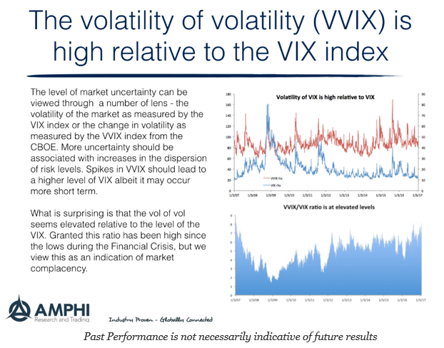

## Table of Contents

## What is the Cboe Global Markets VIX of VIX (VVIX)?

The Cboe Global Markets VIX of VIX, or VVIX, is a measure of the volatility of the VIX, which itself is a measure of the stock market's expectation of volatility. The VIX is often called the "fear gauge" because it reflects how much investors expect the stock market to move in the near future. The VVIX, on the other hand, measures how much the VIX is expected to fluctuate. This can be useful for investors who want to understand not just how much the market might move, but how much the market's expectation of movement might change.

The VVIX is calculated using options on the VIX, similar to how the VIX is calculated using options on the S&P 500. When the VVIX is high, it means that there is a lot of uncertainty about how much the VIX will change. This can happen during times of high market stress or when there are big news events that could affect the market. When the VVIX is low, it means that the market expects the VIX to stay pretty stable. This can be a sign that the market is calm and that investors are not too worried about sudden changes in volatility.

## How does VVIX differ from the standard VIX index?

The VVIX and the VIX are both measures of volatility, but they focus on different things. The VIX, known as the "fear gauge," measures how much the stock market is expected to move in the near future. It does this by looking at options on the S&P 500, which give an idea of what investors think will happen to stock prices. The VIX goes up when investors are worried and expect big changes in the market, and it goes down when investors are calm and expect the market to stay steady.

The VVIX, on the other hand, measures the volatility of the VIX itself. It tells us how much the VIX is expected to change. The VVIX uses options on the VIX to figure this out. When the VVIX is high, it means that people are unsure about how much the VIX will change, which often happens during times of big news or market stress. When the VVIX is low, it means that the VIX is expected to stay pretty stable, which can be a sign of a calm market. So, while the VIX tells us about expected market moves, the VVIX tells us about expected changes in those expectations.

## What does VVIX measure in the financial markets?

The VVIX measures how much the VIX, which is known as the "fear gauge," is expected to change. The VIX itself looks at options on the S&P 500 to figure out how much the stock market might move in the near future. When the VIX is high, it means investors are worried and expect big changes in the market. When it's low, it means investors are calm and expect the market to stay steady. The VVIX, on the other hand, uses options on the VIX to see how much the VIX might change.

When the VVIX is high, it means there's a lot of uncertainty about how much the VIX will change. This often happens during times of big news or when the market is stressed. A high VVIX can show that people are unsure about how much fear or calm will be in the market. When the VVIX is low, it means the VIX is expected to stay pretty stable. This can be a sign that the market is calm and investors are not too worried about sudden changes in how much the market might move.

## How is VVIX calculated?

The VVIX is calculated using options on the VIX. Just like how the VIX looks at options on the S&P 500 to figure out how much the market might move, the VVIX looks at options on the VIX to see how much the VIX might change. The VIX itself is a measure of how much the stock market is expected to move in the near future, and it uses the prices of options on the S&P 500 to make this calculation.

To calculate the VVIX, the Cboe Global Markets uses a formula that takes into account the prices of options on the VIX. These options give an idea of how much people think the VIX will change. The VVIX formula looks at the prices of these options and figures out how much volatility is expected in the VIX itself. This helps investors understand not just how much the market might move, but also how much the market's expectation of movement might change.

## What are the main uses of VVIX for investors and traders?

The VVIX is a helpful tool for investors and traders who want to understand how much the market's fear or calm might change. It tells them how much the VIX, which measures the stock market's expected moves, is expected to change. When the VVIX is high, it means there's a lot of uncertainty about how much fear or calm there will be in the market. This can be useful for traders who want to make bets on how much the VIX might move. For example, if they think the VVIX is too high, they might bet that the VIX will stay stable, and if they think it's too low, they might bet that the VIX will change a lot.

Investors also use the VVIX to help them make decisions about their portfolios. If the VVIX is high, it can mean that the market might be in for some big swings in how much fear or calm there is. This might make investors more cautious and want to protect their investments from big changes. On the other hand, if the VVIX is low, it might mean the market will stay pretty steady, which could make investors feel more confident about taking some risks. By keeping an eye on the VVIX, investors and traders can get a better sense of what might happen next in the market and adjust their strategies accordingly.

## How can VVIX be used to gauge market volatility?

The VVIX helps people understand how much the market's fear or calm might change. It does this by measuring how much the VIX, which is like a fear gauge for the stock market, is expected to move. When the VVIX is high, it means there's a lot of uncertainty about how much fear or calm there will be in the market. This can be a sign that the market might be in for some big swings. On the other hand, when the VVIX is low, it means the market expects the VIX to stay pretty steady, which can mean the market will be calm.

Investors and traders use the VVIX to help them make decisions. If the VVIX is high, it might make them more cautious because they think the market could have big changes in how much fear or calm there is. They might want to protect their investments from these big swings. But if the VVIX is low, they might feel more confident and be willing to take some risks because they think the market will stay steady. By watching the VVIX, people can get a better idea of what might happen next in the market and adjust their plans accordingly.

## What historical events have significantly impacted VVIX levels?

Some big events that have made the VVIX go up a lot are things like the 2008 financial crisis and the early days of the COVID-19 pandemic in 2020. During these times, people were really worried about what would happen to the stock market. The VVIX went up because there was a lot of uncertainty about how much fear or calm there would be in the market. When big news like this happens, it can make the VVIX jump because people are not sure how the market will react.

Another event that affected the VVIX was the "Volmageddon" event in February 2018. This was when a lot of people were betting that the VIX would stay low, but then it suddenly went up a lot. This made the VVIX spike because it showed how much the VIX could change unexpectedly. These kinds of events show how the VVIX can help people understand how much the market's fear or calm might change during big news or stressful times.

## How does VVIX correlate with other volatility indices?

The VVIX, which measures how much the VIX is expected to change, often moves in a similar way to other volatility indices, but it's not exactly the same. For example, the VIX itself is a measure of how much the stock market is expected to move. When the VIX goes up because people are worried about the market, the VVIX often goes up too. This is because when the market is unsure, people also get unsure about how much the VIX will change. But sometimes, the VVIX can go up even if the VIX stays the same, if there's a lot of uncertainty about what the VIX will do next.

Another volatility index that the VVIX can be compared to is the S&P 500 Short-Term Volatility Index, or SVXY. This index looks at the expected volatility of the S&P 500 over a shorter period than the VIX. The VVIX and SVXY can move together when there's a lot of short-term uncertainty in the market. But they can also move differently if the uncertainty is more about how much the VIX will change rather than how much the S&P 500 will move. So, while the VVIX is related to other volatility indices, it gives a unique view of how much the market's fear or calm might change.

## What are the limitations and criticisms of using VVIX?

The VVIX can be tricky to use because it's based on the VIX, which is already hard to understand. The VIX looks at options on the S&P 500 to guess how much the market will move, and the VVIX looks at options on the VIX to guess how much the VIX will change. This means the VVIX is kind of a guess about a guess, which can make it less reliable. Also, the VVIX can be affected by things like how much people are trading options on the VIX, which might not always show what's really going on in the market.

Some people think the VVIX can be too jumpy. It can go up and down a lot, even when the market seems calm. This can make it hard to use for making decisions about investing. Critics say that because the VVIX is so focused on the VIX, it might miss other important things happening in the market. So, while the VVIX can be a helpful tool, it's important to use it along with other information to get a full picture of what's going on.

## How can VVIX be integrated into a trading strategy?

The VVIX can help traders figure out how much the market's fear or calm might change. When the VVIX is high, it means there's a lot of uncertainty about how much the VIX will move. This can be a sign that the market might have big swings. Traders can use this information to decide when to buy or sell options on the VIX. For example, if they think the VVIX is too high, they might bet that the VIX will stay steady. If they think it's too low, they might bet that the VIX will change a lot. By watching the VVIX, traders can make smarter bets on how much the VIX might move.

Traders can also use the VVIX to help manage their risks. If the VVIX is high, it might mean the market could have big changes in how much fear or calm there is. This can make traders more careful and want to protect their investments from these big swings. They might use options or other tools to do this. On the other hand, if the VVIX is low, it might mean the market will stay pretty steady. This can make traders feel more confident about taking some risks. By keeping an eye on the VVIX, traders can adjust their strategies to fit what they think might happen next in the market.

## What advanced tools and techniques are available for analyzing VVIX?

Advanced tools and techniques for analyzing the VVIX include using special software that can show how the VVIX changes over time. This software can make charts and graphs that help traders see patterns in the VVIX. They can look at things like moving averages, which are lines that show the average VVIX over a certain time. This can help them understand if the VVIX is going up or down and how fast it's changing. Another tool is called a volatility cone, which shows how much the VVIX has changed in the past. This can help traders see if the VVIX is acting in a normal way or if it's doing something unusual.

Traders can also use something called options pricing models to help them understand the VVIX. These models use math to figure out how much options on the VIX should cost. By looking at these prices, traders can see what the market thinks the VVIX will do next. Another technique is called [backtesting](/wiki/backtesting), where traders use old data to see how well their ideas about the VVIX would have worked in the past. This can help them decide if their strategies are good or if they need to change them. By using these tools and techniques, traders can get a better idea of what the VVIX might do and make smarter decisions.

## How does VVIX behavior vary across different market cycles?

The VVIX changes in different ways during different times in the market. When the market is doing well and people are happy, the VVIX is usually low. This means that people think the VIX, which measures how much the market might move, will stay pretty steady. But when the market starts to go down or there's a lot of news that makes people worried, the VVIX can go up a lot. This is because people are unsure about how much the VIX will change. They might think the market will have big swings, so the VVIX goes up to show that uncertainty.

In times when the market is going through big changes, like during a financial crisis or a big event like the start of a global health crisis, the VVIX can jump a lot. During these times, people are really worried about what will happen next, so the VVIX shows that by going up. But in quieter times, when the market is not moving much, the VVIX stays low. This shows that people think the VIX will stay the same, and there won't be big changes in how much fear or calm there is in the market. So, the VVIX can help people understand how much uncertainty there is about the market's fear or calm during different market cycles.

## What is the understanding of the VIX and VVIX?

The VIX Index, often referred to as the "fear index," is a pivotal tool in understanding market volatility. It quantifies the market's anticipation of 30-day volatility, deriving its value from the option prices of the S&P 500 Index. This calculation involves complex mathematical models, integrating inputs from various option prices to estimate a single, implied volatility measure. The Chicago Board Options Exchange (Cboe) introduced the VIX in 1993, and since then, it has become the most recognized gauge for market stress and volatility expectations.

The formula for the VIX relies on the model of implied volatility from a range of S&P 500 options. It can be represented as:

$$
VIX = 100 \times \sqrt{\frac{2}{\pi} \cdot \sum_{i} \frac{\Delta K_i}{K_i^2} \cdot e^{RT} \cdot Q(K_i)}
$$

where:

- $\Delta K_i$ is the interval between strike prices,
- $K_i$ is the strike price,
- $R$ is the risk-free interest rate,
- $T$ is the time to expiration,
- $Q(K_i)$ is the average of the bid and ask quotes for options at strike $K_i$.

While the VIX reflects the anticipated [volatility](/wiki/volatility-trading-strategies) of the stock market over the next month, the VVIX takes this a step further by evaluating the variability of the VIX itself. The VVIX, often referred to as the "VIX of VIX," provides insights into the expected volatility of market volatility. This measure gauges how much the volatility (as measured by the VIX) is expected to vary, offering crucial insights into the potential for drastic shifts in volatility, which in turn can signal changes in market sentiment.

Higher levels of VVIX indicate increased volatility in the VIX, suggesting that the market is anticipating larger fluctuations in the perceived volatility of the S&P 500. These elevated VVIX levels often correspond with periods of market tension, signifying significant shifts in investor sentiment. As the VVIX rises, it signals to traders that the VIX may experience larger swings, reflecting a market environment where uncertainty is heightened. Understanding these dynamics allows traders to better gauge market conditions and adjust their strategies accordingly.

In summary, while the VIX measures the market's expectation of near-term volatility, the VVIX offers an additional layer of insight by assessing how volatile those expectations themselves might become. This dual-layer approach enhances a trader’s ability to navigate volatile markets and implement strategies aligned with anticipated market conditions.

## References & Further Reading

[1]: Whaley, R. E. (1993). ["Derivatives on market volatility: Hedging tools long overdue."](https://www.scirp.org/reference/referencespapers?referenceid=2049305) The Journal of Derivatives, 1(1), 71-84.

[2]: Carr, P., & Wu, L. (2006). ["A Tale of Two Indices"](https://engineering.nyu.edu/sites/default/files/2021-03/carrwutaleoftwoindices.pdf) The Journal of Derivatives, 13(3), 13-29.

[3]: Alexander, C., & Korovilas, D. (2011). ["The hazards of volatility diversification."](https://papers.ssrn.com/sol3/papers.cfm?abstract_id=1752389) Journal of Futures Markets, 32(9), 865-885.

[4]: Cont, R. (2001). ["Empirical properties of asset returns: stylized facts and statistical issues."](http://rama.cont.perso.math.cnrs.fr/pdf/empirical.pdf) Quantitative Finance, 1(2), 223-236.

[5]: Dash, S., & Moran, M. T. (2005). ["VIX as a Companion for Hedge Fund Portfolios."](https://www.semanticscholar.org/paper/VIX-as-a-Companion-for-Hedge-Fund-Portfolios-Dash-Moran/98f29d0295fffa7dbca3849f19188d3f7bd0a355) The Journal of Alternative Investments, 8(3), 75-80.