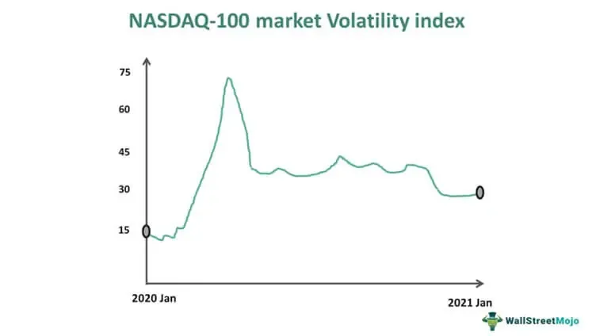

In the fast-paced world of financial markets, understanding and managing volatility is crucial for investors and traders. Volatility is a statistical measure of the dispersion of returns for a given security or market index. A higher volatility indicates a larger variation in values and a higher level of risk. This underpins the importance of tools that measure and predict market volatility, allowing market participants to make informed decisions.

The Cboe Volatility Index for the Nasdaq, also known as the VXN, is an invaluable tool for this purpose. It specifically measures market expectations of 30-day volatility for the Nasdaq 100 Index, which is predominantly composed of technology and growth-oriented companies. The VXN serves as a barometer for market sentiment, offering insights into the level of uncertainty or risk perceived by investors within a short time frame.



This article explores the concept of the Cboe Volatility Index, examining its role and significance in Nasdaq trading. Furthermore, it addresses how algorithmic trading leverages this index information for strategic advantage. Understanding these dynamics is essential for anyone looking to optimize trading strategies and manage risks effectively in the technology-driven Nasdaq market. By incorporating VXN data, traders and investors can enhance their decision-making process, adjusting their strategies in response to anticipated market fluctuations.

Algorithmic trading, a method that utilizes computer algorithms to execute trades at high speeds and frequencies, plays a significant role in today's financial markets. Traders and firms increasingly rely on sophisticated algorithms to interpret and act on real-time data. The integration of volatility indices like the VXN into these trading systems allows for the rapid adjustment of trading positions, optimizing trade execution in response to changing market conditions. As technology and the nature of financial markets continue to evolve, leveraging tools like the VXN remains vital for staying competitive and managing market uncertainties efficiently.

## Table of Contents

## Understanding the Cboe Nasdaq Volatility Index (VXN)

The Cboe Nasdaq Volatility Index, commonly known as VXN, is a pivotal tool in understanding market sentiment, specifically regarding the Nasdaq 100 Index. It provides real-time insights into the expected volatility of this index over the next 30 days. Originally introduced in 2001, the VXN was designed as a counterpart to the VIX, which is the volatility index for the S&P 500. 

The composition of the Nasdaq 100, which predominantly features large technology firms, makes the VXN especially sensitive to fluctuations in this sector. This characteristic allows the VXN to serve as a barometer for investor sentiment and perceived risk associated with the tech industry. When technology stocks exhibit significant price changes due to earnings reports, economic announcements, or industry-specific news, the VXN captures these changes, reflecting the market's collective expectations for future volatility.

To calculate the VXN, one considers a range of Nasdaq 100 options, applying mathematical models to assess anticipated economic conditions. The index is predominantly influenced by the prices of these options, which encapsulate traders' views on potential market fluctuations. The VXN is thus analogous to a "fear gauge," where higher values indicate increased market anxiety about potential drastic price movements, while lower values suggest a calmer market outlook. This makes it invaluable for traders and investors aiming to make informed decisions based on perceived [volatility](/wiki/volatility-trading-strategies).

## How the VXN Works

The Cboe Nasdaq Volatility Index (VXN) is constructed using the prices of Nasdaq 100 options, providing a forward-looking measure of expected market volatility over the next 30 days. This calculation is crucial for its role as a predictive tool in the financial markets.

The VXN is computed using a series of option prices that reflect the market's forecast of future volatility. The methodology involves several steps:

1. **Option Selection**: The index uses both call and put options on the Nasdaq 100 Index (NDX), focusing on those nearest to 30 days to expiration. This approach ensures that the measurement closely aligns with the designated forecasting period of 30 days.

2. **Weighted Average**: The model aggregates weighted prices of options across various strike prices. These prices are weighted to reflect their contribution to overall market variance expected by investors. The formula for calculating the VXN involves the concept of a variance swap, which uses the following:
$$
   \sigma^2 = \frac{2}{T} \sum_{i} \frac{\Delta K_i}{K_i^2} e^{RT} Q(K_i) - \frac{1}{T} \left(\frac{F}{K_0} - 1\right)^2

$$

   where:
   - $\sigma$ is the annualized volatility.
   - $T$ is the time to expiration.
   - $\Delta K_i$ is the interval between strike prices.
   - $K_i$ are the selected strike prices.
   - $e^{RT}$ is the risk-free interest rate component.
   - $Q(K_i)$ represents the midpoint between the bid and ask prices of each option with strike price $K_i$.
   - $F$ is the forward index level derived from the current NDX price and the risk-free interest rate.
   - $K_0$ is the first strike below the forward index level.

3. **Volatility Representation**: Once the variance is obtained, the VXN is derived by taking the square root of this variance, scaling it to reflect annualized volatility.

When the VXN value is high, it serves as an indicator that investors are expecting significant volatility in the Nasdaq 100 Index; this reflects a heightened level of uncertainty or risk in the market. Conversely, a lower VXN suggests a more stable market environment with less anticipated fluctuation.

Commonly referred to as a "fear gauge," the VXN reflects the market's collective nervousness or complacency specifically geared toward the technology sector. This makes it particularly relevant for investors and traders monitoring the tech-heavy Nasdaq 100, as it encapsulates market sentiment and expectations regarding upcoming price movements within this segment.

## Algorithmic Trading and its Role

Algorithmic trading, often referred to as algo trading, harnesses the power of computer algorithms to execute trades predicated on specific, pre-established criteria such as price, [volume](/wiki/volume-trading-strategy), and timing. This sophisticated method of trading leverages computational models to automate and optimize trade execution efficiently, mitigating the impact of human emotions and errors. By employing advanced statistical and mathematical models, algo trading assesses market conditions in real-time and executes trades with precision at high speeds.

Incorporating the Cboe Nasdaq Volatility Index (VXN) into [algorithmic trading](/wiki/algorithmic-trading) strategies presents a strategic advantage for traders seeking to adapt their positions based on anticipated market volatility. The VXN, which measures the projected 30-day volatility of the Nasdaq 100 Index, offers traders insights into market sentiment particularly within technology sectors. By analyzing changes in the VXN, algorithmic trading systems can preemptively adjust trading strategies to accommodate expected market behaviors, thereby optimizing trade execution processes.

For instance, algo trading systems can be programmed to buy or sell derivatives or equities in response to specific thresholds in the VXN. When the VXN indicates heightened market volatility, such algorithms might increase trading activities to capitalize on potential price swings, or conversely, when the VXN suggests stability, the systems might reduce trading frequency to minimize costs. This adaptability is crucial in fast-moving financial markets where timely decision-making can significantly influence profitability.

Moreover, the integration of VXN data into algorithmic models allows for automatic reactions to market changes far quicker than traditional trading methods. Unlike human traders, who may require time to analyze and act on data, algorithmic systems can process VXN inputs and execute corresponding trades within milliseconds. This capability not only enhances the efficiency of trade execution but also allows traders to maintain a competitive edge by swiftly responding to newly available information, balancing risk, and potential reward.

The following is an example of a simplified Python snippet illustrating how an algorithmic trading strategy might incorporate VXN data:

```python
import pandas as pd

# Hypothetical function to fetch VXN data (replace with actual data source)
def fetch_vxn_data():
    # Example dataset
    return pd.DataFrame({'Date': ['2023-10-01', '2023-10-02'],
                         'VXN': [20.5, 19.8]})

# Trading strategy based on VXN threshold
def trading_strategy(df):
    positions = []
    vxn_threshold = 20  # Example threshold for volatility
    for index, row in df.iterrows():
        if row['VXN'] > vxn_threshold:
            positions.append('Enter Long Position')  # Suggests anticipating price increase
        else:
            positions.append('Hold/Exit Position')  # Suggests lower market activity
    return positions

# Fetch the data and run the strategy
vxn_data = fetch_vxn_data()
print(trading_strategy(vxn_data))
```

This snippet demonstrates how a basic algorithm might alter trading positions based on modeled VXN values, showcasing the dynamic potential of integrating volatility indices in strategic trading frameworks.

## Benefits and Risks of Using VXN in Algo Trading

The integration of the Cboe Nasdaq Volatility Index (VXN) into algorithmic trading strategies offers the considerable advantage of enhanced risk management. By providing real-time insights into market sentiment, traders can better anticipate and react to changes in the Nasdaq 100 Index's volatility, which in turn optimizes decision-making and trade execution. VXN helps identify potential market fluctuations by capturing the market’s collective expectations, thereby allowing algorithms to adjust trading positions with greater precision.

However, there are inherent risks associated with relying solely on the VXN for trading algorithms. The index may not fully encapsulate all factors affecting volatility, such as unexpected geopolitical events, macroeconomic policy changes, or sudden technological advancements impacting the tech sector. These factors could lead to discrepancies between predicted and actual market volatility, potentially resulting in significant financial losses. Algorithms must therefore be designed with adaptability in mind, incorporating additional data sources to capture a comprehensive market view.

To illustrate, consider a simplified Python example where a trading algorithm uses the VXN to determine trading conditions:

```python
def assess_market_conditions(vxn_value, additional_factors):
    if vxn_value > 25 and additional_factors['news_sensitivity'] > 7:
        return "High Volatility - Reduce Positions"
    elif vxn_value < 15 and additional_factors['economic_stability'] > 5:
        return "Low Volatility - Increase Positions"
    else:
        return "Moderate Volatility - Hold Steady"

vxn_value = 23
additional_factors = {'news_sensitivity': 8, 'economic_stability': 6}

decision = assess_market_conditions(vxn_value, additional_factors)
print(decision)
```

In this scenario, the algorithm considers both the VXN value and other factors like news sensitivity and economic stability to make informed trading decisions. Balancing the advantages of automated responses with the necessity for human oversight is crucial. Traders retain a critical role in interpreting broader market contexts and adapting algorithmic strategies accordingly, thereby ensuring that decision-making remains robust in the face of unforeseen market dynamics.

Ultimately, while the VXN serves as a valuable component in risk management and trading efficiency, its integration needs cautious implementation and continual refinement to mitigate potential risks. Traders must remain vigilant in their analysis and interpretation, modifying algorithms as needed to reflect the complexities of the dynamic market environment.

## Conclusion

The Cboe Nasdaq Volatility Index (VXN) serves as an essential instrument for traders who are navigating the dynamic and unpredictable environment of the Nasdaq market, particularly in the technology sector. By offering insights into expected market volatility over a 30-day period, the VXN allows traders to better gauge investor sentiment and potential market movements. This understanding is particularly valuable for creating algorithmic trading strategies, where timely and informed decisions can significantly enhance trade efficiency and improve risk management.

When integrated into algorithmic trading systems, the VXN allows for more strategic trade execution. The ability to react automatically to changes in market conditions, as indicated by fluctuations in the VXN, enables traders to optimize their positions based on evolving volatility expectations. This not only reduces the time lag associated with manual trading methods but also enhances the precision and consistency of trading decisions, ultimately contributing to a more robust trading performance.

As the landscape of technology and financial markets continues to transform, leveraging indices like the VXN will remain critical for maintaining a competitive edge. The pace of technological advancements demands that traders and financial strategists incorporate sophisticated tools and metrics to stay ahead of market shifts. The VXN, with its focus on the tech-driven Nasdaq 100, offers a sharpened lens through which traders can plan and execute their strategies, ensuring they are well-positioned to capitalize on market opportunities while mitigating potential risks. In summary, the effective use of the VXN in trading strategies is not just a matter of improving current practices but is also a forward-looking approach essential for thriving in an ever-evolving market landscape.

## References & Further Reading

[1]: Whaley, R. E. (2000). ["The Investor Fear Gauge."](https://www.semanticscholar.org/paper/The-Investor-Fear-Gauge-Whaley/37ea262fb99beb8bf9dcb8406400d491aab40a0b) The Journal of Portfolio Management, 26(3), 12-17.

[2]: Black, F., & Scholes, M. (1973). ["The Pricing of Options and Corporate Liabilities."](https://www.cs.princeton.edu/courses/archive/fall09/cos323/papers/black_scholes73.pdf) Journal of Political Economy, 81(3), 637-654.

[3]: Hull, J. C. (2018). ["Options, Futures, and Other Derivatives"](https://www.semanticscholar.org/paper/Options%2C-Futures%2C-and-Other-Derivatives-Hull/89bdee500c8623864fc9eb7a471546aa713acc44) (10th Edition). Pearson.

[4]: Gatheral, J. (2006). ["The Volatility Surface: A Practitioner's Guide."](https://onlinelibrary.wiley.com/doi/book/10.1002/9781119202073)+-p-9780471792512) Wiley Finance.

[5]: Lopez de Prado, M. (2018). ["Advances in Financial Machine Learning."](https://www.amazon.com/Advances-Financial-Machine-Learning-Marcos/dp/1119482089) Wiley.

[6]: Chan, E. (2009). ["Quantitative Trading: How to Build Your Own Algorithmic Trading Business."](https://github.com/ftvision/quant_trading_echan_book) Wiley.

[7]: Sinclair, E. (2013). ["Volatility Trading."](https://onlinelibrary.wiley.com/doi/book/10.1002/9781118662724) Wiley.