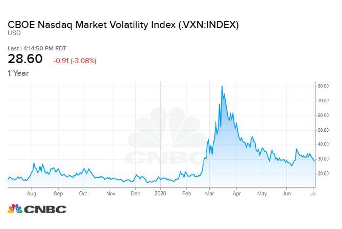

## Table of Contents

## What is the Cboe Nasdaq Volatility Index (VXN)?

The Cboe Nasdaq Volatility Index, often referred to as VXN, is a measure of the market's expectation of volatility over the next 30 days for the Nasdaq-100 Index. It's like a thermometer for the stock market's nervousness, specifically for the tech-heavy Nasdaq-100. The VXN is calculated using the prices of options on the Nasdaq-100 Index, which are financial instruments that give investors the right to buy or sell the index at a specific price.

The VXN can be thought of as a fear gauge for the Nasdaq-100. When the VXN goes up, it means investors are expecting bigger swings in the Nasdaq-100's value, which often happens during times of uncertainty or bad news. On the other hand, when the VXN goes down, it suggests that investors are feeling calmer and expecting smaller changes in the index's value. This index is useful for investors who want to understand the market's mood and make decisions based on expected volatility.

## How is the VXN calculated?

The VXN is figured out by looking at the prices of options on the Nasdaq-100 Index. Options are like bets on where the index will go in the future. The VXN uses a special math formula called the VIX methodology to turn these option prices into a number that shows how much the market expects the Nasdaq-100 to move around in the next 30 days. This formula looks at the prices of both call options, which bet on the index going up, and put options, which bet on it going down.

The VXN calculation involves [picking](/wiki/asset-class-picking) out a range of options that are close to the current price of the Nasdaq-100. These options are then used to find out how much it would cost to make a bet that would pay off if the index moved a lot in either direction. This cost is what turns into the VXN number. The higher the cost, the higher the VXN, which means the market thinks the Nasdaq-100 will be more jumpy in the next month.

## What does the VXN measure?

The VXN, or Cboe Nasdaq Volatility Index, measures how much people expect the Nasdaq-100 Index to move around in the next 30 days. It's like a guess about how calm or wild the stock market, especially the tech part of it, will be. The VXN looks at the prices of options, which are bets on where the Nasdaq-100 will go, to figure out this guess.

When the VXN number goes up, it means people think the Nasdaq-100 will have bigger ups and downs soon. This usually happens when there's bad news or uncertainty in the market. If the VXN number goes down, it means people expect the Nasdaq-100 to stay pretty steady, which suggests they feel more relaxed about the market. So, the VXN is a useful tool for investors who want to know how nervous or calm the market feels about the tech stocks in the Nasdaq-100.

## How does the VXN differ from the VIX?

The VXN and the VIX are both like thermometers for the stock market, but they check the temperature of different parts. The VXN looks at the Nasdaq-100 Index, which is full of tech companies, to see how much people expect it to move around in the next 30 days. On the other hand, the VIX focuses on the S&P 500 Index, which is a bigger mix of companies from different industries. So, while the VXN is all about tech and innovation, the VIX gives a broader picture of the whole market's mood.

Both indexes use the same math trick to turn option prices into a number that shows expected movement, but they use different options. The VXN uses options on the Nasdaq-100, while the VIX uses options on the S&P 500. This means that if you're interested in how jittery the tech world is feeling, you'd look at the VXN. But if you want to know about the overall market's nerves, the VIX is your go-to. They both help investors understand and maybe even predict how wild the market might get, but they do it for different slices of the stock world.

## Why is the VXN important for investors?

The VXN is important for investors because it helps them understand how much the Nasdaq-100, which is full of tech companies, might move around in the next month. If the VXN number is high, it means people think the Nasdaq-100 will have big ups and downs soon. This can be a warning sign for investors to be careful or maybe even change their plans. On the other hand, if the VXN number is low, it suggests that the market expects the Nasdaq-100 to stay pretty steady, which might make investors feel more confident about their investments.

Investors can use the VXN to make smarter choices. For example, if the VXN is high, an investor might decide to buy options to protect their investments from big drops in the Nasdaq-100. Or, they might choose to wait and see what happens before making new investments. By keeping an eye on the VXN, investors can get a sense of the market's mood and adjust their strategies to match, especially if they're focused on tech stocks.

## How can the VXN be used to gauge market sentiment?

The VXN helps investors understand how people feel about the tech part of the stock market. It's like a mood ring for the Nasdaq-100, which is full of tech companies. When the VXN number is high, it means people are expecting big changes in the Nasdaq-100 soon. This usually happens when there's a lot of uncertainty or bad news, and it shows that investors are feeling nervous or scared. On the other hand, when the VXN number is low, it means people think the Nasdaq-100 will stay pretty calm. This suggests that investors are feeling more relaxed and confident about the market.

By watching the VXN, investors can get a sense of whether the market is feeling jittery or calm about tech stocks. If the VXN goes up, it's a sign that investors might want to be careful or take steps to protect their investments from big swings. If the VXN goes down, it might be a good time for investors to feel more confident about making new investments in tech. So, the VXN is a useful tool for anyone trying to figure out the mood of the market and make smarter investment choices based on how much people expect the Nasdaq-100 to move around.

## What are the historical trends of the VXN?

The VXN, which measures how much people expect the Nasdaq-100 to move around in the next month, has had some big ups and downs over the years. During calm times, like when the economy is doing well and there's not much bad news, the VXN tends to stay low. For example, in the late 1990s, during the dot-com boom, the VXN was often in the low 20s or even teens, showing that people were feeling pretty good about tech stocks. But when things get shaky, like during the dot-com crash in the early 2000s or the financial crisis in 2008, the VXN can jump way up. During those times, it sometimes hit the 40s or 50s, showing that investors were really worried about big changes in the Nasdaq-100.

More recently, the VXN has shown some interesting patterns. During the calm before the COVID-19 pandemic in early 2020, the VXN was hovering around the low 20s, much like other stable periods. But when the pandemic hit and caused a lot of uncertainty, the VXN spiked to over 80, which was one of the highest levels ever recorded. This showed how scared investors were about the future of tech stocks during that time. Since then, as things have gotten a bit more stable, the VXN has come back down but still shows occasional spikes when there's new uncertainty or bad news affecting the tech sector.

## How does the VXN correlate with the Nasdaq-100 Index?

The VXN and the Nasdaq-100 Index are like two sides of the same coin. The VXN shows how much people expect the Nasdaq-100 to move around in the next month, while the Nasdaq-100 is the actual group of tech stocks that people are betting on. When the Nasdaq-100 goes through big changes, like big drops or jumps, the VXN usually goes up. This is because when the Nasdaq-100 is moving a lot, people expect it to keep moving a lot, so they're willing to pay more for options that bet on those big moves.

On the other hand, when the Nasdaq-100 is calm and not changing much, the VXN tends to stay low. This means that people expect the Nasdaq-100 to keep being calm, so they're not as interested in buying options that bet on big moves. So, the VXN and the Nasdaq-100 often move together, but in opposite ways: when the Nasdaq-100 is jumpy, the VXN goes up, and when the Nasdaq-100 is steady, the VXN goes down. This relationship helps investors understand how nervous or calm the market is about tech stocks.

## What are the implications of a high VXN reading?

When the VXN number is high, it means people think the Nasdaq-100, which is full of tech companies, will have big ups and downs soon. This usually happens when there's a lot of uncertainty or bad news in the market. Investors might get nervous and start to worry about their investments. A high VXN can be a warning sign for investors to be careful. They might decide to buy options to protect their investments from big drops in the Nasdaq-100, or they might choose to wait and see what happens before making new investments.

A high VXN also shows that people are willing to pay more for options, which are bets on where the Nasdaq-100 will go. This is because when the market is expecting big moves, options that bet on those moves become more valuable. So, a high VXN can lead to more trading in options and might even affect the prices of the stocks in the Nasdaq-100. Investors who watch the VXN can use it to understand the market's mood and make smarter choices about their investments, especially if they're focused on tech stocks.

## How can traders use the VXN for hedging strategies?

Traders can use the VXN to protect their investments from big drops in the Nasdaq-100 by using a strategy called hedging. When the VXN is high, it means people expect the Nasdaq-100 to move a lot in the next month. This is a good time for traders to buy options that will pay off if the Nasdaq-100 goes down. These options, called put options, act like insurance for their investments. By buying put options, traders can limit how much money they might lose if the Nasdaq-100 drops a lot.

Another way traders use the VXN for hedging is by adjusting their investments based on how nervous or calm the market feels. If the VXN is high, showing a lot of expected movement, traders might decide to sell some of their Nasdaq-100 stocks or move their money into safer investments. This way, they can reduce the risk of losing money if the market gets wild. By keeping an eye on the VXN, traders can make smart moves to protect their investments from big ups and downs in the tech-heavy Nasdaq-100.

## What are the limitations of the VXN as a volatility measure?

The VXN is a great tool for understanding how much people expect the Nasdaq-100 to move around, but it has some limits. One big limit is that it only looks at options on the Nasdaq-100, so it doesn't tell you about other parts of the market. If other indexes or stocks are acting differently, the VXN won't show that. Also, the VXN is based on what people think will happen in the next month, so it might not be right if things change quickly or if people's guesses are off.

Another thing to remember is that the VXN can be affected by things like how many options are being traded or how much people are willing to pay for them. If there's not a lot of trading going on, the VXN might not give a good picture of what's really happening. And sometimes, big moves in the VXN can be caused by just a few traders making big bets, not by what most people think. So, while the VXN is helpful, it's not perfect and should be used with other tools to get a full picture of the market's mood.

## How can advanced statistical models enhance the interpretation of the VXN?

Advanced statistical models can help make the VXN more useful by looking at more than just the number itself. These models can take into account things like how the VXN has changed over time, how it compares to other [volatility](/wiki/volatility-trading-strategies) measures, and even how it might be affected by news or events. By using these models, investors can get a better idea of what the VXN is really telling them about the market's mood. For example, a model might show that a high VXN today is more or less important than it was in the past, depending on other factors.

These models can also help predict what might happen next with the VXN and the Nasdaq-100. By looking at patterns and trends, statistical models can give investors a heads-up about when the VXN might go up or down. This can be really helpful for making decisions about buying or selling options or adjusting investments. So, while the VXN gives a snapshot of expected volatility, advanced statistical models can turn that snapshot into a clearer, more detailed picture of what's going on and what might happen next.

## How does the VXN work?

The Cboe Nasdaq Volatility Index (VXN) is constructed using the prices of Nasdaq 100 options, providing a forward-looking measure of expected market volatility over the next 30 days. This calculation is crucial for its role as a predictive tool in the financial markets.

The VXN is computed using a series of option prices that reflect the market's forecast of future volatility. The methodology involves several steps:

1. **Option Selection**: The index uses both call and put options on the Nasdaq 100 Index (NDX), focusing on those nearest to 30 days to expiration. This approach ensures that the measurement closely aligns with the designated forecasting period of 30 days.

2. **Weighted Average**: The model aggregates weighted prices of options across various strike prices. These prices are weighted to reflect their contribution to overall market variance expected by investors. The formula for calculating the VXN involves the concept of a variance swap, which uses the following:
$$
   \sigma^2 = \frac{2}{T} \sum_{i} \frac{\Delta K_i}{K_i^2} e^{RT} Q(K_i) - \frac{1}{T} \left(\frac{F}{K_0} - 1\right)^2

$$

   where:
   - $\sigma$ is the annualized volatility.
   - $T$ is the time to expiration.
   - $\Delta K_i$ is the interval between strike prices.
   - $K_i$ are the selected strike prices.
   - $e^{RT}$ is the risk-free interest rate component.
   - $Q(K_i)$ represents the midpoint between the bid and ask prices of each option with strike price $K_i$.
   - $F$ is the forward index level derived from the current NDX price and the risk-free interest rate.
   - $K_0$ is the first strike below the forward index level.

3. **Volatility Representation**: Once the variance is obtained, the VXN is derived by taking the square root of this variance, scaling it to reflect annualized volatility.

When the VXN value is high, it serves as an indicator that investors are expecting significant volatility in the Nasdaq 100 Index; this reflects a heightened level of uncertainty or risk in the market. Conversely, a lower VXN suggests a more stable market environment with less anticipated fluctuation.

Commonly referred to as a "fear gauge," the VXN reflects the market's collective nervousness or complacency specifically geared toward the technology sector. This makes it particularly relevant for investors and traders monitoring the tech-heavy Nasdaq 100, as it encapsulates market sentiment and expectations regarding upcoming price movements within this segment.

## References & Further Reading

[1]: Whaley, R. E. (2000). ["The Investor Fear Gauge."](https://www.semanticscholar.org/paper/The-Investor-Fear-Gauge-Whaley/37ea262fb99beb8bf9dcb8406400d491aab40a0b) The Journal of Portfolio Management, 26(3), 12-17.

[2]: Black, F., & Scholes, M. (1973). ["The Pricing of Options and Corporate Liabilities."](https://www.cs.princeton.edu/courses/archive/fall09/cos323/papers/black_scholes73.pdf) Journal of Political Economy, 81(3), 637-654.

[3]: Hull, J. C. (2018). ["Options, Futures, and Other Derivatives"](https://www.semanticscholar.org/paper/Options%2C-Futures%2C-and-Other-Derivatives-Hull/89bdee500c8623864fc9eb7a471546aa713acc44) (10th Edition). Pearson.

[4]: Gatheral, J. (2006). ["The Volatility Surface: A Practitioner's Guide."](https://onlinelibrary.wiley.com/doi/book/10.1002/9781119202073)+-p-9780471792512) Wiley Finance.

[5]: Lopez de Prado, M. (2018). ["Advances in Financial Machine Learning."](https://www.amazon.com/Advances-Financial-Machine-Learning-Marcos/dp/1119482089) Wiley.

[6]: Chan, E. (2009). ["Quantitative Trading: How to Build Your Own Algorithmic Trading Business."](https://github.com/ftvision/quant_trading_echan_book) Wiley.

[7]: Sinclair, E. (2013). ["Volatility Trading."](https://onlinelibrary.wiley.com/doi/book/10.1002/9781118662724) Wiley.