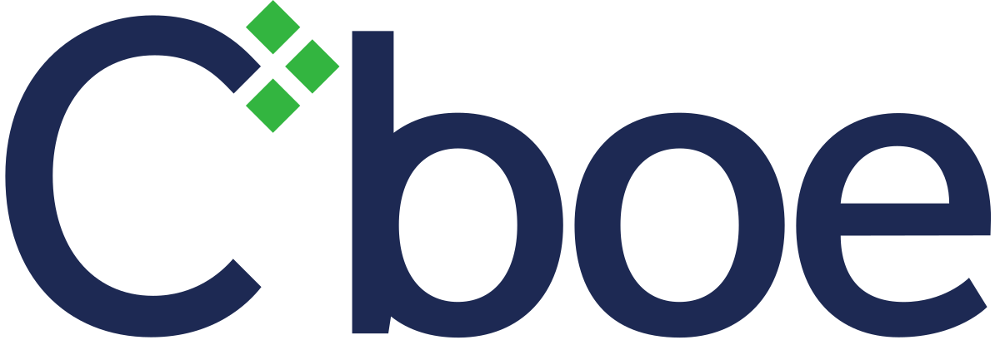

## Table of Contents

## What is the CBOE Options Exchange?

The CBOE Options Exchange, often just called CBOE, is a place where people can buy and sell options. Options are special kinds of contracts that give you the right, but not the obligation, to buy or sell a stock at a certain price before a certain date. The CBOE was the first place in the world to start trading these options, and it began in 1973. It's located in Chicago and is a big part of the financial world because it helps people manage risk and invest in different ways.

The CBOE is important because it offers a lot of different options for stocks, indexes, and even things like interest rates and commodities. This variety helps traders and investors find the right tools for their needs. The exchange also makes sure that trading is fair and safe by setting rules and using technology to watch over the market. This helps keep the market working smoothly and builds trust among the people who use it.

## When was the CBOE Options Exchange founded?

The CBOE Options Exchange was founded in 1973. It was the first place in the world where people could trade options. Options are special contracts that let you buy or sell a stock at a set price before a certain date.

The CBOE is in Chicago and is a big part of the financial world. It helps people manage risk and invest in different ways. The exchange offers many kinds of options for stocks, indexes, and other things. It also makes sure trading is fair and safe by setting rules and using technology to watch the market.

## What types of options are traded on the CBOE?

The CBOE trades many types of options. These include options on stocks, which let you buy or sell a specific company's stock at a set price before a certain date. They also trade options on stock indexes, like the S&P 500, which let you bet on how a group of stocks will do. Another type is options on exchange-traded funds (ETFs), which are like baskets of stocks that you can trade like a single stock.

Besides these, the CBOE also offers options on things like interest rates and commodities. Interest rate options help people bet on how interest rates will change, which can be important for banks and investors. Commodity options let you bet on the price of things like gold or oil. All these different types of options give traders and investors a lot of choices to manage their risks and try to make money.

The CBOE makes sure that trading all these options is fair and safe. They use rules and technology to watch the market and make sure everyone follows the rules. This helps keep the market working smoothly and builds trust among the people who use it.

## How does one start trading on the CBOE?

To start trading on the CBOE, you first need to open an account with a brokerage firm that has access to the CBOE. This means finding a broker who lets you trade options. Once you have an account, you'll need to fill out some forms and provide information about yourself. This is to make sure you understand the risks of trading options. After your account is set up, you might need to deposit money into it to start trading.

Once your account is ready, you can start trading. You'll use the broker's trading platform to buy and sell options. The CBOE offers many types of options, so you can choose the ones that fit your goals. It's a good idea to learn about different strategies and maybe even practice with a demo account before you start using real money. Remember, trading options can be risky, so it's important to do your research and maybe talk to a financial advisor.

## What are the trading hours for the CBOE?

The CBOE has regular trading hours and also extended trading hours. The regular trading hours are from 9:30 AM to 4:15 PM Eastern Time, Monday through Friday. These hours match the normal trading times for the stock market, so you can trade options on stocks and indexes during this time.

There are also extended trading hours at the CBOE. These hours let you trade certain options before and after the regular market hours. The pre-market session runs from 8:15 AM to 9:15 AM Eastern Time, and the after-hours session goes from 4:15 PM to 5:00 PM Eastern Time. This gives you more chances to trade, but remember that trading outside regular hours can be riskier because there might be less activity in the market.

## What are some popular indices and products offered by the CBOE?

The CBOE offers many popular indices and products that people like to trade. One of the most well-known is the CBOE Volatility Index, or VIX. The VIX is often called the "fear gauge" because it measures how much people expect the stock market to move around in the next 30 days. Another popular index is the S&P 500 Index, which tracks the performance of 500 large companies in the U.S. People can trade options on these indices to bet on how the market will do.

Besides indices, the CBOE also offers options on exchange-traded funds (ETFs). ETFs are like baskets of stocks that you can trade like a single stock. Some popular ETFs that you can trade options on at the CBOE include the SPDR S&P 500 [ETF](/wiki/etf-trading-strategies) (SPY) and the Invesco QQQ Trust (QQQ), which tracks the Nasdaq-100 Index. These products give traders and investors lots of ways to manage their risks and try to make money.

## How does the CBOE ensure fair trading practices?

The CBOE makes sure trading is fair by setting strict rules that everyone has to follow. They watch the market all the time using special technology to see if anyone is doing anything wrong. If someone breaks the rules, the CBOE can punish them, like by fining them or stopping them from trading. This helps keep the market honest and fair for everyone.

The CBOE also works with other groups, like the Securities and Exchange Commission (SEC), to make sure the rules are strong and up to date. They often check their systems to make sure they are working right and that no one can cheat. By doing all these things, the CBOE helps make sure that people can trust the market and feel safe when they trade.

## What are the fees associated with trading on the CBOE?

When you trade on the CBOE, you'll have to pay some fees. There are two main types of fees: transaction fees and regulatory fees. Transaction fees are what the CBOE charges for each trade you make. These fees can be different depending on the type of option you're trading and how much you're trading. Your broker might also add their own fees on top of what the CBOE charges.

Regulatory fees are another type of fee you might have to pay. These fees help cover the costs of making sure the market is fair and safe. The CBOE and other groups like the SEC use these fees to watch over the market and make sure everyone follows the rules. The exact amount of these fees can change, so it's a good idea to check with your broker to see what you'll have to pay.

## Can you explain the role of market makers on the CBOE?

Market makers on the CBOE play an important role in keeping the market running smoothly. They are special traders who are always ready to buy or sell options. This means that when you want to trade, there's always someone there to trade with you. Market makers help make sure there's enough activity in the market, which makes it easier for everyone to buy and sell options.

Market makers also help keep the prices of options fair. They do this by giving both a buying price and a selling price for options. The difference between these two prices is called the "bid-ask spread." By keeping this spread small, market makers help make sure that people can trade options at fair prices. This is important because it builds trust in the market and makes it a good place for people to trade.

## What advanced trading strategies can be implemented on the CBOE?

The CBOE allows for many advanced trading strategies that help traders manage risk and try to make money. One popular strategy is called a "straddle." With a straddle, you buy both a call option and a put option on the same stock at the same strike price and expiration date. This lets you make money if the stock price moves a lot in either direction. Another strategy is a "strangle," which is similar but uses different strike prices for the call and put options. This can be a good choice if you think the stock will move a lot but you're not sure which way.

Another advanced strategy is called a "butterfly spread." This involves buying and selling options at three different strike prices. It can help you make money if the stock price stays close to the middle strike price. A "condor spread" is similar but uses four different strike prices, giving you a wider range where you can make money. These strategies can be complex, but they offer ways to manage risk and aim for profits in different market conditions. It's important to understand these strategies well before using them, as they can be risky if not used correctly.

## How does the CBOE's volatility index (VIX) work?

The CBOE's Volatility Index, or VIX, is a tool that shows how much people expect the stock market to move around over the next 30 days. It's often called the "fear gauge" because it goes up when people are worried about the market and expect big changes. The VIX is calculated using the prices of options on the S&P 500 index. These options show what traders think the market might do, and the VIX uses this information to give a number that shows the expected [volatility](/wiki/volatility-trading-strategies).

When the VIX is high, it means people are expecting a lot of ups and downs in the market, which usually happens during times of uncertainty or bad news. On the other hand, a low VIX means people are expecting the market to stay pretty calm. Traders and investors use the VIX to help them make decisions about their investments. For example, they might buy options to protect their investments if they think the VIX is going to go up, or they might see a low VIX as a good time to take more risks.

## What impact does the CBOE have on global financial markets?

The CBOE has a big impact on global financial markets because it's one of the biggest places in the world where people can trade options. Options are special contracts that let you buy or sell stocks at a set price before a certain date. Since the CBOE was the first place to start trading these options in 1973, it has helped create a whole new way for people to invest and manage risk. The CBOE's products, like options on stocks, indexes, and other things, are used by people all over the world. This means that what happens at the CBOE can affect how people around the globe think about the market and make their investment choices.

The CBOE also helps keep the global financial markets stable and fair. They use strict rules and special technology to watch over trading and make sure no one is cheating. This helps build trust in the market, which is important for people to feel safe when they invest. The CBOE's Volatility Index, or VIX, is another way they affect global markets. The VIX, often called the "fear gauge," shows how much people expect the market to move around. When the VIX goes up or down, it can change how people around the world feel about the market and what they do with their money.

## What is the Role of the VIX Volatility Index?

The VIX Volatility Index, launched by the CBOE in 1993, has emerged as a fundamental tool for assessing market sentiment and investor expectations of volatility over the subsequent 30 days. Known colloquially as the "fear index", the VIX captures the market's anticipated short-term fluctuations and serves as a critical benchmark for gauging market sentiment. The index has become a cornerstone for trading strategies, offering valuable insights that influence decision-making processes across financial markets.

By measuring the implied volatility of S&P 500 index options, the VIX provides a numerical value that predicts how much the market is expected to move, on an annualized basis, within the next month. It is calculated using a wide range of S&P 500 option prices, thereby reflecting the consensus view of future volatility. The formula incorporates both calls and puts, ensuring a comprehensive measure of expected volatility. Specifically, the VIX can be expressed as:

$$
VIX = 100 \times \sqrt{\frac{2}{\pi} \sum_{i} \frac{\Delta K_i}{K_i^2} e^{rt}Q(K_i)}
$$

where $\Delta K_i$ is the interval between strike prices, $K_i$ is the strike price of the ith option, $r$ is risk-free interest rate, $t$ is time to expiration, and $Q(K_i)$ represents the price of the option.

The profound influence of the VIX is seen in its role as a benchmark for a wide array of volatility-related products and financial derivatives. These products, including VIX futures and options, allow traders to hedge against volatility spikes or capitalize on anticipated changes in market volatility. By offering a platform for volatility trading, the VIX enables sophisticated trading strategies that aim to mitigate risk or exploit volatility-driven opportunities. The global integration of VIX-based instruments into diverse financial strategies underscores its significance in navigating market complexities.

Trading in VIX-linked products allows for diversified portfolio management strategies, as traders use these instruments for both speculative purposes and risk management. For instance, during times of economic uncertainty or market stress, investors often turn to the VIX as a protective measure to safeguard their portfolios against downside risks. As such, the VIX and its associated products are not only vital for understanding market sentiment but also serve as essential tools for financial resilience and strategy formulation across the globe.

## References & Further Reading

[1]: ["The Options Clearing Corporation (OCC) - About."](https://www.theocc.com/Company-Information/What-Is-OCC) The Options Clearing Corporation.

[2]: Whaley, R. E. (2009). ["Understanding the VIX"](https://www.researchgate.net/publication/277429711_Understanding_the_VIX). The Journal of Portfolio Management, 35(3), 98-105.

[3]: ["CBOE Global Markets - History."](https://en.wikipedia.org/wiki/Cboe_Global_Markets) CBOE Global Markets.

[4]: Aldridge, I. (2013). ["High-Frequency Trading: A Practical Guide to Algorithmic Strategies and Trading Systems"](https://onlinelibrary.wiley.com/doi/pdf/10.1002/9781119203803.fmatter). Wiley.

[5]: Chance, D. M., & Brooks, R. (2015). ["An Introduction to Derivatives and Risk Management"](https://books.google.com/books/about/Introduction_to_Derivatives_and_Risk_Man.html?id=b8PgBQAAQBAJ) (10th ed.). Cengage Learning.