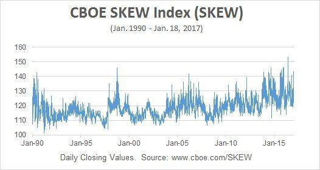

## Table of Contents

## What is the Cboe SKEW Index?

The Cboe SKEW Index, often just called SKEW, is a measure that shows how worried investors are about big stock market drops. It looks at options on the S&P 500, which is a big group of stocks. When the SKEW is high, it means investors are more scared of a huge drop in the market. When it's low, they are less worried about a big fall.

The SKEW is different from the VIX, another measure of market fear, because it focuses on the tails of the distribution, or the extreme events. The VIX looks at expected volatility, but the SKEW looks at the chance of a really big move, not just the normal ups and downs. This makes the SKEW a useful tool for investors who want to understand the risk of rare but severe market events.

## How is the Cboe SKEW Index calculated?

The Cboe SKEW Index is calculated using the prices of out-of-the-money S&P 500 options. These are options that are far away from the current stock price. The SKEW looks at how much people are willing to pay for these options, which shows how worried they are about big moves in the market. The index uses a special formula that takes the prices of these options and turns them into a number. This number tells us how likely investors think a big drop in the market is.

The calculation involves comparing the prices of these out-of-the-money options to a normal distribution of stock prices. If the prices are higher than what a normal distribution would predict, it means investors are paying more to protect against big drops, and the SKEW goes up. The SKEW is set up so that a reading of 100 means the market is expecting a normal distribution of returns. If the SKEW is higher than 100, it means investors are more worried about big drops than usual.

## What does the SKEW Index measure in the stock market?

The SKEW Index measures how worried investors are about big drops in the stock market. It looks at the prices of special options that are far away from the current stock price. These options are called out-of-the-money options. If people are willing to pay a lot for these options, it means they are scared of a big drop in the market.

The SKEW Index is different from other measures like the VIX, which looks at expected ups and downs in the market. The SKEW focuses on the chance of really big moves, not just the normal ups and downs. A higher SKEW number means investors are more worried about a huge drop happening, even if it's rare. A lower SKEW number means they are less worried about these big drops.

## How does the SKEW Index differ from the VIX Index?

The SKEW Index and the VIX Index both measure fear in the stock market, but they look at different things. The VIX, also known as the "Fear Gauge," measures how much the market expects the S&P 500 to go up and down in the next 30 days. It uses the prices of options that are close to the current stock price to figure this out. So, the VIX is all about the normal ups and downs that investors expect.

On the other hand, the SKEW Index focuses on the chance of really big moves in the market, especially big drops. It looks at the prices of options that are far away from the current stock price. These are called out-of-the-money options. If people are willing to pay a lot for these options, it means they are scared of a huge drop in the market, even if it's rare. So, while the VIX is about normal [volatility](/wiki/volatility-trading-strategies), the SKEW is about the fear of extreme events.

## What is considered a high or low value for the SKEW Index?

The SKEW Index is set up so that a reading of 100 means the market is expecting a normal distribution of returns. This is the baseline, and it means investors are not particularly worried about big drops in the market. When the SKEW Index goes above 100, it means investors are more worried than usual about the chance of a big drop. The higher the SKEW Index goes above 100, the more worried investors are.

A high value for the SKEW Index is usually considered to be anything over 120. When it gets this high, it means investors are very scared of a huge drop in the market, even if it's rare. On the other hand, a low value for the SKEW Index would be below 110. When it's this low, it means investors are not as worried about big drops in the market.

## Can the SKEW Index predict stock market crashes?

The SKEW Index can give us a hint about how worried investors are about big drops in the stock market. It looks at special options that people buy to protect against huge falls. If the SKEW Index is high, it means investors are scared and think a big drop might happen, even if it's rare. But the SKEW Index doesn't say exactly when or if a crash will happen. It's more like a warning sign that tells us people are worried.

Even though the SKEW Index can't predict crashes for sure, it's still useful. When the SKEW Index goes above 120, it means investors are very scared. This can be a good time for investors to be careful and maybe protect their money. But remember, the stock market can be hard to predict, and the SKEW Index is just one tool to help us understand what might happen.

## How can investors use the SKEW Index in their trading strategies?

Investors can use the SKEW Index to understand how scared other investors are about big drops in the stock market. If the SKEW Index is high, it means a lot of people are worried about a huge fall, even if it's rare. This can be a signal for investors to be careful. They might want to buy options that protect their money if the market goes down a lot. Or they might decide to sell some of their stocks to avoid losing too much if a crash happens.

On the other hand, if the SKEW Index is low, it means investors are not as worried about big drops. This could be a good time for investors to take more risks. They might want to buy more stocks or options that will make money if the market stays calm or goes up. But it's important to remember that the SKEW Index is just one tool. It can't predict the future for sure, so investors should use it along with other information to make their decisions.

## What historical events have significantly affected the SKEW Index?

The SKEW Index has been influenced by several major events over the years. One big event was the financial crisis in 2008. During this time, the SKEW Index went up a lot because investors were very scared of big drops in the market. They were worried about banks failing and the economy getting worse. The high SKEW showed that people were buying a lot of options to protect themselves from a huge fall in the stock market.

Another event that affected the SKEW Index was the COVID-19 pandemic in 2020. When the virus started spreading around the world, the stock market dropped a lot. This made the SKEW Index go up because investors were very worried about even bigger drops. They were buying options to protect their money if the market crashed even more. The SKEW Index stayed high for a while until things started to get better and the market calmed down.

## How accurate is the SKEW Index as a predictor of market volatility?

The SKEW Index is not a perfect predictor of market volatility, but it can give investors a good idea about how scared people are of big drops in the stock market. It looks at the prices of special options that people buy to protect against huge falls. If the SKEW Index is high, it means a lot of investors are worried about a big drop happening, even if it's rare. But just because the SKEW Index is high doesn't mean a crash will happen for sure. It's more like a warning sign that tells investors to be careful.

Even though the SKEW Index can't predict the future exactly, it's still a useful tool. It can help investors understand how other people feel about the market. For example, during big events like the 2008 financial crisis or the 2020 COVID-19 pandemic, the SKEW Index went up a lot because people were very scared. Investors can use this information to make better decisions, like buying options to protect their money or being more careful with their investments. But it's important to use the SKEW Index along with other information because no single tool can predict the stock market perfectly.

## What are the limitations of using the SKEW Index for market predictions?

The SKEW Index can give investors a hint about how worried people are about big drops in the stock market, but it has some limitations. First, the SKEW Index doesn't tell us exactly when a big drop will happen. It just shows that people are scared and think a big drop might happen, even if it's rare. So, investors can't use it to predict the future for sure. They can only use it as a warning sign to be careful.

Another limitation is that the SKEW Index looks at the prices of special options, but it doesn't consider other important things that can affect the market. Things like economic reports, world events, and company news can also make the market go up or down. The SKEW Index doesn't take these into account, so it can't give a complete picture of what might happen. Investors need to use other tools and information along with the SKEW Index to make good decisions.

## How do professional traders interpret changes in the SKEW Index?

Professional traders watch the SKEW Index to understand how scared other investors are about big drops in the stock market. If the SKEW Index goes up, it means more people are worried about a huge fall. Traders might see this as a sign to be careful. They could buy options to protect their money if the market crashes. Or they might decide to sell some of their stocks to avoid losing too much if a big drop happens. The SKEW Index is like a warning light that tells traders to pay attention and maybe take action to protect their investments.

But traders also know that the SKEW Index has its limits. It doesn't predict exactly when a big drop will happen. It just shows that people are scared and think a big drop might happen, even if it's rare. So, traders don't rely only on the SKEW Index. They use it along with other tools and information, like economic reports and world events, to get a better picture of what might happen in the market. This way, they can make smarter decisions and be ready for whatever the market does next.

## What advanced statistical methods can be used to analyze the predictive power of the SKEW Index?

To analyze how well the SKEW Index can predict big drops in the stock market, researchers can use something called regression analysis. This method helps them see if high SKEW numbers are linked to big market drops later on. They can look at lots of past data to see if a high SKEW Index today means a big drop is more likely to happen soon. Another useful tool is time series analysis, which looks at how the SKEW Index changes over time. This can help spot patterns and trends that might tell us when a big drop is coming.

Another advanced method is [machine learning](/wiki/machine-learning). This can be used to build models that predict market crashes by looking at the SKEW Index along with other data, like economic reports and world events. Machine learning can find complex patterns that might be hard for people to see. It can also learn from past mistakes to make better predictions in the future. But even with these fancy methods, it's important to remember that the SKEW Index is just one piece of the puzzle. It can't predict the future for sure, but it can help us understand how scared investors are about big drops in the market.

## References & Further Reading

[1]: ["The Cboe SKEW Index"](https://www.cboe.com/us/indices/dashboard/skew/) - Cboe Global Markets.

[2]: Black, F., & Scholes, M. (1973). ["The Pricing of Options and Corporate Liabilities"](https://www.cs.princeton.edu/courses/archive/fall09/cos323/papers/black_scholes73.pdf). Journal of Political Economy, 81(3), 637-654.

[3]: Taleb, N. N. (2007). ["The Black Swan: The Impact of the Highly Improbable"](https://archive.org/details/10.1.1.695.4305).

[4]: Hull, J. C. (2018). ["Options, Futures, and Other Derivatives"](https://www.semanticscholar.org/paper/Options%2C-Futures%2C-and-Other-Derivatives-Hull/89bdee500c8623864fc9eb7a471546aa713acc44). Pearson Education.

[5]: Cont, R. (2001). ["Empirical Properties of Asset Returns: Stylized Facts and Statistical Issues"](http://rama.cont.perso.math.cnrs.fr/pdf/empirical.pdf). Quantitative Finance, 1(2), 223-236.