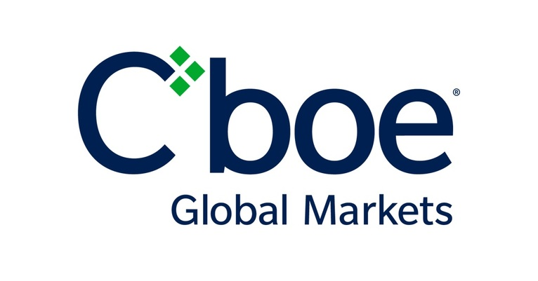

## Table of Contents

## What is the CBOE Stock Exchange?

The CBOE Stock Exchange, also known as the Chicago Board Options Exchange, is a place where people buy and sell stocks and options. It started in 1973 and is one of the biggest exchanges in the world. People go there to trade because it has a lot of different stocks and options to choose from. It's located in Chicago, but people from all over the world can trade there using computers.

Options are special kinds of investments that give you the right to buy or sell a stock at a certain price. The CBOE was the first place to offer options trading, which is why it's so important. They also have something called the VIX, which is like a thermometer for how scared or calm people are about the stock market. This helps investors make better decisions about their money.

## When was the CBOE Stock Exchange founded?

The CBOE Stock Exchange was founded in 1973. It started in Chicago and was the first place where people could trade options. Options are special kinds of investments that let you buy or sell a stock at a set price.

The CBOE became very important because it offered something new and useful for investors. Over time, it grew to be one of the biggest exchanges in the world. People from all over can use it to trade stocks and options, not just in Chicago but through computers too.

## What types of financial products are traded on the CBOE Stock Exchange?

The CBOE Stock Exchange is a place where people trade different kinds of financial products. The main things traded there are stocks and options. Stocks are pieces of ownership in a company, and options are special contracts that give you the right to buy or sell stocks at a certain price.

Options are very important at the CBOE because it was the first place to offer them. There are two main types of options: call options, which let you buy a stock, and put options, which let you sell a stock. These options can be used to make money or to protect other investments.

Besides stocks and options, the CBOE also has something called the VIX. The VIX is not something you can trade directly, but it's a measure of how scared or calm people are about the stock market. It's like a thermometer for the market's mood and helps investors make decisions.

## How does the CBOE Stock Exchange differ from other stock exchanges?

The CBOE Stock Exchange is different from other stock exchanges mainly because it was the first place to offer options trading. Options are special kinds of investments that let you buy or sell stocks at a set price. This was a big deal because before the CBOE started in 1973, people could only trade stocks directly. The CBOE made it possible for investors to use options to make money or protect their other investments, which was a new and useful tool.

Another way the CBOE stands out is because it has the VIX, which is like a thermometer for how scared or calm people are about the stock market. The VIX helps investors understand the market's mood and make better decisions about their money. While other exchanges focus mostly on trading stocks, the CBOE's focus on options and the VIX gives it a unique role in the world of finance.

## What are the trading hours of the CBOE Stock Exchange?

The CBOE Stock Exchange has regular trading hours from 9:30 AM to 4:00 PM Eastern Time, Monday through Friday. These are the hours when most people trade stocks and options. It's like a busy time when everyone is buying and selling, kind of like a big market during the day.

But the CBOE also has something called extended trading hours. Before the regular hours, there's a pre-market session from 8:15 AM to 9:30 AM Eastern Time. After the regular hours, there's an after-hours session from 4:00 PM to 5:00 PM Eastern Time. These extra times let people trade when the main market is closed, which can be handy if you want to make a trade outside of the usual busy times.

## What are the listing requirements for companies on the CBOE Stock Exchange?

To list on the CBOE Stock Exchange, a company needs to meet certain rules. They need to have at least $4 million in stockholders' equity, which means the total value of what the shareholders own in the company. They also need to have at least 1.1 million publicly held shares, which are shares that anyone can buy and sell on the exchange. Plus, the company must have at least 400 shareholders, which helps make sure there are enough people interested in trading the stock.

Another important rule is that the stock price must be at least $4 per share when the company starts trading on the CBOE. This helps make sure the stock is valuable enough for people to want to trade it. The company also needs to follow certain rules about how they run their business and report their financial information. This includes having regular meetings with shareholders and making sure their financial reports are honest and clear. These rules help keep the exchange fair and trustworthy for everyone who trades there.

## How does the CBOE Stock Exchange ensure fair trading practices?

The CBOE Stock Exchange works hard to make sure trading is fair for everyone. They have rules that everyone has to follow when they trade. For example, they watch out for things like insider trading, which is when someone uses secret information to make money. They also check for market manipulation, where people try to trick the market to change prices unfairly. To do this, they use special computer systems and have people who watch the trading all the time.

Another way the CBOE keeps trading fair is by making sure everyone gets the same information at the same time. They do this by having strict rules about how companies share news and financial reports. This helps stop some people from getting an unfair advantage. If someone breaks these rules, the CBOE can punish them, like by fining them or stopping them from trading. This helps keep the market honest and fair for everyone who wants to trade there.

## What role does technology play in the operations of the CBOE Stock Exchange?

Technology is really important for the CBOE Stock Exchange. It helps them handle all the trading that happens every day. They use computers to match up buyers and sellers quickly and accurately. This is important because it makes sure that people can trade whenever they want, without waiting. The CBOE also uses technology to keep an eye on the trading and make sure everything is fair. They have special systems that watch for anything that might be wrong, like people trying to cheat or use secret information to make money.

Another way technology helps is by letting people from all over the world trade on the CBOE. With the internet, anyone can trade from their own computer, not just people in Chicago where the exchange is located. This makes the CBOE bigger and more useful for more people. Technology also helps the CBOE keep up with all the new kinds of investments and ways of trading that keep coming out. This means they can keep offering the best and newest tools for investors to use.

## Can you explain the process of executing a trade on the CBOE Stock Exchange?

When someone wants to buy or sell a stock or an option on the CBOE Stock Exchange, they usually do it through a broker. A broker is like a helper who uses a computer system to send the order to the exchange. The order might be to buy a certain stock at a certain price, or to sell an option. Once the order gets to the CBOE, their computers look for someone who wants to make the opposite trade. If someone wants to sell the same stock or option at the price you want to buy, the trade happens right away.

The CBOE's computers work fast to match up buyers and sellers. This helps make sure that trades happen quickly and fairly. Once the trade is done, the CBOE sends a message back to your broker, letting them know that the trade is complete. Your broker then updates your account to show that you now own the stock or option, or that you've sold it. This whole process usually happens in just a few seconds, thanks to the technology the CBOE uses.

## What are some of the major indices associated with the CBOE Stock Exchange?

The CBOE Stock Exchange is known for a few important indices that help investors understand the market. One of the most famous ones is the VIX, also called the "Fear Gauge." It measures how much people expect the stock market to move up or down in the next 30 days. A high VIX means people are worried and expect big changes, while a low VIX means they think things will stay calm. The VIX is really useful because it helps investors decide when to buy or sell.

Another important index is the CBOE S&P 500 BuyWrite Index, or BXM. This index shows how well a strategy of buying stocks in the S&P 500 and selling call options on them works. It's a way for investors to see if they can make money by combining stocks and options. The BXM helps people understand how this kind of investing might work over time.

## How has the CBOE Stock Exchange evolved in response to global financial trends?

The CBOE Stock Exchange has changed a lot over the years to keep up with what's happening in the world of money. When it started in 1973, it was the first place to offer options trading, which was a big deal. As more people started using computers and the internet, the CBOE made sure they could trade from anywhere, not just in Chicago. This helped them grow and become one of the biggest exchanges in the world. They also added new products like the VIX, which measures how scared or calm people are about the market, to help investors make better decisions.

As global financial trends changed, the CBOE kept adapting. They saw that people wanted more ways to invest and protect their money, so they added more types of options and other financial products. They also started working with other exchanges around the world to make trading easier for everyone. By staying up-to-date with technology and listening to what investors need, the CBOE has stayed important and useful in the fast-changing world of finance.

## What are the future prospects and potential challenges for the CBOE Stock Exchange?

The future looks bright for the CBOE Stock Exchange because it keeps finding new ways to help people invest. They are always working on new products and using the latest technology to make trading easier and faster. The CBOE is also looking to grow in other parts of the world, which could bring in more people to trade. As more investors learn about options and other tools the CBOE offers, it could become even more important in the world of finance.

But there are challenges too. One big challenge is keeping up with all the new rules and regulations that governments are making to stop cheating in the markets. The CBOE has to make sure it follows these rules while still giving people good ways to invest. Another challenge is competition from other exchanges that are also trying to attract traders. The CBOE needs to keep offering things that people want and need, or they might go to other places to trade. By staying smart and adapting to changes, the CBOE can keep growing and helping investors around the world.

## References & Further Reading

[1]: Hendershott, T., Jones, C. M., & Menkveld, A. J. (2011). ["Does Algorithmic Trading Improve Liquidity?"](https://faculty.haas.berkeley.edu/hender/Algo.pdf) Journal of Finance, 66(1), 1-33.

[2]: Zhang, L. (2010). ["The Effect of High-Frequency Trading on Stock Volatility and Price Discovery."](https://papers.ssrn.com/sol3/Delivery.cfm/SSRN_ID1731384_code343637.pdf?abstractid=1691679&rulid=5442158&mirid=1) SSRN Electronic Journal.

[3]: "Regulation National Market System (Reg NMS)," U.S. Securities and Exchange Commission. [Link](https://www.sec.gov/rules-regulations/2005/06/regulation-nms)

[4]: Narang, R. (2013). ["Inside the Black Box: A Simple Guide to Quantitative and High-Frequency Trading."](https://onlinelibrary.wiley.com/doi/book/10.1002/9781118662717) Wiley.

[5]: Malkiel, B. G., & Fama, E. F. (1970). ["Efficient Capital Markets: A Review of Theory and Empirical Work."](https://onlinelibrary.wiley.com/doi/abs/10.1111/j.1540-6261.1970.tb00518.x) The Journal of Finance, 25(2), 383-417.