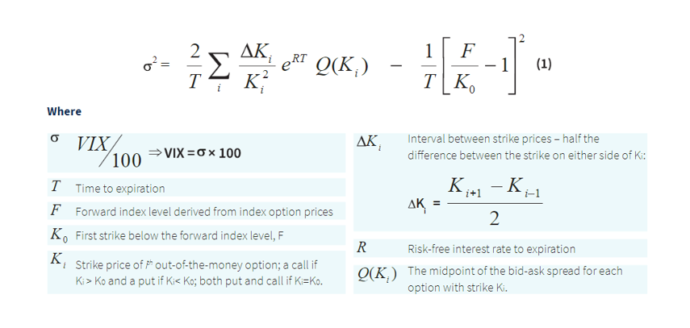

## Table of Contents

## What is the Cboe Volatility Index (VIX)?

The Cboe Volatility Index, often known as the VIX, is a measure of the stock market's expectation of volatility over the next 30 days. It is calculated by the Chicago Board Options Exchange (CBOE) and is often referred to as the "fear gauge" because it reflects investors' sentiment about future market volatility. The VIX is derived from the prices of options on the S&P 500 index, which are used to estimate the likelihood of significant changes in the market.

When the VIX is high, it means that investors expect a lot of movement in the stock market, which often happens during times of uncertainty or fear. On the other hand, a low VIX suggests that investors expect the market to be relatively stable. The VIX is an important tool for investors because it helps them understand market sentiment and make decisions about their investments based on expected volatility.

## Why is the VIX often referred to as the 'fear gauge'?

The VIX is often called the 'fear gauge' because it shows how worried or scared investors are about the stock market. It measures how much the market might go up or down in the next 30 days. When people are scared about the economy or something big happening in the world, they expect the market to move a lot, so the VIX goes up. This means the VIX is a way to see how nervous people are feeling about their investments.

When the VIX is high, it means that investors think the market will be very unpredictable and might drop a lot. This usually happens during times when people are worried about things like a recession, political problems, or other big events. On the other hand, when the VIX is low, it means investors are feeling calm and think the market will stay pretty steady. So, the VIX helps everyone see how much fear is in the market at any given time.

## How does the VIX measure market volatility?

The VIX measures market [volatility](/wiki/volatility-trading-strategies) by looking at options on the S&P 500 index. Options are like bets on where the stock market will go. The VIX uses the prices of these options to figure out how much the market might move in the next 30 days. If people think the market will move a lot, they will pay more for options, and this makes the VIX go up.

When the VIX is high, it means people are expecting big changes in the market. This usually happens when people are worried about something like a financial crisis or a big world event. On the other hand, if the VIX is low, it means people think the market will stay pretty calm and not change much. So, the VIX is a way to see how much the market might shake up in the near future.

## What are the key components used in calculating the VIX?

The VIX is calculated using options on the S&P 500 index. These options are like bets people make on where the stock market will go in the future. The VIX looks at the prices of these options to see how much people are willing to pay for them. If people are willing to pay a lot, it means they think the market will move a lot, and this makes the VIX go up.

The VIX uses two types of options: calls and puts. Call options give people the right to buy the S&P 500 at a certain price, while put options give them the right to sell it at a certain price. The VIX looks at the prices of these options that are close to the current market price and will expire in the next 23 to 37 days. By doing this, the VIX can figure out how much the market might move in the next 30 days.

## How often is the VIX calculated and updated?

The VIX is calculated and updated every 15 seconds during regular trading hours. This means that investors can see how the market's expected volatility changes throughout the day. Regular trading hours are from 9:30 AM to 4:15 PM Eastern Time, Monday through Friday.

Outside of regular trading hours, the VIX is still updated but less often. It is recalculated every 15 minutes during pre-market and after-hours trading sessions. This helps investors keep an eye on market volatility even when the main market is closed.

## What is the difference between the VIX and other volatility indices?

The VIX, also known as the Cboe Volatility Index, is just one of many volatility indices out there. It focuses on the S&P 500 and looks at options to figure out how much the market might move in the next 30 days. Other volatility indices might look at different markets or use different time frames. For example, the VXN looks at the Nasdaq-100, while the VXD focuses on the Dow Jones Industrial Average. Each of these indices gives a different picture of what investors think about the volatility of different parts of the market.

Another difference is that some volatility indices might use different methods to calculate volatility. The VIX uses options that are close to the current market price and will expire soon. Other indices might use different options or even different kinds of financial products to measure volatility. This can make the numbers they come up with different from the VIX, even if they're looking at the same market. So, while the VIX is very popular and widely used, it's not the only way to measure how much the market might shake up in the future.

## Can you explain the mathematical formula used to compute the VIX?

The VIX uses a special math formula to figure out how much the market might move. It looks at the prices of options on the S&P 500 that will expire soon. The formula starts by finding the difference between the prices people are willing to pay for call options and put options. Then, it turns these differences into something called "volatility," which is a number that tells us how much the market might go up or down. This part of the formula is called the "variance swap," and it's a way to measure how much the market's price might change.

After finding the volatility from the options, the VIX formula takes the square root of this number to get the final VIX value. This final number is what we see as the VIX, and it tells us the expected yearly volatility of the S&P 500 over the next 30 days. The formula is pretty complicated, but it basically uses the prices of options to guess how much the market might shake up in the near future.

## How does the VIX use options pricing to forecast volatility?

The VIX uses the prices of options on the S&P 500 to guess how much the market might move in the next 30 days. Options are like bets people make on where the stock market will go. The VIX looks at the prices people are willing to pay for these options, especially the ones that will expire soon. If people are willing to pay a lot for options, it means they think the market will move a lot, and this makes the VIX go up. On the other hand, if people aren't willing to pay much, it means they think the market will stay pretty calm, and the VIX goes down.

The VIX uses a special math formula to turn the prices of these options into a number that shows how much the market might shake up. This formula looks at the difference between what people are willing to pay for call options (which let people buy the S&P 500 at a certain price) and put options (which let people sell it at a certain price). By figuring out these differences and doing some math, the VIX can tell us how much the market might move in the next month. This helps investors understand how worried or calm people are feeling about the market's future.

## What is the historical range of the VIX, and what does it indicate about market conditions?

The VIX has been around since the late 1980s, and over the years, it has had a wide range of values. The lowest the VIX has ever been is around 9, which happened during times when the market was very calm and people were feeling good about the economy. On the other hand, the highest the VIX has ever been is over 80, which happened during the 2008 financial crisis when people were really scared about what was going to happen to the market.

When the VIX is low, like in the range of 10 to 20, it usually means that people think the market will stay pretty steady and they're not too worried. But when the VIX is high, like above 30 or even higher, it means that people are expecting big changes in the market and they're feeling nervous or scared. So, the VIX helps us see how much fear or calm is in the market at any given time.

## How can investors use the VIX for hedging and trading strategies?

Investors can use the VIX to protect their investments by hedging. When the VIX is high, it means people are expecting a lot of movement in the market, so investors might buy options or other financial products that go up in value if the market goes down. This can help them lose less money if the market drops a lot. For example, if an investor thinks the market might crash, they could buy put options on the S&P 500, which would make money if the market goes down, helping to offset losses in their other investments.

The VIX can also be used for trading strategies. Some traders look at the VIX to guess where the market might go next. If the VIX is very high, it might mean the market is about to calm down, so traders might buy stocks or other investments that do well when the market is stable. On the other hand, if the VIX is very low, it might mean the market is about to get more volatile, so traders might sell their investments or buy things that do well when the market is moving a lot. By watching the VIX, traders can try to make smart moves and maybe make money from the ups and downs of the market.

## What are the limitations and criticisms of the VIX as a volatility measure?

The VIX is a popular way to measure how much the market might move, but it has some problems. One big issue is that it only looks at options on the S&P 500, so it doesn't tell us about the whole market. If other parts of the market are acting differently, the VIX might not show that. Also, the VIX looks at options that will expire soon, so it might not be the best at guessing what will happen over a longer time. This can make it hard for investors who are thinking about the market over many months or years.

Another problem is that the VIX can be hard to understand and use. It's based on a complicated math formula, and not everyone knows how to use it right. Sometimes, the VIX might seem to predict big changes in the market, but then nothing big happens. This can make people think the VIX is not a good tool. Also, the VIX can be affected by things like how much people are trading options, which might not have much to do with what the market will actually do. So, while the VIX is useful, it's not perfect and should be used carefully.

## How has the methodology for calculating the VIX evolved over time?

The VIX was first introduced in 1993 by the Chicago Board Options Exchange (CBOE). Back then, it was calculated using the prices of options on the S&P 100 index, which is a smaller group of big companies compared to the S&P 500. The old VIX used a simpler way to figure out volatility, looking at the prices of options that were close to the current market price but would expire in just a few weeks. This method worked okay, but it had some problems because it didn't look at a wide range of options or cover a longer time period.

In 2003, the CBOE changed how the VIX is calculated to make it better. They started using options on the S&P 500 instead of the S&P 100, which covers a bigger part of the market. The new way of calculating the VIX uses a more complicated math formula that looks at a wider range of options prices and covers options that will expire over the next 23 to 37 days. This change made the VIX a better tool for guessing how much the market might move in the next month, and it's the method we still use today.

## What is the VIX Calculation and How Has It Evolved?

The calculation of the VIX, or the Volatility Index, is intricately tied to the pricing of S&P 500 index options. Originally, the VIX was based on S&P 100 index options, but in 2003, it was updated to reflect the broader market sentiment by incorporating S&P 500 options. This shift allowed for a more comprehensive measure of market expectations regarding volatility, aligning better with the diverse components of the S&P 500.

The methodology behind the VIX involves aggregating the prices of multiple options, both calls and puts, of the S&P 500 across various strike prices. The calculation considers options with expirations around 30 days from the current date. The core principle is to estimate the expected volatility over the next 30 days using these options prices. This process can be symbolically described by the following formula:

$$

\text{VIX} = 100 \times \sqrt{\frac{2}{T} \sum_{i} \frac{\Delta K_i}{K^2_i} e^{RT}Q(K_i) - \frac{1}{T} \left( \frac{F}{K_0} - 1 \right)^2}
$$

Where:
- $T$ represents the time to expiration.
- $\Delta K_i$ is the interval between strike prices.
- $K_i$ is the strike price of option $i$.
- $R$ is the risk-free interest rate.
- $Q(K_i)$ is the mid-point of the bid-ask spread for each option with strike $K_i$.
- $F$ is the forward index level derived from the options.

In essence, the calculation aggregates the weighted prices of options to forecast the expected future volatility of the S&P 500. Since its inception, the VIX methodology has undergone various enhancements, particularly in terms of the inputs used and the accuracy of model assumptions, to make it a precise indicator of market sentiment. Key improvements include the adoption of advanced numerical techniques like cubic spline interpolation, which refines the estimation of volatility across a broader range of option prices.

Such improvements have significantly enhanced the reliability of the VIX, making it a vital tool for investors and traders who seek a comprehensive understanding of market turbulence and the accompanying risks.

## References & Further Reading

[1]: Cboe Global Markets. ["VIX White Paper."](https://cdn.cboe.com/api/global/us_indices/governance/Volatility_Index_Methodology_Cboe_Volatility_Index.pdf) Provides detailed information on the Cboe Volatility Index and its calculation.

[2]: Whaley, R. E. (2009). ["Understanding the VIX."](https://www.researchgate.net/publication/277429711_Understanding_the_VIX) The Journal of Portfolio Management, 35(3), 98-105.

[3]: Carr, P., & Wu, L. (2006). ["A Tale of Two Indices."](https://www.semanticscholar.org/paper/A-Tale-of-Two-Indices-Carr-Wu/794f4df5d1cc2395256427f68fe78df21c2696c4) The Journal of Derivatives, 13(3), 13-29.

[4]: Black, F., & Scholes, M. (1973). ["The Pricing of Options and Corporate Liabilities."](https://www.cs.princeton.edu/courses/archive/fall09/cos323/papers/black_scholes73.pdf) Journal of Political Economy, 81(3), 637-654. This paper underpins the option pricing models that are foundational to VIX calculations.

[5]: ["Option Volatility and Pricing: Advanced Trading Strategies and Techniques"](https://www.amazon.com/Option-Volatility-Pricing-Strategies-Techniques/dp/0071818774) by Sheldon Natenberg

[6]: Andersen, T.G., Bollerslev, T., Diebold, F.X., & Labys, P. (2003). ["Modeling and Forecasting Realized Volatility."](https://www.nber.org/papers/w8160) Econometrica, 71(2), 579–625.

[7]: Filimonov, V., & Sornette, D. (2012). ["Quantifying Reflexivity in Financial Markets: Toward a Prediction of Flash Crashes."](https://arxiv.org/abs/1201.3572) Physical Review E, 85(5).