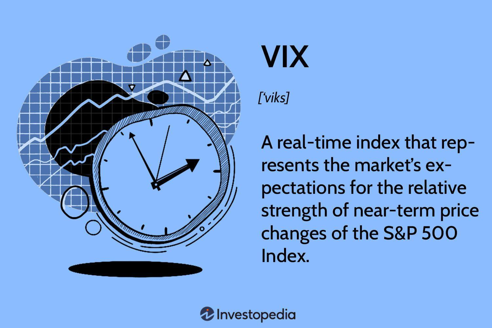

The VIX, commonly referred to as the Volatility Index or the Fear Index, plays a pivotal role in the financial markets as it quantifies market sentiment and anticipated volatility. This index, created by the Chicago Board Options Exchange (CBOE), serves as a barometer of the stock market's expectations of volatility over the next 30 days. As an indicator derived from S&P 500 index options' prices, it provides meaningful insights into the level of fear or complacency among investors.

Market participants, especially algorithmic traders, consider the VIX a crucial tool due to its unique ability to forecast market movements. By analyzing the VIX, traders can identify potential investment opportunities based on expected volatility, thereby making informed trading decisions. The VIX often exhibits an inverse relationship with the stock market; when market volatility increases, the VIX tends to rise, while a decrease in volatility usually corresponds with a drop in the VIX. This inverse correlation is instrumental in hedging equity positions and constructing diversified portfolios.



Trading the VIX requires employing sophisticated strategies that algorithmic traders are well-equipped to implement. Algorithmic trading leverage computer algorithms to execute trades at speeds that far exceed human capabilities. This article outlines the fundamental concepts of VIX trading, its advantages, and illustrates how algorithmic strategies can be effectively applied for trading the VIX. Through a thorough exploration of various algorithmic strategies, traders can harness the predictive power of the VIX and potentially enhance the performance of their trading systems.

## Table of Contents

## Understanding the VIX

The VIX, or Volatility Index, is a widely recognized metric that serves as a barometer for market volatility expectations over the next 30 days. This index is calculated based on the prices of options on the S&P 500 index. Specifically, it employs the prices of near-term S&P 500 options that are both in- and out-of-the-money, providing a comprehensive picture of market sentiment. Essentially, the VIX seeks to quantify the degree of investor anxiety, with higher values indicating increased fear and anticipated fluctuations, while lower values suggest stability and complacency.

Mathematically, the VIX is derived using a formula that incorporates the weighted average of the implied volatilities of a diverse range of S&P 500 options. The calculation involves computing the expected volatility for these options, taking into account bid-ask spreads and time to expiration. This process yields a single figure that encapsulates market volatility expectations.

The relationship between the VIX and the stock market is typically inverse. When the stock market experiences downturns, the VIX tends to rise as uncertainty and fear increase, leading investors to seek protective options, thus pushing up option prices. Conversely, during bullish market conditions, the VIX often declines as confidence prevails and demand for downside protection diminishes.

In practice, the VIX serves as a crucial tool for investors and traders who seek to understand market dynamics and potential turning points. By gauging the level of market anxiety, it helps stakeholders make informed decisions regarding portfolio allocation, hedging strategies, and exposure to risk. The VIX's ability to reflect market sentiment in real-time makes it an invaluable component of contemporary financial analysis and strategy development.

## Trading the VIX in Algorithmic Strategies

Algorithmic trading, a method that uses computer algorithms to execute trades with speed and precision, is particularly effective when applied to the VIX, or Volatility Index. The VIX measures market expectations of [volatility](/wiki/volatility-trading-strategies) and serves as a barometer of investor sentiment, making it a key instrument for traders seeking to capitalize on volatility forecasting.

One common strategy employed in VIX trading is mean-reversion. This strategy assumes that asset prices and historical volatility will eventually revert to their long-term averages. Implementing a mean-reversion strategy involves identifying points at which the VIX is perceived to have deviated from the norm and predicting its likely return to average values. This can be quantitatively modeled using time series analysis. For example, one might use the formula:

$$
VIX_{mean} = \frac{1}{n} \sum_{i=1}^{n} VIX_i
$$

where $VIX_{mean}$ is the average VIX value over a specified period, and $VIX_i$ represents individual daily VIX values within that period.

Momentum-based systems represent another class of algorithmic strategies tailored for trading the VIX. These strategies rely on the principle that significant price movements, either up or down, are likely to continue for a period. Traders may leverage [momentum](/wiki/momentum) indicators to initiate trades when the VIX starts showing a distinct upward or downward trend. Technical indicators such as the Moving Average Convergence Divergence (MACD) or the Relative Strength Index (RSI) can be used to identify these trends, with algorithmic models set to automatically execute trades based on predefined thresholds.

Hedging with derivatives is a strategic approach that utilizes financial instruments like options and futures to mitigate potential losses. Traders can use VIX futures to hedge against adverse market movements, given their direct correlation to market volatility. This involves taking positions in derivatives that appreciate in value when volatility spikes, thus protecting the underlying portfolio. The use of derivatives for hedging must be well-calculated, considering the cost and the impact on the overall portfolio's risk profile.

Furthermore, traders capitalize on the predictive capability of the VIX to anticipate broader market behavior. By analyzing VIX term structures and spreads between different VIX futures, traders forecast future volatility trends, which can indicate potential market reversals or continuations. Algorithmic models efficiently process vast amounts of market data, enabling real-time analysis and trading decisions that align with computed volatility expectations.

In summary, [algorithmic trading](/wiki/algorithmic-trading) of the VIX involves employing sophisticated strategies such as mean-reversion, momentum-based systems, and derivative hedging, leveraging the index’s predictive capabilities to optimize trade execution and gain insights into market trends. These strategies necessitate a robust computational infrastructure and a profound understanding of both market dynamics and algorithmic principles to achieve success in VIX trading.

## Developing Algorithmic VIX Trading Strategies

Identifying patterns and anomalies in VIX data is essential for developing robust algorithmic trading strategies. The Volatility Index, or VIX, presents a unique dataset that requires traders to analyze its fluctuations to predict market behavior accurately. This can be achieved through various approaches including statistical measures, technical indicators, and [machine learning](/wiki/machine-learning) models.

Statistical measures such as moving averages and standard deviations can help algorithmic traders identify trends and volatility clusters within the VIX data. For example, calculating a 20-day moving average of the VIX provides insights into the short-term volatility trend. Additionally, Bollinger Bands—formed by a moving average and standard deviations above and below it—can identify periods when the VIX is unusually high or low, indicating potential market turning points.

Machine learning models offer advanced methods for predicting VIX movements by detecting complex patterns and relationships within the data. Linear regression models can assist in understanding the relationship between the VIX and other market variables, while more sophisticated models such as Random Forests and Neural Networks can uncover non-linear interactions. Here is a simple example of implementing a Random Forest model in Python:

```python
from sklearn.ensemble import RandomForestRegressor
from sklearn.model_selection import train_test_split
from sklearn.metrics import mean_squared_error
import pandas as pd

# Assume vix_data is a DataFrame with VIX data and other market indicators
vix_data = pd.read_csv('vix_data.csv')
features = vix_data.drop('VIX', axis=1)
target = vix_data['VIX']

# Splitting the dataset into training and testing sets
X_train, X_test, y_train, y_test = train_test_split(features, target, test_size=0.2, random_state=42)

# Training a Random Forest model
rf_model = RandomForestRegressor(n_estimators=100, random_state=42)
rf_model.fit(X_train, y_train)

# Predicting and calculating the mean squared error
predictions = rf_model.predict(X_test)
mse = mean_squared_error(y_test, predictions)
print(f'Mean Squared Error: {mse}')
```

Backtesting is a critical step in developing algorithmic VIX trading strategies, as it allows traders to apply their strategies to historical data in order to evaluate performance before live deployment. When [backtesting](/wiki/backtesting), using realistic assumptions about transaction costs, slippage, and [liquidity](/wiki/liquidity-risk-premium) is essential to avoid over-optimistic results.

Optimization of strategy parameters ensures that the trading algorithm operates effectively under various market conditions. However, it is vital to guard against overfitting, a common pitfall where a model performs well on historical data but poorly in real-world scenarios due to excessive complexity. Techniques such as cross-validation and out-of-sample testing can help mitigate this risk.

Ultimately, by integrating statistical, technical, and machine learning methods, traders can enhance the accuracy and robustness of their VIX trading strategies, increasing the likelihood of achieving successful outcomes in dynamic financial markets.

## Backtesting and Optimization

Backtesting is an essential component of developing algorithmic trading strategies, especially when trading indices like the VIX. It allows traders to apply historical data to simulated trades, evaluating a strategy's performance before deploying it in the real world. The core idea is to validate whether a proposed trading strategy has merit based on past market conditions, thereby reducing the risk of failure when applied with real capital.

To execute backtesting effectively, traders must use clean and reliable historical data from which to run their simulations. This data, typically encompassing multiple years, should reflect actual market conditions, including price movements, trading [volume](/wiki/volume-trading-strategy), and even external factors that may influence the VIX.

Optimization of algorithm parameters plays a crucial role in enhancing the performance of backtested strategies. This process involves fine-tuning these parameters to maximize returns and reduce risk. A common pitfall during optimization is overfitting, where an algorithm is excessively tailored to historical data, capturing noise rather than meaningful patterns. To mitigate this, strategies such as cross-validation can be used. This involves partitioning the data into training and test sets multiple times to ensure that the model performs well on unseen data.

Consider a simple backtesting implementation in Python, using a hypothetical VIX trading strategy:

```python
import pandas as pd
import numpy as np

# Load historical VIX data
vix_data = pd.read_csv('vix_data.csv', parse_dates=['Date'], index_col='Date')
vix_data['Returns'] = np.log(vix_data['Close'] / vix_data['Close'].shift(1))

# Define a simple mean-reversion strategy
def mean_reversion_strategy(data, window, threshold):
    rolling_mean = data['Close'].rolling(window=window).mean()
    signal = np.where(data['Close'] < (rolling_mean - threshold), 1, 0)  # Buy signal
    signal = np.where(data['Close'] > (rolling_mean + threshold), -1, signal)  # Sell signal
    return signal

# Backtest the strategy
def backtest(data, signal):
    data['Signal'] = signal
    data['Strategy_Returns'] = data['Returns'] * data['Signal'].shift(1)
    cumulative_returns = (1 + data['Strategy_Returns']).cumprod() - 1
    return cumulative_returns

# Apply strategy
signal = mean_reversion_strategy(vix_data, window=5, threshold=1.5)
cumulative_returns = backtest(vix_data, signal)
performance = cumulative_returns.iloc[-1]

print(f'Strategy Performance: {performance:.2%}')
```

When optimizing trading algorithms, it is essential to consider realistic trading conditions as they can significantly impact strategy outcomes. Key factors include:

- **Slippage**: The difference between the expected price of a trade and the actual price, which can erode profits, especially in volatile markets like the VIX.

- **Transaction Costs**: Every trade incurs costs, which can include broker commissions, spreads, and any fees that eat into profits.

- **Market Impact**: The effect that a trader's own actions have on the market. Large orders, in particular, can move prices unfavorably, and this impact needs to be incorporated into the backtesting model.

In conclusion, successful backtesting and optimization require a balance between rigorous testing with historical data and an awareness of the dynamic and sometimes unpredictable nature of the financial markets. By carefully simulating trading conditions, algorithmic traders can design more robust strategies that stand the test of future market fluctuations.

## Risk Management in VIX Trading

Effective risk management in VIX trading is crucial due to the index's inherent sensitivity to market fluctuations and its role as a gauge of market uncertainty. The Volatility Index, commonly referred to as the VIX, requires careful handling within trading strategies to mitigate risks while leveraging its potential for returns.

A fundamental risk management approach involves setting tight stop losses. By defining predetermined [exit](/wiki/exit-strategy) points for trades, traders can limit potential losses if the market moves against their positions. For instance, employing a stop-loss order can help to automatically close a position when the VIX rises or falls to a specified level, thus preventing further losses. The decision on where to place stop-loss orders should be informed by historical volatility data and current market conditions, ensuring they are neither too tight to cause premature exits nor too loose to allow substantial losses.

Diversification with non-correlated assets is another pivotal strategy. Since the VIX typically moves inversely with equity markets, incorporating assets with different risk profiles within a portfolio can reduce overall volatility. For example, combining VIX-related trades with bonds, commodities, or currencies that exhibit low correlation with VIX movements can stabilize returns across varying market environments. This diversification enhances the resilience of the trading strategy to unpredictable VIX fluctuations.

Hedging techniques are also essential in managing VIX trading risks. Using derivatives such as options and futures, traders can create positions that offset potential losses in the primary investment. For example, purchasing put options on the VIX can serve as a hedge against positions that benefit from declining market volatility. These derivative instruments allow traders to construct more complex strategies that can benefit from specific market scenarios, thereby reducing exposure to adverse movements.

Mathematically, risk management in the context of VIX trading can be expressed through optimization techniques. For instance, the expected return $E(R)$ of a portfolio that includes VIX-related investments can be optimized against its variance $\sigma^2$ to find the optimal trade-off between risk and return. Using statistical software and algorithms, traders can simulate various scenarios to determine the best composition and hedging strategies for their portfolios.

A simplistic Python snippet for simulating stop-loss implementation might look like this:

```python
# Example Python code for implementing stop-loss logic
def apply_stop_loss(current_price, entry_price, stop_loss_perc):
    stop_loss_price = entry_price * (1 - stop_loss_perc / 100)
    if current_price <= stop_loss_price:
        return "Sell"
    else:
        return "Hold"

# Example Variables
entry_price = 20.00  # Example entry price of the asset
current_price = 18.50  # Current price of the VIX-related asset
stop_loss_perc = 10.0  # Stop loss set at 10%

# Simulating the stop loss decision
decision = apply_stop_loss(current_price, entry_price, stop_loss_perc)
print("Decision:", decision)
```

Overall, effective risk management in VIX trading involves a combination of precise stop-loss settings, strategic diversification, and robust hedging approaches. These components work together to protect portfolios from adverse market movements while allowing traders to capitalize on the opportunities presented by volatility trading.

## Case Study: Successful VIX Trading Strategies

Examining successful VIX trading strategies reveals valuable insights into the construction and implementation of effective algorithmic trading systems. Such strategies often leverage statistical anomalies, momentum indicators, and advanced machine learning models to predict volatility movements and optimize trading outcomes.

A prominent example involves utilizing statistical anomalies in VIX price behavior. Researchers have identified that VIX often exhibits mean-reverting properties, where prices tend to return to an average level over time. Traders exploit this behavior by designing mean-reversion strategies, which can be implemented using statistical tests such as the Augmented Dickey-Fuller test to confirm the presence of non-stationarity in the data.

Momentum indicators form another crucial component of successful VIX trading strategies. These indicators help traders capture the continuing direction of VIX movements. For instance, the Relative Strength Index (RSI) or Moving Average Convergence Divergence (MACD) can be employed to identify overbought or oversold conditions, signaling potential entry or exit points. Algorithmic trading systems can be programmed to execute trades based on these technical indicators, systematically capitalizing on established market trends.

Machine learning models have significantly enhanced the predictive capabilities of VIX trading strategies. Techniques such as neural networks and support vector machines allow for complex pattern recognition within historical market data. These models are trained on large datasets to learn underlying patterns and forecast future volatility movements. An example implementation in Python might resemble:

```python
from sklearn.model_selection import train_test_split
from sklearn.svm import SVR
import numpy as np

# Sample data preprocessing
data = np.array(...)  # Placeholder for actual VIX data
X, y = data[:, :-1], data[:, -1]

# Splitting data into training and testing sets
X_train, X_test, y_train, y_test = train_test_split(X, y, test_size=0.2, random_state=42)

# Training the model
model = SVR(kernel='rbf')
model.fit(X_train, y_train)

# Making predictions
predictions = model.predict(X_test)
```

Despite the potential for high returns, algorithmic VIX trading strategies require continual adjustments and refinements. Market conditions and volatility patterns can shift over time, necessitating regular updates to the models and strategies to maintain performance. Adaptation might involve recalibrating parameter settings or integrating new data sources to enhance model accuracy and responsiveness.

Overall, successful VIX trading strategies capitalize on the interplay between statistical methods, momentum indicators, and machine learning tools. Continual refinement and adaptation to changing market conditions are crucial for sustaining their effectiveness.

## Challenges and Limitations

Predicting movements in the Volatility Index (VIX) presents considerable challenges due to the complex and dynamic nature of its fundamental components. One of the primary difficulties in forecasting VIX is its high sensitivity to market sentiment and macroeconomic events. The VIX is often considered a “fear gauge” reflecting investor sentiments, which can be unpredictable and swiftly altered by economic reports, geopolitical tensions, and sudden market shifts. Hence, any model or strategy aimed at predicting VIX movements must incorporate a diverse range of indicators and data sources to capture these variations effectively.

High-frequency trading ([HFT](/wiki/high-frequency-trading-strategies)) of the VIX introduces further complexities, necessitating substantial technological infrastructure and expertise. Implementing HFT strategies requires high-performance computing systems capable of executing trades in microseconds. This precision minimizes latency and slippage, essential for capitalizing on transient price discrepancies. The investment in technology, alongside the continual need for system upgrades and maintenance, represents a significant barrier to entry for smaller firms or individual traders. Additionally, expertise in quantitative analysis, data science, and algorithmic implementation is crucial to effectively develop and deploy HFT strategies.

Traders in VIX markets must also contend with an evolving regulatory environment. Regulatory bodies worldwide are increasingly focused on the activities of algorithmic and high-frequency traders to ensure market stability and integrity. Compliance with these regulations necessitates meticulous record-keeping, reporting, and model transparency, all of which can be resource-intensive. Market conditions are similarly in flux, influenced by advances in technology, changes in market structure, and shifts in investor behavior. As such, traders need not only to develop robust strategies but also to remain agile and adaptive to successfully navigate these changing landscapes.

The combined challenges of accurately predicting VIX movements, the technological demands of HFT, and the navigation of regulatory and market dynamics underscore the complexity of successful VIX trading. Traders must leverage advanced analytical tools, continually monitor compliance mandates, and remain responsive to market shifts to maintain competitive advantage and mitigate risks in this inherently volatile trading environment.

## Conclusion

Trading the VIX through algorithmic strategies offers significant potential for profitability. However, realizing this potential necessitates a meticulous approach centered around comprehensive strategy development and rigorous risk management practices. Key components of successful VIX trading strategies include the integration of historical data analysis, machine learning techniques, and exhaustive real-world backtesting.

Historical data analysis serves as the foundation for understanding volatility patterns and crafting predictive models. Machine learning enhances these models by identifying complex, non-linear relationships within the data, providing more accurate forecasts of market movements. For instance, employing regression models or neural networks can help discern subtle patterns indicative of future VIX behavior.

Moreover, real-world backtesting is indispensable for evaluating the potential efficacy of strategies under various market conditions. This involves simulating trades using historical data to assess how strategies would have performed in the past, considering factors like transaction costs and market liquidity. The optimization of algorithm parameters during backtesting helps in fine-tuning strategies to maximize performance while minimizing risks such as overfitting.

Ongoing refinement and adaptation are critical to maintaining the effectiveness of VIX trading strategies. The dynamic nature of financial markets means strategies that work today might not be as effective tomorrow. Continuous monitoring and tweaking of algorithms are necessary to adapt to shifts in market sentiment and changes in economic conditions.

In conclusion, while trading the VIX with algorithmic strategies can be lucrative, it demands not only technical expertise but also a disciplined approach to development, testing, and refinement. This ensures that strategies remain robust and adaptive to the ever-evolving landscape of financial markets.

## References & Further Reading

### References & Further Reading

1. **Whaley, R. E. (1993).** "Derivatives on market volatility: Hedging tools long overdue," *The Journal of Derivatives*, 1(1), 71-84. This seminal paper by Professor Whaley introduces the concept of trading derivatives based on market volatility and provides an in-depth analysis of the VIX.

2. **CBOE VIX White Paper.** The Chicago Board Options Exchange (CBOE) provides a comprehensive white paper detailing the calculation and application of the VIX. The document is a valuable resource for understanding the technical foundation of the index.

3. **Carr, P., & Wu, L. (2006).** "A Tale of Two Indices," *The Journal of Derivatives*, 13(3), 13-29. This paper explores the intricacies of volatility trading, comparing the performance and characteristics of the VIX and other volatility indices.

4. **Dash, S. (2004).** "Understanding the VIX," *S&P Dow Jones Indices Insights*. This publication offers a thorough explanation of the VIX's role in measuring market expectations of near-term volatility, useful for traders and analysts alike.

5. **Hull, J. C. (2015).** *Options, Futures, and Other Derivatives.* This textbook provides a comprehensive overview of derivatives and includes sections on trading volatility, explaining the underlying mechanisms of volatility indices such as the VIX.

6. **Chan, E., & Ng, C. T. (2017).** *Machine Trading: Deploying Computer Algorithms to Conquer the Markets.* The book offers insights into algorithmic trading, including examples and strategies that incorporate the VIX as a predictive tool.

7. **Patterson, S. (2013).** *Dark Pools: The Rise of the Machine Traders and the Rigging of the U.S. Stock Market.* This book discusses the technical and ethical landscapes of algorithmic trading, giving context to trading strategies involving indices like the VIX.

8. **Carver, R. (2019).** *Leveraged Trading: A Professional Approach to Trading FX, Stocks on Margin, CFDs, Spread Bets and Futures for All Trading Styles.* This book includes discussions on risk management strategies necessary for handling the inherent volatility of trading instruments like the VIX.

9. **Engle, R., & Patton, A. (2001).** "What Good is a Volatility Model?" *Quantitative Finance*, 1(2), 231-243. This paper provides insights into the value of accurate volatility modeling, which is critical for successful VIX trading strategies.

10. **Boyle, P. P., & Vorst, T. (1992).** "Option Replication in Discrete Time with Transaction Costs," *The Journal of Finance*, 47(1), 271-293. It discusses methods for simulating trades and managing transaction costs, a crucial aspect of backtesting algorithmic strategies against the VIX.

These resources provide a diverse foundation for understanding and employing algorithmic trading strategies focused on the VIX, encompassing both academic and practical perspectives.

