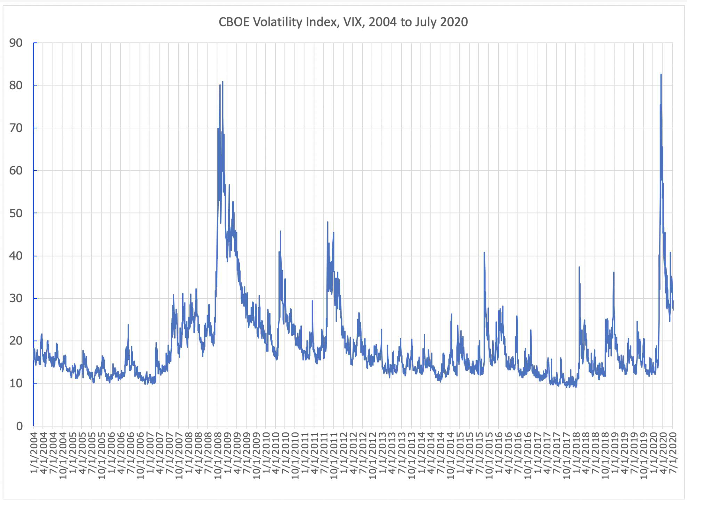

## Table of Contents

## What is the Cboe Volatility Index?

The Cboe Volatility Index, often called the VIX, is a measure that shows how much the stock market expects prices to change over the next 30 days. It is sometimes called the "fear gauge" because it goes up when people are worried about the market and think prices will move a lot. The VIX is calculated using the prices of options on the S&P 500, which is a big group of stocks that represent the U.S. market.

When the VIX is high, it means that investors expect big changes in the stock market, and they might be feeling nervous. On the other hand, when the VIX is low, it suggests that investors expect the market to stay pretty calm and not change much. The VIX is important for investors because it helps them understand market sentiment and make decisions about buying or selling stocks and other investments.

## How is the Cboe Volatility Index calculated?

The Cboe Volatility Index, or VIX, is calculated using the prices of options on the S&P 500. Options are contracts that give people the right to buy or sell the S&P 500 at a certain price in the future. The VIX looks at the prices of these options that will expire in about 23 to 37 days. It focuses on options that are close to the current price of the S&P 500, called "at-the-money" options, and also options that are a bit higher or lower, called "out-of-the-money" options.

To calculate the VIX, a special formula is used that takes the prices of these options and figures out how much the market expects the S&P 500 to move. The formula looks at how much people are willing to pay for these options, which shows how much they think the market will change. The more they are willing to pay, the higher the VIX will be, because it means they expect bigger changes in the market. The VIX is then expressed as a percentage, showing the expected annualized change in the S&P 500 over the next 30 days.

## What does the Cboe Volatility Index measure?

The Cboe Volatility Index, known as the VIX, measures how much the stock market expects prices to change over the next 30 days. It's like a fear gauge because it shows how worried or calm investors are feeling about the market. When the VIX is high, it means that people expect big changes in stock prices, which usually happens when they are nervous or scared about what might happen in the market.

The VIX is calculated using the prices of options on the S&P 500, which is a big group of stocks that represents the U.S. market. These options are contracts that let people buy or sell the S&P 500 at a certain price in the future. By looking at how much people are willing to pay for these options, the VIX can tell us how much the market expects to move. A high VIX means people are willing to pay more for these options, showing they expect bigger changes in the market.

## Why is the Cboe Volatility Index important for investors?

The Cboe Volatility Index, or VIX, is important for investors because it helps them understand how worried or calm the market is feeling. When the VIX is high, it means that people expect big changes in the stock market, which can be a sign that investors are feeling nervous or scared. On the other hand, when the VIX is low, it suggests that the market expects things to stay pretty calm, and investors might feel more relaxed. By watching the VIX, investors can get a sense of the overall mood of the market, which can help them make better decisions about buying or selling stocks and other investments.

Investors also use the VIX to make plans for their investments. For example, if the VIX is high, an investor might decide to buy options as a way to protect their investments from big drops in the market. Or, if the VIX is low, an investor might feel more comfortable taking on riskier investments because they think the market will stay stable. Overall, the VIX is a useful tool that helps investors understand market sentiment and adjust their strategies accordingly.

## How can the Cboe Volatility Index be used in trading strategies?

The Cboe Volatility Index, or VIX, can be a helpful tool for traders when they are making trading plans. If the VIX is high, it means that the market expects big changes in stock prices, which can be a sign that people are worried about the market. Traders might use this information to buy options that protect their investments from big drops. These options can help limit losses if the market goes down a lot. On the other hand, if the VIX is low, it suggests that the market expects things to stay pretty calm. Traders might see this as a good time to take on riskier investments, because they think the market will not change much.

Traders can also use the VIX to make money from changes in market fear. If a trader thinks the VIX will go up because people will get more worried, they can buy VIX options or futures. These are special investments that go up in value when the VIX goes up. If the VIX does go up, the trader can make money. On the other hand, if a trader thinks the VIX will go down because people will feel calmer, they can sell VIX options or futures. If the VIX goes down, the trader can make money from that too. By understanding how the VIX moves, traders can find ways to profit from changes in market sentiment.

## What is the historical performance of the Cboe Volatility Index?

The Cboe Volatility Index, or VIX, has had a lot of ups and downs since it started in 1993. Usually, the VIX stays around 20, but it can go much higher when the market gets really worried. For example, during the financial crisis in 2008, the VIX went up to almost 90, which was a sign that people were very scared about the market. Another big spike happened in March 2020, when the VIX hit around 82 because of the worries about the COVID-19 pandemic. These big jumps show that the VIX can really shoot up when something scary happens in the world or the economy.

On the other hand, the VIX can also stay low for a long time when the market feels calm. For instance, in 2017, the VIX stayed below 15 for most of the year, which meant that people were not expecting big changes in the market. Low VIX levels like this can last for months or even years, showing that the market can go through long periods of calm. Overall, the VIX's historical performance tells us that it can be a good way to see how worried or calm the market is feeling at any time.

## How does the Cboe Volatility Index correlate with stock market movements?

The Cboe Volatility Index, or VIX, often goes up when the stock market goes down a lot, and it goes down when the stock market is calm. This is because the VIX measures how much the market expects prices to change over the next 30 days. When people are worried and think the market will have big changes, they are willing to pay more for options, which makes the VIX go up. For example, during the financial crisis in 2008 and the start of the COVID-19 pandemic in 2020, the VIX jumped to very high levels because people were scared about the market.

On the other hand, when the stock market is doing well and people are not worried, the VIX stays low. This means the market expects small changes in prices, so people don't need to pay as much for options. For instance, in 2017, the VIX was very low for most of the year because the market was calm and people were not expecting big changes. So, the VIX can be a good way to see if the market is feeling worried or calm, and it often moves in the opposite direction of the stock market.

## What are the key differences between the Cboe Volatility Index and other volatility indices?

The Cboe Volatility Index, or VIX, is different from other volatility indices because it focuses on the S&P 500, which is a big group of stocks that represent the U.S. market. Other indices might look at different groups of stocks or even other types of investments like commodities or currencies. For example, the VXN looks at the Nasdaq 100, which is more focused on technology stocks, while the VXD looks at the Dow Jones Industrial Average, which includes 30 big companies. So, the VIX gives a broad view of the U.S. stock market's expected movement, while other indices might give a more specific view.

Another key difference is how these indices are calculated. The VIX uses a special formula that looks at the prices of options that will expire in about 23 to 37 days. It focuses on options that are close to the current price of the S&P 500 and also a bit higher or lower. Other volatility indices might use different time periods or different types of options. For example, the VVIX, which measures the volatility of the VIX itself, uses options on the VIX instead of options on the S&P 500. These differences mean that each index can tell investors something different about how much the market expects to change.

## How can one invest in the Cboe Volatility Index?

Investing in the Cboe Volatility Index, or VIX, is a bit different from buying stocks or bonds. You can't buy the VIX directly like you can with stocks. Instead, you can invest in products that are based on the VIX. One way to do this is by buying VIX futures or options. These are special contracts that let you bet on whether the VIX will go up or down. If you think the VIX will go up because people will get more worried about the market, you can buy VIX futures or options. If the VIX does go up, you can make money. But if it goes down, you might lose money.

Another way to invest in the VIX is through exchange-traded products (ETPs) like ETFs or ETNs that track the VIX. These products try to follow the movements of the VIX, so if the VIX goes up, the value of these products should go up too. Some popular VIX ETPs include the iPath Series B S&P 500 VIX Short-Term Futures ETN (VXX) and the ProShares VIX Short-Term Futures [ETF](/wiki/etf-trading-strategies) (VIXY). Keep in mind that these products can be tricky to understand and can be risky, so it's important to know what you're getting into before you invest.

## What are the limitations and criticisms of the Cboe Volatility Index?

The Cboe Volatility Index, or VIX, has some limitations that investors should know about. One big limitation is that the VIX can't be bought directly like stocks or bonds. Instead, investors have to use VIX futures, options, or exchange-traded products that try to follow the VIX. These products can be hard to understand and can be very risky. They might not always move the same way as the VIX, which can make investing in them tricky. Also, the VIX only looks at the expected movement of the S&P 500 over the next 30 days, so it might not be the best tool for understanding longer-term market trends or the expected movement of other parts of the market.

Some people also criticize the VIX because it can be affected by things like changes in interest rates or the way people trade options. For example, if a lot of traders suddenly start buying or selling options, it can make the VIX go up or down even if the overall market sentiment hasn't changed much. This means the VIX might not always be a perfect measure of how worried or calm the market is feeling. Another criticism is that the VIX can be hard to predict. It can jump up or down quickly, which makes it hard for investors to use it to make good trading decisions. So, while the VIX is a useful tool, it's important for investors to understand its limitations and use it carefully.

## How has the methodology of the Cboe Volatility Index evolved over time?

The Cboe Volatility Index, or VIX, started in 1993 with a different way of being calculated than it uses now. At first, the VIX looked at the prices of options on the S&P 100, which is a smaller group of stocks than the S&P 500. It used a simple formula that measured the expected movement of the S&P 100 over the next 30 days. But in 2003, the Cboe changed the VIX to use options on the S&P 500 instead, which is a bigger and more important group of stocks. They also changed the formula to look at options that will expire in about 23 to 37 days, and they started using a new way to calculate the expected movement of the market.

These changes made the VIX a better tool for understanding how worried or calm the whole U.S. stock market is feeling. The new formula looks at more options and tries to get a better idea of what the market expects to happen. Even though the VIX has changed over time, it still uses the same basic idea: looking at the prices of options to see how much the market expects prices to change. These updates have helped make the VIX a more accurate and useful measure of market fear and uncertainty.

## What advanced statistical models are used to analyze the Cboe Volatility Index?

Advanced statistical models help people understand and predict how the Cboe Volatility Index, or VIX, will move. One common model is the GARCH (Generalized Autoregressive Conditional Heteroskedasticity) model. This model looks at how the VIX changes over time and tries to figure out how much it might change in the future. It's good at understanding that the VIX can have periods of being calm and then suddenly getting very jumpy. Another model is the ARIMA (AutoRegressive Integrated Moving Average) model, which looks at past values of the VIX to predict future values. It can help people see if there are any patterns in how the VIX moves.

Other models include [machine learning](/wiki/machine-learning) techniques like neural networks and support vector machines. These models can look at lots of different things at the same time, like how the stock market is doing, what's happening in the economy, and even news stories, to try to predict the VIX. They can find patterns that might be hard for people to see. All these models help investors and traders make better guesses about where the VIX might be headed, which can help them make smarter decisions about their investments.

## What is the Cboe VIX and how can it be understood?

The Cboe Volatility Index (VIX) is a composite of real-time prices of options on the S&P 500 index (SPX), reflecting investors' consensus view of future 30-day expected stock market volatility. Introduced in 1993 by the Chicago Board Options Exchange (Cboe), it provides a standardized measure for quantifying market expectations of volatility. The VIX is often perceived as a gauge of investor sentiment, specifically the level of fear or complacency in the market.

Mathematically, the VIX is derived from the prices of SPX options, utilizing the implied volatilities calculated through a process involving a wide range of out-of-the-money put and call options. The formula incorporates the weighted average of the option's implied volatilities, allowing analysts to project the expected movement in the S&P 500 over the coming 30 days. The specific formula used is:

$$
VIX = 100 \times \sqrt{\frac{2}{T} \sum \frac{\Delta K_i}{K_i^2} e^{RT} Q(K_i) - \frac{1}{T} \left(\frac{F}{K_0} - 1\right)^2}
$$

where $T$ is the time to expiration, $\Delta K_i$ is the interval between strike prices, $K_i$ is a specific strike price, $R$ is the risk-free interest rate, $Q(K_i)$ is the midpoint of the bid/ask spread for each option, and $F$ is the forward index level derived from index option prices.

The relationship between the VIX and stock market prices is typically inverse. During periods of declining stock prices, market participants often anticipate higher [volatility](/wiki/volatility-trading-strategies), leading to increased demand for protective options, which in turn elevates the VIX value. Conversely, during market upswings, volatility expectations generally diminish, resulting in a lower VIX. This inverse correlation positions the VIX as both a fear and sentiment index within financial markets. Its value can range significantly, generally between 10 to 80, signifying varying degrees of market unease or calm. 

Understanding these dynamics equips traders and investors with insights into market psychology, offering opportunities to strategize their investment approaches considering potential market fluctuations.

## References & Further Reading

[1]: Cboe Global Markets. ["Cboe Volatility Index (VIX) White Paper"](https://cdn.cboe.com/api/global/us_indices/governance/Volatility_Index_Methodology_Cboe_Volatility_Index.pdf)

[2]: Whaley, R. E. (2009). ["Understanding the VIX"](https://www.researchgate.net/publication/277429711_Understanding_the_VIX). The Journal of Portfolio Management, 35(3), 98-105.

[3]: Simon, D. P. (2003). ["The Nasdaq Volatility Index During and After the Bubble"](https://www.semanticscholar.org/paper/The-Nasdaq-Volatility-Index-During-and-After-the-Simon/2924df2a87ba6522ca7b133ea99e9a4107246804), The Journal of Derivatives, 10(4), 9-24.

[4]: Zhang, H. (2010). ["The VIX: Trick or Treat?"](https://cpb-us-w2.wpmucdn.com/sites.wustl.edu/dist/0/249/files/2016/03/JFEC_Hao_Zhang-1klbr8e.pdf) The Journal of Alternative Investments, 12(2), 56-80.

[5]: ["Option Pricing Models and Volatility Using Excel-VBA"](https://onlinelibrary.wiley.com/doi/book/10.1002/9781119202097) by Fabrice Douglas Rouah and Gregory Vainberg

[6]: Alexander, C. (2008). ["Market Risk Analysis, Volume II: Practical Financial Econometrics"](https://pdfs.semanticscholar.org/159a/c49d31ebb0e594e993935a463c42c97874e6.pdf). Wiley.