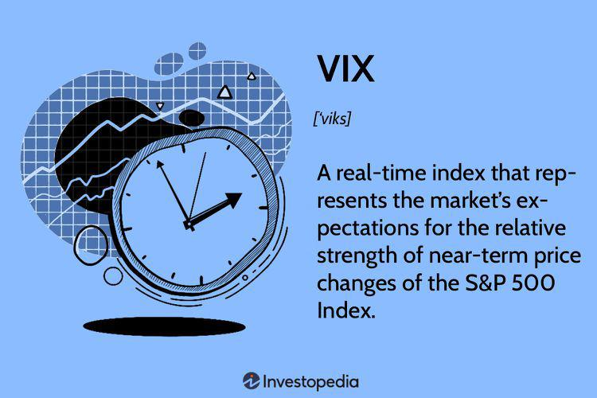

The Cboe Volatility Index (VIX) serves as a crucial barometer for gauging market sentiment and anticipated volatility. Commonly referred to as the 'Fear Index,' the VIX offers insights into the market's expectations of future volatility, particularly concerning the S&P 500 index. Established by the Chicago Board Options Exchange (Cboe) in 1993, this forward-looking indicator plays a significant role in financial markets by helping investors and traders assess potential fluctuations in stock prices over a 30-day period.

The VIX is calculated using the prices of S&P 500 index options, effectively capturing the implied volatility of those options. This calculation provides a transparent view of market participants' collective assessment of uncertainty and risk, making it an indispensable tool in trading and investment strategy formulation.



This article elucidates the complexities of the VIX, highlighting its importance within the stock market ecosystem and its application in algorithmic trading strategies. By comprehending the intricacies of the VIX, traders—whether seasoned or novice—can better align their strategies with prevailing market conditions. Understanding the VIX and its interplay with market dynamics is essential for effectively navigating periods of uncertainty and capitalizing on opportunities presented by market volatility.

## Table of Contents

## Understanding the Cboe VIX

The Cboe Volatility Index (VIX) is a composite of real-time prices of options on the S&P 500 index (SPX), reflecting investors' consensus view of future 30-day expected stock market volatility. Introduced in 1993 by the Chicago Board Options Exchange (Cboe), it provides a standardized measure for quantifying market expectations of volatility. The VIX is often perceived as a gauge of investor sentiment, specifically the level of fear or complacency in the market.

Mathematically, the VIX is derived from the prices of SPX options, utilizing the implied volatilities calculated through a process involving a wide range of out-of-the-money put and call options. The formula incorporates the weighted average of the option's implied volatilities, allowing analysts to project the expected movement in the S&P 500 over the coming 30 days. The specific formula used is:

$$
VIX = 100 \times \sqrt{\frac{2}{T} \sum \frac{\Delta K_i}{K_i^2} e^{RT} Q(K_i) - \frac{1}{T} \left(\frac{F}{K_0} - 1\right)^2}
$$

where $T$ is the time to expiration, $\Delta K_i$ is the interval between strike prices, $K_i$ is a specific strike price, $R$ is the risk-free interest rate, $Q(K_i)$ is the midpoint of the bid/ask spread for each option, and $F$ is the forward index level derived from index option prices.

The relationship between the VIX and stock market prices is typically inverse. During periods of declining stock prices, market participants often anticipate higher [volatility](/wiki/volatility-trading-strategies), leading to increased demand for protective options, which in turn elevates the VIX value. Conversely, during market upswings, volatility expectations generally diminish, resulting in a lower VIX. This inverse correlation positions the VIX as both a fear and sentiment index within financial markets. Its value can range significantly, generally between 10 to 80, signifying varying degrees of market unease or calm. 

Understanding these dynamics equips traders and investors with insights into market psychology, offering opportunities to strategize their investment approaches considering potential market fluctuations.

## The Evolution and Products of VIX

Since its inception, the Cboe Volatility Index (VIX) has witnessed significant evolution, marked by the introduction of various financial instruments designed to leverage its properties as a measure of market sentiment and risk. Initially developed by the Chicago Board Options Exchange (Cboe) in 1993, the VIX was intended as a benchmark index to gauge the market's expectations of future volatility, particularly for the S&P 500. Over the years, it has grown beyond a mere index to encompass a suite of derivatives that facilitate diverse trading strategies.

VIX futures, introduced in 2004, were the first derivative products to offer investors the ability to trade based on future expectations of volatility. These futures contracts allowed traders to separately speculate on or hedge against anticipated changes in volatility without having to directly engage with the underlying equity markets. The success of VIX futures paved the way for the introduction of VIX options in 2006, providing traders with additional flexibility to construct strategies involving volatility expectations alongside other assets.

The development of VIX derivatives was motivated by the need to address fluctuating market conditions and investor sentiment, driving innovation in the creation of additional volatility products. Among these are various exchange-traded funds (ETFs) and exchange-traded notes (ETNs), which offer exposure to VIX futures. These products enable a broader range of investors to incorporate volatility into their portfolios, serving as tools for hedging against market declines or capitalizing on periods of significant uncertainty.

In addition to the original VIX derivatives, several other volatility indices have emerged, each tailored to track different segments of the market or specific geographic regions. These indices allow traders to adopt strategies that are sensitive to particular volatility implications, further enriching their ability to manage risk. The associated products, including sector-specific volatility indexes or international volatility measures, cater to diverse trading strategies that facilitate the sizing of portfolios against expected market movements.

In summary, the evolution of the VIX from a simple barometer of market sentiment to a complex ecosystem of derivatives and related instruments underscores its critical role in modern financial markets. By enabling various risk management and speculative strategies, VIX-related products have become invaluable tools in the sophisticated landscape of contemporary trading.

## Algorithmic Trading and the VIX

Algorithmic trading has harnessed the predictive power of the Cboe Volatility Index (VIX) to enhance decision-making processes and refine execution strategies. Complex algorithms employ VIX data to assess market conditions, enabling traders to efficiently manage positions in response to anticipated volatility shifts. The integration of VIX in algorithmic frameworks allows for the automation of trades based on conditions such as abrupt increases in volatility or sentiment shifts. 

An algorithm might use the VIX as a trigger to hedge portfolios, using derivatives like VIX futures to protect against adverse market movements. For instance, a rise in the VIX might prompt algorithms to increase their positions in VIX futures, anticipating further market downturns. Additionally, algorithms can exploit VIX derivatives for speculative purposes or to enhance returns by betting on volatility movements. For these tasks, algorithms often incorporate predictive modeling and [machine learning](/wiki/machine-learning) techniques to forecast VIX movements accurately.

The mathematical underpinning of algorithmic strategies using the VIX often involves quantitative models like the GARCH (Generalized Autoregressive Conditional Heteroskedasticity) model, which helps predict future volatility metrics based on past data. Here is a simple Python snippet illustrating the use of a basic model to predict volatility:

```python
from arch import arch_model

# Historical volatility data from VIX
vix_data = [...]  # Historical VIX data

# Fit a GARCH model
model = arch_model(vix_data, vol='Garch', p=1, q=1)
model_fit = model.fit(disp='off')

# Predict future volatility
volatility_forecast = model_fit.forecast(horizon=1)
predicted_volatility = volatility_forecast.variance[-1:]
```

In this context, algorithms can process significant volumes of data at high speeds, generating trading decisions that would be difficult to achieve manually. By leveraging the VIX, [algorithmic trading](/wiki/algorithmic-trading) firms can design sophisticated risk management strategies, balance portfolios, and exploit inefficiencies in the market. Ultimately, the use of VIX within algorithmic trading strategies represents an advanced application of quantitative analysis, offering profound insights and operational advantages in dynamic market environments.

## Trading Strategies Involving the VIX

Traders employ a variety of strategies involving the VIX through derivatives such as Exchange-Traded Funds (ETFs), Exchange-Traded Notes (ETNs), and futures. These financial instruments offer exposure to market volatility and are essential tools for translating volatility forecasts into actionable trades.

One common approach to leverage the VIX is through hedging strategies. Investors often use VIX futures and options contracts to protect their portfolios against sudden market downturns. By taking a position in VIX-related products, traders aim to offset potential losses that may occur when market volatility increases. For instance, when there is an expectation of heightened volatility, a trader might purchase VIX call options, which could increase in value as the VIX rises, thus compensating for losses in equity holdings.

Another strategy involves market timing and speculative plays by gauging potential wider market movements using the VIX. A rising VIX can indicate increased fear in the market, prompting traders to reduce equity exposure or shift to safer asset classes like bonds or commodities. Conversely, a decreasing VIX suggests market stability, encouraging traders to increase holdings in riskier assets.

ETFs and ETNs that track VIX indices provide more accessible options for investors who prefer not to engage directly in futures markets. These products offer exposure to VIX variations without the complexities of actively managing futures contracts. Examples include the iPath S&P 500 VIX Short-Term Futures ETN (VXX) and the ProShares VIX Short-Term Futures [ETF](/wiki/etf-trading-strategies) (VIXY).

Mathematical models and algorithmic trading systems also integrate VIX data to enhance trading strategies. These algorithms analyze VIX trends and correlations with other market indicators to automate trade execution, aiming to capitalize on anticipated market shifts. By calculating potential market risks using statistical models that incorporate the VIX, algorithms can dynamically adjust investment portfolios to optimize returns or mitigate risks.

Overall, the use of VIX products in trading strategies provides a flexible approach to dealing with uncertainty and market fluctuations, allowing traders to strategically manage volatility exposure and hedge against potential losses.

## The Impact of VIX on Market Movements

The Cboe Volatility Index (VIX), serving as a contrary indicator of market sentiment, is observed meticulously during periods of market instability. It serves as an influential tool for traders and investors to gauge the level of fear or complacency within the market. This predictive power can be particularly significant during sudden market downturns or turmoil when the behavior of the VIX often provides critical insights into potential market dynamics.

One notable instance showcasing the influence of the VIX was during the February 2018 market correction. At that time, the VIX experienced a dramatic spike, dubbed the "Volmageddon," where the index surged by over 100% in a single day from February 5 to February 6, 2018. This unprecedented rise was driven by systematic volatility-targeting strategies, which forced a cascade of selling in the markets. The spike in the VIX exposed vulnerabilities in many leveraged and inverse-volatility exchange-traded products (ETPs) that had grown popular among retail investors, leading to substantial losses and market-wide effects.

The VIX's function as a "fear gauge" means that its rapid escalation often precedes or coincides with significant downturns in the equity markets. When the VIX rises sharply, it typically signals heightened market fears, prompting traders to adjust their portfolios towards safer assets or hedge their positions more aggressively against anticipated declines. This recognition can lead to increased market volatility, as evidenced during the "Volmageddon" episode, where the VIX's movement had a direct impact on trading behavior, leading to further market instability.

Moreover, the broader implications extend beyond market pricing. An elevated VIX level influences margin requirements, trading costs, and [liquidity](/wiki/liquidity-risk-premium) conditions, thus playing a substantial role in the overall risk management frameworks employed by financial institutions and individual investors alike. In volatile times, stakeholders may reconsider their risk tolerance, adjust their exposure to equities, or increase diversification strategies to mitigate potential losses.

In conclusion, the VIX not only anticipates future volatility but also actively contributes to shaping market dynamics through its influence on investor behavior and strategic financial decisions. Understanding these nuances can provide a significant advantage in both navigating and capitalizing on market fluctuations.

## Conclusion

The Cboe VIX, often referred to as the "Fear Index," stands as a crucial component in the toolkit of traders and analysts alike, offering insights into potential future volatility within the S&P 500. It serves as both a cornerstone for understanding market sentiment and a strategic instrument for navigating the complexities of market dynamics. For traditional traders, the VIX provides a way to gauge market sentiment and anticipate possible downturns, allowing for more informed decision-making and strategic hedging. Algorithmic traders utilize the VIX to fine-tune their models and algorithms, enabling them to react swiftly to changes in market volatility and optimize their trades for maximum returns.

By comprehensively understanding and leveraging the VIX, traders enhance their ability to align trading strategies with prevailing market conditions. This alignment can lead to more effective risk management and the potential for increased returns. It allows traders to adjust their portfolios accordingly, whether by hedging through VIX-linked products or by using the VIX as an indicator for broader market trends. In essence, the VIX equips both traditional and algorithmic traders with the insights needed to adeptly manage the uncertainties inherent in market volatility, ensuring that their strategies remain robust and responsive to changing market sentiments.

## References & Further Reading

[1]: Cboe Global Markets. ["Cboe Volatility Index (VIX) White Paper"](https://cdn.cboe.com/api/global/us_indices/governance/Volatility_Index_Methodology_Cboe_Volatility_Index.pdf)

[2]: Whaley, R. E. (2009). ["Understanding the VIX"](https://www.researchgate.net/publication/277429711_Understanding_the_VIX). The Journal of Portfolio Management, 35(3), 98-105.

[3]: Simon, D. P. (2003). ["The Nasdaq Volatility Index During and After the Bubble"](https://www.semanticscholar.org/paper/The-Nasdaq-Volatility-Index-During-and-After-the-Simon/2924df2a87ba6522ca7b133ea99e9a4107246804), The Journal of Derivatives, 10(4), 9-24.

[4]: Zhang, H. (2010). ["The VIX: Trick or Treat?"](https://cpb-us-w2.wpmucdn.com/sites.wustl.edu/dist/0/249/files/2016/03/JFEC_Hao_Zhang-1klbr8e.pdf) The Journal of Alternative Investments, 12(2), 56-80.

[5]: ["Option Pricing Models and Volatility Using Excel-VBA"](https://onlinelibrary.wiley.com/doi/book/10.1002/9781119202097) by Fabrice Douglas Rouah and Gregory Vainberg

[6]: Alexander, C. (2008). ["Market Risk Analysis, Volume II: Practical Financial Econometrics"](https://pdfs.semanticscholar.org/159a/c49d31ebb0e594e993935a463c42c97874e6.pdf). Wiley.