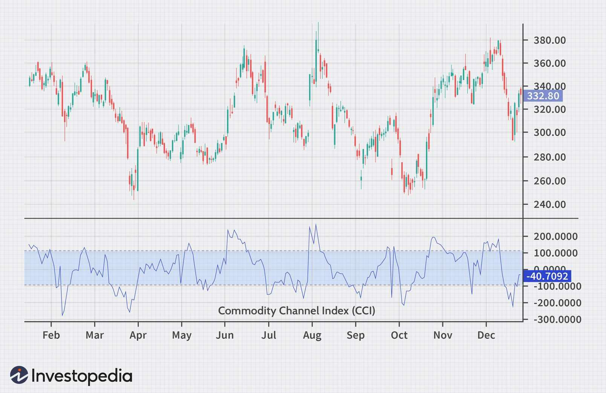

The Commodity Channel Index (CCI) is a widely recognized technical indicator extensively utilized within the domain of algorithmic trading. This article investigates the range of strategies leveraging the CCI indicator to enhance traders' decision-making processes. As a momentum oscillator, the CCI assists traders in identifying overbought and oversold market conditions, making it applicable across a variety of asset classes, such as stocks and commodities.

Initially developed by Donald R. Lambert in 1980, the CCI was designed to analyze the commodities market, yet its application has significantly broadened to include diverse securities including stocks, exchange-traded funds (ETFs), and more. By capturing the deviations of a security's price from its statistical mean, the CCI facilitates traders in determining the market's strength and direction.



Implementing the CCI in algorithmic trading can greatly benefit traders by providing data-driven insights that enhance strategic decision-making. Employing such insights, traders can achieve a more systematic approach, reducing emotional biases that often accompany trading decisions. Traders benefit from understanding mathematical calculations and the theory underlying the CCI, equipping them with the knowledge to apply it effectively.

This guide aims to cover the functionality and utilization of the CCI indicator, including effective trading strategies tailored for its integration into algorithmic trading systems. By exploring these components, traders can gain an advantageous edge in financial markets through meticulously designed and backtested trading strategies that incorporate the CCI.

## Table of Contents

## What is the CCI Indicator?

The Commodity Channel Index (CCI) indicator is a tool used in technical analysis to measure the current price level relative to an average price level over a specified period. This measurement helps identify the strength and direction of the market, assisting traders in making informed decisions. The CCI was originally developed by Donald R. Lambert in 1980 for use in the commodities market. However, its adaptability and effectiveness have led to its widespread application across various securities, including stocks and exchange-traded funds (ETFs).

The CCI operates as an oscillator, fluctuating between positive and negative values. Typically, readings above +100 suggest that a security may be overbought, indicating a possible downturn or selling opportunity, while readings below -100 imply that a security could be oversold, suggesting a potential upturn or buying opportunity. This binary overbought/oversold framework is a valuable part of many trading strategies, aiding in the timing of entry and exit points.

Understanding the calculation of the CCI is essential for traders to leverage this tool effectively. The CCI formula is as follows:

$$
CCI = \frac{(TP - SMA_{TP})}{0.015 \times \text{Mean Deviation}}
$$

Where:
- $TP$ is the Typical Price, calculated as $(\text{High} + \text{Low} + \text{Close}) / 3$.
- $SMA_{TP}$ is the Simple Moving Average of the Typical Price over a chosen period.
- The constant 0.015 is used to ensure that approximately 70% to 80% of CCI values fall between +100 and -100.
- Mean Deviation is the average of the absolute differences between the Typical Price and the $\text{SMA}_{TP}$.

This calculation provides a normalized view of the price action, allowing traders to compare different securities and timeframes seamlessly. Mastery of the CCI's theoretical underpinnings and computational methodology empowers traders to incorporate it into their algorithmic strategies effectively. For those using programming languages like Python, libraries such as pandas and numpy can facilitate the computation and analysis of the CCI, further enhancing its integration into trading systems.

## Setting Up CCI in Algorithmic Trading

Algorithmic traders utilize the Commodity Channel Index (CCI) by designing and implementing strategies that automatically execute trades in response to its signals. Setting up the CCI in [algorithmic trading](/wiki/algorithmic-trading) involves several critical steps that ensure the effective use of this [momentum](/wiki/momentum)-based oscillator.

Firstly, traders must determine the optimal period for CCI readings. The period is the number of time intervals over which the CCI is calculated, influencing the sensitivity of the indicator to price changes. Commonly, periods range from 5 to 20 days, with shorter periods making the CCI more responsive to price changes and longer periods smoothing out short-term [volatility](/wiki/volatility-trading-strategies). Finding the right balance depends on the asset's characteristics and the trader's strategy preferences.

The CCI is calculated using the formula:

$$
\text{CCI} = \frac{\text{Typical Price} - \text{SMA}(\text{Typical Price})}{0.015 \times \text{Mean Deviation}}
$$

Where:

- The Typical Price is the average of the high, low, and close prices for a given period.
- SMA(Typical Price) is the Simple Moving Average of the Typical Price.
- Mean Deviation is the average of the absolute differences between the Typical Price and its SMA.

Traders need to establish levels that define overbought and oversold conditions for the specific asset they are dealing with. While the conventional levels are above +100 for overbought and below -100 for oversold, traders may need to adjust these thresholds based on historical performance and asset volatility. Customizing these levels according to the asset's behavior can improve the predictive power of the CCI signals.

Backtesting frameworks are indispensable tools in this setup process. Through [backtesting](/wiki/backtesting), traders apply their CCI-based strategies to historical market data, allowing them to evaluate the potential effectiveness of their system. Key performance metrics such as drawdowns, the profit [factor](/wiki/factor-investing), and win-loss ratios can be analyzed to assess the strategy's strength and weaknesses. A detailed backtesting regimen helps traders refine their strategies, adjust periods, and thresholds, and ultimately provide confidence before deploying the system in live trading.

Python, with its rich suite of libraries like pandas for data manipulation and [backtrader](/wiki/backtrader) or zipline for backtesting, is often utilized for this purpose. Here is an example of how Python can set up a simple CCI-based strategy:

```python
import pandas as pd
import talib
import backtrader as bt

# Define a simple strategy using Backtrader
class CCIStrategy(bt.Strategy):
    params = (('period', 14), ('overbought', 100), ('oversold', -100))

    def __init__(self):
        self.cci = bt.indicators.CommodityChannelIndex(self.data, period=self.params.period)

    def next(self):
        if not self.position:
            if self.cci > self.params.overbought:
                self.sell()  # Signal to sell if CCI is overbought
            elif self.cci < self.params.oversold:
                self.buy()  # Signal to buy if CCI is oversold
        else:
            if self.position.size > 0 and self.cci > 0:
                self.close()  # Close long position
            elif self.position.size < 0 and self.cci < 0:
                self.close()  # Close short position

# Load data and run strategy
data = bt.feeds.YahooFinanceData(dataname='AAPL', fromdate=pd.Timestamp('2022-01-01'), todate=pd.Timestamp('2023-01-01'))
cerebro = bt.Cerebro()
cerebro.adddata(data)
cerebro.addstrategy(CCIStrategy)
cerebro.run()
```

This code sets up a basic strategy using Backtrader, reading data from Yahoo Finance. The CCI is calculated with a period of 14, and trades are made based on the overbought and oversold thresholds set in the strategy parameters. By continuously backtesting and refining these setups, traders enhance the likelihood of achieving profitable outcomes with CCI in algorithmic trading.

## Strategies Utilizing the CCI Indicator

The Commodity Channel Index (CCI) indicator is a versatile tool that can be applied to various trading strategies, enhancing decision-making by identifying potential market trends, reversals, and market anomalies. Understanding and implementing CCI-based strategies can be lucrative for traders, provided they tailor their approach to specific market conditions and asset classes.

### Trend Following

The trend-following strategy with the CCI indicator is straightforward yet powerful. Traders look for CCI values moving above +100 to signal potential long positions, indicating the start of a bullish market trend. Conversely, when the CCI drops below -100, it suggests bearish conditions, prompting traders to consider short positions. This strategy aims to capitalize on significant market movements by aligning trades with the momentum.

The implementation of this strategy can be automated using a simple Python script:

```python
def trend_following_strategy(data, cci_period):
    data['CCI'] = ta.cci(data['High'], data['Low'], data['Close'], timeperiod=cci_period)
    data['Signal'] = 0
    data['Signal'][data['CCI'] > 100] = 1  # Long position
    data['Signal'][data['CCI'] < -100] = -1  # Short position
    return data
```

### Mean Reversion

Mean reversion is another popular strategy involving the CCI indicator. This approach assumes that an asset's price will revert to its mean or average level over time. Traders enter long positions when the CCI value is significantly low, suggesting oversold conditions, while they opt for short positions when the CCI is highly positive, indicating overbought scenarios. The effectiveness of this strategy often depends on the stability of market conditions and the chosen look-back period for the CCI.

Example of determining entry points in Python:

```python
def mean_reversion_strategy(data, cci_period, threshold=100):
    data['CCI'] = ta.cci(data['High'], data['Low'], data['Close'], timeperiod=cci_period)
    data['Buy_Signal'] = (data['CCI'] < -threshold)  # Oversold
    data['Sell_Signal'] = (data['CCI'] > threshold)  # Overbought
    return data
```

### Divergence

Divergence between the CCI and actual price movement offers a valuable signal for potential reversals. A bullish divergence occurs when prices fall to a new low, but the CCI does not, suggesting a potential upward reversal. Conversely, a bearish divergence happens when prices reach new highs while the CCI fails to do so, indicating a possible downturn. Divergence strategies often provide early signals and are useful for traders seeking to anticipate market reversals.

To detect divergence, visual analysis is often effective, but algorithmic detection can be implemented with additional complexity involving comparative analysis of price and indicator data trends.

### Strategy Optimization

Each of these strategies can be optimized by adjusting their specific rules and parameters, a process generally carried out through backtesting. Backtests involve running these strategies over historical data to assess their potential performance, refining them by altering periods, thresholds, and signal triggers to enhance profitability.

Imports and libraries such as Pandas, NumPy, and TA-Lib in Python provide efficient means to execute these strategies programmatically, allowing for rigorous testing and fine-tuning, making the CCI a valuable component for systematic trading systems. By leveraging data points offered by the CCI and combining them with solid strategy frameworks, traders can harness robust trading methodologies tailored to their trading goals and market conditions.

## Backtesting CCI Strategies

Backtesting applying CCI-based trading strategies to historical data is crucial in evaluating their effectiveness and viability in algorithmic trading. This process allows traders to quantify potential drawdowns, determine the profit factor, and analyze win-loss ratios under varied market conditions. For instance, calculating the profit factor involves dividing the gross profits by the gross losses of a trading strategy. A profit factor greater than one indicates that the strategy is profitable.

Here's a basic outline on how backtesting can be implemented using Python and the popular `pandas` and `numpy` libraries:

```python
import pandas as pd
import numpy as np

# Sample historical data
data = pd.read_csv('historical_data.csv')
prices = data['Close']

# Calculate the CCI
def calculate_cci(prices, period=20):
    ma = prices.rolling(window=period).mean()
    md = prices.rolling(window=period).apply(lambda x: np.fabs(x - x.mean()).mean(), raw=True)
    cci = (prices - ma) / (0.015 * md)
    return cci

# Strategy implementation
def backtest_strategy(prices, cci):
    cash = 10000  # Starting with $10,000
    position = 0  # No position at the start

    for i in range(len(prices)):
        if cci[i] > 100 and position <= 0:
            # Enter long position
            position = cash / prices[i]
            cash = 0
        elif cci[i] < -100 and position > 0:
            # Enter short position
            cash = position * prices[i]
            position = 0

    # Final cash balance or value of held position
    final_balance = cash + position * prices.iloc[-1]
    return final_balance

# Backtesting
cci = calculate_cci(prices)
final_value = backtest_strategy(prices, cci)
profit = final_value - 10000
print(f"Profit from backtesting: ${profit:.2f}")
```

This code snippet illustrates a simple CCI-based strategy where a trade is entered when the CCI moves above +100 (long) or below -100 (short) and exited under opposite conditions. It assumes beginning with a cash balance of $10,000 and calculates profits based on the final balance. 

Backtesting offers insights for improving strategy parameters and helps in identifying the conditions under which the Commodity Channel Index (CCI) strategies perform best. However, traders should be aware of overfitting, a risk where strategies are too closely tailored to historical data but fail in real-time trading. To mitigate this, it's recommended to use a portion of data for training and a separate set for validation, known as walk-forward analysis. Ultimately, backtesting guides risk management and strategy refinement to better predict and navigate future market movements.

## Advantages and Limitations of the CCI Indicator

The Commodity Channel Index (CCI) indicator offers several advantages and limitations that traders should consider when incorporating it into their trading strategies.

**Advantages:**

1. **Versatility:** The CCI is a highly adaptable tool that can be applied across a myriad of financial markets, including equities, commodities, forex, and indices. Its design to gauge momentum and identify potential reversals makes it valuable for diverse trading scenarios.

2. **Entry and Exit Points:** The CCI's ability to identify both overbought and oversold conditions provides traders with clear entry and exit signals. This can be particularly useful for timing trades in trending markets, where momentum shifts are essential to capture.

3. **Ease of Use:** With a straightforward calculation method using the formula:
$$
   CCI = \frac{(Typical \, Price - SMA_{n})}{0.015 \times Mean \, Deviation}

$$
   where $(Typical \, Price = \frac{High + Low + Close}{3})$, traders can efficiently integrate CCI into their strategies. The constant $0.015$ is used to ensure most CCI values fall between +100 and -100.

**Limitations:**

1. **Lagging Indicator:** As a momentum-based lagging indicator, the CCI may not react swiftly to market changes, particularly in fast-moving conditions. This delay can result in missed opportunities or late entries and exits.

2. **False Signals:** In markets that lack a clear trend or exhibit significant volatility, the CCI might generate false signals, leading to potential losses. This is especially true when the market conditions oscillate rapidly without maintaining a sustained direction.

3. **Reversal Ineffectiveness:** The CCI struggles with accurately predicting market reversals in rapidly changing environments. By the time the indicator signals a change, the market may have already shifted significantly.

Given these limitations, traders often combine the CCI with other technical analysis tools and indicators, such as moving averages, MACD, or RSI, to create a more robust trading system. This combination aims to mitigate false signals and enhance decision-making accuracy. For instance, a trader might employ a moving average crossover to confirm a CCI signal before executing a trade, providing an additional layer of verification and reducing the risk of acting on erroneous signals.

## Conclusion

The Commodity Channel Index (CCI) indicator continues to be favored by traders for its adaptability in detecting market conditions across various asset classes. Its ability to identify overbought and oversold situations offers traders valuable insight for making informed entry and [exit](/wiki/exit-strategy) decisions. However, merely relying on CCI signals without a comprehensive risk management framework could expose traders to significant market risks. Therefore, integrating CCI with other technical indicators and robust risk management strategies is crucial to mitigate potential losses.

Implementing ongoing backtesting and refinements is essential for sustaining a profitable trading strategy involving CCI in algorithmic systems. Backtesting allows traders to simulate how CCI strategies would have performed in different historical market scenarios. This helps assess the effectiveness of the strategies and refine them to align with current market trends. Utilizing backtesting frameworks to pinpoint the potential drawdowns, profit factors, and win-loss ratios under various conditions reinforces the strategy's robustness.

In conclusion, while the CCI indicator provides strong signals, consistent performance in trading necessitates a strategic approach that incorporates risk management, ongoing analysis, and refinement to adapt to ever-changing market dynamics.

## References & Further Reading

[1]: Lambert, D. R. (1980). "The Commodity Channel Index: Tools for Trading Cycles." Commodities (August issue), 62-64.

[2]: Murphy, J. J. (1999). ["Technical Analysis of the Financial Markets: A Comprehensive Guide to Trading Methods and Applications."](https://www.amazon.com/Technical-Analysis-Financial-Markets-Comprehensive/dp/0735200661) New York Institute of Finance.

[3]: Pring, M. J. (2002). ["Technical Analysis Explained"](https://www.amazon.com/Technical-Analysis-Explained-Fifth-Successful/dp/0071825177), McGraw-Hill.

[4]: Jansen, Stefan. (2021). ["Machine Learning for Algorithmic Trading: Predictive models to extract signals from market and alternative data for systematic trading strategies with Python"](https://www.amazon.com/Machine-Learning-Algorithmic-Trading-alternative/dp/1839217715). Packt Publishing.

[5]: Kaufman, P. J. (2013). ["Trading Systems and Methods"](https://www.amazon.com/Trading-Systems-Methods-Website-Wiley/dp/1118043561), Wiley Trading.