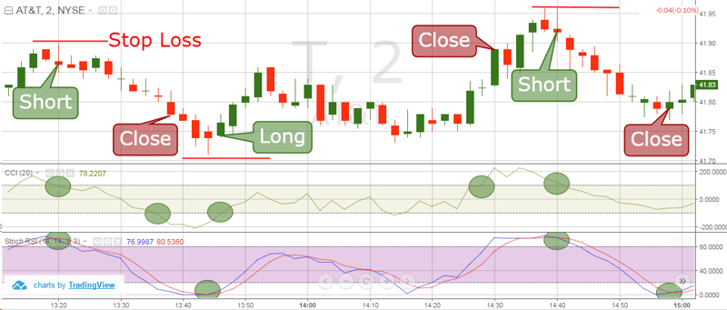

## Table of Contents

## What is the Commodity Channel Index (CCI) and how is it calculated?

The Commodity Channel Index (CCI) is a technical indicator used in trading to help identify if an asset is overbought or oversold. It was developed by Donald Lambert and is commonly used in analyzing commodities, but it can also be applied to other types of securities. The CCI measures the difference between an asset's current price and its average price over a chosen period of time. Traders use it to spot potential trend reversals and to generate buy or sell signals.

To calculate the CCI, you first need to determine the typical price, which is the average of the high, low, and closing prices for each period. Next, you calculate a simple moving average of the typical price over a set number of periods, usually 20. Then, you find the mean deviation, which is the average of the absolute differences between the typical price and its moving average. Finally, the CCI is calculated using the formula: CCI = (Typical Price - Moving Average) / (0.015 x Mean Deviation). The result is a value that oscillates around zero, with readings above +100 suggesting an overbought condition and readings below -100 indicating an oversold condition.

## What are the key components of the CCI formula?

The CCI formula has three main parts: the typical price, the moving average, and the mean deviation. The typical price is found by adding the high, low, and closing prices of a period and then dividing by three. This gives you an average price for that period. The moving average is then calculated by taking the typical prices over a set number of periods, usually 20, and averaging them. This helps smooth out the price data over time.

The mean deviation is the third part, and it measures how much the typical prices vary from the moving average. To find it, you take the absolute difference between each typical price and the moving average, then average those differences. Once you have these three components, you can calculate the CCI. The formula is: CCI = (Typical Price - Moving Average) / (0.015 x Mean Deviation). This gives you a number that shows if the price is high or low compared to what's normal.

## How does the CCI help in identifying overbought and oversold conditions?

The Commodity Channel Index (CCI) helps traders figure out if a stock or commodity is overbought or oversold. When the CCI goes above +100, it means the price might be too high and could go down soon. This is called an overbought condition. Traders might think about selling their investments when they see this. On the other hand, when the CCI drops below -100, it suggests that the price might be too low and could go up. This is an oversold condition, and it might be a good time to buy.

The CCI uses a special formula to come up with these numbers. It looks at the average price over a certain time, usually 20 days, and compares it to how much prices usually move around. If the current price is a lot higher or lower than what's normal, the CCI will show that with a number above +100 or below -100. By watching these numbers, traders can make better decisions about when to buy or sell.

## What are the typical threshold values used for the CCI indicator?

The typical threshold values for the Commodity Channel Index (CCI) are +100 and -100. When the CCI goes above +100, it means the price might be too high and could go down soon. This is called an overbought condition. Traders might think about selling their investments when they see this. On the other hand, when the CCI drops below -100, it suggests that the price might be too low and could go up. This is an oversold condition, and it might be a good time to buy.

These threshold values help traders make decisions by showing when prices are moving a lot away from what's normal. The CCI uses a special formula to come up with these numbers. It looks at the average price over a certain time, usually 20 days, and compares it to how much prices usually move around. If the current price is a lot higher or lower than what's normal, the CCI will show that with a number above +100 or below -100. By watching these numbers, traders can make better decisions about when to buy or sell.

## How can the CCI be used to generate buy and sell signals?

The Commodity Channel Index (CCI) can help traders figure out when to buy or sell a stock or commodity. When the CCI goes above +100, it means the price might be too high and could go down soon. This is called an overbought condition. Traders might see this as a signal to sell their investments because the price might drop. On the other hand, when the CCI drops below -100, it suggests that the price might be too low and could go up. This is an oversold condition, and it might be a good time to buy because the price could rise.

Traders can also use the CCI to spot when the price might start to change direction. For example, if the CCI has been below -100 and starts to move back above -100, it might be a sign that the price is going to go up. This could be a good time to buy. Similarly, if the CCI has been above +100 and starts to move back below +100, it might mean the price is going to go down. This could be a signal to sell. By watching these movements, traders can make better decisions about when to buy or sell.

## What are the differences between using CCI for short-term and long-term trading?

When using the Commodity Channel Index (CCI) for short-term trading, traders focus on quick changes in the CCI value to make fast buy or sell decisions. They might look for the CCI to go above +100 as a signal to sell because the price might drop soon. If the CCI goes below -100, it could be a sign to buy because the price might go up. Short-term traders often use a shorter time period, like 10 or 14 days, to calculate the CCI, so they can catch these quick changes. They need to be ready to act fast and might trade more often.

For long-term trading, the approach is different. Long-term traders use the CCI to see bigger trends over time. They might use a longer period, like 20 or 30 days, to smooth out the CCI values and get a clearer picture of where the price is going. They look for the CCI to stay above +100 for a while as a sign that the price might keep going up, so they might buy and hold. If the CCI stays below -100 for a while, it could mean the price will keep dropping, so they might sell or wait for a better time to buy. Long-term traders don't trade as often and focus on bigger, slower changes in the market.

## Can the CCI be used effectively in trending markets, and if so, how?

Yes, the CCI can be used effectively in trending markets. In a strong uptrend, the CCI often stays above +100 for a long time. This means the price is going up and might keep going up. Traders can use this to decide to buy and hold onto their investments. They might wait for the CCI to dip a bit but stay above +100 before buying more, thinking the uptrend will continue. On the other hand, if the CCI drops below +100 but then quickly goes back above it, this could be a good sign to keep holding or even buy more, as the uptrend is still strong.

In a strong downtrend, the CCI often stays below -100 for a long time. This means the price is going down and might keep going down. Traders can use this to decide to sell or short sell their investments. They might wait for the CCI to rise a bit but stay below -100 before selling more, thinking the downtrend will continue. If the CCI goes above -100 but then quickly drops back below it, this could be a good sign to keep selling or even short sell more, as the downtrend is still strong. By watching how the CCI behaves in a trend, traders can make better decisions about when to buy or sell.

## How does the CCI perform in different market conditions, such as ranging or volatile markets?

In ranging markets, where the price moves up and down within a certain range, the CCI can help traders find good times to buy or sell. When the CCI goes above +100, it might be a good time to sell because the price could drop back down to the middle of the range. When the CCI goes below -100, it might be a good time to buy because the price could go back up to the middle of the range. Traders can use these signals to make money by buying low and selling high within the range. The CCI works well in these markets because it can spot when the price is at the top or bottom of the range.

In volatile markets, where the price moves a lot and changes quickly, the CCI can be a bit trickier to use. The CCI might go above +100 and below -100 a lot because the price is moving so much. Traders need to be careful and might want to use a shorter time period to calculate the CCI, like 10 or 14 days, so they can catch these quick changes. They might also want to use the CCI along with other indicators to make sure their signals are good. Even though it's harder to use in volatile markets, the CCI can still help traders find good times to buy or sell if they pay close attention to it.

## What are some common strategies that incorporate the CCI, and how do they work?

One common strategy that uses the CCI is called the overbought/oversold strategy. Traders using this strategy watch for the CCI to go above +100, which means the price might be too high and could go down soon. When they see this, they might decide to sell their investments. On the other hand, if the CCI goes below -100, it means the price might be too low and could go up soon. This is when traders might decide to buy. This strategy works well in markets where the price moves up and down within a certain range, helping traders buy low and sell high.

Another strategy is the trend-following strategy. In this approach, traders look at how the CCI behaves in strong trends. If the CCI stays above +100 for a long time during an uptrend, traders might keep buying and holding their investments, expecting the price to keep going up. If the CCI stays below -100 for a long time during a downtrend, traders might keep selling or short selling, expecting the price to keep going down. This strategy helps traders make money by riding the trend until the CCI shows signs that the trend might be ending.

A third strategy is the divergence strategy. Traders using this look for times when the price of a stock or commodity is moving one way, but the CCI is moving the other way. For example, if the price is going up but the CCI is going down, it might mean the price will soon start to drop. Traders might sell their investments when they see this kind of divergence. If the price is going down but the CCI is going up, it might mean the price will soon start to rise, and traders might buy. This strategy helps traders spot when the price might change direction, even if it's not clear from looking at the price alone.

## How can traders combine the CCI with other technical indicators to improve trading decisions?

Traders can combine the CCI with other technical indicators to make better trading decisions. One common way is to use the CCI along with moving averages. For example, a trader might use a simple moving average to see the overall trend of a stock or commodity. If the CCI goes above +100 and the price is above the moving average, it could be a strong signal to buy because both indicators suggest the price might keep going up. On the other hand, if the CCI goes below -100 and the price is below the moving average, it could be a strong signal to sell because both indicators suggest the price might keep going down.

Another way to improve trading decisions is by using the CCI with the Relative Strength Index (RSI). The RSI also helps spot overbought and oversold conditions, but it uses a different formula. If both the CCI and RSI show that a stock is overbought (CCI above +100 and RSI above 70), it could be a very strong signal to sell. If both show that a stock is oversold (CCI below -100 and RSI below 30), it could be a very strong signal to buy. By using these two indicators together, traders can get more confident signals about when to buy or sell.

## What are the potential pitfalls and limitations of using the CCI as a trading tool?

Using the CCI as a trading tool can have some pitfalls. One big problem is that the CCI can give false signals, especially in volatile markets. The price might move a lot and make the CCI go above +100 or below -100, but then the price might not go the way the CCI suggests. This can make traders buy or sell at the wrong times and lose money. Another issue is that the CCI works best in certain types of markets, like ranging markets. In trending markets, the CCI might stay above +100 or below -100 for a long time, which can make it hard for traders to know when to buy or sell.

Another limitation of the CCI is that it doesn't work well on its own. Traders need to use it with other indicators, like moving averages or the RSI, to get more reliable signals. Relying only on the CCI can lead to bad trading decisions because it doesn't give a complete picture of the market. Also, the CCI can be affected by the time period used to calculate it. If the time period is too short, the CCI might give too many signals, and if it's too long, it might miss important changes in the market. Traders need to be careful and adjust the time period based on the market conditions and their trading style.

## How can advanced traders customize the CCI settings to better fit specific trading styles or assets?

Advanced traders can customize the CCI settings to fit their specific trading styles or the assets they trade by changing the time period used to calculate the CCI. For example, if a trader likes to make quick trades, they might use a shorter time period, like 10 or 14 days, to get more signals and catch fast changes in the price. On the other hand, if a trader likes to hold onto their investments for a longer time, they might use a longer time period, like 20 or 30 days, to smooth out the CCI values and get a clearer picture of the bigger trends. By choosing the right time period, traders can make the CCI work better for their style of trading.

Another way to customize the CCI is by adjusting the overbought and oversold thresholds. The usual thresholds are +100 and -100, but traders can change these numbers to fit the asset they are trading. For example, if an asset tends to stay in overbought or oversold conditions for a long time, a trader might set the thresholds higher or lower to avoid getting false signals. This can help traders get more accurate signals for when to buy or sell. By tweaking these settings, advanced traders can make the CCI a more useful tool for their specific needs.

## What is the CCI Indicator?

The Commodity Channel Index (CCI) indicator is a tool used in technical analysis to measure the current price level relative to an average price level over a specified period. This measurement helps identify the strength and direction of the market, assisting traders in making informed decisions. The CCI was originally developed by Donald R. Lambert in 1980 for use in the commodities market. However, its adaptability and effectiveness have led to its widespread application across various securities, including stocks and exchange-traded funds (ETFs).

The CCI operates as an oscillator, fluctuating between positive and negative values. Typically, readings above +100 suggest that a security may be overbought, indicating a possible downturn or selling opportunity, while readings below -100 imply that a security could be oversold, suggesting a potential upturn or buying opportunity. This binary overbought/oversold framework is a valuable part of many trading strategies, aiding in the timing of entry and [exit](/wiki/exit-strategy) points.

Understanding the calculation of the CCI is essential for traders to leverage this tool effectively. The CCI formula is as follows:

$$
CCI = \frac{(TP - SMA_{TP})}{0.015 \times \text{Mean Deviation}}
$$

Where:
- $TP$ is the Typical Price, calculated as $(\text{High} + \text{Low} + \text{Close}) / 3$.
- $SMA_{TP}$ is the Simple Moving Average of the Typical Price over a chosen period.
- The constant 0.015 is used to ensure that approximately 70% to 80% of CCI values fall between +100 and -100.
- Mean Deviation is the average of the absolute differences between the Typical Price and the $\text{SMA}_{TP}$.

This calculation provides a normalized view of the price action, allowing traders to compare different securities and timeframes seamlessly. Mastery of the CCI's theoretical underpinnings and computational methodology empowers traders to incorporate it into their algorithmic strategies effectively. For those using programming languages like Python, libraries such as pandas and numpy can facilitate the computation and analysis of the CCI, further enhancing its integration into trading systems.

## How do you set up CCI in algorithmic trading?

Algorithmic traders utilize the Commodity Channel Index (CCI) by designing and implementing strategies that automatically execute trades in response to its signals. Setting up the CCI in [algorithmic trading](/wiki/algorithmic-trading) involves several critical steps that ensure the effective use of this [momentum](/wiki/momentum)-based oscillator.

Firstly, traders must determine the optimal period for CCI readings. The period is the number of time intervals over which the CCI is calculated, influencing the sensitivity of the indicator to price changes. Commonly, periods range from 5 to 20 days, with shorter periods making the CCI more responsive to price changes and longer periods smoothing out short-term [volatility](/wiki/volatility-trading-strategies). Finding the right balance depends on the asset's characteristics and the trader's strategy preferences.

The CCI is calculated using the formula:

$$
\text{CCI} = \frac{\text{Typical Price} - \text{SMA}(\text{Typical Price})}{0.015 \times \text{Mean Deviation}}
$$

Where:

- The Typical Price is the average of the high, low, and close prices for a given period.
- SMA(Typical Price) is the Simple Moving Average of the Typical Price.
- Mean Deviation is the average of the absolute differences between the Typical Price and its SMA.

Traders need to establish levels that define overbought and oversold conditions for the specific asset they are dealing with. While the conventional levels are above +100 for overbought and below -100 for oversold, traders may need to adjust these thresholds based on historical performance and asset volatility. Customizing these levels according to the asset's behavior can improve the predictive power of the CCI signals.

Backtesting frameworks are indispensable tools in this setup process. Through [backtesting](/wiki/backtesting), traders apply their CCI-based strategies to historical market data, allowing them to evaluate the potential effectiveness of their system. Key performance metrics such as drawdowns, the profit [factor](/wiki/factor-investing), and win-loss ratios can be analyzed to assess the strategy's strength and weaknesses. A detailed backtesting regimen helps traders refine their strategies, adjust periods, and thresholds, and ultimately provide confidence before deploying the system in live trading.

Python, with its rich suite of libraries like pandas for data manipulation and [backtrader](/wiki/backtrader) or zipline for backtesting, is often utilized for this purpose. Here is an example of how Python can set up a simple CCI-based strategy:

```python
import pandas as pd
import talib
import backtrader as bt

# Define a simple strategy using Backtrader
class CCIStrategy(bt.Strategy):
    params = (('period', 14), ('overbought', 100), ('oversold', -100))

    def __init__(self):
        self.cci = bt.indicators.CommodityChannelIndex(self.data, period=self.params.period)

    def next(self):
        if not self.position:
            if self.cci > self.params.overbought:
                self.sell()  # Signal to sell if CCI is overbought
            elif self.cci < self.params.oversold:
                self.buy()  # Signal to buy if CCI is oversold
        else:
            if self.position.size > 0 and self.cci > 0:
                self.close()  # Close long position
            elif self.position.size < 0 and self.cci < 0:
                self.close()  # Close short position

# Load data and run strategy
data = bt.feeds.YahooFinanceData(dataname='AAPL', fromdate=pd.Timestamp('2022-01-01'), todate=pd.Timestamp('2023-01-01'))
cerebro = bt.Cerebro()
cerebro.adddata(data)
cerebro.addstrategy(CCIStrategy)
cerebro.run()
```

This code sets up a basic strategy using Backtrader, reading data from Yahoo Finance. The CCI is calculated with a period of 14, and trades are made based on the overbought and oversold thresholds set in the strategy parameters. By continuously backtesting and refining these setups, traders enhance the likelihood of achieving profitable outcomes with CCI in algorithmic trading.

## What are the advantages and limitations of the CCI Indicator?

The Commodity Channel Index (CCI) indicator offers several advantages and limitations that traders should consider when incorporating it into their trading strategies.

**Advantages:**

1. **Versatility:** The CCI is a highly adaptable tool that can be applied across a myriad of financial markets, including equities, commodities, forex, and indices. Its design to gauge momentum and identify potential reversals makes it valuable for diverse trading scenarios.

2. **Entry and Exit Points:** The CCI's ability to identify both overbought and oversold conditions provides traders with clear entry and exit signals. This can be particularly useful for timing trades in trending markets, where momentum shifts are essential to capture.

3. **Ease of Use:** With a straightforward calculation method using the formula:
$$
   CCI = \frac{(Typical \, Price - SMA_{n})}{0.015 \times Mean \, Deviation}

$$
   where $(Typical \, Price = \frac{High + Low + Close}{3})$, traders can efficiently integrate CCI into their strategies. The constant $0.015$ is used to ensure most CCI values fall between +100 and -100.

**Limitations:**

1. **Lagging Indicator:** As a momentum-based lagging indicator, the CCI may not react swiftly to market changes, particularly in fast-moving conditions. This delay can result in missed opportunities or late entries and exits.

2. **False Signals:** In markets that lack a clear trend or exhibit significant volatility, the CCI might generate false signals, leading to potential losses. This is especially true when the market conditions oscillate rapidly without maintaining a sustained direction.

3. **Reversal Ineffectiveness:** The CCI struggles with accurately predicting market reversals in rapidly changing environments. By the time the indicator signals a change, the market may have already shifted significantly.

Given these limitations, traders often combine the CCI with other technical analysis tools and indicators, such as moving averages, MACD, or RSI, to create a more robust trading system. This combination aims to mitigate false signals and enhance decision-making accuracy. For instance, a trader might employ a moving average crossover to confirm a CCI signal before executing a trade, providing an additional layer of verification and reducing the risk of acting on erroneous signals.

## References & Further Reading

[1]: Lambert, D. R. (1980). "The Commodity Channel Index: Tools for Trading Cycles." Commodities (August issue), 62-64.

[2]: Murphy, J. J. (1999). ["Technical Analysis of the Financial Markets: A Comprehensive Guide to Trading Methods and Applications."](https://www.amazon.com/Technical-Analysis-Financial-Markets-Comprehensive/dp/0735200661) New York Institute of Finance.

[3]: Pring, M. J. (2002). ["Technical Analysis Explained"](https://www.amazon.com/Technical-Analysis-Explained-Fifth-Successful/dp/0071825177), McGraw-Hill.

[4]: Jansen, Stefan. (2021). ["Machine Learning for Algorithmic Trading: Predictive models to extract signals from market and alternative data for systematic trading strategies with Python"](https://www.amazon.com/Machine-Learning-Algorithmic-Trading-alternative/dp/1839217715). Packt Publishing.

[5]: Kaufman, P. J. (2013). ["Trading Systems and Methods"](https://www.amazon.com/Trading-Systems-Methods-Website-Wiley/dp/1118043561), Wiley Trading.