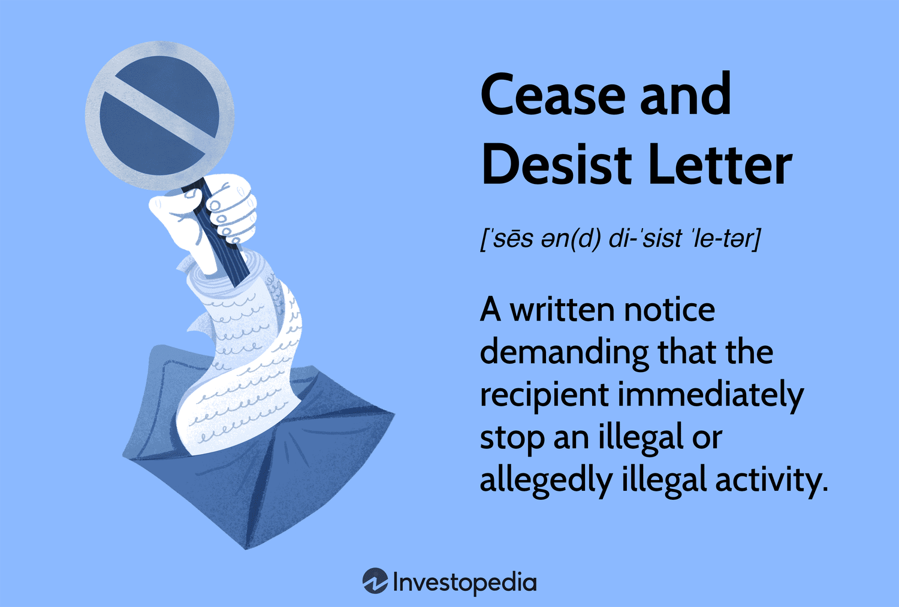

Intellectual property (IP) has undergone significant transformation in the digital age, shaping industries characterized by rapid technological advancement and innovation. Within this context, algorithmic trading stands out as a particularly dynamic field. Algorithmic trading involves leveraging computer algorithms to execute trading decisions rapidly and efficiently, significantly influencing the financial markets. Its innovation-driven nature emphasizes the necessity of robust intellectual property protection to safeguard the proprietary algorithms and strategies that give firms a competitive edge.

As technology and finance increasingly intersect, the protection of intellectual property emerges as a critical concern. In these sectors, intellectual property encompasses patents, copyrights, trademarks, and trade secrets, each offering avenues to shield innovative work. Patents protect novel inventions, copyrights cover original works of authorship, trademarks distinguish brand identity, and trade secrets encompass confidential business information that provides a competitive advantage. For firms engaged in algorithmic trading, protecting these intellectual assets is essential to maintaining their uniqueness and market position.



Amid these challenges, cease and desist letters have become a vital legal tool. A cease and desist letter serves as a formal request for an individual or organization to stop engaging in alleged unlawful activity, such as IP infringement. By utilizing this legal strategy, companies can proactively defend their intellectual innovations against unauthorized use or reproduction. It is a preliminary step that can preempt lengthy and costly litigation, provided that the claims within the letter are well-founded and legally sound.

This article explores the interplay between intellectual property and algorithmic trading, highlighting the importance of IP protection in contemporary financial and technological landscapes. Specifically, it examines the role of cease and desist letters as a mechanism to enforce and safeguard proprietary innovations. By addressing these topics, the article aims to shed light on the evolving challenges and strategies associated with protecting intellectual property in algorithmic trading.

## Table of Contents

## Understanding Intellectual Property in Algorithmic Trading

Intellectual property (IP) representing creations of the mind, is a cornerstone in protecting innovations and creations in various sectors, including algorithmic trading. The main types of intellectual property include patents, copyrights, trademarks, and trade secrets. Patents provide exclusive rights to inventors for their inventions, typically those offering a new and useful process or system. Copyrights protect original works of authorship, such as software code. Trademarks identify and distinguish products or services, while trade secrets encompass confidential business information that provides a competitive edge.

In algorithmic trading, the protection of intellectual property is particularly challenging due to the complex and technical nature of trading algorithms. These algorithms often combine unique strategies, proprietary data analysis methods, and cutting-edge technology to execute trades. This complexity makes it difficult to determine what aspects are protectable under existing IP laws. For example, while a specific software code might be copyrightable, the underlying trading strategy may hinge more on trade secrecy for its protection, as strategies must remain undisclosed to maintain their advantage over competitors.

Examples of intellectual property within trading algorithms manifest in various forms. A patented algorithm may represent a novel way to process financial data or predict market movements. Copyrighted elements could include the source code used to program the algorithm. A trademark might protect the brand name of a trading platform that uses these algorithms, ensuring that consumers associate the name with innovative service and performance. Trade secrets might include proprietary datasets, the logic behind specific trading rules, or parameters that influence trade execution.

Protecting intellectual property is of paramount importance for firms engaged in [algorithmic trading](/wiki/algorithmic-trading), as such IP often constitutes the core of their competitive advantage. Proper IP protection mechanisms deter competitors from copying innovative trading methods, thus preserving profits and market share. Without protection, firms risk losing their unique market positioning and the financial investment in developing their proprietary algorithms. Furthermore, robust IP frameworks encourage further innovation by ensuring that entities can reap the benefits of their research and development efforts without undue risk of misappropriation. Consequently, firms must strategically navigate IP laws and craft comprehensive protection plans that encompass all aspects of their algorithmic technologies.

## What is a Cease and Desist Letter?

A cease and desist letter is a formal, written document used to demand that an individual or organization stop engaging in an activity that is considered unlawful or infringing upon the rights of others. These letters assert legal rights without initiating formal litigation, serving as a preliminary step in resolving disputes. The recipient is asked to "cease" — stop the offending action — and "desist" — refrain from taking such actions in the future.

### Definition of Cease and Desist Letters and Their Legal Significance

Cease and desist letters are significant in legal contexts as they provide the infringing party with an official notice of a rights violation. These letters often aim to warn the recipient before pursuing more formal legal action, such as filing a lawsuit. They function as both a warning and a deterrent, potentially resolving disputes without court involvement. Legally, they clarify that the sender is serious about enforcing their rights and has identified specific legal grounds for their demands.

### Common Scenarios Where Cease and Desist Letters Are Used

Cease and desist letters are commonly used in situations involving:

1. **Intellectual Property Infringement**: This includes unauthorized use of copyrighted materials, trademarks, patents, or trade secrets. For example, a company might issue a cease and desist letter to another business suspected of copying its proprietary software code or algorithms.

2. **Defamation**: If an individual or entity believes they are the subject of false and damaging statements, they may send a cease and desist letter to the party making those statements to stop further defamation.

3. **Contractual Disputes**: If one party believes another is violating the terms of a contract, a cease and desist letter can request them to adhere to the contract terms or face potential legal action.

4. **Harassment or Violations of Privacy**: Individuals may send cease and desist letters to stop personal harassment or invasion of privacy, serving as a formal request for the activity to cease.

### Role of Cease and Desist Letters in Protecting Intellectual Property Rights

In the context of protecting intellectual property (IP), cease and desist letters are critical tools. They offer a non-litigative means to enforce IP rights, clearly articulating the infringement and providing the infringer an opportunity to cease the violation. This can prevent further damage to the IP holder and provide the infringer a chance to remedy the situation without escalating to litigation.

In fields like algorithmic trading, where proprietary algorithms and strategies are key competitive advantages, maintaining the exclusivity and confidentiality of this intellectual property is vital. A cease and desist letter might be sent to a competitor suspected of misappropriating proprietary trading algorithms or using similar algorithmic strategies illegally.

### Understanding the Impact and Enforcement of Cease and Desist Letters in the Trading Industry

In the trading industry, cease and desist letters can have significant impacts. They serve as a crucial first step in defending proprietary trading strategies and technologies. However, enforcement depends on the specific circumstances and the strength of the evidence provided in the letter. The letter itself does not have the force of law but signals the sender's intent to protect their IP rights through legal means if necessary.

A well-drafted letter that clearly outlines the specific rights being violated and provides evidence of such infringement is more likely to achieve compliance. However, if the recipient believes the claims are unfounded, they may choose to contest the letter's assertions. Consequently, legal counsel is often sought before sending or responding to such letters to ensure the claims or defenses are legally sound.

In conclusion, cease and desist letters play a pivotal role in safeguarding intellectual property within the trading industry. By effectively communicating the infringement and potential consequences, they encourage compliance and provide a pathway to resolve disputes efficiently.

## Legal Considerations in Sending a Cease and Desist for Algo Trading

When considering the issuance of a cease and desist letter in the context of algorithmic trading, it is critical to include several key legal elements to ensure the strength and validity of the claims. These elements typically consist of a clear identification of the intellectual property (IP) being infringed, a description of the alleged infringing activity, and a demand to cease the infringing actions. Additionally, the letter should specify potential remedies and legal actions that may be pursued if the infringing party does not comply. This clarity not only aids in the resolution of the dispute but also reinforces the seriousness and legitimacy of the claims.

Ensuring the legality and validity of the claims is paramount. The claim must be substantiated by a firm legal basis, verifying that the sender holds the rights to the intellectual property in question and that the alleged infringing activities indeed constitute a breach. This can be backed by documentation such as patents, copyrights, or evidence of trade secrets. A well-reasoned and fact-based approach minimizes the risk of counterclaims or legal disputes that could arise from an unfounded or exaggerated claim.

Sending a cease and desist letter without proper justification can precipitate several potential legal consequences. If the recipient believes the claims are frivolous or made in bad faith, they could respond with a lawsuit for wrongful threats or seek a declaratory judgment of non-infringement. This can lead to both financial liabilities and reputational harm for the sender, making it essential to ensure that the claims are not only accurate but also proportionate to the alleged infringement.

Legal professionals can provide invaluable guidance when drafting a cease and desist letter. Consultation with a lawyer who specializes in intellectual property law can help assess the strength of a case and ensure that the letter aligns with legal standards. Lawyers can advise on the appropriateness of the claims, the language used, and the potential outcomes of sending such a letter. Moreover, they can help plan strategic responses to potential retaliation from the recipient. In complex technical domains such as algorithmic trading, utilizing expert legal advice is often indispensable. 

Ultimately, a strategically crafted cease and desist letter not only serves as a tool for protecting intellectual property but also mitigates risks while upholding lawful conduct in the competitive algorithmic trading sector.

## Case Studies: Intellectual Property Disputes in Algo Trading

Algorithmic trading, a domain characterized by high-speed transactions and complex computational models, has experienced numerous challenges related to intellectual property (IP) disputes. To understand these issues, examining notable cases offers insight into the intricacies of legal conflicts and the precedents they set.

One significant case is the dispute between proprietary trading firms, where one firm accused another of stealing its trading algorithms. In such cases, the primary legal concern revolves around the trade secrets. Trade secrets in algorithmic trading typically involve proprietary trading strategies, high-frequency trading systems, or particular models for market predictions. The defendant in such disputes may be a former employee or a competitor alleged to have used these secret algorithms without authorization.

A landmark case was Citadel LLC vs. Teza Technologies. In this instance, Citadel accused several former employees of taking confidential algorithmic strategies to Teza Technologies. The dispute highlighted critical legal precedents, particularly regarding the enforceability of non-compete agreements and the protection of trade secrets through non-disclosure agreements (NDAs). The resolution underscored the importance for firms to ensure comprehensive employment agreements and rigorous internal controls to guard proprietary systems.

The legal outcomes from such cases have established precedents that emphasize protecting IP through robust contractual obligations. The necessity for firms to focus on crafting detailed NDAs and non-compete clauses that are enforceable in court has become apparent. Additionally, jurisdictional considerations and the specific language in contracts play crucial roles in these disputes' outcomes.

These cases have imparted significant lessons for trading firms. First, they emphasize the critical need for internal protocols to ensure all trade secrets are well-documented and that their confidentiality is continuously preserved. Companies should regularly update their IP protections to align with evolving technology and legal standards.

Preventative measures taken by firms following such disputes include enhancing their cybersecurity infrastructure to ensure trading algorithms are secure from unauthorized access. Businesses increasingly employ advanced encryption methods and access controls, ensuring that only authorized personnel can access sensitive data. Moreover, regular audits and monitoring systems are put in place to detect and prevent any potential leaks of proprietary information.

Furthermore, firms are adopting a proactive approach by engaging in IP training for employees, focusing on the importance of maintaining confidentiality and understanding the legal obligations under their contract terms. Developing a company culture that prioritizes IP protection is becoming widespread as part of these preventative strategies.

Overall, the need for vigilance in safeguarding intellectual property within algorithmic trading is more critical than ever. By learning from past litigation, businesses are better equipped to preempt potential IP conflicts and ensure the security of their valuable trading algorithms.

## Best Practices for Protecting Intellectual Property in Algorithmic Trading

Protecting intellectual property (IP) in algorithmic trading is essential for firms looking to maintain their competitive edge and secure proprietary innovations. Here are some best practices to help safeguard these valuable assets:

### Strategies for Safeguarding Algorithms and Trading Strategies as IP

#### Confidentiality Agreements and Contracts
Confidentiality agreements, or non-disclosure agreements (NDAs), are fundamental tools for protecting sensitive information related to trading algorithms. These contracts legally bind parties to confidentiality, preventing them from sharing proprietary algorithms with unauthorized entities. Such agreements should encompass detailed definitions of trade secrets and specify the obligations of each party regarding non-disclosure and use of the protected information. In addition to NDAs, employment contracts should include clear clauses about IP ownership to prevent disputes when employees leave or work remotely.

#### Technology Solutions to Trace and Secure Trading Algorithms
Emerging technology plays a critical role in the protection of trading algorithms. Encryption is a foundational solution for securing data. Algorithms should be encrypted both at rest and during transmission to prevent unauthorized access. Moreover, firms can utilize blockchain technology to establish a tamper-proof record of algorithm development, which can serve as evidence of ownership if a dispute arises. Additionally, watermarking digital assets with unique identification codes can help trace unauthorized use or distribution.

Using version control systems can also enhance security. By keeping a comprehensive log of all changes made to code, firms can detect unauthorized modifications and prove original authorship. Git, a popular version control software, is often employed for this purpose. Firms can restrict access to repositories, allowing only authorized personnel to view or modify code. Here's a simple example of initializing a Git repository for algorithm storage:

```bash
# Initialize a Git repository
git init
# Add all files related to the algorithm
git add .
# Commit the files with an appropriate message
git commit -m "Initial commit of trading algorithm"
```

#### Proactive Measures to Monitor and Respond to IP Infringement
Monitoring for IP infringement involves staying vigilant and actively searching for unauthorized usage of trading algorithms. This can be achieved through specialized software that scans for instances of proprietary code on the internet. Regular audits of both internal and external systems are essential to ensure compliance with IP protection policies.

Firms should establish a rapid response plan for potential IP breaches. This includes setting up a dedicated team that can quickly assess any reports of infringement and take appropriate legal action if necessary. Prompt issuance of cease and desist letters, as discussed elsewhere, is a critical component of this response.

Additionally, fostering a culture of awareness around IP issues within the organization is beneficial. Regular training sessions about the importance of IP protection and the specific measures in place can increase organizational vigilance and reduce the risk of accidental breaches.

In conclusion, protecting intellectual property in algorithmic trading requires a combination of legal, technological, and organizational strategies. By implementing robust confidentiality agreements, leveraging advanced encryption and tracking technologies, and maintaining vigilant monitoring for IP infringements, firms can significantly enhance the security of their valuable algorithmic assets.

## Conclusion

As algorithms and [machine learning](/wiki/machine-learning) models become increasingly integral to the success of trading operations, safeguarding intellectual property (IP) has emerged as a critical focus for firms operating in the finance and technology sectors. Intellectual property protection in algorithmic trading is vital not only to maintain a competitive edge but also to foster innovation and secure substantial financial investments. 

Cease and desist letters play a pivotal role in protecting these intangible assets. By formally notifying alleged infringers of potential IP violations, these letters provide an opportunity to address disputes outside of court. This legal strategy is essential in mitigating IP conflicts, allowing firms to assert their rights and deter unauthorized use of their proprietary technologies and strategies. 

In an era characterized by rapid technological advancement, firms must remain vigilant and proactive in their IP protection strategies. Staying informed and adapting to new challenges as they arise can prevent costly legal battles and protect the core of their business. Implementing strong confidentiality agreements, maintaining detailed documentation, and utilizing advanced technological solutions for monitoring and securing algorithms are essential practices in this regard.

As the landscape of intellectual property in the financial sector continues to evolve, companies are encouraged to adopt comprehensive IP strategies. This ensures not only compliance with legal standards but also promotes a culture of innovation and ethical conduct. Looking forward, the intersection of technology and finance will likely necessitate even more robust measures to protect the intellectual property that forms the crux of algorithmic trading operations.

## References & Further Reading

[1]: Bergstra, J., Bardenet, R., Bengio, Y., & Kégl, B. (2011). ["Algorithms for Hyper-Parameter Optimization."](https://papers.nips.cc/paper/4443-algorithms-for-hyper-parameter-optimization) Advances in Neural Information Processing Systems 24.

[2]: ["Advances in Financial Machine Learning"](https://www.amazon.com/Advances-Financial-Machine-Learning-Marcos/dp/1119482089) by Marcos Lopez de Prado

[3]: ["Evidence-Based Technical Analysis: Applying the Scientific Method and Statistical Inference to Trading Signals"](https://www.amazon.com/Evidence-Based-Technical-Analysis-Scientific-Statistical/dp/0470008741) by David Aronson

[4]: ["Machine Learning for Algorithmic Trading"](https://github.com/stefan-jansen/machine-learning-for-trading) by Stefan Jansen

[5]: ["Quantitative Trading: How to Build Your Own Algorithmic Trading Business"](https://www.amazon.com/Quantitative-Trading-Build-Algorithmic-Business/dp/1119800064) by Ernest P. Chan

[6]: Leiblein, M.J., & Reuer, J.J. (2017). ["Building a Competitive Advantage through Innovation and Intellectual Property Protection."](https://strategicmanagementreview.net/assets/articles/Leiblein%20and%20Reuer.pdf) Journal of Management.

[7]: Patra, J.C., et al. (2009). ["Intellectual Property Rights in Computer Software: Implications in Algorithm Trading."](https://scholar.google.com/citations?user=Nt7xa94AAAAJ&hl=en) IEEE Transactions on Engineering Management.