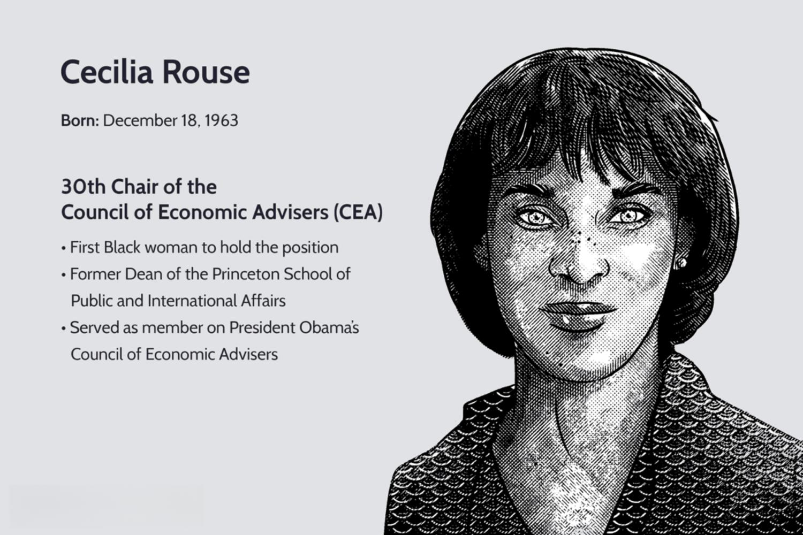

Cecilia Rouse is a prominent figure in the field of economics, distinguished by her extensive academic achievements and influential roles in public service and policy-making institutions. Her career reflects a commitment to advancing economic understanding and applying this knowledge to address complex societal issues. Rouse has made notable contributions to academia through her research in labor economics and the economics of education, areas where her work has often set new standards for scholarship.

Rouse's career is characterized by a seamless blend of theoretical and applied economics. In academia, she has been a faculty member at prestigious institutions, notably Princeton University, where she has been involved in pioneering research. Her academic output has significantly contributed to discussions around socioeconomic mobility, education, and labor markets. This research has not only enriched academic discourse but has also had practical applications in shaping public policy.



In government service, Rouse's expertise was further recognized through her appointments to the Council of Economic Advisers under both the Obama and Biden administrations. Her tenure as chair of the Council was particularly noteworthy, marking a historic appointment as the first Black woman to hold the position. In this role, she provided crucial economic guidance during challenging times, influencing economic policy at the highest levels.

Rouse's impact also reaches into algorithmic trading and financial markets, where her academic insights into economic behaviors and market dynamics underscore the importance of data-driven decision-making in finance. Her championing of these techniques has been instrumental in highlighting the value of economic education in enhancing financial market efficiencies.

Overall, Cecilia Rouse's journey through academia, government, and think tanks highlights her as a trailblazer in leveraging economics to address broad social and economic challenges. Her dedication to economic equity and education continues to influence public policy and academic research, cementing her legacy as a transformative figure in economic thought and practice.

## Table of Contents

## Early Life and Educational Background

Cecilia Rouse was born in Walnut Creek, California, into a family that prioritized education, which played a significant role in shaping her future endeavors. Her upbringing in such an environment instilled in her a robust appreciation for learning from an early age. This foundation paved the way for her academic pursuits, culminating in her studies at Harvard University. 

At Harvard, Rouse pursued her interest in economics, a field that she would come to excel in, [earning](/wiki/earning-announcement) both a Bachelor of Arts and a Ph.D. in economics. During her undergraduate studies, she immersed herself in economic theories and principles, laying a solid groundwork for her future research and professional achievements. Her doctoral studies further honed her analytical skills and deepened her understanding of economic issues, particularly those related to labor economics and educational outcomes.

The experiences and education Cecilia Rouse acquired at Harvard played a vital role in propelling her toward a prestigious academic career. Her comprehensive education equipped her with the analytical tools and critical thinking skills necessary to contribute significantly to economic scholarship and public policy discussions.

## Academia and Research at Princeton University

Cecilia Rouse's association with Princeton University began in 1992, initiating a prolific period of academic contribution and research in economics, specifically focused on labor economics and the economics of education. Her tenure at Princeton as a professor of economics and public affairs is notable for its emphasis on understanding and improving socioeconomic mobility through education.

Rouse's research in labor economics investigates how various factors, including education, affect labor market outcomes. Her work sheds light on the significant role education plays in shaping individuals' economic opportunities and overall economic mobility. A key aspect of her research includes examining the efficacy of educational policies and their long-term impacts on the workforce.

One groundbreaking study by Rouse assessed the impact of education on socioeconomic mobility. By analyzing educational interventions and their subsequent influence on socioeconomic outcomes, her research provided empirical evidence supporting the argument that access to quality education can significantly reduce economic disparities. Her studies often employed rigorous econometric methods to isolate the causal effects of educational policies, ensuring reliable insights that can inform policy decisions.

Additionally, Rouse contributed to the analysis of the education system's role in economic inequality. By evaluating how educational reforms could potentially enhance equity in labor markets, she offered valuable perspectives on crafting policies that promote equal opportunities. Her work highlighted the importance of considering both direct and indirect factors that contribute to educational success and failures within different demographic groups.

Rouse's academic contributions at Princeton extended beyond research. As a dedicated educator, she mentored numerous students and budding economists, influencing the next generation of scholars in economics. Her commitment to education, both as a subject of research and as a means of professional nurturing, underscored her role in advancing economic policy and theory and reinforcing the connection between academic inquiry and real-world applications.

## Influential Career in Public Policy

Cecilia Rouse's tenure in public policy, particularly her service on the Council of Economic Advisers (CEA), stands out as a significant period in her career. Serving under both the Obama and Biden administrations, Rouse's contributions were both groundbreaking and pivotal.

During her time with the Obama administration, Rouse was a member of the CEA from 2009 to 2011. Her work during this period was crucial, as the nation grappled with the aftermath of the 2008 financial crisis. Rouse provided insightful economic advice that shaped recovery strategies. She focused on labor markets, education policies, and the long-term economic growth of the country. Her strong analytical skills and ability to translate complex economic concepts into actionable policies were invaluable as the administration worked to stabilize the economy and stimulate job creation.

Rouse's influence further expanded during the Biden administration when she became the chair of the CEA in 2021. Her appointment was historic, as she was the first Black woman to hold this prestigious position. As chair, Rouse led the council in navigating the economic challenges posed by the COVID-19 pandemic. Her leadership played a crucial role in crafting policies that aimed to bolster economic recovery and resilience. She emphasized the importance of equitable economic solutions and the need to address systemic disparities.

Under Rouse's guidance, the CEA provided advice on a wide array of issues, including labor market dynamics, fiscal policy, and economic equity. Her approach was data-driven, advocating for policies that were both scientifically sound and practically effective. Her tenure was marked by efforts to increase transparency and accessibility in economic policy discussions. Rouse's contributions during this time underscore her commitment to using her expertise to address both immediate and long-term economic challenges.

Her role in providing essential economic guidance has left a lasting impact on the policy landscape, emphasizing the importance of equity and data-driven decision-making in crafting effective economic policies.

## Algorithmic Trading and Economic Advancements

Cecilia Rouse's academic work influences various sectors of finance, particularly [algorithmic trading](/wiki/algorithmic-trading), where her insights into economic education and data-driven methodologies have proven influential. Her economic research emphasizes the pivotal role that education plays in financial markets, advocating for a robust understanding of economic principles to navigate and optimize market operations.

Rouse has highlighted the significance of incorporating data analytics within economic paradigms to bring about efficiency and transparency in financial markets. Algorithmic trading, which relies heavily on complex algorithms and high-frequency data processing, benefits greatly from her approach. By applying economic theories to algorithmic models, financial practitioners can devise strategies that are more aligned with market realities, thereby reducing anomalies and enhancing predictability.

Her contributions are anchored on using advanced data analysis techniques to improve market efficiencies. Rouse advocates for the integration of econometric tools that not only scrutinize market data but also interpret underlying economic patterns. This approach assists traders and economists in predicting price movements and devising more accurate trading algorithms.

Consider the implementation of predictive models in algorithmic trading. A Python code snippet illustrating a simple moving average crossover strategy might look like this:

```python
import numpy as np
import pandas as pd

# Assuming 'data' is a DataFrame with a 'Close' column representing the closing prices
short_window = 40
long_window = 100

# Calculating the short and long moving averages
signals = pd.DataFrame(index=data.index)
signals['signal'] = 0.0
signals['short_mavg'] = data['Close'].rolling(window=short_window, min_periods=1).mean()
signals['long_mavg'] = data['Close'].rolling(window=long_window, min_periods=1).mean()

# Generating signals
signals['signal'][short_window:] = np.where(signals['short_mavg'][short_window:] 
                                            > signals['long_mavg'][short_window:], 1.0, 0.0)

# Calculating positions
signals['positions'] = signals['signal'].diff()
```

This example aligns economic theory with practical financial tools, demonstrating how theoretical insights translate into real-world applications. By championing data analytics, Rouse's perspectives contribute to refining strategies that traders employ, which in turn can lead to improved market dynamics and economic stability. Her emphasis on education in economics equips market participants with the necessary skills to adapt in rapidly evolving financial landscapes.

## Published Works and Contributions

Cecilia Rouse has made substantial contributions to economic literature, predominantly through her work published in various academic journals. Her research primarily focuses on education, labor markets, and economic disparities, addressing key issues that influence public policy and socioeconomic development.

In her studies on education, Rouse has explored the efficacy of private school vouchers, analyzing their impact on student performance and educational outcomes. This research provides critical insights into school choice policies and their implications for equal access to quality education. Her findings often highlight the nuanced effects of vouchers, considering factors such as socioeconomic background and local education systems.

Rouse has also extensively examined the consequences of student debt on career choices, shedding light on how financial obligations influence professional trajectories and economic mobility. Her work underscores the significant role that student debt plays in determining post-graduation decisions, affecting sectors ranging from public service to entrepreneurship.

Her academic investigations are underpinned by rigorous empirical methods, utilizing large datasets and statistical techniques to derive evidence-based conclusions. These studies contribute to the broader understanding of labor economics and education policy, offering data-driven insights that shape policy debates and reforms.

Her published works serve as essential resources for policymakers, economists, and educators aiming to address economic disparities and promote equity through informed economic frameworks. By focusing on pivotal issues, Rouse's research continues to inform and influence contemporary economic thought and public policy.

## Leadership at the Brookings Institution

After completing her service in the Biden administration as chair of the Council of Economic Advisers, Cecilia Rouse was appointed president of the Brookings Institution in 2024. This marked a significant continuation of her career, allowing her to further influence public policy through rigorous research and advocacy. Under her leadership, the institution has made strides in addressing complex global economic challenges.

Rouse’s tenure at Brookings is characterized by a commitment to applying academically robust, data-driven techniques to develop innovative solutions for economic issues. Her background in labor economics and the economics of education informs her approach, driving initiatives that aim to rectify socioeconomic disparities and promote equitable growth. A particular focus has been placed on harnessing the power of education as a tool for socioeconomic mobility and applying this understanding to broader policy frameworks.

One of the main objectives during her presidency is to address pressing global economic challenges, including income inequality, climate change, and the integration of technology in financial systems. Rouse advocates for policies that marry economic theory with practical applications, aiming to devise strategies that are both sustainable and socially responsible. Her leadership style encourages interdisciplinary collaboration, bringing together experts from various fields to create comprehensive policy solutions.

Moreover, Rouse emphasizes the importance of utilizing advanced data analytics in shaping effective policy. In her view, the integration of big data and algorithmic techniques in economic research and policy-making can significantly enhance market efficiencies and lead to more informed decision-making processes. This approach resonates with her earlier academic work which often underscored the vital role of data-driven methodologies in maximizing the efficacy of economic policy.

Rouse continues to engage with the academic community through her role at Brookings, contributing to the discourse on global economic governance. Her ability to translate complex economic concepts into actionable policy recommendations remains a hallmark of her leadership. As such, her work at Brookings is poised to make substantial contributions to contemporary economic thought and practice, reinforcing the institution’s role as a leading think tank.

Through her stewardship at Brookings, Cecilia Rouse is cementing her legacy as a pivotal figure in addressing the multifaceted economic challenges of our time. Her efforts ensure that the institution continues to be a beacon of knowledge and a driver of impactful policy solutions on an international scale.

## Legacy and Impact

Cecilia Rouse’s career exemplifies a profound commitment to advancing economic equity and education, leaving a legacy that impacts both academic circles and real-world policy frameworks. Her contributions extend beyond traditional academic pursuits, reflecting her dedication to applying economic principles to practical policy applications aimed at reducing social inequalities.

Throughout her tenure in academia and government, Rouse has advocated for policies that address economic disparities. Her work emphasizes the importance of equitable education as a fundamental driver of socioeconomic mobility. By highlighting the intrinsic link between education and economic opportunity, Rouse has helped shape policies that promote access to quality education for underserved communities, thereby fostering economic empowerment.

Rouse's influence is also evident in her role as a policy advisor. As the chair of the Council of Economic Advisers, she provided strategic guidance on economic policies that aimed to bridge the gap between different economic strata. Her efforts have been integral in formulating initiatives that support economic resilience and inclusivity, ensuring that economic recovery plans account for the needs of marginalized populations.

Moreover, Rouse's legacy includes her emphasis on data-driven approaches to economic challenges. Her support for using data analytics and empirical research as tools to assess and implement policy measures has been crucial in enhancing the efficiency and effectiveness of public policy. This approach not only informs evidence-based decision-making but also sets a precedent for future economists and policymakers.

In the broader context of social equality, Rouse remains a pioneering figure, advocating for the use of economics as a tool for social change. Her work continues to inspire new generations of economists to leverage their expertise for the betterment of society, ensuring that economic policies serve as catalysts for social justice and equity. Through her career and contributions, Cecilia Rouse has undeniably cemented her position as a key figure in the quest to harness economic insights for the advancement of a more equitable world.

## References & Further Reading

[1]: Goldin, C., & Katz, L. F. (2008). ["The Race between Education and Technology."](https://www.nber.org/papers/w12984) Harvard University Press.

[2]: Rouse, C. E. (1998). ["Private School Vouchers and Student Achievement: An Evaluation of the Milwaukee Parental Choice Program."](https://www.nber.org/papers/w5964) The Quarterly Journal of Economics, 113(2), 553-602.

[3]: Rouse, C. E., & Krueger, A. B. (2004). ["Putting Computerized Instruction to the Test: A Randomized Evaluation of a 'Scientifically Based' Reading Program."](https://www.nber.org/papers/w10315) American Economic Journal: Economic Policy, 1(1), 159-180.

[4]: Abel, J. R., & Deitz, R. (2014). ["Do the Benefits of College Still Outweigh the Costs?"](https://www.newyorkfed.org/medialibrary/media/research/current_issues/ci20-3.pdf) Current Issues in Economics and Finance, 20(3).

[5]: Hanushek, E. A., & Woessmann, L. (2015). ["The Knowledge Capital of Nations: Education and the Economics of Growth."](https://www.jstor.org/stable/j.ctt17kk9kq) MIT Press.