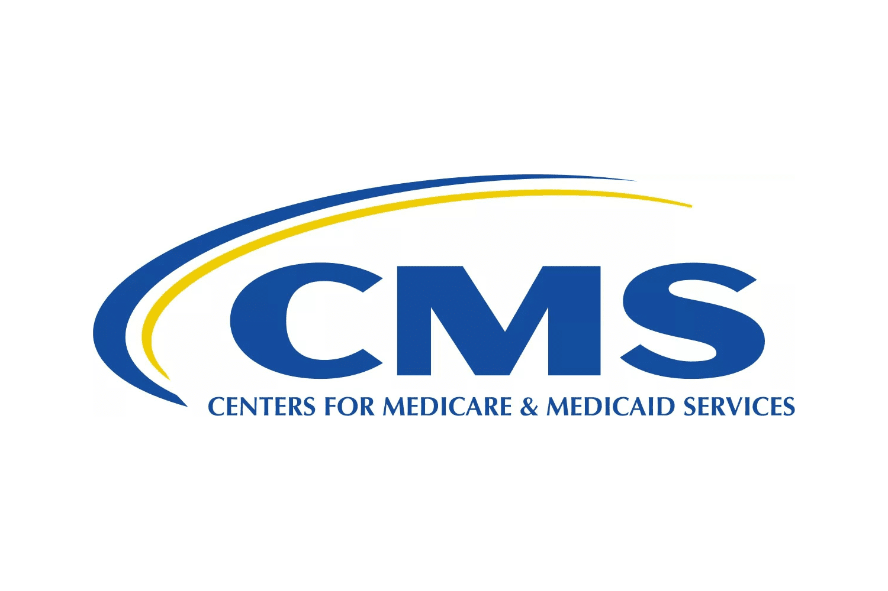

Algorithmic trading refers to the use of computer programs and systems to execute trading strategies in financial markets automatically. By employing complex algorithms and statistical models, this form of trading aims to manage portfolios, execute trades swiftly, and exploit momentary opportunities across various asset classes. Algorithmic trading plays a significant role in sectors such as finance, where it enhances efficiency and liquidity, and has begun to penetrate industries like healthcare by offering innovative approaches to financial management.

Medicaid and Medicare form the backbone of the U.S. healthcare system by providing essential health coverage for millions. Medicaid serves low-income individuals and families, while Medicare primarily supports people aged 65 and older, alongside certain younger individuals with disabilities. These programs aim to ensure access to healthcare services for vulnerable populations, funded and regulated by government policies. The Centers for Medicare & Medicaid Services (CMS) oversees these programs, ensuring their effective and equitable function.

This article aims to explore the intersection between technological advancements in algorithmic trading and their potential applications within Medicaid and Medicare, through the oversight framework of CMS. It intends to unravel how financial algorithms can be integrated to streamline the efficiency of healthcare financial operations, from funding distribution to enhancing decision-making processes within these programs.

Technology and the use of algorithms hold transformative potential in healthcare delivery and management. Financial algorithms in particular can offer predictive insights and operational efficiencies that were once unimaginable, promising a new era of precision and cost-effectiveness. Algorithmic tools can optimize resources, support better financial planning, and enhance transparency in Medicaid and Medicare operations.

As the article progresses, each component—Medicaid, Medicare, CMS, and algorithmic trading—will be dissected to reveal their current functions and the potential synergies that exist when combined. This sets the stage for an informed discussion of how these separate elements can cross paths to forge advancements in healthcare finance, thereby offering solutions that could significantly enhance the current system.

## Table of Contents

## Understanding Medicaid and Medicare

Medicaid and Medicare are two cornerstone programs in the U.S. healthcare system, each serving distinct roles yet sharing a common objective: to provide vital healthcare services to specific populations. These programs were established under the Social Security Amendments of 1965, aiming to expand healthcare coverage and reduce the financial barriers to medical access.

Medicaid is a means-tested program designed to assist low-income individuals and families, including children, pregnant women, elderly adults, and individuals with disabilities. It is jointly funded by the federal and state governments, giving states the flexibility to tailor the program to their specific needs while adhering to federal guidelines. The federal government, through the Centers for Medicare & Medicaid Services (CMS), matches state spending on Medicaid, where the Federal Medical Assistance Percentage (FMAP) is determined by each state's per capita income relative to the national average.

Medicare, conversely, is a federally funded program that provides health insurance to individuals aged 65 and older, as well as younger individuals with certain disabilities or diseases like End-Stage Renal Disease. Medicare is divided into several parts: Part A covers hospital insurance, Part B covers medical insurance, Part C (Medicare Advantage) allows beneficiaries to receive Medicare benefits through private health plans, and Part D covers prescription drug plans.

Despite serving different demographics, Medicaid and Medicare share similarities including their goal of improving healthcare accessibility and quality. Both programs require cooperation between federal and state governments, although Medicare is primarily managed at the federal level.

The importance of the Centers for Medicare & Medicaid Services (CMS) in managing these programs cannot be overstated. CMS is responsible for the administration and oversight of both Medicaid and Medicare, ensuring they operate efficiently while maintaining compliance with federal laws. CMS plays a crucial role in policy formulation, program implementation, and the coordination of care across these programs, ultimately influencing the quality and delivery of healthcare services in the U.S.

The financial and social impact of Medicaid and Medicare on American society is substantial. They have significantly reduced the uninsured rate among vulnerable populations, alleviating medical costs for millions of Americans. Financially, they account for a large portion of the federal budget, underscoring the importance of efficient management and sustainable funding mechanisms to ensure long-term viability.

Technological advancements are increasingly integral to the operation of Medicaid and Medicare. The adoption of health information technology, such as Electronic Health Records (EHRs) and telemedicine, enhances the coordination and delivery of care. CMS actively invests in data analytics and digital tools to streamline administrative processes, improve patient outcomes, and combat fraud and abuse. These advancements are crucial in modernizing the infrastructure of these programs, making them more responsive to the evolving needs of beneficiaries and the healthcare landscape.

In summary, Medicaid and Medicare are vital components of the U.S. healthcare system, administered with the critical involvement of CMS. Their sustained impact and ongoing evolution through technology integration demonstrate their indispensable role in promoting health equity and access.

 to CMS and Its Role

The Centers for Medicare & Medicaid Services (CMS), a part of the U.S. Department of Health and Human Services, plays a pivotal role in the administration of both Medicaid and Medicare programs. As the federal agency responsible for these large-scale public health initiatives, CMS ensures that millions of Americans receive healthcare services that they are entitled to under federal law. 

CMS's primary function is to oversee the implementation of Medicaid and Medicare by managing the funds and regulations that govern these programs. Medicaid, a state and federal program, provides healthcare coverage to low-income individuals and families. Medicare, on the other hand, is a federal program primarily for individuals aged 65 and older, as well as certain younger people with disabilities. Through these programs, CMS impacts a diverse segment of the population, ensuring access to essential medical services.

The technological infrastructure of CMS is crucial for the efficient management of the vast amounts of data and transactions associated with Medicaid and Medicare. CMS uses advanced IT systems to process claims, manage payments, and maintain records. This digital infrastructure is essential not only for daily operations but also for ensuring compliance with healthcare regulations and facilitating the audit processes. The agency's push towards modernization is a response to the increasing demands for efficiency, accuracy, and transparency in healthcare delivery.

In recent years, CMS has launched several initiatives to enhance its program delivery through technology. For instance, the agency has been investing in cloud computing to improve data storage and accessibility, thereby facilitating more streamlined operations and quicker decision-making processes. Another prominent initiative is the use of data analytics to boost predictive modeling capabilities, allowing CMS to identify trends in healthcare utilization and allocate resources more effectively.

Digital tools and data analytics are increasingly integrated into CMS's operations, enabling the agency to improve service delivery and policy-making. These tools help in managing health outcomes and ensuring cost-effective use of resources. For example, by leveraging big data analytics, CMS can monitor healthcare providers and ensure compliance with performance standards, thus improving the overall quality of care provided to beneficiaries.

Through its administration of Medicaid and Medicare, CMS demonstrates the significant impact of technology in modern healthcare management. The agency's ongoing initiatives reflect a broader trend within the healthcare sector to harness digital transformation in enhancing the efficiency and effectiveness of health service delivery.

## Algorithmic Trading and Its Influence on Healthcare

Algorithmic trading, also known as algo trading, refers to the use of computer algorithms to automate trading decisions in financial markets. These algorithms can analyze a multitude of market variables and execute trades at speeds and frequencies far beyond human capabilities. The primary objectives of [algorithmic trading](/wiki/algorithmic-trading) are to improve trading efficiency, reduce costs, and optimize portfolio management. It has become a cornerstone in financial markets, applied in various areas such as high-frequency trading, [market making](/wiki/market-making), and [arbitrage](/wiki/arbitrage).

In the healthcare sector, the principles of algorithmic trading are beginning to shape financial management systems, particularly concerning health insurance and Medicare/Medicaid funding. These financial operations often involve complex decision-making processes that can benefit from the precision and speed offered by algorithms. For instance, algorithms could be used to manage risk portfolios for insurance providers by predicting future claims based on historical data, thus allowing for more accurate pricing and resource allocation.

One example of algorithm-driven strategies in healthcare financial management is in the automation of claims processing. Algorithms can analyze claims data to detect patterns of fraud or inefficient practices, thereby improving the accuracy and speed of processing. Furthermore, Medicare and Medicaid funding could potentially use algorithmic models to predict patient outcomes and allocate resources more effectively. For instance, predictive algorithms could analyze demographic and health data to forecast future expenditures, helping policymakers allocate funds more efficiently.

The benefits of employing algorithms in healthcare financial operations include enhanced accuracy, reduced administrative costs, and more efficient resource allocation. Algorithms can process vast amounts of data quickly and identify trends that might be overlooked by human analysts. This can lead to significant cost savings and improved allocation of resources, thereby optimizing the overall management of healthcare programs.

However, integrating algorithmic trading into healthcare presents certain challenges and ethical considerations. One major concern is data privacy. Healthcare data is sensitive, and algorithms require access to large datasets to function effectively, raising concerns about how this data is used and protected. There are also ethical considerations regarding the decision-making process of algorithms, particularly when they impact patient care and resource distribution.

Moreover, there's a risk of over-reliance on algorithms, which might lead to unintended consequences if the algorithms make incorrect predictions or decisions. The complexity of healthcare systems and the variability of individual patient needs might not always be accurately captured by algorithmic models, leading to potential errors.

In conclusion, while algorithmic trading holds significant promise for enhancing healthcare financial management, especially in areas like Medicaid and Medicare funding, it is crucial to address the challenges and ethical considerations involved. Proper regulation, transparent data handling practices, and a balanced approach to integrating technology with human expertise are key to leveraging these advancements effectively.

## The Intersection of Medicaid, CMS, Medicare, and Algo Trading

Algorithmic trading, traditionally associated with the financial markets, offers promising applications in the financial management of Medicaid and Medicare. Leveraging algorithmic approaches can potentially revolutionize how these massive health programs are managed financially, improving efficiencies and resource allocation.

One of the primary ways algorithmic trading principles can enhance Medicaid and Medicare is through optimizing fund allocation and investment strategies. By utilizing algorithms to model complex datasets, CMS can predict budgetary needs more accurately and allocate resources more effectively. These algorithms can analyze historical spending patterns, demographic changes, and healthcare trends, creating predictive models that guide financial planning.

Some CMS initiatives have started to recognize the potential benefits of integrating algorithm-based solutions. For example, the CMS Innovation Center explores ways to reduce costs while maintaining or improving healthcare quality. By adopting algorithmic techniques, such as those used in high-frequency trading, the CMS can streamline financial transactions, reduce waste, and allocate resources more efficiently.

Case studies from the financial sector illustrate how algorithmic trading strategies could be adapted for healthcare financing. For instance, risk management strategies used in finance can be applied to manage the risk of unexpected healthcare expenditures. Similarly, [machine learning](/wiki/machine-learning) algorithms used to predict stock market trends could help predict shifts in healthcare demand, enabling more responsive funding strategies.

Looking towards future innovations, there are several trends at the intersection of healthcare financing and algorithmic trading. The increasing availability of big data in healthcare offers vast amounts of information that can be harnessed to refine algorithmic models. Moreover, real-time data analysis using high-frequency trading algorithms could allow CMS to adjust funding allocations on short notice, responding dynamically to emerging healthcare needs.

However, the adoption of such technologies is significantly influenced by policy and regulatory frameworks. Strict regulations govern both healthcare operations and financial transactions, posing challenges in implementing algorithmic solutions. Data privacy laws, such as HIPAA, add layers of complexity to using personal healthcare data in algorithmic models. Moreover, regulatory approval processes can slow down the adoption of new technologies.

Balancing innovation with compliance is crucial. Developing frameworks that allow for systematic testing and evaluation of algorithmic tools within CMS will be vital. Collaborations with technology firms that specialize in secure algorithmic solutions could also provide pathways to integrating these advanced strategies while safeguarding sensitive health data.

In summary, while challenges exist, the synergies between algorithmic trading and healthcare financing point towards a future where Medicaid and Medicare can achieve more sustainable and responsive financial management. The continued development and integration of these technologies depend on adapting current regulatory frameworks and investing in the necessary technological infrastructure.

## Challenges and Opportunities

Integrating algorithmic trading into Medicaid and Medicare financial operations presents several challenges and opportunities. Ensuring data privacy and managing ethical issues are paramount concerns in this integration. The sensitive nature of healthcare data necessitates strict compliance with regulations such as HIPAA (Health Insurance Portability and Accountability Act), which mandates the protection and confidential handling of patient information. Any algorithmic trading solution must incorporate robust security measures, including encryption and access controls, to safeguard this data against breaches and unauthorized access.

Ethical concerns also arise from the potential bias in algorithmic decision-making. Algorithms trained on biased datasets may inadvertently reinforce inequities within healthcare systems. Ensuring that these algorithms undergo rigorous testing and validation against diverse data sets is essential to minimize the risk of biased outcomes.

On the security front, the financial assets involved in Medicaid and Medicare operations are significant, necessitating assurance that algorithmic systems cannot be exploited for financial fraud. Implementing comprehensive security protocols and regular audits will be essential to build trust and prevent financial misconduct.

Despite these challenges, algorithmic trading offers substantial opportunities for improving efficiency, reducing costs, and enhancing resource allocation. By automating complex financial transactions, algorithms can perform tasks much faster than human operators. For example, algorithms can optimize budget allocations by analyzing historical spending patterns and predicting future needs, potentially leading to more efficient use of resources.

Assessing the readiness of the current CMS (Centers for Medicare & Medicaid Services) infrastructure to accommodate algorithmic trading technologies reveals mixed results. While some technological frameworks are in place to support data-driven strategies, significant upgrades are required to incorporate advanced algorithmic systems seamlessly. Investment in scalable computing resources, data analytics platforms, and employee training will be critical components in preparing CMS for this transition.

Solutions to overcome the challenges involve a multi-faceted approach. Enhancing transparency in the algorithmic decision-making process can build trust among stakeholders. Publishing comprehensive documentation and conducting regular audits will ensure that algorithms adhere to ethical standards. Additionally, fostering collaborations between technology experts, healthcare professionals, and policymakers can facilitate the development of regulatory frameworks that support innovation while safeguarding public interests.

In summary, the integration of algorithmic trading within Medicaid and Medicare holds promise for transformative improvements. Addressing concerns related to data privacy, ethics, and security, while ensuring the CMS infrastructure is prepared, will be crucial steps in harnessing these opportunities. Through strategic planning and implementation, the potential benefits can be realized, leading to a more efficient and equitable healthcare financing system.

## Conclusion

The exploration of integrating algorithmic trading with Medicaid and Medicare through the Centers for Medicare & Medicaid Services (CMS) highlights a promising frontier in healthcare financial management. Algorithmic trading, with its capacity to process vast amounts of data and execute complex decisions at speed, presents significant benefits for optimizing the financial operations of Medicaid and Medicare. These benefits include enhanced efficiency, cost reduction, and improved resource allocation. By leveraging such technology, CMS can potentially lead to more sustainable healthcare financing models and better outcomes for beneficiaries.

However, the application of algorithmic trading within the healthcare sector is not without challenges. Concerns around data privacy, ethical implications, and financial security form critical barriers that must be addressed to ensure responsible integration. Additionally, the readiness of current CMS infrastructure and regulatory frameworks presents hurdles that will require strategic planning and adaptation.

Encouragement for ongoing exploration and research in this area is essential to harness the full potential of algorithmic solutions. Stakeholders, including policymakers, healthcare providers, and technology developers, are urged to remain engaged with developments in this field. Continued dialogue and collaboration will be pivotal in successfully merging technology with healthcare financing objectives.

For readers interested in deepening their understanding of this subject, numerous resources are available. Academic journals, industry reports, and governmental publications provide insights into the existing landscape and future possibilities. Engaging with this literature will offer further clarity and guidance on the role of algorithms in transforming healthcare systems.

In conclusion, as the intersection of technology and healthcare continues to evolve, it is vital for all parties involved to stay informed and active in pursuing innovative solutions that can enhance the US healthcare system's effectiveness and sustainability.

## References & Further Reading

[1]: ["Health Information Technology: Improving Quality and Safety"](https://pmc.ncbi.nlm.nih.gov/articles/PMC6006013/) by Richard G. Roberts, Agency for Healthcare Research and Quality (US).

[2]: ["Electronic Health Records: Manual for Developing Countries"](https://iris.who.int/handle/10665/207504) by the World Health Organization.

[3]: ["Algorithmic Trading and DMA"](https://www.amazon.com/Algorithmic-Trading-DMA-introduction-strategies/dp/0956399207) by Barry Johnson.

[4]: ["The Centers for Medicare & Medicaid Services: A Primer"](https://www.cms.gov/about-cms) by the Congressional Research Service.

[5]: ["Coding Algorithms for Medicare Risk Adjustments"](https://www.cms.gov/medicare/payment/medicare-advantage-rates-statistics/risk-adjustment) by the Centers for Medicare & Medicaid Services.

[6]: ["Effect of Medicare Coverage on Use of Invasive Cardiovascular Procedures"](https://www.sciencedirect.com/science/article/pii/S0002870324003053) by David M. Cutler, JAMA.

[7]: ["Exploring Data Science in Health and Medicine"](https://pubmed.ncbi.nlm.nih.gov/34398394/) in the Journal of Biomedical Informatics.

