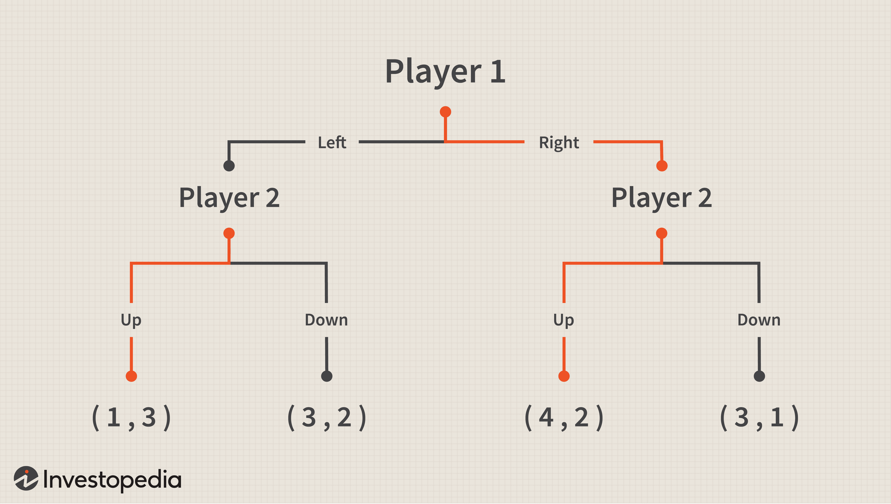

The Centipede Game is a vital illustration within strategic decision-making, exemplifying how individuals manage the tension between self-interest and mutual benefit. Originating from game theory, the Centipede Game involves a strategic interaction where two players alternately decide whether to take a larger share of an increasing sum of money or pass it to their opponent, introducing complex considerations of trust and cooperation.

This article examines the practical application of game theory in strategic contexts, with a particular focus on algorithmic trading. Algorithmic trading, characterized by rapid decision-making in competitive environments, can benefit significantly from the insights derived from game theory. Theoretical constructs like the Centipede Game provide a framework for understanding strategic interactions and decision-making processes. Notably, the application of such models can aid traders in optimizing their strategies within aggressive financial markets.



By exploring the theoretical basis of the Centipede Game, we aim to shed light on its implications for strategic interactions and how these insights can be leveraged in algorithmic trading. Understanding the balance between self-interest and cooperation in strategic games like the Centipede Game can offer essential insights for traders, helping them adapt and enhance their strategies to improve outcomes. Join us as we investigate the mechanics and practical implications of the Centipede Game in financial trading, illustrating the intersection between theoretical principles and real-world applications.

## Table of Contents

## Understanding the Centipede Game

The Centipede Game is a classic example within the field of game theory, illustrating the interplay between cooperative and competitive strategies. It is structured as an extensive-form game involving two players who take turns to decide whether to "take" a progressively increasing pot of money or "pass" it to the opponent. Each player, thus, faces a strategic choice at every juncture: to secure an immediate, albeit smaller reward or to defer withdrawal in hopes of a larger gain at a subsequent stage.

The game's structure and dynamics can be visualized as a sequence of decision nodes connected by branches, indicating the cumulative monetary value available in each round. Mathematically, this is represented by a tree-like diagram where each node represents a decision point and each branch symbolizes the decision to either take or pass. The payoffs increment with each pass, but at the risk that the pot will be taken by the other player at a subsequent node.

A key concept in understanding the Centipede Game is Nash Equilibrium, which predicts that rational players, focused on maximizing their own utility, will elect to take the pot early in the game. This prediction arises from backward induction—a strategic reasoning process where players analyze the game's potential outcomes from the end back to the start. As a result, rational, self-interested players anticipate that their opponent will take the pot in future rounds, thus incentivizing them to take it sooner.

However, empirical studies have consistently shown that real-life participants often opt to pass the pot much longer than Nash Equilibrium suggests. This deviation from theoretical expectations indicates a proclivity towards cooperative behavior, possibly influenced by factors such as trust, fairness, and a desire for mutual benefit in repeated interactions.

The Centipede Game's essence can be captured in Python through the creation of a simulation that iterates over decision nodes, allowing for experiments on various strategies' outcomes:

```python
def centipede_game(initial_pot=2, total_rounds=10):
    pot = initial_pot
    decision_point = 0

    while decision_point < total_rounds:
        player = "Player 1" if decision_point % 2 == 0 else "Player 2"
        choice = input(f"{player}: Take (t) or Pass (p)? ").strip().lower()

        if choice == 't':
            print(f"{player} takes the pot of {pot}")
            break
        else:
            pot += initial_pot
            print(f"Pot increased to {pot}")

        decision_point += 1

centipede_game()
```

This simple model allows players to simulate decision-making processes and observe how the pot evolves, offering insights into how strategic interactions unfold under different scenarios.

Ultimately, the Centipede Game presents a fascinating lens through which to analyze strategic decision-making, encouraging reflection on how theoretical models align or diverge from actual human behavior.

## Game Theory Basics: Strategies and Equilibria

Game theory provides critical insights into strategic decision-making problems like the Centipede Game. At the core of game theory is the Nash Equilibrium, a concept where players select strategies that yield optimal outcomes, given the strategies of other players. In other words, a Nash Equilibrium occurs when no player has anything to gain by changing only their own strategy. This holds particular significance in the Centipede Game, where the theoretical prediction based on the Nash Equilibrium is that rational, self-interested players will choose to end the game prematurely to secure immediate benefits, often ignoring potential long-term gains.

The Centipede Game involves players alternately deciding whether to take a growing pot or pass it to their opponent. Each decision point reflects a strategic choice influenced by the concept of dominant strategies. A dominant strategy is one that provides a higher payoff for a player, no matter what the other players decide. In this context, the Nash Equilibrium solution typically implies ending the game early, highlighting a dominant strategy where players prioritize certain short-term gains.

Despite this theoretical foundation, experimental studies have shown that human players often continue the game longer than the Nash Equilibrium would predict, suggesting a preference for potential longer-term benefits or trust and cooperation among players. This divergence from the Nash Equilibrium highlights the role of bounded rationality and other behavioral factors influencing decision-making. 

To better understand these dynamics, consider a Python simulation illustrating the basic structure of the Centipede Game and the predicted equilibria:

```python
# Simple illustration of Centipede Game with Nash Equilibrium concept
def centipede_game(payoff_matrix, steps):
    for step in range(steps):
        # Assume players decide based on Nash Equilibrium
        player_choice = "take" if step % 2 == 0 else "pass"
        if player_choice == "take":
            payoff = payoff_matrix[step]
            print(f"Player {step % 2 + 1} takes, payoff: {payoff}")
            break
        else:
            print(f"Player {step % 2 + 1} passes")
            continue
    else:
        # If loop completes, assume maximum payoff achieved by mutual passing
        print("Players cooperated till the end, maximum mutual payoff.")

# Example payoff matrix for 4 steps
payoff_matrix = [(2, 0), (0, 4), (6, 0), (0, 8)]
centipede_game(payoff_matrix, 4)
```

In this illustration, the simulation uses a simple payoff matrix where each tuple represents potential payoffs if a player decides to take. If the game ended according to the Nash Equilibrium, a player would seize the pot at the earliest opportunity indicated by the payoff matrix. However, to mirror empirical observations where human players often exhibit more cooperative behavior, you might observe different outcomes based on strategic decisions beyond Nash's predictions.

These foundational ideas of game theory, particularly Nash Equilibria and dominant strategies, not only aid in deciphering the Centipede Game but also offer a lens through which traders can analyze and improve strategic choices in their financial activities, accounting for both theoretical and behavioral considerations.

## Applying the Centipede Game to Algo Trading

Algorithmic trading is a fast-paced domain where decisions are made in milliseconds, often replicating strategic challenges akin to those found in the Centipede Game. This game, a staple of game theory, illustrates the intricate balance between self-interest and potential mutual benefit. Applying its concepts to [algorithmic trading](/wiki/algorithmic-trading) can provide traders with a valuable framework for decision-making.

The Centipede Game's primary lesson is the anticipation of competitor moves. In the game, two players make sequential choices, each having the option to either take a larger portion of an exponentially increasing reward or pass the opportunity to their opponent. A key insight for algorithmic trading lies in predicting how opponents in the market might react, akin to anticipating whether the opponent will grab the pot or continue the play. This psychological anticipation can be coded into trading algorithms using [machine learning](/wiki/machine-learning) models trained to predict competitor behavior from historical data.

For instance, consider using [reinforcement learning](/wiki/reinforcement-learning)—a machine learning paradigm where algorithms learn optimal actions through trial and error in a dynamic environment— to model this strategic anticipation. The Centipede Game's strategy can be incorporated into a reinforcement learning framework where an agent, representing a trading algorithm, receives rewards not just based on immediate gains but also on predicted long-term benefits by cooperating more and seizing opportunities at strategic points:

```python
import numpy as np
import gym

# Suppose a simple env like Centipede Game for trading
class TradingEnv(gym.Env):
    def __init__(self):
        super(TradingEnv, self).__init__()
        self.action_space = gym.spaces.Discrete(2)  # pass or take
        self.observation_space = gym.spaces.Box(low=0, high=1, shape=(1,))

    def reset(self):
        self.state = [0.5]  # some initial state representing market condition
        return np.array(self.state)

    def step(self, action):
        if action:
            # Strategy of taking 
            reward = 1.0
            done = True
        else:
            # Strategy that passes
            reward = 0.1
            done = False
        self.state = np.random.random(1)  # randomly new state
        return np.array(self.state), reward, done, {}

# Example agent modeling
class TradingAgent:
    def __init__(self):
        self.learning_rate = 0.1
        self.discount_factor = 0.9

    def train(self, env, episodes=1000):
        for episode in range(episodes):
            state = env.reset()
            done = False
            while not done:
                action = np.random.choice([0, 1])  # Simplified: Random action for demo
                next_state, reward, done, _ = env.step(action)

# Instantiate environment and agent
env = TradingEnv()
agent = TradingAgent()

# Start training
agent.train(env)
```

Anticipation and strategic decision-making, when encoded into algorithms, enable traders to be adaptive and optimize their strategies. By integrating Centipede Game concepts, algorithms can simultaneously analyze potential short-term gains while being aware of long-term strategies that predict competitors' reactions and movements in the market.

Moreover, traders can take inspiration from the repeated nature of the Centipede Game, recognizing that the market operates in cycles. In trading algorithms, competitors often resolve strategies on whether to [exit](/wiki/exit-strategy) positions early (akin to ending the game prematurely) or continue acquiring incremental advantages (extending cooperation in the game). These decisions mirror real market reactions to variables such as price movements, [volume](/wiki/volume-trading-strategy) changes, and economic news.

In summary, by recognizing and anticipating market moves through insights drawn from the Centipede Game, traders can design sophisticated algorithmic strategies that transcend mere immediate action, allowing for adaptation and optimization in the competitive world of algorithmic trading.

## Behavioral Insights from the Centipede Game

The Centipede Game, a strategic game in game theory, provides an insightful lens through which the behavioral aspects of decision-making can be analyzed. Despite theoretical forecasts grounded in Nash Equilibrium that suggest players should act out of pure self-interest and end the game early, empirical studies consistently report deviations from this prediction. Players demonstrate a propensity for cooperation, prolonging the game beyond the theoretically optimal stopping point.

Several experimental studies have probed these behavioral tendencies to identify underlying factors such as trust and perceived fairness, which significantly influence player decisions. One landmark study by McKelvey and Palfrey (1992) highlighted that participants frequently cooperate more than the Nash Equilibrium predicts. This behavior underscores the complexity of human decision-making, where psychological factors often override pure economic rationality.

The dynamics of trust play a pivotal role in the Centipede Game. Players often weigh the immediate gains of defecting against the potential benefits of sustained collaboration, which hinges on the trust that their counterpart will reciprocate cooperative gestures. This trust can modify the strategic calculus, leading to moves that seem irrational when viewed solely through the lens of traditional game theory.

Perceived fairness further complicates decision-making. Players are influenced by their interpretations of equity and fairness, which can lead to choices that diverge from the expected self-interest model. Fairness considerations might prompt a player to continue passing even in situations where taking the offer would maximize their payoff, due to expectations of equitable sharing or future reciprocation.

The behavioral insights gleaned from Centipede Game experiments suggest that incorporating human elements such as trust and fairness can enrich models of strategic decision-making. These insights have profound implications, particularly in environments characterized by uncertainty and dependency on strategic interaction, such as financial markets and negotiation scenarios. Thus, understanding these behavioral tendencies not only challenges the traditional predictions of game theory but also enhances the predictive power of economic models by accounting for the nuanced realities of human behavior.

## Practical Implications for Traders

Incorporating principles from the Centipede Game in trading strategies highlights the importance of strategic foresight and adaptability. Traders can leverage insights from game theory to enhance decision-making processes and optimize trading outcomes. By understanding the interaction dynamics suggested by the Centipede Game, traders can anticipate competitor actions and incorporate cooperative strategies effectively.

**1. Strategic Foresight:**
Strategic foresight involves looking ahead and understanding the potential outcomes of various trading strategies. By analyzing the Centipede Game's framework, traders can predict how competitors might behave in certain market scenarios. This anticipation allows them to make informed decisions that maximize their potential returns while minimizing risks. For example, traders can use predictive algorithms to model competitor behavior and simulate the outcomes of different strategic choices. This approach helps identify optimal points for market entry or exit.

**2. Cooperative Strategies:**
The Centipede Game demonstrates that cooperation can often lead to better collective outcomes, contradicting the purely self-interested strategies suggested by Nash Equilibrium. In trading, this translates to forming strategic alliances or coalitions where shared insights and resources can enhance performance. Traders might collaborate by sharing market data or forming consortia to influence market movements positively. Such cooperative strategies can provide a competitive edge, particularly in volatile markets where information asymmetry is a significant challenge.

**3. Balancing Risk and Opportunity:**
Traders must balance the risks and rewards of various market opportunities. Game theory offers techniques for evaluating the potential payoffs and risks associated with different strategies. By employing decision-making frameworks that assess these factors, traders can develop strategies that align with their risk tolerance and investment objectives. For instance, expected utility theory—a core concept in game theory—helps traders assess the expected outcomes of trades under different scenarios, facilitating more calculated risk-taking.

**4. Algorithmic Application:**
Algorithmic trading systems can incorporate game theory principles from the Centipede Game to refine strategy execution. Algorithms can be programmed to identify patterns and exploit market inefficiencies based on competitors’ anticipated decisions. By leveraging machine learning and [artificial intelligence](/wiki/ai-artificial-intelligence), these systems dynamically adjust strategies in real-time, responding effectively to market shifts. Here's a basic Python example to illustrate how an algorithm might incorporate competitor anticipation:

```python
import numpy as np

def anticipate_competitor(actions, history):
    # Simulate competitor behavior based on historical data
    probabilities = np.mean(history, axis=0)
    return np.random.choice(actions, p=probabilities)

actions = ['buy', 'sell', 'hold']
history = np.array([[0.4, 0.3, 0.3], [0.5, 0.2, 0.3], [0.3, 0.4, 0.3]])

predicted_action = anticipate_competitor(actions, history)
print(f"Predicted Competitor Action: {predicted_action}")
```

In this code, a simple probabilistic model predicts likely competitor actions based on historical behavior, equipping traders with insights for strategic adjustments.

In summary, applying the Centipede Game's principles allows traders to develop strategies that are not only adaptive but also collaboratively beneficial, aligning individual goals with broader market dynamics. This understanding can lead to more effective decision-making processes in the pursuit of profitable trading opportunities.

## Conclusion

The Centipede Game serves as a valuable model for understanding strategic interactions in competitive environments. It provides an analytic framework that highlights how decision-makers might prioritize short-term gains versus long-term benefits. This balance between competition and cooperation is exceptionally pertinent in trading, where anticipating and reacting to the actions of competitors is critical.

By applying game theory concepts from the Centipede Game, traders can enhance their decision-making processes and improve outcomes in financial markets. For example, adopting strategies that incorporate both defensive and cooperative elements can increase profitability and reduce vulnerability in volatile markets. Traders can use algorithms informed by game theory to simulate competitive interactions and predict potential market moves. This approach involves not only analyzing historical data but also simulating potential future scenarios based on strategic game models.

In algorithmic trading, understanding the dynamics of the Centipede Game can lead to the development of more robust trading algorithms. Such algorithms might incorporate aspects of cooperation, which can be counterintuitive but beneficial, as they promote stability and reduce market aggressiveness. Python, with its robust libraries for numerical simulation, can be instrumental in building and testing these models. A sample Python snippet for a simple Centipede Game simulation might look like this:

```python
def centipede_game_simulation():
    total_rounds = 10
    payoff = [1, 2, 4, 8, 16, 32, 64, 128, 256, 512]  # Example payoffs
    for round_number in range(total_rounds):
        if player_decides_to_stop(round_number):
            return payoff[round_number]
    return 0  # Ending with cooperation

def player_decides_to_stop(round_number):
    # Decision logic, potentially using random or strategy-based decision-making
    return True if round_number >= 5 else False

print(centipede_game_simulation())
```

This article emphasizes the intersection of theoretical insights and practical applications, offering a comprehensive view of strategic decision-making in trading. By translating the theoretical aspects of the Centipede Game into actionable trading strategies, traders are better equipped to navigate the complexities of modern financial markets. Understanding these concepts invites traders to adopt a nuanced perspective that contemplates both immediate outcomes and long-term objectives, ultimately fostering a strategic edge in the marketplace.

## References & Further Reading

[1]: McKelvey, R. D., & Palfrey, T. R. (1992). ["An Experimental Study of the Centipede Game."](http://www.dklevine.com/archive/refs4521.pdf) Econometrica, 60(4), 803-836.

[2]: Camerer, C. (2003). ["Behavioral Game Theory: Experiments in Strategic Interaction."](https://psycnet.apa.org/record/2003-06054-000) Princeton University Press.

[3]: Osborne, M. J. (2004). ["An Introduction to Game Theory."](https://mathematicalolympiads.files.wordpress.com/2012/08/martin_j-_osborne-an_introduction_to_game_theory-oxford_university_press_usa2003.pdf) Oxford University Press.

[4]: Dixit, A. K., & Nalebuff, B. J. (2008). ["The Art of Strategy: A Game Theorist's Guide to Success in Business and Life."](https://www.amazon.com/Art-Strategy-Theorists-Success-Business/dp/0393337170) W.W. Norton & Company.

[5]: Fudenberg, D., & Tirole, J. (1991). ["Game Theory."](https://archive.org/details/gametheory0000fude) MIT Press.