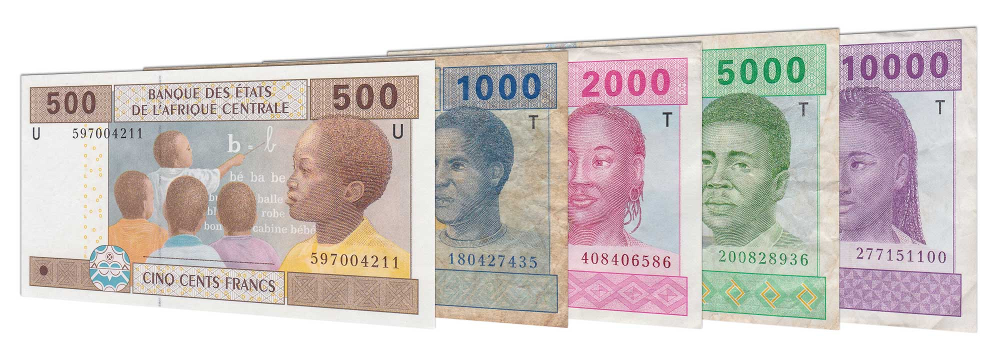

## Table of Contents

## What is the Central African CFA Franc?

The Central African CFA Franc is a type of money used in six countries in Central Africa. These countries are Cameroon, Central African Republic, Chad, Republic of the Congo, Equatorial Guinea, and Gabon. The CFA stands for "Coopération Financière en Afrique Centrale," which means "Financial Cooperation in Central Africa" in English. This money is tied to the Euro, which is the money used in many European countries. This means that the value of the CFA Franc stays stable compared to the Euro.

The Central African CFA Franc is managed by a special bank called the Bank of Central African States (BEAC). This bank works to make sure the money is used properly and helps the economies of the six countries. People in these countries use the CFA Franc to buy things, save money, and do business with each other. Because the CFA Franc is linked to the Euro, it helps these countries have more stable prices and makes it easier for them to trade with Europe.

## Which countries use the Central African CFA Franc?

The Central African CFA Franc is the money used in six countries in Central Africa. These countries are Cameroon, Central African Republic, Chad, Republic of the Congo, Equatorial Guinea, and Gabon. People in these countries use this money every day to buy things, save, and do business.

The Central African CFA Franc is tied to the Euro, which is the money used in many European countries. This helps keep the value of the CFA Franc steady. A special bank called the Bank of Central African States (BEAC) looks after the CFA Franc and helps the economies of these six countries work well.

## What does CFA stand for?

CFA stands for "Coopération Financière en Afrique Centrale." This means "Financial Cooperation in Central Africa" in English. It is the name of the money used in six countries in Central Africa.

These countries are Cameroon, Central African Republic, Chad, Republic of the Congo, Equatorial Guinea, and Gabon. The CFA Franc is linked to the Euro, which helps keep its value steady. A special bank called the Bank of Central African States (BEAC) manages the CFA Franc and helps the economies of these countries.

## How is the Central African CFA Franc managed?

The Central African CFA Franc is managed by a special bank called the Bank of Central African States (BEAC). This bank looks after the money used in six countries in Central Africa: Cameroon, Central African Republic, Chad, Republic of the Congo, Equatorial Guinea, and Gabon. The BEAC makes sure that the money is used properly and helps the economies of these countries work well.

The Central African CFA Franc is tied to the Euro, which is the money used in many European countries. This means that the value of the CFA Franc stays stable compared to the Euro. Because it is linked to the Euro, it helps these countries have more stable prices and makes it easier for them to trade with Europe.

## What is the historical background of the Central African CFA Franc?

The Central African CFA Franc was created after World War II when France wanted to help its colonies in Africa. In 1945, France set up a new money system called the CFA Franc for its African colonies. The CFA stands for "Coopération Financière en Afrique Centrale," which means "Financial Cooperation in Central Africa." At first, the CFA Franc was used in all French colonies in Africa, but later it was split into two different CFA Francs: one for West Africa and one for Central Africa.

In 1958, the Central African CFA Franc became its own money, separate from the West African CFA Franc. This happened when the countries in Central Africa formed their own group called the Economic and Monetary Community of Central Africa (CEMAC). The Central African CFA Franc is tied to the Euro, which means its value stays steady compared to the Euro. This link helps the countries that use the CFA Franc have stable prices and makes it easier for them to trade with Europe. The Bank of Central African States (BEAC) was set up to manage the CFA Franc and help the economies of Cameroon, Central African Republic, Chad, Republic of the Congo, Equatorial Guinea, and Gabon.

## How has the value of the Central African CFA Franc changed over time?

The Central African CFA Franc was first used in 1945 when France created it for its African colonies. At that time, the CFA Franc was tied to the French Franc, which was the money used in France. In 1958, the Central African CFA Franc became its own money, separate from the West African CFA Franc. Since then, it has been managed by the Bank of Central African States (BEAC). The value of the CFA Franc has changed over time because of different events and changes in the economy.

In 1994, there was a big change when the Central African CFA Franc was devalued. This means that its value was lowered compared to the French Franc. The devaluation happened because the countries using the CFA Franc were having economic problems. After that, in 1999, the CFA Franc was tied to the Euro instead of the French Franc. This helped keep the value of the CFA Franc more stable because the Euro is used in many European countries. Today, the Central African CFA Franc is still tied to the Euro, and its value stays steady compared to the Euro. This helps the countries that use the CFA Franc have more stable prices and makes it easier for them to trade with Europe.

## What are the economic benefits of using the Central African CFA Franc?

Using the Central African CFA Franc gives the six countries that use it some important economic benefits. One big benefit is that the CFA Franc is tied to the Euro. This means its value stays steady compared to the Euro. Because the Euro is used in many European countries, this link helps the countries using the CFA Franc have more stable prices. When prices are stable, people and businesses can plan better for the future. They don't have to worry as much about sudden changes in the value of their money.

Another benefit is that using the CFA Franc makes it easier for these countries to trade with Europe. Since the CFA Franc is tied to the Euro, businesses in these countries can trade with Europe without worrying too much about changes in money values. This can help them sell more things to Europe and buy things they need from Europe more easily. The Bank of Central African States (BEAC) also helps by managing the CFA Franc and working to keep the economies of these countries strong.

## What are the economic challenges faced by countries using the Central African CFA Franc?

Countries using the Central African CFA Franc face some economic challenges. One big challenge is that they can't control their own money as much as other countries. Because the CFA Franc is tied to the Euro, these countries can't change the value of their money to help their own economies. If they need to make their money worth less to help their businesses sell more things, they can't do it. This can make it hard for them to grow their economies and create jobs.

Another challenge is that these countries depend a lot on Europe. Since the CFA Franc is linked to the Euro, what happens in Europe can affect their economies a lot. If the Euro gets weaker or if Europe has economic problems, it can make things harder for these countries. They might have to keep a lot of their money in Europe, which means they can't use it to help their own people as much. This can make it harder for them to build schools, hospitals, and other things their people need.

## How does the Central African CFA Franc impact trade within the region?

The Central African CFA Franc helps trade within the region because it is the same money used in six countries: Cameroon, Central African Republic, Chad, Republic of the Congo, Equatorial Guinea, and Gabon. When all these countries use the same money, it makes it easier for them to buy and sell things to each other. They don't have to worry about changing money from one type to another, which can be hard and cost extra money. This can help businesses in these countries trade more easily and grow faster.

But there are also some challenges. Because the CFA Franc is tied to the Euro, the countries can't change the value of their money to help their own trade. If they need to make their money worth less to sell more things, they can't do it. This can make it harder for businesses in these countries to compete with businesses from other places. Also, since they use the same money, what happens in one country can affect the others. If one country has big money problems, it can make trade harder for all the countries using the CFA Franc.

## What is the relationship between the Central African CFA Franc and the Euro?

The Central African CFA Franc is tied to the Euro, which means its value stays steady compared to the Euro. The Euro is the money used in many European countries. Because the CFA Franc is linked to the Euro, it helps the six countries that use it—Cameroon, Central African Republic, Chad, Republic of the Congo, Equatorial Guinea, and Gabon—have more stable prices. When prices are stable, people and businesses can plan better for the future without worrying about sudden changes in the value of their money.

This link to the Euro also makes it easier for these countries to trade with Europe. They don't have to worry about big changes in money values when they buy or sell things to Europe. But, because their money is tied to the Euro, these countries can't control their own money as much. They can't change the value of the CFA Franc to help their own economies if they need to. This can make it harder for them to grow and create jobs.

## How have political changes influenced the Central African CFA Franc?

Political changes have had a big effect on the Central African CFA Franc. The CFA Franc was first created after World War II when France wanted to help its colonies in Africa. In 1958, the Central African CFA Franc became its own money, separate from the West African CFA Franc. This happened when the countries in Central Africa formed their own group called the Economic and Monetary Community of Central Africa (CEMAC). These political changes helped set up the system that manages the CFA Franc today.

Over time, political changes in the countries using the CFA Franc have also influenced its use. Sometimes, leaders in these countries have wanted to change the money system because they thought it would help their economies grow faster. For example, some people have talked about leaving the CFA Franc and using a different money. But changing the money system is hard because it can affect trade and the economy a lot. So, the Central African CFA Franc has stayed tied to the Euro, even with all these political changes.

## What are the future prospects and potential reforms for the Central African CFA Franc?

The future of the Central African CFA Franc is a big topic that many people are talking about. Some people think that the countries using the CFA Franc should change their money system to help their economies grow faster. They want to have more control over their own money so they can make changes to help their people. This could mean leaving the CFA Franc and using a new money that is not tied to the Euro. But changing the money system is hard because it can affect trade and the economy a lot. So, any big changes would need to be planned very carefully.

There are also talks about making smaller changes to the CFA Franc system. Some people want to keep the CFA Franc but make it less tied to the Euro. This could give the countries a bit more control over their money while still keeping the benefits of being linked to the Euro. The Bank of Central African States (BEAC) might also change some of its rules to help the economies of the six countries that use the CFA Franc. But any reforms would need to be agreed on by all the countries, and it would take time to see if these changes help or not.

## References & Further Reading

[1]: Balima, H. W., & Combes, J. L. (2012). ["The Determinants of Inflation in CEMAC Region"](https://scholar.google.com/citations?user=1dMWmC4AAAAJ). International Monetary Fund Working Papers.

[2]: Masson, P., & Pattillo, C. (2001). ["Monetary Union in West Africa (ECOWAS): Is It Desirable and How Could It Be Achieved?"](https://www.imf.org/external/pubs/nft/op/204/) International Monetary Fund.

[3]: De Grauwe, P. (2012). ["Economics of Monetary Union"](https://archive.org/details/economicsofmonet0000grau) by Oxford University Press.

[4]: Durden, T. (2016). ["The Pros and Cons of Automatic Algorithmic Trading in the Financial Markets"](https://www.eurotrader.com/is-algorithmic-trading-the-future-the-pros-and-cons-of-automated-trading-systems/) Financial Sense.

[5]: Johnson, B. (2010). ["Algorithmic Trading & DMA: An Introduction to Direct Access Trading Strategies"](https://archive.org/details/algorithmictradi0000john) by 4Myeloma Press.

[6]: Ene, E. C., & Ufoeze, L. I. (2020). ["The Impact of Technology on Economic Growth in Africa."](https://www.researchgate.net/publication/324232908_EFFECT_OF_MONETARY_POLICY_ON_ECONOMIC_GROWTH_IN_NIGERIA_AN_EMPIRICAL_INVESTIGATION) Journal of International Development.