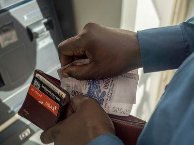

The Central African CFA Franc (XAF) is a pivotal element in the economic framework of six Central African countries: Cameroon, Central African Republic, Chad, Republic of the Congo, Equatorial Guinea, and Gabon. Serving as the common currency, the XAF facilitates trade and economic integration among these nations. Introduced in 1945, the currency is supported by the French treasury and pegged to the euro, offering stability to the region's monetary system. Understanding the XAF's historical context and current applications provides valuable insight into its impact on regional economies.

This article examines the XAF's historical development, its strategic economic role, and its implications for the financial landscapes of the member countries. An additional focus is on how algorithmic trading, a modern technological advancement, is affecting financial markets in the XAF zone. Algorithmic trading involves using complex algorithms to automate decisions and transactions in financial markets. This technology streamlines trading processes and is increasingly utilized in markets globally, including those that operate with the XAF.



The influence of algorithmic trading on the Central African economies presents both opportunities and challenges. For example, while it could enhance market liquidity and increase trading volume, there is also the potential for new risks such as technical issues or market manipulation. As we explore these dimensions, it becomes essential to understand how the XAF shapes the economic realities of Central Africa and how technological advancements intersect with these dynamics.

## Table of Contents

## History and Background of the XAF

The Central African CFA Franc (XAF) was established in 1945, initially serving the French Colonies in Africa. Its introduction marked a significant transition from the use of the French Equatorial franc, which was prevalent during the colonial era. The XAF's inception was aimed at providing a stable and unified currency for the region, facilitating economic transactions and growth.

The backing of the XAF by the French treasury is a key component of its stability. This guarantee, coupled with its peg to the euro, ensures that the XAF maintains a consistent exchange rate, thereby reducing the risks of hyperinflation or currency devaluation that can disrupt economies. The fixed exchange rate is currently set at 1 euro = 655.957 XAF. This peg allows for predictable monetary policy and helps maintain confidence in the currency.

Governance of the XAF is maintained by the Economic and Monetary Union of Central Africa (CEMAC), which coordinates monetary policy among its member states. CEMAC plays a vital role in ensuring the currency's stability and managing the balance of payments among the region's countries. Its establishment was intended to foster economic integration and cooperation among the countries using the XAF, namely Cameroon, Central African Republic, Chad, Republic of the Congo, Equatorial Guinea, and Gabon.

In summary, the Central African CFA Franc was established to provide a stable and unified currency system for French territories in Africa. Its backing by the French treasury and peg to the euro ensure its stability and uniformity, while governance by CEMAC facilitates coordinated economic policy and regional integration.

## Economic Overview of the XAF Zone

The Central African CFA Franc (XAF) is utilized by six Central African nations: Cameroon, the Central African Republic, Chad, the Republic of the Congo, Equatorial Guinea, and Gabon. Each of these countries exhibits distinct economic characteristics that collectively define the XAF zone's economic landscape.

Cameroon, with its relatively diversified economy, relies significantly on agriculture, which contributes to various sectors, including manufacturing and exports. Key agricultural products include cocoa, coffee, and cotton. The agricultural sector not only supports a large portion of the population but also plays a vital role in international trade, providing a steady source of foreign exchange.

Gabon, in contrast, is heavily dependent on its oil wealth, which constitutes a substantial part of its gross domestic product (GDP). The oil sector has historically been a catalyst for economic growth, attracting foreign investment and boosting government revenues. However, fluctuating oil prices pose a risk to economic stability, necessitating efforts to diversify the economy.

In the Republic of the Congo and Equatorial Guinea, economies are similarly driven by oil production and exports. These countries depend on the global oil market's health, which influences their economic performance and government budgets. Despite significant oil revenues, the need for diversification is pressing to mitigate the effects of oil price [volatility](/wiki/volatility-trading-strategies).

Chad and the Central African Republic face more daunting economic challenges. Chad's economy is primarily agricultural, but it also contains considerable oil reserves. Political instability, along with periodic conflict, has hindered economic development and investment, affecting growth prospects. The Central African Republic, one of the world's poorest nations, struggles with ongoing conflict and inadequate infrastructure, which impede economic progress.

Economic indicators such as GDP growth and inflation rates provide insight into the health of these economies. For example, Cameroon, with its more balanced economy, generally exhibits moderate GDP growth and inflation rates. Gabon and Equatorial Guinea, due to their reliance on oil, experience more volatile growth patterns. Similarly, Chad and the Central African Republic often face unpredictable economic conditions, influenced by both domestic and external factors.

Monitoring these economic indicators is crucial for understanding the economic dynamics within the XAF zone and for devising strategies that foster sustainable growth and stability. Indeed, a diversified approach to economic development, supported by stable fiscal and monetary policies, is essential for enhancing resilience against external shocks.

## Understanding Algorithmic Trading

Algorithmic trading employs advanced computational techniques to automate financial market transactions. This approach enables traders to execute large and complex orders with precision and speed that traditional manual trading cannot match. By leveraging the power of algorithms, traders can analyze vast amounts of data in real time, identify trading signals, and make split-second decisions that optimize efficiency and profitability.

The core function of [algorithmic trading](/wiki/algorithmic-trading) lies in its ability to process numerous market variables and execute trades based on pre-defined conditional statements. For instance, an algorithm may be designed to buy a particular stock when its price drops to a given threshold or sell when it rises above a certain limit. Mathematically, this could be represented using conditional logic:

```python
if stock_price <= buy_threshold:
    execute_trade('buy', volume)
elif stock_price >= sell_threshold:
    execute_trade('sell', volume)
```

Such algorithms can assess market data, historical prices, and other economic indicators to inform trading strategies. They can also [factor](/wiki/factor-investing) in deterministic variables such as interest rates or market volatility to forecast potential future price movements, thus allowing traders to make informed decisions.

Algorithmic trading is becoming increasingly prevalent in global financial markets, including regions where the Central African CFA Franc (XAF) is used. The adoption of this technology is spurred by its ability to enhance trading efficiency. Speed is a crucial advantage, as algorithms can react to market fluctuations faster than humans, creating opportunities for [arbitrage](/wiki/arbitrage) and minimizing the risk associated with price slippage.

Moreover, algorithmic trading allows for the execution of various trading strategies, such as market-making, [statistical arbitrage](/wiki/statistical-arbitrage), and [trend following](/wiki/trend-following), which can lead to increased trading volumes and potentially greater market [liquidity](/wiki/liquidity-risk-premium). This is particularly relevant for XAF-denominated markets, where historically lower liquidity has posed challenges for investors.

However, the reliance on technology brings its own set of risks. Algorithms can be susceptible to technical failures or errors in programming logic, leading to unintended trading behavior. Additionally, the lack of human oversight can open opportunities for market manipulation, emphasizing the need for robust regulatory frameworks and technological safeguards to manage these risks effectively.

Despite these challenges, the expansion of algorithmic trading offers significant opportunities for financial markets in Central Africa. By enhancing trade execution and enabling more sophisticated trading strategies, algorithmic trading can contribute to more dynamic and resilient market environments, ultimately benefiting the broader economic landscape.

## The Impacts of Algorithmic Trading on Central African Economies

Algorithmic trading has the potential to significantly impact economies using the Central African CFA Franc (XAF). One of the primary benefits of algorithmic trading is its ability to enhance market liquidity. By employing complex algorithms, traders can execute large-scale buy or sell orders quickly, reducing the time lag between order placement and execution. This increased efficiency promotes more continuous trading activities, facilitating smoother price discovery and narrower bid-ask spreads in XAF-denominated markets.

Increased trading [volume](/wiki/volume-trading-strategy) is another potential outcome of adopting algorithmic trading. As algorithmic systems handle more transactions with speed and precision, the overall trading volume in financial markets can rise. Higher trading volumes contribute to more robust financial markets, allowing for substantial participation from both domestic and foreign investors. Consequently, this increased activity can influence currency valuation, making the XAF more attractive to [forex](/wiki/forex-system) traders and potentially affecting economic policies in the region.

However, the dependency on algorithms carries inherent risks. One concern is the possibility of market manipulation, where trading programs might contribute to artificial price movements. Strategic manipulation of these programs could lead to inconsistencies and unfair advantages in the market. Moreover, technical failures pose significant threats; a malfunction in algorithmic systems might trigger unintended trading decisions, impacting market stability.

Systems and oversight must evolve to mitigate these risks concurrently with the widespread adoption of algorithmic trading in Central African economies. Enhancing regulatory frameworks and ensuring that algorithms are subjected to rigorous testing can help align technological innovations with the region's economic stability objectives. Balancing the benefits and challenges of algorithmic trading is crucial for leveraging its potential in enhancing the financial infrastructure of XAF-denominated markets.

## Challenges and Opportunities

Central African nations share several common challenges that impact their economic frameworks, including political instability and economic volatility. Political instability often leads to inconsistent economic policies, which can deter investment and complicate business operations. Countries such as Chad and the Central African Republic experience frequent conflicts, resulting in economic disruption and hampering long-term planning and development. Furthermore, economic volatility, often influenced by external shocks such as fluctuating oil prices and global economic conditions, can have detrimental effects on the growth and stability of these economies.

However, these challenges present a backdrop for significant opportunities. One of the key opportunities for Central African countries is economic diversification. Currently, many of these economies rely heavily on a limited number of sectors, such as oil in Gabon and Equatorial Guinea. By diversifying their economic activities, these nations can reduce their vulnerability to sector-specific shocks and foster more stable growth. For instance, investing in agriculture, mining, and services could create new revenue streams and job opportunities.

Technological adoption is another opportunity that holds promise for these economies. By integrating new technologies, such as algorithmic trading, countries can improve the efficiency and transparency of their financial markets. This adoption not only attracts foreign investment but also enhances local financial literacy and market participation. 

Moreover, regional cooperation presents an avenue for Central African economies to harness collective strengths. The Economic and Monetary Community of Central Africa (CEMAC) provides a platform for policy harmonization and shared economic strategies. By working together, these countries can negotiate more favorable trade agreements, enhance infrastructure development, and improve regional security, all of which contribute to economic stability and growth.

Developing robust financial infrastructures will be crucial to support the growth of technologies such as algorithmic trading. This includes not only technological enhancements but also the establishment of regulatory frameworks to prevent risks like market manipulation. Investing in education and training for financial professionals will also aid in building a knowledgeable workforce capable of managing sophisticated financial systems.

In conclusion, while Central African nations face significant hurdles, they also have the potential to transform their economies through diversification, technology, and regional collaboration. The successful navigation of these challenges and opportunities will require strategic planning and investment, alongside efforts to stabilize political environments and establish robust economic policies.

## Conclusion

The Central African CFA Franc (XAF) remains a cornerstone of regional economic stability, serving as a pivotal factor in maintaining economic consistency across its member states. The currency's link to the euro underpins its stability, directly influencing trade and financial policies within the region.

The integration of algorithmic trading presents new horizons and challenges for these economies. Algorithmic trading's potential to enhance market liquidity and boost trading volumes could lead to a more dynamic financial environment. This growth prospect, however, is tempered by risks such as potential market manipulation and technological failures. Consequently, the Central African economies must develop robust regulatory frameworks to mitigate these issues.

Future economic growth in the Central African region will hinge on successfully balancing technological advancements with existing economic structures. Embracing new technologies like algorithmic trading necessitates investments in financial infrastructure and regulatory measures to ensure a safe transition.

Understanding the XAF's role in the Central African economic landscape is crucial. Policymakers must account for its influence on monetary policies and regional economic strategies. This understanding will guide them in adapting to technological changes while maintaining economic stability, ultimately contributing to sustainable growth and development in Central Africa.

## References & Further Reading

[1]: Balima, H. W., & Combes, J. L. (2012). ["The Determinants of Inflation in CEMAC Region"](https://scholar.google.com/citations?user=1dMWmC4AAAAJ). International Monetary Fund Working Papers.

[2]: Masson, P., & Pattillo, C. (2001). ["Monetary Union in West Africa (ECOWAS): Is It Desirable and How Could It Be Achieved?"](https://www.imf.org/external/pubs/nft/op/204/) International Monetary Fund.

[3]: De Grauwe, P. (2012). ["Economics of Monetary Union"](https://archive.org/details/economicsofmonet0000grau) by Oxford University Press.

[4]: Durden, T. (2016). ["The Pros and Cons of Automatic Algorithmic Trading in the Financial Markets"](https://www.eurotrader.com/is-algorithmic-trading-the-future-the-pros-and-cons-of-automated-trading-systems/) Financial Sense.

[5]: Johnson, B. (2010). ["Algorithmic Trading & DMA: An Introduction to Direct Access Trading Strategies"](https://archive.org/details/algorithmictradi0000john) by 4Myeloma Press.

[6]: Ene, E. C., & Ufoeze, L. I. (2020). ["The Impact of Technology on Economic Growth in Africa."](https://www.researchgate.net/publication/324232908_EFFECT_OF_MONETARY_POLICY_ON_ECONOMIC_GROWTH_IN_NIGERIA_AN_EMPIRICAL_INVESTIGATION) Journal of International Development.