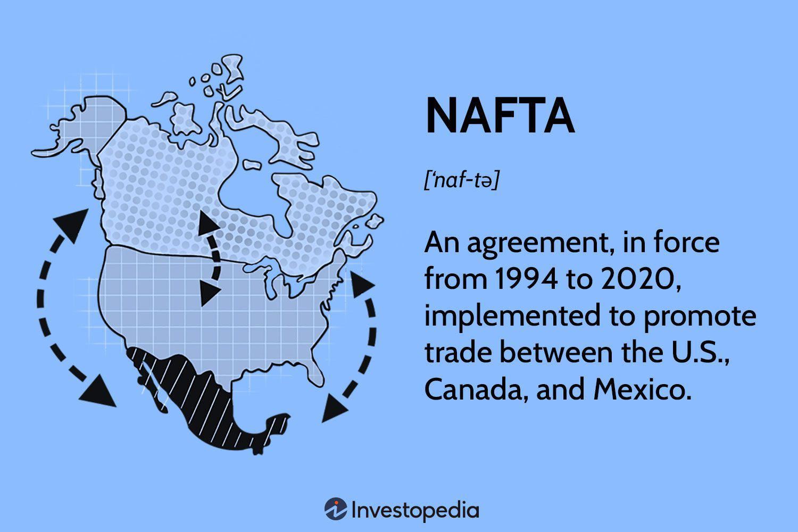

The Central America Free Trade Agreement-Dominican Republic (CAFTA-DR) represents a pivotal shift in trade dynamics between the United States and Central American countries. Enacted in 2004, this agreement includes Costa Rica, El Salvador, Guatemala, Honduras, Nicaragua, and the Dominican Republic. CAFTA-DR aimed to eliminate trade barriers, augment regional market access, and promote economic integration. The agreement’s implementation has significantly enhanced trade volume and economic linkages across member countries, encouraging foreign investments and facilitating a more competitive market environment.

In the constantly evolving landscape of international trade, modern innovations such as algorithmic trading have begun to interface with trade agreements like CAFTA-DR. Algorithmic trading harnesses computer programs to execute trades at high speed and efficiency, analyzing vast datasets and making instantaneous decisions. This technological advancement has the potential to revolutionize trading practices by improving liquidity, reducing market impact, and optimizing trade execution. 



The goal of this article is to scrutinize the impact of CAFTA-DR on Central America’s economic landscape, with a specific focus on how such trade agreements can support the integration of advanced technologies like algorithmic trading. By examining these intersections, we aim to identify the possibilities for future enhancements in trade efficiency and market competitiveness in the region. Understanding this synergy could provide critical insights for stakeholders and policymakers aiming to leverage the benefits of CAFTA-DR while encouraging innovation and economic growth.

## Table of Contents

## Understanding CAFTA-DR

The Central America Free Trade Agreement-Dominican Republic (CAFTA-DR) is a significant trade agreement involving the United States and several Central American countries. The agreement was initially signed on August 5, 2004, and includes the United States, Costa Rica, El Salvador, Guatemala, Honduras, Nicaragua, and the Dominican Republic. The primary objective of CAFTA-DR is to eliminate tariffs and trade barriers, fostering economic growth by increasing trade and investment between member countries.

CAFTA-DR originated from a desire to create a comprehensive trade agreement that would build on existing bilateral agreements and facilitate greater economic integration within the region. With its signing, the agreement marked the first free trade arrangement between the United States and small economies of Central America, significantly influencing the trade landscape in these countries. The agreement's development included extensive negotiations with the goal of harmonizing trade practices and regulations among member nations.

By removing tariffs on a wide range of goods, CAFTA-DR has played a crucial role in increasing trade flows between the United States and Central American countries. This elimination of tariffs means that imported goods from member countries can enter these markets without the added costs associated with tariffs, which has boosted trade volumes significantly. For instance, within a few years of its implementation, trade between the United States and the CAFTA-DR region grew substantially, with exports of U.S. manufactured goods benefiting from enhanced market access.

Despite its achievements, CAFTA-DR has also faced criticism and challenges. One major criticism is related to the impact on small farmers in Central America. The agreement's reduction of trade barriers increased competition from larger, often subsidized agricultural producers from the United States. This heightened competition has put pressure on small farmers in the region, who may lack the resources to compete with these larger entities, potentially threatening their livelihoods. Further critiques point to broader economic and social challenges, such as concerns about labor rights and environmental protections, which some argue are insufficiently addressed by the agreement.

In conclusion, CAFTA-DR has made a significant impact on trade relations between the United States and Central American countries by facilitating trade and investment through the removal of tariffs. However, it is also essential to consider the challenges and criticisms associated with the agreement, particularly concerning its effects on local economies and small agricultural producers.

## The Role of Technology in Modern Trade

Technological advancements have profoundly shaped the landscape of international trade, revolutionizing how transactions are executed and managed across global markets. The evolution of trade can be traced back to the advent of electronic communication and the internet, which enabled faster and more efficient exchange of information. Over time, the integration of sophisticated software and communication networks has led to the rise of [algorithmic trading](/wiki/algorithmic-trading), a major technological development in modern markets.

Algorithmic trading, often referred to as algo trading, involves using computer algorithms to automate trading strategies. This form of trading leverages mathematical models and statistical analysis to execute trades at optimal speeds and prices, thereby minimizing human intervention and emotion-based decision-making. Algo trading is characterized by several critical elements:

1. **Speed and Efficiency**: By using pre-programmed instructions, algo trading can execute orders within fractions of a second, far exceeding human capabilities. This speed is crucial in markets where price fluctuations occur within milliseconds. For example, if one were to implement a high-frequency trading (HFT) algorithm in Python, it might look something like this:

   ```python
   def execute_trade(order_book, threshold):
       """
       Executes trades based on price threshold.
       """
       for order in order_book:
           if order['price'] <= threshold:
               execute_order(order)
               update_order_book(order)
   ```

2. **Reduced Transaction Costs**: Automation reduces the need for manual intervention, cutting down transaction costs associated with human labor and errors.

3. **Market Liquidity**: Algo trading contributes to higher market liquidity by enabling a higher volume of trades within a shorter time frame. Increased liquidity generally leads to tighter bid-ask spreads, benefiting all market participants.

4. **Consistent Strategy Execution**: Algorithms strictly adhere to predefined rules and strategies, ensuring consistent execution of trades without deviation due to market volatility or emotional bias.

The benefits of algorithmic trading extend beyond speed and efficiency. By employing data-driven strategies, traders can capitalize on market opportunities that would be impossible to perceive and execute manually. With the continuous advancement of [artificial intelligence](/wiki/ai-artificial-intelligence) and [machine learning](/wiki/machine-learning) technologies, algorithmic models are becoming increasingly sophisticated, capable of learning from historical data and adjusting strategies in real-time.

In summary, the role of technology, especially algorithmic trading, has dramatically reshaped modern trade by enabling rapid, cost-effective, and efficient transactions. The ongoing integration of advanced technologies promises further enhancements in trade execution and market dynamics.

## CAFTA-DR and Its Impact on Algorithmic Trading

The Central America Free Trade Agreement-Dominican Republic (CAFTA-DR) has played a pivotal role in fostering an environment that encourages the adoption and growth of technologies such as algorithmic trading in the region. By streamlining trade processes and reducing barriers, CAFTA-DR enhances the economic landscape of its member countries, making them more attractive for technological advancements.

One of the primary ways CAFTA-DR facilitates the adoption of algorithmic trading is by improving market access and reducing tariffs. This reduction in trade barriers supports an increase in cross-border financial activities, which can leverage algorithmic trading technologies to optimize these transactions. As trade becomes more fluid and borderless, the need for rapid and efficient trade execution grows, an area where algorithmic trading excels.

Algorithmic trading offers numerous benefits to countries within the CAFTA-DR framework. By automating the trading process, algo trading can increase the speed and accuracy of transactions, reduce human error, and improve [liquidity](/wiki/liquidity-risk-premium) in the financial markets. This enhanced market efficiency leads to potential cost savings and better pricing for both consumers and financial institutions. Moreover, algorithmic trading's capacity to analyze vast datasets and execute trades based on complex algorithms allows for more strategic decision-making, thereby enhancing competitive advantage.

Several sectors within the CAFTA-DR member countries have effectively incorporated algorithmic trading, benefiting from the competitive edge afforded by the agreement's trade advantages. For example, financial institutions within the banking sector have adopted algorithmic trading to manage currency risk more effectively in the face of fluctuating exchange rates. This is particularly pertinent given the trade's increased [volume](/wiki/volume-trading-strategy) and complexity under CAFTA-DR.

Agricultural export companies, a significant component of trade between Central America and the United States, also stand to gain from algo trading. By employing algorithms to forecast market trends and commodity prices, these companies can optimize their supply chain and pricing strategies, reducing operational risks and maximizing revenue.

The technology and data analytics sectors have seen burgeoning growth due to the demand created by algorithmic trading. Companies specializing in software development and data analysis in CAFTA-DR member countries have found new opportunities to innovate and expand their offerings to support the financial services industry.

In summary, CAFTA-DR has created a conducive environment for the adoption of algorithmic trading by facilitating trade and reducing barriers. This technological advancement offers enhanced market efficiency, strategic decision-making, and risk management. Through these benefits, companies across various sectors are better positioned to thrive in the interconnected global market, capitalizing on the free trade advantages provided by CAFTA-DR.

## Challenges and Opportunities

Central American countries face several challenges when integrating algorithmic trading within the framework of the Central America Free Trade Agreement-Dominican Republic (CAFTA-DR). One prominent challenge is technological infrastructure. Many Central American nations lack the robust technological environment necessary for high-frequency trading platforms that rely on fast, reliable internet connections and powerful computing capabilities. For instance, server and network capabilities may not meet the demands required for executing trades within microseconds, which is crucial for maintaining competitiveness in algorithmic trading.

Another significant challenge is the complexity of regulatory frameworks. The financial regulations in several Central American countries may not be fully adapted to accommodate the intricacies of algorithmic trading. This includes defining clear legal guidelines for algorithm usage, ensuring market stability, and addressing the ethical considerations linked to automated systems. Additionally, there might be an absence of regulatory bodies equipped to monitor advanced trading activities adequately, posing both a risk and a deterrent for widespread adoption.

However, CAFTA-DR provides multiple opportunities to overcome these challenges and foster innovation in trading practices. By promoting trade liberalization and investment between the United States and Central American countries, CAFTA-DR can facilitate infrastructure development. Increased cross-border trade and investment can lead to an influx of capital, potentially directed toward enhancing digital infrastructure. For example, partnerships with international firms could lead to investments in data centers and network improvements, which are paramount for algorithmic trading.

Moreover, CAFTA-DR opens the door for Central American countries to participate in technology transfer initiatives. By collaborating with countries experienced in algorithmic trading, Central American nations could adopt best practices and advanced technologies, thereby accelerating their integration into the global digital economy. Furthermore, CAFTA-DR encourages innovation through competitive market access, driving Central American firms to enhance their technological capabilities to remain competitive.

To address the challenges and seize the opportunities provided by CAFTA-DR, a multi-faceted strategy is recommended. Investment in technology education is crucial, equipping the workforce with the necessary skills to manage and operate complex algorithmic systems. This includes establishing educational programs focused on data science, computer science, and financial technologies.

Creating favorable policies is equally important. Governments can formulate regulations that support technological advancement while ensuring market integrity and stability. This might involve setting up specialized regulatory bodies to oversee algorithmic trading and promote ethical standards. Additionally, incentivizing private sector investment in technology through tax breaks or subsidies could stimulate infrastructure development.

In summary, while Central American countries encounter various obstacles in integrating algorithmic trading, CAFTA-DR offers a platform to enhance digital infrastructure and drive innovation. By investing in education, creating supportive regulatory policies, and leveraging the advantages of trade agreements, these nations can position themselves to benefit from the advancements in trading technologies.

## The Future of Trade in Central America With CAFTA-DR

The future of trade in Central America under the Central America Free Trade Agreement-Dominican Republic (CAFTA-DR) framework is poised for significant evolution, propelled by technological advancements. As countries within the CAFTA-DR agreement continue to embrace innovations, the potential for transforming trade dynamics through advanced trading technologies becomes increasingly attainable.

Algorithmic trading, a method that employs algorithms to automate trading decisions and executions, is expected to play a pivotal role in revolutionizing trade practices in the region. By utilizing complex mathematical models and vast data sets, algorithmic trading enhances market efficiency and liquidity, enabling traders to respond rapidly to market fluctuations. The reduction of human error and the capability to process vast amounts of information at unprecedented speeds provide a strategic advantage to market participants.

With CAFTA-DR serving as a foundation, Central American countries are presented with the opportunity to develop and refine their trading infrastructure. This involves not only upgrading digital systems but also nurturing skills essential for the workforce to adapt to these technological shifts. By establishing robust cybersecurity measures and fostering an environment conducive to innovation, these nations can effectively leverage algorithmic trading to boost their economic growth and strengthen their positions in the global market.

Moreover, CAFTA-DR offers a blueprint for other regions looking to enhance trade through a blend of free trade agreements and technology. By demonstrating the benefits of reduced trade barriers coupled with technological integration, CAFTA-DR can inspire similar initiatives worldwide. The agreement highlights the importance of collaborative efforts between governments and private sectors to create regulatory frameworks that support innovation while safeguarding market integrity and stability.

As the digital landscape continues to evolve, the potential for transformative growth in Central American trade under the CAFTA-DR framework is vast. By capitalizing on advanced trading technologies, these countries can redefine their economic futures and stand as exemplars for regions aspiring to integrate technological innovations into their trade ecosystems.

## Conclusion

The Central America Free Trade Agreement-Dominican Republic (CAFTA-DR) has played a pivotal role in enhancing trade relations between the United States and Central American countries. By eliminating tariffs and providing a structured framework for trade, CAFTA-DR has opened new horizons for economic growth in the region. Among these advancements, algorithmic trading stands out as a significant technological evolution, offering increased efficiency and speed in executing trades, which has revolutionized how trade is conducted in global markets.

Algorithmic trading has emerged as a key component of modern financial markets, leveraging mathematical models and powerful computing to automate and optimize trading decisions. This technological approach allows for the processing of vast amounts of data and executing high-frequency trades, which boosts market efficiency and liquidity. For the nations within the CAFTA-DR agreement, embracing such innovations can lead to enhanced competitiveness in the global marketplace.

Continued adaptation and innovation in trade practices are crucial for sustaining and promoting regional economic growth. The synergy between CAFTA-DR’s trade facilitation and the adoption of cutting-edge technologies positions Central American countries favorably to capitalize on global market opportunities. Therefore, stakeholders must remain proactive in identifying and implementing strategies that leverage CAFTA-DR's advantages to bolster their technological infrastructure and regulatory frameworks.

For stakeholders, exploring avenues to harness the benefits of CAFTA-DR in tandem with advancements in technology, particularly in algorithmic trading, is essential. Investing in technology education and developing favorable policies can create an environment that nurtures innovation and fosters economic development. By doing so, Central American nations can position themselves as leaders in adopting innovative trade practices, thereby setting a precedent for other regions seeking to enhance their economic and technological landscapes through free trade agreements.

## References & Further Reading

[1]: "CAFTA-DR (Dominican Republic-Central America FTA)" on the Office of the United States Trade Representative website. Available at: [https://ustr.gov/trade-agreements/free-trade-agreements/cafta-dr-dominican-republic-central-america-fta](https://ustr.gov/trade-agreements/free-trade-agreements/cafta-dr-dominican-republic-central-america-fta)

[2]: "The Implementation and Economic Effects of the Dominican Republic-Central America Free Trade Agreement (CAFTA-DR)" by J. F. Hornbeck, Congressional Research Service. Available at: [https://sgp.fas.org/crs/row/R42468.pdf](https://sgp.fas.org/crs/row/R42468.pdf)

[3]: "Algorithmic Trading and DMA: An Introduction to Direct Access Trading Strategies" by Barry Johnson.

[4]: "Trading and Exchanges: Market Microstructure for Practitioners" by Larry Harris.

[5]: "Algorithmic and High-Frequency Trading" by Álvaro Cartea, Sebastian Jaimungal, and José Penalva.