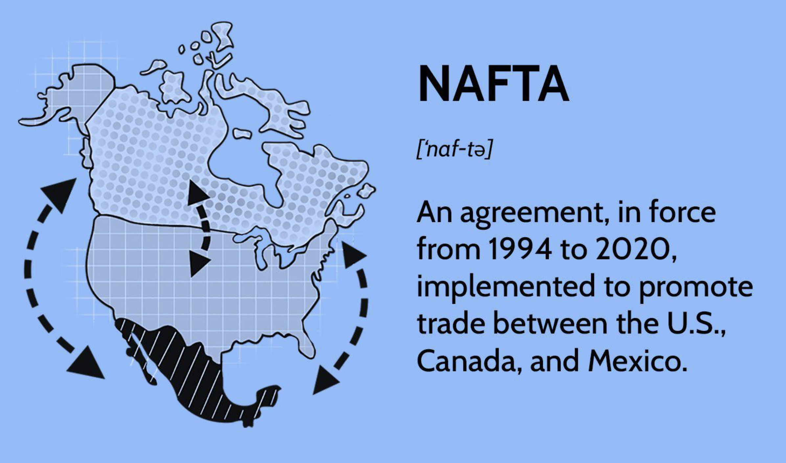

## Table of Contents

## What is the Central America-Dominican Republic Free Trade Agreement (CAFTA-DR)?

The Central America-Dominican Republic Free Trade Agreement, or CAFTA-DR, is a trade agreement between the United States, Costa Rica, El Salvador, Guatemala, Honduras, Nicaragua, and the Dominican Republic. It was created to help these countries trade more easily with each other by lowering taxes on goods and services that are traded between them. The agreement was signed in 2004 and has been in effect since 2006 for most of the countries involved.

CAFTA-DR helps businesses in these countries sell their products to other countries more easily and cheaply. This can help businesses grow and create more jobs. It also gives consumers more choices and lower prices for goods. However, some people worry that the agreement might hurt small farmers and workers in certain industries by making it harder for them to compete with bigger businesses from other countries.

## Which countries are part of the CAFTA-DR?

The CAFTA-DR includes the United States, Costa Rica, El Salvador, Guatemala, Honduras, Nicaragua, and the Dominican Republic. These countries work together to make trading easier and cheaper.

The agreement helps businesses in these countries sell their products to each other more easily. It also aims to create more jobs and give consumers more choices and lower prices.

## When was the CAFTA-DR established?

The CAFTA-DR was signed in 2004. It is a trade agreement between the United States, Costa Rica, El Salvador, Guatemala, Honduras, Nicaragua, and the Dominican Republic. The main goal of this agreement is to make it easier and cheaper for these countries to trade with each other.

The agreement came into effect in 2006 for most of the countries involved. By lowering taxes on goods and services traded between these countries, CAFTA-DR helps businesses grow and create more jobs. It also gives people more choices and lower prices for things they buy.

## What are the main objectives of the CAFTA-DR?

The main goal of the CAFTA-DR is to make trading between the United States, Costa Rica, El Salvador, Guatemala, Honduras, Nicaragua, and the Dominican Republic easier and cheaper. By lowering taxes on goods and services that are traded between these countries, businesses can sell their products to other countries more easily. This helps businesses grow and can lead to more jobs for people in these countries.

Another important objective of CAFTA-DR is to give consumers more choices and lower prices for goods. When it's easier to trade, businesses can offer more products, and competition can help keep prices down. However, some people worry that the agreement might hurt small farmers and workers in certain industries because it can be harder for them to compete with bigger businesses from other countries.

## How does CAFTA-DR benefit participating countries economically?

CAFTA-DR helps the countries involved by making it easier and cheaper to trade with each other. When taxes on goods and services are lowered, businesses can sell their products to other countries more easily. This can help businesses grow bigger and create more jobs for people. For example, a factory in Honduras might be able to sell more clothes to the United States because the taxes are lower, so they can hire more workers.

Consumers in these countries also benefit from CAFTA-DR. With easier trade, there are more products available to buy, and competition between businesses can help keep prices low. So, people can have more choices and pay less for things like food, clothes, and electronics. However, some people worry that small farmers and workers in certain industries might struggle because they have to compete with bigger businesses from other countries, which can be hard for them.

## What are the key provisions of the CAFTA-DR?

CAFTA-DR has several important rules that help countries trade more easily. One big rule is that it lowers taxes on goods and services that are traded between the countries. This makes it cheaper for businesses to sell their products to other countries. Another key rule is about protecting intellectual property, like inventions and creative works. This means that if someone in one country creates something new, their rights are protected in all the countries that are part of CAFTA-DR.

The agreement also includes rules about how workers should be treated fairly and how the environment should be protected. This means businesses have to follow certain rules to make sure workers are safe and the environment is not harmed. Another important part of CAFTA-DR is that it makes it easier for businesses to invest in other countries. This can help businesses grow and create more jobs. Overall, these rules help the countries work together and make trade easier and more fair.

## How does CAFTA-DR affect tariffs and trade between member countries?

CAFTA-DR lowers the taxes, called tariffs, that countries put on goods and services when they trade with each other. This makes it cheaper for businesses in the United States, Costa Rica, El Salvador, Guatemala, Honduras, Nicaragua, and the Dominican Republic to sell their products to other countries in the group. For example, a farmer in Guatemala can sell fruits to the United States for a lower price because the taxes are reduced. This helps businesses grow bigger and can lead to more jobs for people in these countries.

By making trade easier and cheaper, CAFTA-DR also helps consumers. When businesses can sell their products more easily, there are more choices for people to buy. Also, because businesses are competing with each other, prices can stay low. So, people in these countries can buy more things and pay less for them. However, some people worry that small farmers and workers in certain industries might struggle because they have to compete with bigger businesses from other countries, which can be hard for them.

## What are the labor and environmental standards outlined in the CAFTA-DR?

CAFTA-DR includes rules to make sure workers are treated fairly and the environment is protected. The agreement says that countries have to follow certain laws about workers' rights. This means that workers should be able to join unions, work in safe conditions, and get paid fairly. If a country doesn't follow these rules, other countries can take action to make sure the rules are followed. This helps make sure that businesses don't take advantage of workers just to save money.

The agreement also has rules to protect the environment. Countries have to make sure that businesses follow laws to keep the air and water clean and protect animals and plants. If a business harms the environment, the country has to take action to fix it. This helps make sure that trade doesn't hurt the environment. By including these rules, CAFTA-DR tries to balance the benefits of trade with protecting workers and the environment.

## How has CAFTA-DR impacted the agricultural sector in member countries?

CAFTA-DR has changed things for farmers in the countries that are part of it. The agreement makes it easier for farmers to sell their crops to other countries because it lowers the taxes on these goods. This means farmers in places like Guatemala and Honduras can sell more fruits, vegetables, and other products to the United States and other countries. This can help them make more money and grow their farms. However, some small farmers worry that they can't compete with bigger farms from other countries that can sell their products for less money.

There are also concerns about how CAFTA-DR might affect the environment and local farming practices. Some people worry that the agreement might encourage more farming that harms the environment, like cutting down forests to make room for crops. Also, some traditional ways of farming might be harder to keep going if farmers have to change how they do things to meet the new rules of the agreement. Overall, while CAFTA-DR can help farmers sell more and make more money, it also brings challenges that they have to deal with.

## What challenges have member countries faced in implementing the CAFTA-DR?

Member countries have faced several challenges in implementing CAFTA-DR. One big challenge is making sure that the rules about workers' rights and protecting the environment are followed. Sometimes, businesses try to save money by not following these rules, which can hurt workers and the environment. Governments have to keep a close watch to make sure everyone follows the rules, which can be hard and take a lot of work.

Another challenge is that some small farmers and businesses find it hard to compete with bigger companies from other countries. The agreement makes it easier for these bigger companies to sell their products in other countries, which can make it tough for smaller farms and businesses to keep up. This can lead to problems like losing jobs or having to change how they do things, which can be difficult for people.

Also, there can be disagreements between countries about how to follow the rules of CAFTA-DR. Sometimes, one country might think another country isn't following the rules, and they have to talk and maybe even take action to solve the problem. This can take time and make it harder for everyone to benefit from the agreement as much as they could.

## How does CAFTA-DR integrate with other regional trade agreements?

CAFTA-DR works together with other trade agreements in the area to make trading even easier for countries. For example, some countries in CAFTA-DR are also part of other trade groups like the Caribbean Community (CARICOM). When countries are part of more than one trade agreement, they can use the rules from each agreement to help them trade more and pay less in taxes. This can help businesses grow bigger and sell their products to more places.

Sometimes, the rules from different trade agreements can be a bit confusing. Countries have to make sure they follow all the rules from each agreement they are part of. This can be hard, but it also gives them more ways to trade and work together with other countries. Overall, CAFTA-DR and other trade agreements help countries work together to make trading easier and help their economies grow.

## What are the future prospects and potential expansions of the CAFTA-DR?

The future of CAFTA-DR looks promising as countries continue to see benefits from easier trade. More countries might want to join CAFTA-DR if they see how it helps businesses grow and create jobs. Also, the countries already in the agreement might work to make the rules even better, so everyone can trade more easily and fairly. They could focus on making sure workers and the environment are protected even more, which would help make the agreement stronger and more popular.

There are also talks about how CAFTA-DR could work with other trade agreements in the area. For example, some countries in CAFTA-DR are also part of other groups like CARICOM. By working together, these agreements could help countries trade even more and pay even less in taxes. This could lead to more growth and more jobs. But, it's important to make sure all the rules from different agreements fit together well, so it's not too confusing for businesses and countries.

## References & Further Reading

[1]: "CAFTA-DR (Dominican Republic-Central America FTA)" on the Office of the United States Trade Representative website. Available at: [https://ustr.gov/trade-agreements/free-trade-agreements/cafta-dr-dominican-republic-central-america-fta](https://ustr.gov/trade-agreements/free-trade-agreements/cafta-dr-dominican-republic-central-america-fta)

[2]: "The Implementation and Economic Effects of the Dominican Republic-Central America Free Trade Agreement (CAFTA-DR)" by J. F. Hornbeck, Congressional Research Service. Available at: [https://sgp.fas.org/crs/row/R42468.pdf](https://sgp.fas.org/crs/row/R42468.pdf)

[3]: "Algorithmic Trading and DMA: An Introduction to Direct Access Trading Strategies" by Barry Johnson.

[4]: "Trading and Exchanges: Market Microstructure for Practitioners" by Larry Harris.

[5]: "Algorithmic and High-Frequency Trading" by Álvaro Cartea, Sebastian Jaimungal, and José Penalva.