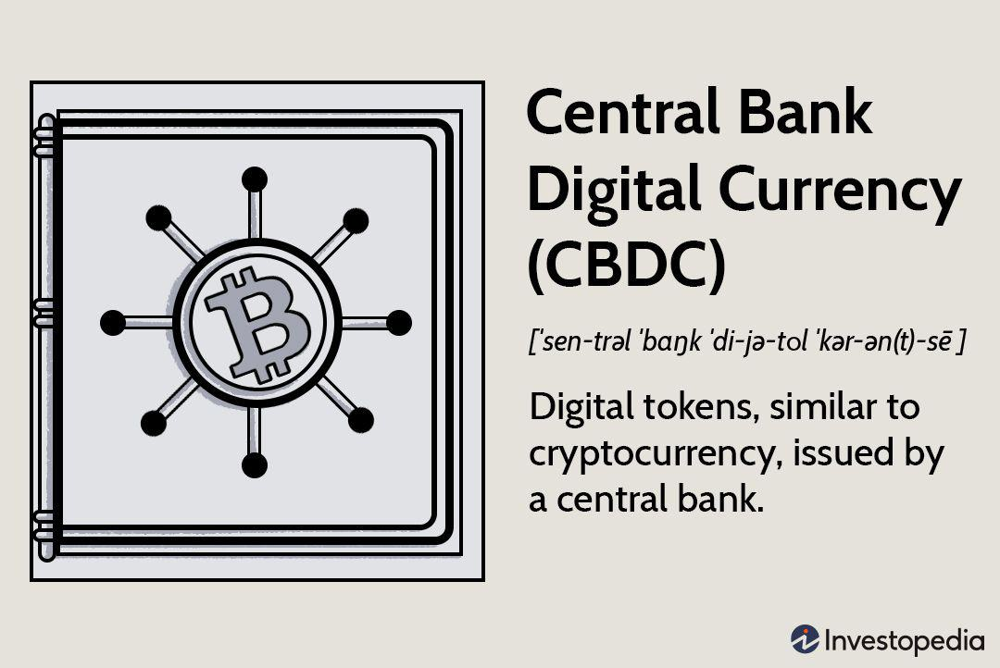

Central Bank Digital Currencies (CBDCs) have emerged as a significant topic of discussion within the realms of finance and technology. These digital currencies, issued by central banks, represent a new form of digital money that could transform global financial ecosystems. Unlike volatile cryptocurrencies, CBDCs are anchored by the stability of a nation's fiat currency, promising the potential to enhance financial inclusion, improve transaction efficiency, and bolster monetary policy effectiveness.

The integration of CBDCs with algorithmic trading holds the potential to redefine trading methodologies. Algorithmic trading, which relies on computer programs to execute trades at high speed based on pre-set criteria, has become increasingly prevalent in financial markets. This automated form of trading utilizes statistical models and machine learning, aiding traders in navigating the complexities of modern finance.



This article aims to explore the potential synergies between CBDCs and algorithmic trading. By examining the fundamentals of CBDCs, their perceived benefits and challenges, and their role in algorithmic strategies, we can understand how these digital instruments might reshape future trading practices. The combined impact of CBDCs' stability and algorithmic trading's efficiency presents intriguing possibilities for enhanced market liquidity and reduced transaction costs. As central banks continue to experiment with and implement CBDCs, the financial sector must consider how these developments will influence existing trading frameworks and practices.

## Table of Contents

## Understanding Central Bank Digital Currencies (CBDCs)

Central Bank Digital Currencies (CBDCs) represent a digital form of a country’s existing fiat currency, directly issued and regulated by the nation’s central bank. Unlike decentralized cryptocurrencies such as Bitcoin, which can experience significant price volatility, CBDCs maintain a stable value due to backing by governmental authorities, ensuring trust and reliability in their use.

The primary objectives of CBDCs include:

1. **Enhancing Financial Inclusion:** By providing digital currency access to those without traditional banking capabilities, CBDCs can significantly foster financial inclusion. This is particularly beneficial in remote or underserved areas where conventional banking infrastructure is limited. Digital currency can reach individuals via mobile or digital platforms without the need for physical bank branches, reducing barriers to entry for financial services.

2. **Reducing Transaction Costs:** Facilitating economic transactions via digital means can lower the costs associated with handling physical cash, such as printing, storage, and distribution. Digital transactions can also reduce time and administrative burdens involved in settlement processes. Consequently, businesses and consumers can benefit from more efficient financial ecosystems, enhancing competitiveness and economic growth.

3. **Increasing Monetary Policy Effectiveness:** With CBDCs, central banks could gain more accurate and real-time data on the money supply and economic activity. This information can enhance the precision with which monetary policy tools are employed, potentially leading to more stable economic environments. Furthermore, CBDCs can allow for more direct implementations of policy measures, such as targeted subsidies or transfers, which can be essential during economic interventions like recession recovery efforts.

CBDCs' introduction into existing financial systems necessitates careful consideration of technological and regulatory frameworks to ensure alignment with current infrastructures and policies. They also present an opportunity to modernize and adapt national and international financial operations to a digital age, potentially leading to more interconnected and efficient systems.

## The Rise of Algorithmic Trading

Algorithmic trading utilizes computer programs to execute trades at speeds and volumes unattainable by human traders. This method relies on algorithms based on pre-determined criteria to identify trading opportunities in financial markets. Historical price data, trading volumes, and other relevant metrics are processed rapidly to make informed decisions. The automation of trading strategies allows for reduced latency and increased execution efficiency.

A core component of [algorithmic trading](/wiki/algorithmic-trading) is the use of statistical models and [machine learning](/wiki/machine-learning) algorithms. These models analyze market data to detect patterns and predict future price movements. For instance, a basic moving average crossover strategy might employ two moving averages: a short-term (e.g., 50-day) and a long-term (e.g., 200-day). A buy signal is generated when the short-term average crosses above the long-term average, while a sell signal is triggered when the opposite occurs.

```python
def moving_average_crossover(prices, short_window=50, long_window=200):
    short_ma = prices.rolling(window=short_window).mean()
    long_ma = prices.rolling(window=long_window).mean()
    signal = short_ma > long_ma
    return signal
```

The rise of algorithmic trading corresponds with the increasing complexity of financial markets. In particular, high-frequency trading ([HFT](/wiki/high-frequency-trading-strategies)), a subset of algorithmic trading, involves executing orders of large [volume](/wiki/volume-trading-strategy) at extremely high speeds. HFT leverages direct market access, co-location, and proprietary algorithms to gain an edge over competitors.

In addition to traditional finance, algorithmic trading has made significant inroads into the [cryptocurrency](/wiki/cryptocurrency) market. The decentralized nature and 24/7 availability of cryptocurrencies make them suitable for algorithmic strategies, allowing traders to exploit [arbitrage](/wiki/arbitrage) opportunities and manage large portfolios across various exchanges.

The prominence of algorithmic trading is driven by several factors, including improved technology and increased market access. With advancements in computing power, financial institutions can process and analyze vast datasets more efficiently. Regulatory environments in many jurisdictions have also adapted to accommodate algorithmic strategies, recognizing their role in enhancing market [liquidity](/wiki/liquidity-risk-premium) and efficiency. Therefore, algorithmic trading has become an integral part of modern financial markets, promising continued evolution alongside technological innovation.

## Linking CBDCs and Algorithmic Trading

Central Bank Digital Currencies (CBDCs) present a promising opportunity to enhance algorithmic trading strategies in digital markets. As government-backed digital currencies, CBDCs offer a level of stability that is typically absent in the volatile cryptocurrency market, making them an attractive medium for algorithmic trading. This stability can significantly reduce the risk inherent in high-frequency trading algorithms, which rely on fast execution and minimal price slippage.

The integration of CBDCs with algorithmic trading systems can streamline cross-border transactions. Traditional cross-border trades often involve complex processes and multiple intermediaries, leading to increased costs and time delays. CBDCs facilitate near-instantaneous settlements without the need for various counterparties, reducing both operational costs and the time required to complete transactions. This efficiency is particularly beneficial in algorithmic trading, where the speed of execution can significantly affect profitability.

Algorithmic trading with CBDCs can also promote market liquidity and efficiency. By providing a stable and reliable digital currency option, CBDCs can enable more participants to enter the market, thus enhancing liquidity. Environments with high liquidity levels facilitate better price discovery and reduce bid-ask spreads, making markets more efficient. Traders can execute large orders with minimal price impact, further optimizing trading strategies.

Python code can be used to simulate the potential impact of CBDCs on market operations. For instance, a simple simulation of transaction times can illustrate the benefits of CBDC instant settlement:

```python
import numpy as np

# Simulate transaction times (in seconds) for traditional and CBDC systems
traditional_times = np.random.normal(loc=5, scale=1, size=1000)  # Average 5 seconds, standard deviation 1
cbdc_times = np.random.normal(loc=0.1, scale=0.01, size=1000)    # Average 0.1 seconds, standard deviation 0.01

# Calculate the average time
avg_traditional = np.mean(traditional_times)
avg_cbdc = np.mean(cbdc_times)

print(f"Average Traditional Transaction Time: {avg_traditional:.3f} seconds")
print(f"Average CBDC Transaction Time: {avg_cbdc:.3f} seconds")
```

This simple model highlights the vast difference in transaction times, where CBDCs provide almost instantaneous transactions compared to traditional methods, thereby optimizing algorithmic trading operations.

In summary, the linkage of CBDCs with algorithmic trading systems could transform digital financial markets by offering stability, improved efficiency, and enhanced liquidity. As more central banks explore and implement CBDCs, the potential for these benefits to be realized in algorithmic trading becomes increasingly tangible.

## Benefits of Using CBDCs in Algorithmic Trading

Central Bank Digital Currencies (CBDCs) present several advantages when utilized in algorithmic trading. One of the primary benefits is the increased stability and trust they provide, being backed by national governments. This state-backed assurance reduces the [volatility](/wiki/volatility-trading-strategies) risks commonly associated with other digital currencies, offering a reliable environment for automated trading systems.

The real-time nature of CBDCs allows for instant settlement of transactions. This feature significantly reduces counterparty risk, a critical consideration in trading operations. Instant settlement means that traders do not face the typical waiting periods associated with traditional currency settlements, which can range from a few hours to several days. Consequently, the immediate confirmation of transactions enhances the efficiency of trading systems and mitigates the risks of price fluctuations during the settlement period.

Additionally, the integration of CBDCs in trading reduces transaction costs. These lower costs can be attributed to the elimination of intermediaries typically involved in the traditional currency settlement process, such as banks and clearinghouses. The seamless nature of CBDC transactions can result in lower fees, thus enhancing the profit margins of algorithmic trading systems. The cost savings from reduced fees are particularly beneficial in high-frequency trading operations, where transaction costs can significantly impact profitability.

To illustrate the impact on profit margins, consider an algorithmic trading strategy that executes thousands of trades daily. Even a minor reduction in per-transaction fees can lead to substantial savings over time. 

In summary, the use of CBDCs in algorithmic trading capitalizes on their inherent stability, instant settlement capability, and cost efficiency, altogether fostering a more robust and profitable trading ecosystem.

## Challenges and Risks

The integration of Central Bank Digital Currencies (CBDCs) into algorithmic trading presents a range of challenges and risks. A primary challenge is cybersecurity. As CBDCs are digital in nature, they are vulnerable to cyberattacks, including hacking, fraud, and other forms of digital crime. The need to secure these digital assets from malicious entities requires robust security protocols and technologies, which can be costly and complex to implement.

Privacy concerns are significant when incorporating CBDCs in algorithmic trading. Unlike traditional cryptocurrencies that often offer pseudonymity, CBDC transactions are fully traceable. This traceability conflicts with the privacy that cryptocurrency traders expect, as every transaction can be monitored by central banks and government entities. Such a system could deter users who prioritize privacy from engaging with CBDCs, thus limiting their adoption in algorithmic trading.

There is also considerable uncertainty about the regulatory landscape concerning CBDCs. The regulation of these digital currencies is still in its nascent stages, with many countries yet to develop comprehensive legislative frameworks. Central banks typically have the authority to influence monetary policy, and the introduction of CBDCs may alter traditional financial systems, potentially leading to new regulatory requirements. This uncertainty can create challenges for algorithmic traders who need stable and predictable regulatory environments to manage their operations effectively.

The interplay between these cybersecurity challenges, privacy concerns, and unclear regulations presents substantial risks to the successful integration of CBDCs in algorithmic trading. As the landscape evolves, collaborative efforts between financial institutions, governments, and technology experts will be essential to navigate these challenges effectively.

## Current Developments and Future Outlook

Several nations are making significant strides in the adoption and exploration of Central Bank Digital Currencies (CBDCs), with notable progress in countries like China and the Bahamas. China has positioned itself at the forefront of CBDC development with its digital currency, the Digital Currency Electronic Payment (DCEP), commonly referred to as the digital yuan. The People's Bank of China has conducted extensive pilot programs in various cities, relying on large-scale consumer trials to refine the digital yuan's use in daily transactions.[^1] The Bahamas, on the other hand, introduced its Sand Dollar, making it the first fully operational retail CBDC. The Sand Dollar aims to address geographic financial disparities inherent in the archipelago's unique structure.[^2]

Central banks globally are recognizing CBDCs' potential to enhance digital ecosystems, offering more efficient payment infrastructures and reducing reliance on cash. Furthermore, the adoption of CBDCs introduces efficiencies in governance, such as improved monetary policy transmission, greater financial inclusion, and more robust transaction tracking that aids in combating illicit financial activities.

The implementation of CBDCs could significantly influence the landscape of algorithmic trading. One of the primary drivers of this potential shift is the ongoing advancement in technology, particularly concerning scalability, transaction speed, and security. A significant focus is on developing blockchain and distributed ledger technologies that underpin the secure and efficient operation of digital currencies.[^3] As CBDCs become more prevalent, algorithmic trading systems can capitalize on their inherent features—like instantaneous settlement and enhanced liquidity.

Simultaneously, regulatory frameworks are being crafted to manage the integration of CBDCs into existing financial systems. This regulatory evolution is crucial as it seeks to balance innovation with security, ensuring that CBDCs meet rigorous standards to protect against financial crime and systemic risks. Countries are closely examining these frameworks, learning from each other to create harmonized guidelines that would streamline cross-border transactions while respecting national monetary policy autonomy.

The future of CBDCs in algorithmic trading is promising but depends on a complex interplay of technological advancements and regulatory developments. As infrastructures mature, CBDCs' potential to transform financial transactions and markets continues to grow, necessitating collaboration among central banks, financial institutions, and technology developers to overcome remaining challenges.

[^1]: European Central Bank. (2020). Report on a Digital Euro. 
[^2]: International Monetary Fund. (2020). The Bahamas Takes a Leap Toward the Future with Digital Currency.
[^3]: Bank for International Settlements. (2021). CBDCs: An Opportunity for the Monetary System.

## Conclusion

Central Bank Digital Currencies (CBDCs) stand at the forefront of transforming financial markets. When paired with algorithmic trading, they present a formidable opportunity to enhance trading efficiency and market stability. By offering a government-backed digital asset, CBDCs can provide unparalleled trust and reliability in financial transactions, minimizing the volatility often associated with digital currencies.

The inherent benefits of CBDCs, such as instant settlement, could significantly reduce counterparty risk, a perennial challenge in the trading landscape. This capability could streamline operations, allowing for faster and more secure trades, thereby enabling algorithmic systems to function with heightened precision and reduced latency.

However, these advantages are not without challenges. Issues regarding cybersecurity, privacy, and regulatory frameworks pose significant hurdles that need to be addressed. The traceability of transactions, although beneficial for security, raises privacy concerns that require innovative solutions. Furthermore, the regulatory environment remains uncertain as central banks navigate the complexities of incorporating digital currencies into existing monetary policies.

The future of CBDCs in algorithmic trading is promising but hinges on meticulous implementation and robust collaboration among global financial institutions. Success demands a coordinated effort to ensure that regulatory frameworks are conducive to innovation while safeguarding security and privacy. As central banks continue to explore and pilot CBDC initiatives, the potential for these digital currencies to anchor a new era of efficient and stable financial trading systems becomes more attainable. Through careful planning and international cooperation, the integration of CBDCs into algorithmic trading is poised to revolutionize the global financial ecosystem.

## References & Further Reading

[1]: Bank for International Settlements. (2021). ["CBDCs: An Opportunity for the Monetary System."](https://www.bis.org/publ/arpdf/ar2021e3.htm)

[2]: European Central Bank. (2020). ["Report on a Digital Euro."](https://www.ecb.europa.eu/euro/html/digitaleuro-report.en.html)

[3]: International Monetary Fund. (2020). ["The Bahamas Takes a Leap Toward the Future with Digital Currency."](https://www.imf.org/en/News/Articles/2021/01/26/pr2123-the-bahamas-imf-executive-board-concludes-2020-article-iv-consultation)

[4]: ["Advances in Financial Machine Learning"](https://www.amazon.com/Advances-Financial-Machine-Learning-Marcos/dp/1119482089) by Marcos Lopez de Prado

[5]: ["Quantitative Trading: How to Build Your Own Algorithmic Trading Business"](https://www.amazon.com/Quantitative-Trading-Build-Algorithmic-Business/dp/1119800064) by Ernest P. Chan