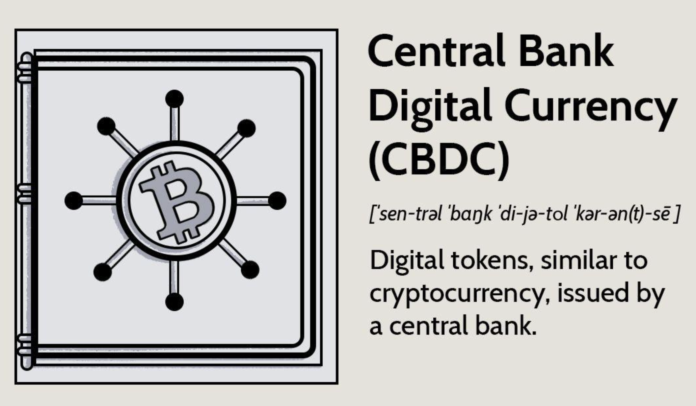

## Table of Contents

## What is a Central Bank Digital Currency (CBDC)?

A Central Bank Digital Currency (CBDC) is a digital form of a country's official currency, issued and regulated by its central bank. It's like the digital version of cash, but instead of physical notes and coins, it exists only in electronic form. The central bank manages it, ensuring it's secure and works smoothly, just like they do with regular money.

CBDCs are different from cryptocurrencies like Bitcoin because they are backed by the government and have the same value as physical money. This means people can trust them as much as they trust their regular currency. Countries are looking into CBDCs because they could make payments easier, faster, and more inclusive, especially for people who don't have bank accounts. It's a way to modernize money and keep up with the digital world.

## How does a CBDC differ from traditional physical currency?

A CBDC is different from traditional physical currency because it exists only in digital form. Instead of having paper notes or metal coins, a CBDC is like money that you can only see and use on your phone or computer. It's managed by the central bank, just like regular money, but you can't touch it or put it in your wallet. You use it through apps or online systems to buy things or send money to others.

Another big difference is how you can use a CBDC. With physical money, you can pay for things even if you're not connected to the internet or if you're in a place where banks aren't open. But with a CBDC, you need some kind of digital device and usually an internet connection to use it. This can make it easier and faster to send money around the world, but it also means you need technology to spend it. Both types of money are backed by the government, so they're equally safe, but they work in different ways.

## What are the main types of CBDCs?

There are two main types of CBDCs: retail CBDCs and wholesale CBDCs. Retail CBDCs are for everyday people like you and me. They let us use digital money for things like buying groceries, paying bills, or sending money to friends. It's like having a digital version of cash that we can use easily with our phones or computers.

Wholesale CBDCs are different because they are meant for banks and big financial institutions. They use these CBDCs to move large amounts of money between themselves quickly and safely. It helps them do their big money transactions more efficiently, but regular people don't use wholesale CBDCs. Both types are important, but they serve different purposes in the world of money.

## What are the potential benefits of implementing a CBDC?

Implementing a CBDC can bring several benefits. One big advantage is that it can make payments faster and easier. With a CBDC, you can send money to anyone, anywhere, almost instantly, without needing to wait for banks to process the transaction. This can be really helpful for people who need to send money to family in other countries or for businesses that need to pay suppliers quickly. Also, since CBDCs are digital, they can help more people get access to financial services, especially those who don't have bank accounts. This can make it easier for everyone to participate in the economy.

Another benefit is that CBDCs can be more secure and easier to track than physical money. Because they're digital, it's harder for people to use them for illegal activities like money laundering. The central bank can also keep a close eye on how the money is being used, which can help them manage the economy better. Plus, since CBDCs don't need to be printed like cash, they can be more environmentally friendly. Overall, CBDCs can help modernize the way we use money, making it more efficient and inclusive for everyone.

## What are the risks and challenges associated with CBDCs?

One of the main risks with CBDCs is privacy. Since CBDCs are digital and managed by the central bank, there's a worry that the government might be able to see all your spending and saving. People value their privacy, and they might not like the idea of the government keeping an eye on how they use their money. There's also the risk of cyber attacks. Because CBDCs are online, hackers might try to steal money or mess with the system. It's important for the central bank to have strong security to protect people's money.

Another challenge is making sure everyone can use CBDCs easily. Not everyone has a smartphone or good internet, so they might find it hard to use digital money. The central bank needs to make sure that people who aren't used to technology can still use CBDCs without problems. There's also the question of what happens to regular banks if everyone starts using CBDCs. If too many people move their money to CBDCs, banks might struggle because they rely on people keeping money in their accounts. This could affect the whole financial system, so it's something that needs careful planning.

## How might a CBDC impact the existing banking system?

A CBDC could change the way banks work. If people start using CBDCs a lot, they might keep less money in regular bank accounts. Banks need that money to lend to others and make money themselves. If too much money moves to CBDCs, banks might find it hard to do their job. They might need to change how they work or find new ways to keep people's money. This could shake up the whole banking system and make banks think about new ways to serve their customers.

On the other hand, CBDCs could also help banks in some ways. They could make it easier for banks to move money around quickly and safely. This could save banks time and money. Banks might also work with the central bank to help people use CBDCs, which could bring them new customers. But it's important for banks and the central bank to work together to make sure that using CBDCs doesn't hurt the banking system too much. They need to find a balance that keeps everything running smoothly.

## What is the current status of CBDC adoption around the world?

Many countries are looking into CBDCs and some are already trying them out. For example, China has been testing its digital yuan in several cities and is expanding its use. The Bahamas has already launched its own CBDC called the Sand Dollar, which people can use for everyday purchases. Other countries like Sweden and Nigeria are also running pilot programs to see how well CBDCs work in their economies. These efforts show that CBDCs are becoming more and more important around the world.

However, not every country is moving at the same speed. Some, like the United States and the European Union, are still studying CBDCs and haven't decided if they will launch their own. They are looking at the pros and cons and trying to figure out the best way to do it. This means that while some countries are ahead in using CBDCs, others are taking their time to make sure they get it right. Overall, the idea of CBDCs is gaining interest, but how quickly they are adopted depends on each country's situation.

## How does a CBDC ensure privacy and security for users?

A CBDC tries to keep your money safe and your privacy protected, but it can be tricky. To keep your money secure, the central bank uses strong technology like encryption. This means your money is locked up with special codes that only you can unlock. They also have systems to watch for any strange activity, like if someone tries to steal your money. If anything looks fishy, they can stop it before it becomes a problem. This helps make sure your digital money is as safe as cash in your wallet.

When it comes to privacy, CBDCs have to balance letting you keep your spending private and letting the central bank see what's happening with the money. Some CBDCs let you have accounts that keep your identity secret, so the central bank can't see who you are. But they might still be able to see what you're buying or how much you're spending. Other CBDCs might give you more privacy, but it's hard to keep everything completely secret because the central bank needs to watch the money to make sure it's being used the right way. It's all about finding the right balance to keep your money safe and your privacy protected.

## What role do CBDCs play in financial inclusion?

CBDCs can help more people join the financial world by giving them an easy way to use money without needing a bank account. In many places, people can't use banks because they're too far away, too expensive, or just too hard to understand. With CBDCs, you can use your phone to send and receive money, even if you don't have a bank account. This means more people can buy things, save money, and send it to family without needing to go to a bank. It's like having a digital wallet that's easy to use and helps everyone be part of the economy.

But, it's not just about having access to money. CBDCs can also help people who are left out of the financial system feel more included. For example, in some countries, women, people in rural areas, or those with low incomes might find it hard to use traditional banks. A CBDC can make it easier for them to get and use money, which can help them start businesses, pay for things they need, and feel more in control of their finances. By making money digital and easier to use, CBDCs can help build a fairer and more inclusive economy for everyone.

## How are CBDCs designed to combat issues like money laundering and fraud?

CBDCs are designed to fight money laundering and fraud by using technology to keep a close watch on how money moves. Because CBDCs are digital, every transaction leaves a trail that the central bank can follow. This makes it easier to spot strange or illegal activities, like someone moving a lot of money quickly or in weird ways. If the central bank sees something that doesn't look right, they can step in and stop it before it turns into a bigger problem. This helps keep the money system clean and safe for everyone.

Another way CBDCs help is by making it harder for people to hide their money. With physical cash, it's easy to move money around without anyone knowing. But with CBDCs, it's much harder to do this because everything is recorded. This means that people who might want to use money for illegal things have a harder time doing it. By keeping a clear record of every transaction, CBDCs make it easier for the central bank to catch and stop money laundering and fraud, helping to protect people's money and keep the economy honest.

## What technological infrastructure is required to support a CBDC?

To support a CBDC, you need a strong technology setup. This includes powerful computers and servers to handle all the transactions quickly and safely. You also need a good internet connection so people can use the CBDC on their phones or computers. The central bank needs special software to manage the CBDC and keep track of all the money moving around. This software should be able to spot any problems or suspicious activities and stop them before they get worse.

Another important part is keeping the CBDC secure. This means using encryption to protect people's money and privacy. The system also needs to be able to handle a lot of people using it at the same time without slowing down or crashing. It's also helpful to have technology that can work with other systems, like banks and payment apps, so people can use the CBDC easily. All these parts together make sure the CBDC can work well and help people use money in a new, digital way.

## What are the future prospects and potential developments for CBDCs?

The future of CBDCs looks promising as more and more countries are exploring and testing them. Many central banks are working on their own digital currencies to see how they can make money easier and faster to use. Some countries might fully launch their CBDCs soon, while others are still figuring out the best way to do it. As technology gets better, CBDCs could become even more secure and easier to use, helping more people around the world to join the digital economy. This could lead to a world where money is mostly digital, making it quicker and simpler to send money anywhere.

There are also new ideas and developments that could change how we use CBDCs. For example, some people are thinking about how CBDCs could work with other new technologies, like smart contracts, to make payments automatic and safe. There's also the possibility of CBDCs working together across different countries, which could make it easier to buy things or send money abroad. As we learn more about CBDCs and how they work, we might find even better ways to use them, making money more inclusive and efficient for everyone.

## References & Further Reading

[1]: Bank for International Settlements. (2021). ["CBDCs: An Opportunity for the Monetary System."](https://www.bis.org/publ/arpdf/ar2021e3.htm)

[2]: European Central Bank. (2020). ["Report on a Digital Euro."](https://www.ecb.europa.eu/euro/html/digitaleuro-report.en.html)

[3]: International Monetary Fund. (2020). ["The Bahamas Takes a Leap Toward the Future with Digital Currency."](https://www.imf.org/en/News/Articles/2021/01/26/pr2123-the-bahamas-imf-executive-board-concludes-2020-article-iv-consultation)

[4]: ["Advances in Financial Machine Learning"](https://www.amazon.com/Advances-Financial-Machine-Learning-Marcos/dp/1119482089) by Marcos Lopez de Prado

[5]: ["Quantitative Trading: How to Build Your Own Algorithmic Trading Business"](https://www.amazon.com/Quantitative-Trading-Build-Algorithmic-Business/dp/1119800064) by Ernest P. Chan