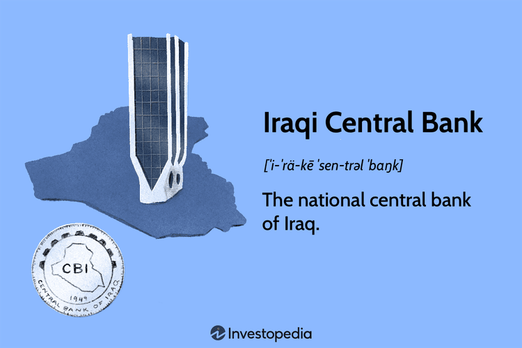

The Central Bank of Iraq (CBI) is a cornerstone in the Iraqi economy and banking system. Established in 2004, following the political changes that occurred after the fall of Saddam Hussein's regime, the CBI has been integral to the country's efforts to manage its monetary policy and ensure financial stability. By controlling inflation, stabilizing the exchange rate, and formulating an effective monetary framework, the bank plays a critical role in guiding Iraq through economic challenges and transitions.

A significant development in recent years is the CBI's adoption of International Standard Banking Practices. This shift is pivotal as it reflects Iraq's aspirations to integrate its financial system more closely with global markets, enhancing the transparency, security, and efficiency of its banking operations. By aligning with international norms, the CBI aims to boost investor confidence and foster economic growth.

This article will examine the intricate functioning of the CBI, highlighting various challenges and recent developments within the Iraqi banking system. It will also explore how the bank impacts the broader economic landscape, ultimately underscoring its importance in facilitating Iraq's economic recovery and growth.

## Table of Contents

## The Role of the Iraqi Central Bank

The Central Bank of Iraq (CBI) is the linchpin of the country's financial and monetary systems, tasked with several critical functions that ensure economic stability and growth in Iraq. One of its primary responsibilities is the implementation of Iraq's monetary policy, which involves maintaining control over the country's money supply and interest rates to achieve macroeconomic objectives like controlling inflation, securing full employment, and stabilizing the currency.

A key aspect of the CBI's monetary policy is the maintenance of a currency peg to the U.S. dollar. This peg helps stabilize the Iraqi dinar by anchoring its value to the more stable and widely accepted U.S. currency, which is crucial for maintaining price stability in an economy heavily reliant on imports. By stabilizing the exchange rate, the CBI helps mitigate the direct impact of exchange rate fluctuations on the domestic economy, thus providing a predictable environment for trade and investment.

In addition to monetary policy, the CBI is responsible for managing Iraq's foreign reserves. These reserves are critical for the country's financial health as they provide a buffer to meet external obligations, influence exchange rates, and offer a line of defense against economic shocks. Effective management of these reserves ensures that Iraq can meet its international liabilities, which is essential for maintaining international confidence in the Iraqi economy.

The CBI also plays a pivotal role in overseeing the banking sector in Iraq. This oversight includes the regulation and supervision of banks to ensure they operate safely and soundly, adhering to the regulations that promote the integrity of the financial system. By ensuring the robustness and reliability of these financial institutions, the CBI helps foster trust among depositors and investors, which is vital for a stable banking environment.

Beyond just overseeing traditional banks, the CBI is instrumental in developing Iraq’s financial system, which extends to the realms of stock exchanges and insurance companies. By fostering a diversified financial sector, the CBI contributes to a more resilient economy capable of supporting growth and development. Encouraging a dynamic financial sector with robust stock markets and insurance services is critical for long-term economic vitality, offering businesses and individuals access to capital and risk management tools.

Through these multifaceted roles, the Central Bank of Iraq significantly impacts the country's economic landscape, aiming to steer its financial system towards stability and growth amidst ongoing challenges.

## Economic Challenges Faced by Iraq

Iraq's economy is predominantly supported by its vast oil reserves, with oil exports constituting a significant portion of government revenue and gross domestic product (GDP). This reliance on a single commodity makes Iraq particularly susceptible to global oil price [volatility](/wiki/volatility-trading-strategies). For instance, a decline in oil prices can lead to substantial budget deficits, affecting public spending and economic growth. The price elasticity of Iraq’s oil revenue underscores this vulnerability, as minor fluctuations in global oil prices can disproportionately impact national income.

Internal conflicts add another layer of complexity to Iraq's economic landscape. The nation's political and social turmoil, particularly in the past few decades, has disrupted economic activities and damaged infrastructure. Corruption remains a substantial barrier to financial stability and growth, undermining public trust and hindering effective government operations. Transparency International consistently ranks Iraq among countries with high levels of perceived corruption, which affects investment and economic management.

The emergence of the Islamic State (ISIS) further exacerbated Iraq's economic challenges. The insurgency not only resulted in significant loss of life and displacement but also led to the looting of banks and destruction of property in regions under ISIS control. This upheaval severely damaged local economies and increased the burden on the Central Bank of Iraq (CBI) to stabilize the national financial system. The CBI has faced monumental challenges in re-establishing confidence and order within the financial sector amidst these threats.

In response, Iraq has engaged in efforts to diversify its economy and reduce its dependency on oil, looking towards agriculture, industry, and services to drive growth. However, progress has been impeded by inadequate infrastructure, security concerns, and a lack of comprehensive reforms. Addressing these economic challenges requires concerted efforts to stabilize the political environment, improve governance, and implement structural reforms aimed at fostering an inclusive and robust economic ecosystem.

## Transition to International Standard Banking Practices

The Central Bank of Iraq (CBI) has progressed notably in its transition to handling foreign transactions directly through Iraqi banks. This move represents a strategic alignment with international banking practices, where central banks typically focus on broader monetary policy while commercial banks handle individual transactions. By delineating these roles, the CBI aims to streamline operations within Iraq's financial system, enhancing both security and efficiency in foreign currency transactions.

Historically, foreign transactions in Iraq involved a more centralized approach, with the CBI playing a significant role in individual currency exchanges. This method, while functional, often led to delays and increased the risk of discrepancies in currency handling. By transitioning to a decentralized system, the CBI allows banks to process transactions independently, thus improving operational efficiency and reducing systemic risks. 

This change is not merely administrative but serves as a confidence-building measure for international markets. By modeling its operations on successful frameworks observed in financially stable economies, Iraq signals its readiness to participate more fully in global financial activities. This structure encourages foreign investment by ensuring that currency operations are conducted in a consistent and reliable manner, thereby fostering international confidence.

The transition is also aligned with broader initiatives to integrate Iraq into the global market, which requires resilience and adaptability to international standards. Such alignment is expected to facilitate smoother international transactions and attract more foreign capital, crucial for enhancing economic growth and development. As Iraqi banks adopt these new roles, they benefit from increased autonomy and the opportunity to develop competitive capabilities in handling complex financial services —conditions essential for a vibrant financial ecosystem.

In summary, the Central Bank of Iraq's shift to handling foreign transactions through commercial banks highlights its commitment to modernizing the financial sector in line with international standards. This evolution not only fortifies the security of currency operations but also enhances the operational efficiency of banking processes within Iraq, laying the groundwork for a more integrated and robust financial landscape.

## Algorithmic Trading and Iraq's Market Potential

Algorithmic trading, though still at an initial stage in Iraq, offers promising opportunities to enhance the efficiency and competitiveness of the Iraqi stock market. As financial systems across the globe increasingly adopt automated trading strategies, Iraq's potential for growth can be significantly amplified by integrating such technological advancements. By deploying complex algorithms for trading decisions, market participants can experience improved speed and accuracy in trade executions, which is essential for competing in the modern financial landscape.

The integration of [algorithmic trading](/wiki/algorithmic-trading) can attract foreign investors by boosting market [liquidity](/wiki/liquidity-risk-premium) and reducing transaction costs. High-frequency trading, a subset of algorithmic trading, can further increase the [volume](/wiki/volume-trading-strategy) of trades, providing more stability and less volatility, which are attractive features for investors considering the Iraqi market.

To exploit these opportunities, Iraq must focus on reinforcing its regulatory frameworks. An effective regulatory environment is crucial to prevent market manipulations, such as spoofing and layering, which can undermine investor confidence. Transparent and well-enforced regulations ensure a fair trading environment, making Iraq more appealing to international traders.

Moreover, developing a robust technological infrastructure forms the backbone of successful algorithmic trading systems. Reliable internet connectivity, advanced data centers, and modern trading platforms are prerequisites for facilitating the high-speed transactions that algorithmic trading demands. Enhancements in these technological domains can support the swift execution of trades and the seamless operation of complex algorithms, essential for the functionality of automated trading systems.

In summary, while algorithmic trading is at a nascent stage in Iraq, it presents an avenue for significant market development. A strategic focus on strengthening regulatory frameworks and technological infrastructure can unlock this potential, positioning Iraq to more effectively attract foreign investment and integrate into the global financial system.

## Conclusion

The Central Bank of Iraq (CBI) remains a cornerstone for ensuring economic stability and fostering growth in the nation. By effectively managing monetary policy and financial regulation, the CBI plays a critical role in navigating the diverse challenges facing Iraq's economy. The country's heavy reliance on oil exports, geopolitical instability, and internal disruptions necessitate robust financial oversight and strategic planning.

Adapting to international banking standards is one of the key measures facilitating the improvement of Iraq's financial sector. By aligning with global practices, the CBI not only enhances its operational efficiency but also bolsters international confidence in Iraq’s financial system. This strategic shift is crucial for improving the security and reliability of foreign transactions and reducing systemic risks.

Furthermore, embracing technological advancements such as algorithmic trading presents significant future prospects for Iraq's economic integration into global markets. This requires the development of supportive infrastructures and regulatory frameworks to ensure efficient and secure trading environments. By harnessing technology, Iraq can potentially attract foreign investments, enhance market liquidity, and promote sustainable economic growth. Together, overcoming economic challenges and embracing modern practices underscore the pivotal role of the CBI in steering Iraq towards a more resilient and globally integrated financial future.

## References & Further Reading

[1]: Alnasrawi, A. (2006). ["Iraq's Burdens: Oil, Sanctions, and Underdevelopment"](https://books.google.com/books/about/Iraq_s_Burdens.html?id=A3T-nrzECooC) in Arab Studies Quarterly, 28(1).

[2]: International Monetary Fund. (2020). ["Iraq: 2019 Article IV Consultation and Request for a Stand-By Arrangement."](https://www.imf.org/en/Publications/CR/Issues/2021/02/10/Iraq-2020-Article-IV-Consultation-Press-Release-Staff-Report-and-Statement-by-the-Executive-50078)

[3]: Dridi, J., & Sula, O. (2021). ["Central Bank Credit to the Government Through Quasi-Fiscal Activities in Pre-Conflict Syria and Iraq"](https://www.imf.org/en/Publications/WP/Issues/2021/03/05/Central-Bank-Credit-to-the-Government-Through-Quasi-Fiscal-Activities-in-Pre-Conflict-Syria-and-50177) by the International Monetary Fund.

[4]: Transparency International. (2022). ["Corruption Perceptions Index 2022"](https://www.transparency.org/en/cpi/2022).

[5]: Al-Khatteeb, L. (2015). ["The Role of Oil in Iraqi Political and Economic Challenges"](https://www.researchgate.net/publication/361228828_Title_Oil_Revenue_Distribution_between_Iraqi-Kurdistan_Region_and_International_Oil_Companies_Co-writers) by The Brookings Institution.

[6]: Cihak, M., Mare, D., & Melecky, M. (2020). ["Integration into the Global Banking Network: Iraq"](https://papers.ssrn.com/sol3/papers.cfm?abstract_id=2811371) by The World Bank.