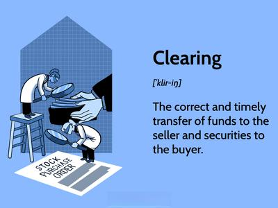

## Table of Contents

## What is a Central Counterparty (CCP) Clearing House?

A Central Counterparty (CCP) Clearing House is an organization that helps make trading safer and more efficient. When people or companies trade things like stocks or futures, they usually have to trust each other to finish the deal. A CCP steps in the middle of these trades. It becomes the buyer to every seller and the seller to every buyer. This way, if one side of the trade can't pay up, the CCP makes sure the other side still gets what they were promised.

CCPs also help manage the risk that comes with trading. They do this by requiring traders to put up money or other assets as a guarantee, called margin. This money acts like a safety net. If a trader can't pay, the CCP uses this margin to cover the losses. By doing all this, CCPs make the whole trading system more stable and trustworthy.

## Why is a CCP important in trading?

A CCP is really important in trading because it makes sure that trades are safe and secure. When you trade, you want to be sure that the other person will do their part of the deal. A CCP steps in and becomes the middle person, promising to complete the trade no matter what. This means if the person you're trading with can't pay or deliver, the CCP will step in and make sure you still get what you were supposed to get. This makes trading a lot less risky and helps everyone trust the system more.

Another reason CCPs are important is that they help manage risk. Trading can be unpredictable, and sometimes things go wrong. CCPs ask traders to put up money or other valuable things as a kind of safety deposit, called margin. If something goes wrong and a trader can't pay, the CCP uses this margin to cover the losses. This way, the CCP helps keep the whole trading system stable and prevents big problems from spreading. By doing this, CCPs make the market a safer place for everyone to trade.

## How does a CCP reduce risk in financial markets?

A CCP reduces risk in financial markets by acting as the middle person in trades. When you trade something like stocks or futures, the CCP steps in and becomes the buyer to every seller and the seller to every buyer. This means if one side of the trade can't pay or deliver what they promised, the CCP makes sure the other side still gets what they were supposed to. This way, traders don't have to worry as much about the other person not holding up their end of the deal, which makes trading safer and more reliable.

Another way a CCP reduces risk is by requiring traders to put up a safety deposit, called margin. This margin acts like a safety net. If a trader can't pay, the CCP uses this margin to cover any losses. By doing this, the CCP helps prevent one trader's problems from causing bigger issues in the market. It keeps the whole trading system more stable and helps everyone feel more confident when they trade.

## What are the main functions of a CCP?

A CCP acts as the middle person in trades. When you trade something, the CCP steps in and becomes the buyer to every seller and the seller to every buyer. This means if one side of the trade can't pay or deliver what they promised, the CCP makes sure the other side still gets what they were supposed to. This way, traders don't have to worry as much about the other person not holding up their end of the deal, which makes trading safer and more reliable.

Another main function of a CCP is to manage risk. The CCP asks traders to put up a safety deposit, called margin. This margin acts like a safety net. If a trader can't pay, the CCP uses this margin to cover any losses. By doing this, the CCP helps prevent one trader's problems from causing bigger issues in the market. It keeps the whole trading system more stable and helps everyone feel more confident when they trade.

## Can you explain the process of clearing and settlement through a CCP?

When you trade something like stocks or futures, the CCP steps in to make sure everything goes smoothly. This process is called clearing. When you make a trade, the CCP becomes the buyer to the seller and the seller to the buyer. This means if one side can't pay or deliver what they promised, the CCP makes sure the other side still gets what they were supposed to. To make this work, the CCP asks traders to put up a safety deposit, called margin. This margin acts like a safety net. If someone can't pay, the CCP uses this margin to cover any losses.

After clearing, the next step is settlement. This is when the actual exchange of money and assets happens. The CCP makes sure that both sides of the trade get what they are owed. For example, if you bought stocks, the CCP makes sure you get those stocks, and if you sold stocks, the CCP makes sure you get the money. The CCP handles all the details to make sure everything is done correctly and on time. By doing all this, the CCP keeps the trading system safe and reliable for everyone involved.

## What is the difference between a CCP and a traditional clearing house?

A Central Counterparty (CCP) and a traditional clearing house both help make trading safer, but they work a bit differently. A traditional clearing house focuses on making sure trades are settled correctly. It acts as a middle person to check and confirm that both sides of a trade do what they promised. It helps match up buyers and sellers and makes sure the right amount of money and assets are exchanged. But it doesn't take on the risk of the trade itself.

A CCP goes a step further. It not only helps with clearing and settling trades but also becomes the buyer to every seller and the seller to every buyer. This means if one side of the trade can't pay or deliver, the CCP steps in to make sure the other side still gets what they were supposed to. To do this, the CCP asks traders to put up a safety deposit, called margin, which acts like a safety net to cover any losses. This makes the whole trading system more stable and reduces the risk for everyone involved.

## How does a CCP handle default risk?

A CCP handles default risk by stepping in when a trader can't pay or deliver what they promised. When you trade, the CCP becomes the middle person, acting as the buyer to every seller and the seller to every buyer. If one side of the trade fails to meet their obligations, the CCP makes sure the other side still gets what they were supposed to. This way, the CCP takes on the risk of the trade, protecting everyone else in the market from the impact of a default.

To manage this risk, the CCP asks traders to put up a safety deposit, called margin. This margin acts like a safety net. If a trader defaults, the CCP uses this margin to cover any losses. By doing this, the CCP helps prevent one trader's problems from causing bigger issues in the market. This system keeps the whole trading system more stable and helps everyone feel more confident when they trade.

## What are the regulatory requirements for CCPs?

CCPs have to follow strict rules set by regulators to make sure they work safely and fairly. These rules are there to protect everyone who trades through the CCP. Regulators often require CCPs to have enough money and assets to cover any losses if a trader can't pay. They also need to have good systems in place to manage risks and keep track of all the trades. This helps make sure the CCP can handle problems without causing bigger issues in the market.

Another important part of the rules is that CCPs need to be open about what they do. They have to report regularly to regulators about their activities, how much risk they are taking on, and how well they are managing that risk. This transparency helps regulators keep an eye on the CCP and make sure it's doing its job properly. By following these rules, CCPs help keep the trading system stable and trustworthy for everyone involved.

## How do CCPs impact market liquidity?

CCPs help make trading easier and more liquid. When you trade through a CCP, it becomes the middle person in the deal. This means you don't have to worry about the other person not paying or delivering what they promised. Because of this, more people feel safe to trade, which means there are more buyers and sellers in the market. When there are more people trading, it's easier to buy or sell things quickly, which is what we call [liquidity](/wiki/liquidity-risk-premium).

But there's another side to it. Sometimes, CCPs can make things a bit harder because they ask traders to put up money or other valuable things as a safety deposit, called margin. This can make some traders think twice before trading, especially if they don't have enough money to cover the margin. So, while CCPs make trading safer, they can also make it a bit less liquid if traders are worried about meeting the margin requirements.

## What are some examples of major CCPs around the world?

There are several major CCPs around the world that help make trading safer. In the United States, one big CCP is the CME Clearing, which is part of the Chicago Mercantile Exchange. It handles trades for things like futures and options on futures. Another important CCP in the U.S. is the Depository Trust & Clearing Corporation (DTCC), which clears and settles trades for stocks, bonds, and other securities.

In Europe, a well-known CCP is LCH.Clearnet, which is based in London. It clears trades for many different kinds of financial products, including [interest rate](/wiki/interest-rate-trading-strategies) swaps and equity derivatives. In Asia, the Hong Kong Exchanges and Clearing Limited (HKEX) is a major CCP that handles trades for stocks, futures, and options in the Hong Kong market. These CCPs play a big role in keeping the global financial markets stable and trustworthy.

## How do CCPs contribute to financial stability?

CCPs help keep financial markets stable by acting as the middle person in trades. When you trade something like stocks or futures, the CCP steps in and becomes the buyer to every seller and the seller to every buyer. This means if one side of the trade can't pay or deliver what they promised, the CCP makes sure the other side still gets what they were supposed to. By doing this, the CCP reduces the risk that one trader's problems will affect everyone else. It makes trading safer and helps everyone trust the market more.

Another way CCPs contribute to financial stability is by managing risk. They ask traders to put up a safety deposit, called margin, which acts like a safety net. If a trader can't pay, the CCP uses this margin to cover any losses. This helps prevent small problems from turning into big ones that could shake the whole market. By keeping everything stable and reducing the chances of big losses, CCPs make the financial system stronger and more reliable for everyone.

## What are the potential drawbacks or criticisms of using CCPs in trading?

One potential drawback of using CCPs in trading is that they can sometimes make it harder for some people to trade. CCPs ask traders to put up a safety deposit, called margin, which can be a lot of money. If someone doesn't have enough money to cover this margin, they might not be able to trade as much as they want. This can make the market less lively because fewer people might be willing to trade. Also, if a big trader can't pay and the CCP has to use a lot of margin to cover the losses, it could make other traders nervous and affect the whole market.

Another criticism is that CCPs might become too important. If everyone relies on just a few big CCPs, and something goes wrong with one of them, it could cause big problems for the whole market. This is called being "too big to fail." Regulators have to keep a close eye on CCPs to make sure they are doing their job well and not taking on too much risk. If a CCP fails, it could shake the trust that people have in the market and make trading a lot riskier.

## References & Further Reading

[1]: Gregory, J. (2014). ["Central Counterparties: Mandatory Central Clearing and Initial Margin Requirements for OTC Derivatives."](https://books.google.com/books/about/Central_Counterparties.html?id=1pPVBQAAQBAJ) Wiley.

[2]: Lopez de Prado, M. (2018). ["Advances in Financial Machine Learning."](https://www.amazon.com/Advances-Financial-Machine-Learning-Marcos/dp/1119482089) Wiley.

[3]: Francioni, R., & Schwartz, R. A. (2017). ["Equity Markets in Transition: The Value Chain, Price Discovery, Regulation, and Beyond"](https://link.springer.com/book/10.1007/978-3-319-45848-9) Springer.

[4]: Paddrik, M., Hayes, R., Todd, A., Yang, S., & Scherer, W. (2012). ["An Agent-Based Model of the E-Mini S&P 500 and the Flash Crash."](https://researchwith.stevens.edu/en/publications/an-agent-based-model-of-the-e-mini-sampp-500-applied-to-flash-cra) The Journal of Physical Agents.

[5]: Arnaoudova, E., & Raphael-Leygues, L. (2020). ["The Role of Central Counterparties in Distribution Network Analytics within Smart Grids."](https://ieeexplore.ieee.org/document/9145680) IEEE Transactions on Smart Grid.