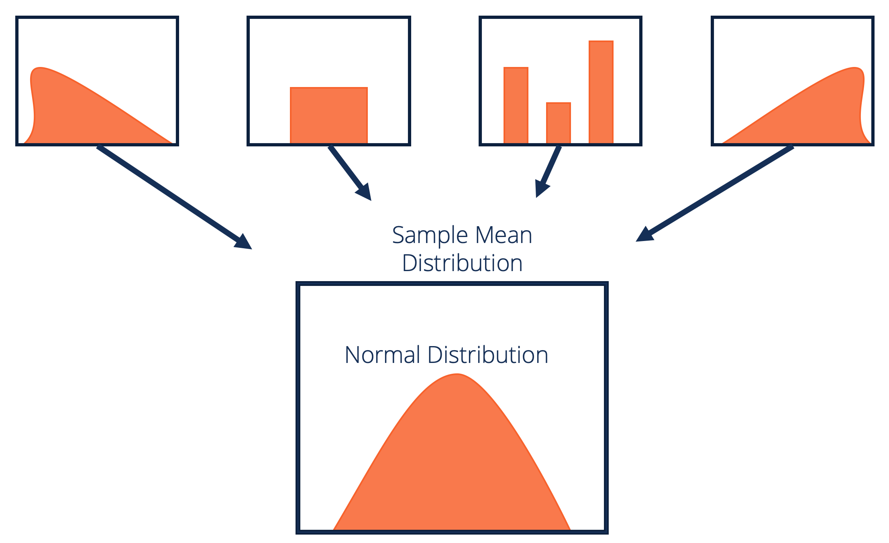

## Table of Contents

## What is the Central Limit Theorem?

The Central Limit Theorem is a key idea in statistics that helps us understand how averages work. It says that if you take many samples from a population and calculate the average of each sample, the distribution of these averages will look like a normal bell-shaped curve, even if the original population doesn't follow a normal distribution. This is true as long as the sample size is large enough, usually around 30 or more.

This theorem is very useful because it allows us to make predictions and do calculations about averages, even when we don't know much about the whole population. For example, if you want to know the average height of all people in a city, you don't need to measure everyone. You can take many samples of, say, 50 people each, and the average heights from these samples will follow a normal distribution. This makes it easier to estimate the true average height of the entire city.

## Why is the Central Limit Theorem important in statistics?

The Central Limit Theorem is really important in statistics because it helps us make sense of data. It tells us that if we take a bunch of samples from any population and find the average of each sample, those averages will start to look like a normal distribution, even if the original data doesn't. This is super helpful because a lot of statistical methods work best with data that follows a normal distribution. So, even if our data is all over the place, we can still use these methods if we're looking at averages of samples.

This theorem is also key for making predictions and doing tests. For example, if you want to know something about a whole group of people, like their average income, you don't have to ask everyone. You can just take a few samples, find the average of each, and use those to guess the average for everyone. This saves a lot of time and effort. Plus, it lets us use confidence intervals and hypothesis testing, which are important tools in [statistics](/wiki/bayesian-statistics), to make decisions based on the data we have.

## What are the basic assumptions required for the Central Limit Theorem to apply?

The Central Limit Theorem works well if a few basic things are true. First, the samples you take from the population need to be random. This means every person or thing in the population has an equal chance of being picked. If you don't pick randomly, the averages you get might not be good at showing what the whole population is like.

Second, the samples should be independent of each other. This means that [picking](/wiki/asset-class-picking) one person or thing for your sample shouldn't affect who or what you pick next. If the samples are not independent, it can mess up the averages and make them less reliable.

Lastly, the sample size matters a lot. The Central Limit Theorem says that the bigger your sample size, the better it works. Usually, a sample size of at least 30 is good enough, but bigger is even better. If your samples are too small, the averages might not follow a normal distribution, and the theorem won't be as useful.

## How does sample size affect the application of the Central Limit Theorem?

The sample size is really important when using the Central Limit Theorem. The theorem says that if you take many samples from a population and find the average of each sample, those averages will start to look like a normal distribution. But this only works well if your samples are big enough. Usually, a sample size of at least 30 is good enough for the theorem to kick in. If your samples are smaller than that, the averages might not follow a normal distribution, and the theorem won't be as useful.

When you have a bigger sample size, the averages from your samples get closer to a normal distribution. This makes it easier to use statistical methods that work with normal distributions. It also means your estimates of things like the average height or income of a whole group of people will be more accurate. So, if you want to make good predictions or do reliable statistical tests, it's a good idea to use bigger samples.

## Can you explain the concept of sampling distribution in relation to the Central Limit Theorem?

The sampling distribution is all about what happens when you take a bunch of samples from a population and look at the averages of those samples. Imagine you want to know the average height of people in a city. You could take many small groups of people, measure their heights, and then find the average height for each group. The collection of all these averages is called the sampling distribution of the mean. 

The Central Limit Theorem comes into play here because it says that if you keep taking these samples and finding their averages, the shape of the sampling distribution will start to look like a normal bell-shaped curve. This happens even if the heights of all the people in the city don't follow a normal distribution themselves. The key is that you need to take enough samples, usually with at least 30 people in each, for this to work well. So, the Central Limit Theorem helps us understand and predict how the sampling distribution will behave, which is super useful for making good guesses about the whole population.

## What is the role of the standard error in the Central Limit Theorem?

The standard error is really important when we talk about the Central Limit Theorem. It's like a measure of how much the averages from our samples might differ from the true average of the whole population. When we take many samples and find their averages, the standard error tells us how spread out these averages are around the true average. The Central Limit Theorem says that as we take more and more samples, the distribution of these averages will look like a normal bell-shaped curve, and the standard error helps us understand how wide that bell curve is.

The size of the standard error depends on how big our samples are. If we use bigger samples, the standard error gets smaller. This means our sample averages will be closer to the true average of the whole population, and our estimates will be more accurate. So, when we use the Central Limit Theorem to make guesses about a population, knowing the standard error helps us figure out how confident we can be in our guesses. It's a key part of understanding how well our sample averages represent the whole group.

## How does the Central Limit Theorem relate to the normal distribution?

The Central Limit Theorem is all about how the averages of many samples from a population start to look like a normal distribution. Imagine you take lots of small groups from a big group of people and find the average of each small group. Even if the big group's data doesn't follow a normal distribution, the averages of these small groups will. This is super helpful because a normal distribution is like a bell-shaped curve that's easy to work with in statistics.

The normal distribution is important because many statistical methods work best with data that follows this shape. The Central Limit Theorem lets us use these methods even when our original data is messy or doesn't follow a normal distribution. As long as we take enough samples, usually with at least 30 items each, the averages will start to look normal. This makes it easier to make predictions and do calculations about the whole group, even if we only have data from a few samples.

## What are some common misconceptions about the Central Limit Theorem?

One common misconception about the Central Limit Theorem is that it says any data will automatically become normally distributed if you just take enough samples. This isn't quite right. The theorem actually says that the averages of many samples will start to look like a normal distribution, not the data itself. So, if you have data that's all over the place, taking more samples won't make the data normal, but the averages of those samples will follow a normal distribution.

Another misunderstanding is that the Central Limit Theorem works no matter how small your samples are. People sometimes think that even tiny samples will do the trick, but that's not true. The theorem needs samples that are big enough, usually at least 30 items, to work well. If your samples are too small, the averages might not look like a normal distribution, and your results could be off.

Lastly, some folks believe that the Central Limit Theorem only applies to data that's already close to a normal distribution. But that's not the case. The beauty of the theorem is that it works even if the original data is far from normal. As long as you take enough big enough samples, the averages will still end up looking like a normal distribution. This makes the theorem really useful for all kinds of data, not just the data that's already nicely shaped.

## Can the Central Limit Theorem be applied to non-normal distributions? If so, how?

Yes, the Central Limit Theorem can be applied to non-normal distributions. The key idea is that even if the data in the population doesn't follow a normal distribution, if you take many samples from that population and find the average of each sample, those averages will start to look like a normal distribution. This is true as long as the samples are big enough, usually at least 30 items each. So, even if you're dealing with data that's all over the place, like the heights of trees in a forest or the incomes of people in a city, the theorem still works.

The reason this is so useful is that a lot of statistical methods are designed to work with normal distributions. By using the Central Limit Theorem, you can take data from a non-normal population, calculate the averages of many samples, and then use those averages to make predictions or do calculations as if the data were normally distributed. This makes it easier to understand and work with data that might otherwise be hard to handle, helping you make better guesses about the whole group based on just a few samples.

## How can the Central Limit Theorem be used in hypothesis testing?

The Central Limit Theorem is really helpful in hypothesis testing because it lets us use sample data to make guesses about a whole group, even if the data isn't normally distributed. Imagine you want to test if a new medicine works better than an old one. You can't ask everyone in the world to try it, so you take a few groups of people, give them the medicine, and see how they do. The Central Limit Theorem says that if you take enough of these groups, the averages of how well the medicine works in each group will follow a normal distribution. This makes it easier to use common statistical tests that work best with normal data.

Once you have these averages that follow a normal distribution, you can use them to do hypothesis testing. For example, you can see if the average improvement from the new medicine is significantly different from the old one. By knowing that the averages are normally distributed thanks to the Central Limit Theorem, you can calculate things like p-values and confidence intervals. These tools help you decide if the new medicine really is better, or if the differences you see could just be due to chance. So, the Central Limit Theorem makes it possible to use powerful statistical methods on data from just a few samples, helping us make better decisions.

## What are the limitations of the Central Limit Theorem?

The Central Limit Theorem is really useful, but it has some limits. One big limit is that it needs big enough samples to work well. Usually, you need at least 30 items in each sample. If your samples are too small, the averages might not look like a normal distribution, and your results could be off. Also, the theorem works best when the samples are picked randomly and each sample is independent of the others. If you don't pick randomly or if the samples affect each other, the theorem might not give you good results.

Another thing to keep in mind is that the Central Limit Theorem talks about the averages of samples, not the data itself. So, even if you take a lot of samples, the original data won't magically turn into a normal distribution. It's just the averages that will start to look normal. This can be confusing if you think the theorem will fix all your data problems. Also, for some types of data, like those with very heavy tails or extreme values, you might need even bigger samples for the theorem to work well. So, while the Central Limit Theorem is a powerful tool, it's important to understand its limits and use it the right way.

## Can you provide a real-world example where the Central Limit Theorem is applied?

Imagine you work at a factory that makes light bulbs. You want to know the average lifespan of the bulbs you make, but it's not possible to test every single bulb. So, you take samples of 50 bulbs at a time, test them, and find the average lifespan of each sample. The Central Limit Theorem comes into play here because it says that if you keep taking these samples and finding their averages, those averages will start to look like a normal distribution, even if the lifespans of all the bulbs don't follow a normal pattern. This is helpful because it lets you use statistical tools that work well with normal distributions to make good guesses about the average lifespan of all the bulbs you make.

For example, after testing many samples, you find that the average lifespan of the bulbs in your samples is around 1,000 hours, with a standard error that tells you how much these averages might vary. Using the Central Limit Theorem, you can now say with confidence that the true average lifespan of all the bulbs you make is likely close to 1,000 hours. This helps you tell customers how long the bulbs will last and make sure your factory is making good products. So, even though you couldn't test every bulb, the Central Limit Theorem let you use just a few samples to understand the whole batch.

## What is the Central Limit Theorem and how can it be understood?

The Central Limit Theorem (CLT) is a pivotal concept in statistics and probability theory, positing that the distribution of the sum (or average) of a large number of independent, identically distributed random variables tends to approach a normal distribution, regardless of the original distribution of the variables. This theorem is instrumental in enabling statisticians to make inferences about population parameters using sample statistics.

Mathematically, the CLT can be expressed as follows: if $X_1, X_2, \ldots, X_n$ are $n$ independent and identically distributed (i.i.d.) random variables, each having a mean $\mu$ and finite variance $\sigma^2$, the standardized sum converges in distribution to a standard normal distribution as $n$ approaches infinity:

$$
Z = \frac{\sum_{i=1}^{n} X_i - n\mu}{\sigma\sqrt{n}} \xrightarrow{d} N(0, 1)
$$

The theorem requires several key conditions: the random variables must be independent, identically distributed, and possess finite mean and variance. These conditions ensure the applicability of the CLT in approximating the distribution of sample means.

One of the primary significances of the CLT is its power to approximate complex distributions with a normal distribution when dealing with large sample sizes. This approximation greatly simplifies statistical processes, allowing for easier computation of confidence intervals and hypothesis tests. For example, the sampling distribution of the sample mean can be treated as normal, permitting the use of z-scores and normal probability tables.

Consider the calculation of the average height of a population. Individual heights may not follow a normal distribution due to various factors. However, by sampling a sufficiently large group and calculating the mean, the distribution of these sample means will approximate normality. This simplification can be illustrated in Python:

```python
import numpy as np
import matplotlib.pyplot as plt

# Simulate the population
population = np.random.exponential(scale=2, size=10000)

# Draw multiple samples and compute their means
sample_means = [np.mean(np.random.choice(population, size=30)) for _ in range(1000)]

# Plotting
plt.hist(sample_means, bins=30, density=True, alpha=0.6, color='g')
plt.title('Distribution of Sample Means')
plt.xlabel('Sample Mean')
plt.ylabel('Frequency')
plt.show()
```

In this example, although the original population follows an exponential distribution, the histogram of sample means will tend to look normally distributed due to the CLT.

The implications of the CLT are profound, especially with large sample sizes as it provides justification to employ normal approximation techniques, facilitating robust statistical modeling even when the population distribution is unknown. This aspect is particularly useful in fields such as economics, biological sciences, and engineering, where it is often impractical to know, let alone collect data that is normally distributed. Overall, the Central Limit Theorem underpins many statistical methodologies, forming a foundational bridge between probability theory and practical data analysis.

## References & Further Reading

[1]: Casella, G., & Berger, R. L. (2002). "[Statistical Inference](https://www.taylorfrancis.com/books/mono/10.1201/9781003456285/statistical-inference-roger-berger-george-casella)." Duxbury Advanced Series.

[2]: Forbes, C., Evans, M., Hastings, N., & Peacock, B. (2010). "[Statistical Distributions](https://www.wiley.com/en-us/exportProduct/pdf/9780470627242)," 4th edition. Wiley.

[3]: Patton, A. J. (2009). "[Copula-based models for financial time series](https://link.springer.com/content/pdf/10.1007/978-3-540-71297-8_34.pdf)." In T. G. Anderson, R. A. Davis, J.-P. Kreiß, & T. Mikosch, Handbook of Financial Time Series. Springer.

[4]: Taleb, N. N. (2007). "[The Black Swan: The Impact of the Highly Improbable](https://en.wikipedia.org/wiki/The_Black_Swan:_The_Impact_of_the_Highly_Improbable)." Random House.

[5]: Jorion, P. (2007). "[Value at Risk: The New Benchmark for Managing Financial Risk](https://link.springer.com/article/10.1007/s11408-007-0057-3)," 3rd edition. McGraw-Hill Education.

[6]: Shreve, S. E. (2004). "[Stochastic Calculus for Finance I: The Binomial Asset Pricing Model](https://link.springer.com/book/10.1007/978-0-387-22527-2)." Springer.

[7]: Wilmott, P. (2006). "[Paul Wilmott Introduces Quantitative Finance](https://www.wiley.com/en-us/Paul+Wilmott+Introduces+Quantitative+Finance,+2nd+Edition-p-9781118836798)." Wiley.

[8]: Fabozzi, F. J., Focardi, S. M., & Kolm, P. N. (2010). "[Quantitative Equity Investing: Techniques and Strategies](https://www.wiley.com/en-us/Quantitative+Equity+Investing%3A+Techniques+and+Strategies-p-9780470262474)." Wiley.