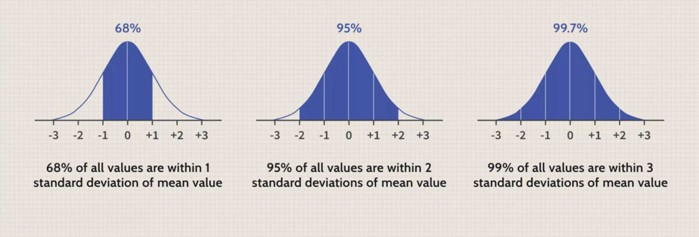

The Central Limit Theorem (CLT) is a fundamental principle in statistics that asserts that the distribution of sample means approximates a normal distribution, regardless of the shape of the original population distribution, given that the sample size is sufficiently large. Mathematically, if $X_1, X_2, \ldots, X_n$ are independent and identically distributed random variables with mean $\mu$ and finite variance $\sigma^2$, then the standardized sum $\frac{\sum_{i=1}^{n} X_i - n\mu}{\sqrt{n\sigma^2}}$ approaches a standard normal distribution as $n$ approaches infinity. This theorem is critical because it enables statisticians to make inferences about population parameters using sample data, which is especially useful when direct measurement of the entire population is impractical.

Probability theory is an essential component of many scientific and engineering disciplines, providing a framework for quantifying uncertainty and modeling random processes. It underpins decision-making processes in fields as diverse as physics, biology, finance, and artificial intelligence. In statistics, probability theory forms the basis for modeling distributions and conducting statistical inference, which involves drawing conclusions about populations based on sample data.



Algorithmic trading, a domain where speed and precision are crucial, leverages both the Central Limit Theorem and probability theory to optimize trading strategies. The CLT facilitates the modeling of returns and risk, providing traders with insights into the distribution of returns and aiding in the formulation of robust trading strategies. Probability models help in assessing and managing risks, predicting market movements, and executing trades swiftly in a competitive market environment.

This article will explore the Central Limit Theorem's profound impact on statistics and its application in algorithmic trading. It will present an in-depth understanding of the underlying mathematical principles of the CLT, examine the role of probability theory in statistics, and discuss their interconnectedness in the context of trading. Furthermore, the article will delve into how these concepts are harnessed in algorithmic trading and the challenges inherent in their application, concluding with considerations for future advancements in this dynamic field.

## Table of Contents

## Understanding the Central Limit Theorem

The Central Limit Theorem (CLT) is a pivotal concept in statistics and probability theory, positing that the distribution of the sum (or average) of a large number of independent, identically distributed random variables tends to approach a normal distribution, regardless of the original distribution of the variables. This theorem is instrumental in enabling statisticians to make inferences about population parameters using sample statistics.

Mathematically, the CLT can be expressed as follows: if $X_1, X_2, \ldots, X_n$ are $n$ independent and identically distributed (i.i.d.) random variables, each having a mean $\mu$ and finite variance $\sigma^2$, the standardized sum converges in distribution to a standard normal distribution as $n$ approaches infinity:

$$
Z = \frac{\sum_{i=1}^{n} X_i - n\mu}{\sigma\sqrt{n}} \xrightarrow{d} N(0, 1)
$$

The theorem requires several key conditions: the random variables must be independent, identically distributed, and possess finite mean and variance. These conditions ensure the applicability of the CLT in approximating the distribution of sample means.

One of the primary significances of the CLT is its power to approximate complex distributions with a normal distribution when dealing with large sample sizes. This approximation greatly simplifies statistical processes, allowing for easier computation of confidence intervals and hypothesis tests. For example, the sampling distribution of the sample mean can be treated as normal, permitting the use of z-scores and normal probability tables.

Consider the calculation of the average height of a population. Individual heights may not follow a normal distribution due to various factors. However, by sampling a sufficiently large group and calculating the mean, the distribution of these sample means will approximate normality. This simplification can be illustrated in Python:

```python
import numpy as np
import matplotlib.pyplot as plt

# Simulate the population
population = np.random.exponential(scale=2, size=10000)

# Draw multiple samples and compute their means
sample_means = [np.mean(np.random.choice(population, size=30)) for _ in range(1000)]

# Plotting
plt.hist(sample_means, bins=30, density=True, alpha=0.6, color='g')
plt.title('Distribution of Sample Means')
plt.xlabel('Sample Mean')
plt.ylabel('Frequency')
plt.show()
```

In this example, although the original population follows an exponential distribution, the histogram of sample means will tend to look normally distributed due to the CLT.

The implications of the CLT are profound, especially with large sample sizes as it provides justification to employ normal approximation techniques, facilitating robust statistical modeling even when the population distribution is unknown. This aspect is particularly useful in fields such as economics, biological sciences, and engineering, where it is often impractical to know, let alone collect data that is normally distributed. Overall, the Central Limit Theorem underpins many statistical methodologies, forming a foundational bridge between probability theory and practical data analysis.

## Probability Theory in Statistics

Probability theory is a fundamental component of [statistics](/wiki/bayesian-statistics) that provides the groundwork for making inferences about a population based on sample data. It involves the study of randomness and uncertainty, enabling statisticians to model and analyze random phenomena. The core elements of probability theory are the concepts of random variables, probability distributions, and expected values, all of which are essential in various statistical methods.

A key aspect of probability theory is its connection to statistical inference, which is the process of drawing conclusions about a population based on a sample. This connection is primarily facilitated through the use of probability distributions, which describe how the values of a random variable are distributed. The normal distribution, for example, is often used due to its prevalence in natural phenomena and its mathematical properties that facilitate analysis. Probability distributions enable the application of techniques such as hypothesis testing, confidence intervals, and regression analysis, allowing statisticians to determine the probability that a given result is due to chance.

The significance of probability distributions in data analysis cannot be overstated, as they provide a structured way to model the uncertainty inherent in any data-driven process. Different types of data require different probability distributions. For instance, a binomial distribution is suitable for binary outcomes, while a Poisson distribution is used for count data. The proper selection and application of these distributions enable effective analysis and interpretation of data, ensuring that predictions and decisions are well-grounded in statistical theory.

Furthermore, probability theory underpins many statistical concepts, including the Central Limit Theorem (CLT). The CLT is crucial because it explains why the normal distribution arises so frequently in nature: it states that the sum (or average) of a large number of independent, identically distributed random variables will be approximately normally distributed, regardless of the original distribution. This property makes the normal distribution a central focus in many statistical analyses, as it simplifies the complexity of dealing with large datasets.

In predictive modeling, probability theory is indispensable. Predictive models often rely on understanding and manipulating probability distributions to make forecasts about future events based on current and historical data. These models, such as logistic regression and Bayesian inference, use probability to quantify uncertainty and evaluate the likelihood of different outcomes. By doing so, they aid decision-makers in various fields, including finance, healthcare, and marketing, to make informed choices based on probable future scenarios.

In summary, probability theory is integral to statistics by offering the tools and frameworks necessary to analyze random phenomena effectively. It provides the foundation for statistical inference, crucially relies on probability distributions in data analysis, underpins essential statistical concepts like the Central Limit Theorem, and is vital for predictive modeling. As a field, it continues to evolve and adapt, driving innovation and understanding across multiple domains.

## The Role of the Central Limit Theorem in Algo Trading

The Central Limit Theorem (CLT) is a fundamental statistical concept that holds substantial importance in [algorithmic trading](/wiki/algorithmic-trading), primarily due to its ability to facilitate risk management and portfolio optimization. In essence, the CLT states that the distribution of the sum (or average) of a sufficiently large number of independent, identically distributed random variables will approximate a normal distribution, regardless of the original distribution of the variables. This property is pivotal in the context of financial markets, where asset returns often do not follow a normal distribution.

### Application in Risk Management and Portfolio Optimization

The CLT is instrumental in risk management by enabling traders to estimate the distribution of returns over a given time period. By assuming that asset returns over short intervals can converge towards a normal distribution, risk managers can use this approximation to assess potential losses and gains. This is particularly useful in Value-at-Risk (VaR) calculations, where the goal is to predict the worst expected loss over a specific time frame at a given confidence level.

In portfolio optimization, the CLT aids in simplifying the complex nature of portfolio returns. By assuming normality, it becomes feasible to compute expected portfolio returns and variances, facilitating the calculation of the efficient frontier. This simplification allows portfolio managers to optimize the risk-return trade-off, making informed decisions based on probabilistic models of portfolio behavior.

### Assumptions about Returns Distribution

In algorithmic trading, understanding and predicting returns distribution is crucial. The CLT allows traders to model returns as approximately normal, enabling the application of a wide range of statistical techniques that rely on this assumption. For instance, in mean-variance analysis—a cornerstone of modern portfolio theory—returns are assumed to be normally distributed, which simplifies the mathematical treatment of risk and return.

### Practical Examples in Trading Algorithms

Practical applications of the CLT in trading algorithms include [backtesting](/wiki/backtesting) strategies that rely on historical return data. By assuming normality, traders can create simulations to predict future performance, identify anomalies, and adjust strategies as needed. Monte Carlo simulations, which are often used to predict price movements and portfolio performance, also rely on the CLT for generating normally distributed outcomes from random sample inputs, thereby allowing the prediction of a range of possible future states.

```python
import numpy as np
import matplotlib.pyplot as plt

# Simulate asset returns using Monte Carlo
np.random.seed(0)
num_simulations = 10000
num_days = 252
returns = np.random.normal(0.001, 0.02, (num_simulations, num_days))

# Calculate cumulative returns
cumulative_returns = np.cumsum(returns, axis=1)

# Plot the results
plt.figure(figsize=(10, 6))
plt.plot(np.exp(cumulative_returns.T))
plt.title('Simulated Asset Price Paths Using CLT')
plt.xlabel('Days')
plt.ylabel('Price')
plt.show()
```

### Development of Trading Strategies

The Central Limit Theorem contributes significantly to the development of algorithmic trading strategies by providing a foundation for statistical [arbitrage](/wiki/arbitrage) and other quantitative approaches. By assuming that asset prices exhibit properties of normality over time, traders can exploit deviations from expected values, setting up trades that profit from mean reversion or other predictable behaviors. This statistical insight increases the robustness of algorithmic models, supporting more accurate predictions and strategic planning.

Furthermore, as financial markets continue to exhibit periods of [volatility](/wiki/volatility-trading-strategies) and noise, the CLT's assumption of normality can be adjusted or relaxed to incorporate fat tails or other anomalies, ultimately leading to more sophisticated models that better capture market dynamics. By serving as a bridge between raw market data and manageable probabilistic models, the Central Limit Theorem remains a cornerstone in the toolkit of quantitative analysts and algorithmic traders.

## Interplay of Probability Theory and Algo Trading

Probability theory is a cornerstone of algorithmic trading, providing essential tools for modeling financial markets and guiding decision-making processes in the creation of automated trading systems. At its core, probability theory offers a framework for quantifying uncertainty, which is critical in a trading environment characterized by inherent market fluctuations and unpredictability.

One of the primary roles of probability in algorithmic trading is market prediction and analysis. Market participants use probabilistic models to forecast future price movements and volatility, thereby identifying potential trading opportunities. For instance, stochastic processes such as Brownian motion and Geometric Brownian motion are often employed to model asset prices and inform trading strategies. These models assume that price changes are continuous and follow specific probabilistic rules, which can then be used to estimate future price distributions.

Probabilistic models are central to algorithmic trading strategies. Among these, the Monte Carlo simulation stands out as a widely used method. Monte Carlo methods involve running numerous simulations with random variables to predict the behavior of an asset under various conditions. This approach allows traders to estimate the probability distribution of potential outcomes and assess risk more accurately.

Moreover, statistics and probability play critical roles in decision-making algorithms. Quantitative analysts use statistical techniques to analyze historical data, test hypotheses, and develop predictive models that guide trading decisions. Machine learning algorithms, which heavily rely on statistical inference, have become increasingly popular due to their ability to adapt to new data and improve prediction accuracy in dynamic market conditions.

In automated trading systems, probability theory helps enhance the algorithms that drive buy and sell decisions. These systems often utilize probabilistic approaches such as Bayesian inference to incorporate new data and update the likelihood of various market scenarios. Bayesian methods are particularly useful for incorporating prior knowledge and continuously refining predictions as new information becomes available.

Probability theory's influence extends to risk management, an essential component of algorithmic trading. Traders employ Value-at-Risk (VaR), a statistical technique that uses probability distributions to estimate the potential loss in an investment's value over a set period, under normal market conditions. VaR calculations enable traders to set risk thresholds and make informed decisions to limit financial exposure.

The integration of probability theory into trading systems transforms the methodologies used for market prediction, strategy development, and risk management, providing a systematic and quantitative approach to navigating the complexities of financial markets. However, while these models are instrumental in forming the basis of trading algorithms, they require continual refinement and adaptation to changing market conditions and emerging data sources.

## Challenges and Considerations

Applying the Central Limit Theorem (CLT) in trading environments presents several challenges. One of the primary obstacles is the assumption that financial returns are normally distributed due to the CLT with large sample sizes. However, market data often exhibit heavy tails and skewness, deviating from a normal distribution. This divergence may lead to inaccurate risk estimations and mispriced derivatives, prompting a need for careful model selection and validation.

When employing probability models in trading, practitioners must consider several factors. It is crucial to tailor models to capture the intricacies of financial data, such as volatility clustering observed in financial time series. Selecting appropriate probability distributions, evaluating models against historical data, and constantly updating parameters with new information are essential strategies for maintaining validity in dynamic markets.

Relying exclusively on statistical methods in finance poses limitations. Although statistical methods provide valuable insights, they often fail to account for qualitative factors affecting market behavior, such as geopolitical events or regulatory changes. Additionally, the assumption of market efficiency inherent in many statistical models may not always hold, potentially leading to model inaccuracies.

To mitigate these challenges, integrating diverse data sources and methodologies becomes necessary. Combining quantitative models with qualitative analyses and [machine learning](/wiki/machine-learning) techniques can enhance predictive accuracy. Additionally, incorporating alternative datasets, such as sentiment analysis from social media or news reports, enriches models by capturing non-traditional signals that could impact trading strategies.

Staying updated with market developments is critical to maintaining the relevance of trading models. Financial markets are highly susceptible to rapid changes influenced by technological advancements, psychographics, and global events. Continuous monitoring and adaptation of trading algorithms ensure they remain effective in capturing current market conditions.

In conclusion, addressing the challenges associated with applying the CLT and probability models in trading requires a comprehensive approach. Employing diverse methodologies and staying informed about market developments enables traders to navigate the complexities of financial markets more effectively. These considerations are fundamental to maintaining the robustness and adaptability of algorithmic trading strategies in a continuously evolving market landscape.

## Conclusion

The central limit theorem (CLT) and probability theory form the backbone of statistical analysis, offering essential insights and methodologies applicable across numerous disciplines, including algorithmic trading. Throughout this article, we explored how the CLT facilitates the approximation of complex distributions, enabling simplified data analysis, especially in contexts involving large sample sizes. This theorem, paired with the principles of probability theory, permits a robust framework for understanding and predicting market behaviors, thus forming an indispensable asset in the world of algo trading.

The integration of CLT and probability theory is pivotal in enhancing trading algorithms. These statistical tools assist in defining return distributions and optimizing portfolio risks, making them essential for effective financial analysis and decision-making processes in trading systems. As technological and methodological advancements continue, the future of algorithmic trading is poised to leverage increasingly sophisticated statistical methods. This evolution holds promise for more refined, precise, and profitable trading strategies.

Encouraging further exploration, embracing diverse data sources, and integrating comprehensive probabilistic models will enhance the adaptability and accuracy of algorithmic trades. As both financial markets and statistical techniques evolve, continuous research and development will be crucial for maintaining an edge in the competitive trading field.

Ultimately, the synergy between statistics, probability, and trading fosters a dynamic environment where theoretical knowledge translates into practical, real-world applications. Embracing this synergy not only broadens the scope of trading strategies but also empowers traders and analysts to navigate the complexities of financial markets with enhanced acuity and foresight.

## References & Further Reading

[1]: Casella, G., & Berger, R. L. (2002). "[Statistical Inference](https://www.taylorfrancis.com/books/mono/10.1201/9781003456285/statistical-inference-roger-berger-george-casella)." Duxbury Advanced Series.

[2]: Forbes, C., Evans, M., Hastings, N., & Peacock, B. (2010). "[Statistical Distributions](https://www.wiley.com/en-us/exportProduct/pdf/9780470627242)," 4th edition. Wiley.

[3]: Patton, A. J. (2009). "[Copula-based models for financial time series](https://link.springer.com/content/pdf/10.1007/978-3-540-71297-8_34.pdf)." In T. G. Anderson, R. A. Davis, J.-P. Kreiß, & T. Mikosch, Handbook of Financial Time Series. Springer.

[4]: Taleb, N. N. (2007). "[The Black Swan: The Impact of the Highly Improbable](https://en.wikipedia.org/wiki/The_Black_Swan:_The_Impact_of_the_Highly_Improbable)." Random House.

[5]: Jorion, P. (2007). "[Value at Risk: The New Benchmark for Managing Financial Risk](https://link.springer.com/article/10.1007/s11408-007-0057-3)," 3rd edition. McGraw-Hill Education.

[6]: Shreve, S. E. (2004). "[Stochastic Calculus for Finance I: The Binomial Asset Pricing Model](https://link.springer.com/book/10.1007/978-0-387-22527-2)." Springer.

[7]: Wilmott, P. (2006). "[Paul Wilmott Introduces Quantitative Finance](https://www.wiley.com/en-us/Paul+Wilmott+Introduces+Quantitative+Finance,+2nd+Edition-p-9781118836798)." Wiley.

[8]: Fabozzi, F. J., Focardi, S. M., & Kolm, P. N. (2010). "[Quantitative Equity Investing: Techniques and Strategies](https://www.wiley.com/en-us/Quantitative+Equity+Investing%3A+Techniques+and+Strategies-p-9780470262474)." Wiley.