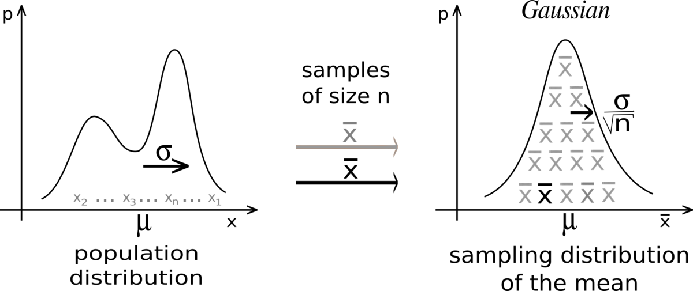

## Table of Contents

## What is the Central Limit Theorem?

The Central Limit Theorem is an important idea in statistics that helps us understand how sample data behaves. It says that if you take many samples from a population, and each sample is large enough, the average of those samples will be normally distributed. This is true no matter what the original population looks like. So, even if the population data is not normally distributed, the averages of the samples will be.

This theorem is very useful because it allows us to use normal distribution to make predictions and do calculations, even when we don't know much about the population. For example, if we want to estimate the average height of all people in a city, we can take many samples of people's heights, and the average of those samples will follow a normal distribution. This makes it easier to understand and work with the data.

## Why is the Central Limit Theorem important in statistics?

The Central Limit Theorem is really important in statistics because it helps us make sense of data even when we don't know much about it. It says that if you take many samples from any population, the average of those samples will look like a normal distribution. This is a big deal because normal distributions are easy to work with. They have a bell shape and we know a lot about how to use them for calculations and predictions.

This theorem is useful in real life too. For example, if you want to know the average weight of all students in a school, you don't need to weigh every single student. You can just take a few samples and use the Central Limit Theorem to make good guesses about the whole school. It makes statistics simpler and more reliable, which is why it's a key part of many studies and experiments.

## How does the Central Limit Theorem apply to sample means?

The Central Limit Theorem is all about sample means. It says that if you take many samples from a population and find the average of each sample, those sample means will follow a normal distribution. This happens even if the original population doesn't look like a normal distribution at all. The key is that your samples need to be big enough, usually around 30 or more items per sample.

This is really helpful because it means we can use normal distribution to make predictions and do calculations, even when we don't know much about the whole population. For example, if you want to know the average height of all people in a city, you can take many samples of people's heights. The average of those samples will form a normal distribution, making it easier to understand and work with the data. This makes the Central Limit Theorem a powerful tool in statistics.

## What are the conditions required for the Central Limit Theorem to hold?

The Central Limit Theorem works best when a few conditions are met. First, the samples you take from the population need to be random. This means every item in the population has an equal chance of being picked. Second, the samples should be independent of each other. This means the result of one sample should not affect the result of another sample.

Another important condition is that the sample size should be large enough. Usually, a sample size of at least 30 is considered good, but if the population is not normally distributed, you might need even larger samples. The bigger the sample size, the better the Central Limit Theorem works.

If these conditions are met, the Central Limit Theorem says that the average of the samples will follow a normal distribution. This is true even if the original population is not normally distributed. This makes it easier to make predictions and do calculations based on the sample data.

## Can you explain the role of sample size in the Central Limit Theorem?

Sample size plays a big role in the Central Limit Theorem. The theorem says that if you take many samples from a population and find the average of each sample, those averages will follow a normal distribution. The key thing is that your samples need to be big enough. Usually, a sample size of at least 30 is considered good. This size helps make sure the averages of the samples look like a normal distribution, even if the original population does not.

If the population is not normally distributed, you might need even larger samples to make the Central Limit Theorem work well. The bigger the sample size, the closer the distribution of the sample means gets to a perfect normal distribution. This is important because it allows us to use normal distribution to make predictions and do calculations, even when we don't know much about the whole population. So, having a big enough sample size is crucial for the Central Limit Theorem to be reliable and useful.

## How does the Central Limit Theorem relate to the normal distribution?

The Central Limit Theorem is all about how sample means relate to the normal distribution. It says that if you take many samples from any population and find the average of each sample, those averages will follow a normal distribution. This is true even if the original population does not look like a normal distribution at all. The key is that your samples need to be big enough, usually around 30 or more items per sample.

This is really helpful because normal distributions are easy to work with. They have a bell shape and we know a lot about how to use them for calculations and predictions. So, even if we don't know much about the whole population, we can use the Central Limit Theorem to make good guesses and do calculations based on the sample means. This makes the Central Limit Theorem a powerful tool in statistics, helping us understand and work with data more easily.

## What is the difference between the Central Limit Theorem and the Law of Large Numbers?

The Central Limit Theorem and the Law of Large Numbers are two important ideas in statistics, but they focus on different things. The Central Limit Theorem says that if you take many samples from a population and find the average of each sample, those averages will follow a normal distribution. This is true even if the original population does not look like a normal distribution. The key is that your samples need to be big enough, usually around 30 or more items per sample. This theorem is useful because normal distributions are easy to work with, making it easier to make predictions and do calculations based on sample data.

The Law of Large Numbers, on the other hand, talks about what happens as you take more and more samples. It says that as the number of samples gets bigger, the average of those samples will get closer and closer to the true average of the whole population. This means that if you keep taking more samples, your estimate of the population average will become more accurate. Unlike the Central Limit Theorem, the Law of Large Numbers does not say anything about the shape of the distribution of the sample averages; it just focuses on how close those averages get to the true population average.

Both ideas are important in statistics, but they help us understand different aspects of working with sample data. The Central Limit Theorem helps us use normal distributions to make predictions, while the Law of Large Numbers assures us that our sample averages will be reliable if we take enough samples. Together, they make statistics a powerful tool for understanding and working with data.

## How can the Central Limit Theorem be used to make inferences about population parameters?

The Central Limit Theorem helps us make guesses about the whole group by using small pieces of it. It says that if we take many samples from a group and find the average of each sample, those averages will look like a normal bell-shaped curve. This is true even if the whole group doesn't look like a bell curve. Because we know a lot about how to use normal curves, we can use these sample averages to make good guesses about the whole group. For example, if we want to know the average height of all people in a city, we can take many samples of people's heights. The average of those samples will form a normal curve, letting us estimate the true average height of everyone in the city.

This is really helpful because it means we don't need to measure everyone in the group to learn about it. We can just take a few samples and use the Central Limit Theorem to make reliable guesses. This makes it easier and cheaper to do studies and experiments. By knowing that the averages of our samples will follow a normal curve, we can use special math formulas to find out how sure we are about our guesses. This is called making "confidence intervals," which tell us a range where we think the true average of the whole group might be. So, the Central Limit Theorem is a powerful tool that helps us understand and work with data from the whole group, even when we only have a few samples.

## What are some common misconceptions about the Central Limit Theorem?

One common misconception about the Central Limit Theorem is that it says the original data from a population will always be normally distributed. This is not true. The Central Limit Theorem actually says that if you take many samples from any population and find the average of each sample, those averages will follow a normal distribution. The original data can look like anything, but the averages of the samples will form a bell-shaped curve if the samples are big enough.

Another misconception is that the Central Limit Theorem works with any sample size. While it's true that the theorem becomes more reliable with larger samples, you usually need at least 30 items in each sample for it to work well. If the original population is very far from a normal distribution, you might need even more items in your samples. So, it's important to have a big enough sample size to make sure the Central Limit Theorem gives you good results.

## Can the Central Limit Theorem be applied to non-normal distributions? If so, how?

Yes, the Central Limit Theorem can be applied to non-normal distributions. It says that if you take many samples from any population and find the average of each sample, those averages will follow a normal distribution. This is true even if the original population does not look like a normal distribution at all. The key is that your samples need to be big enough, usually around 30 or more items per sample. So, even if the data you start with is all over the place, the averages of your samples will form a nice bell-shaped curve.

This is really helpful because normal distributions are easy to work with. They have a bell shape and we know a lot about how to use them for calculations and predictions. So, even if we don't know much about the whole population, we can use the Central Limit Theorem to make good guesses and do calculations based on the sample means. This makes the Central Limit Theorem a powerful tool in statistics, helping us understand and work with data more easily, no matter what the original distribution looks like.

## How does the Central Limit Theorem affect hypothesis testing and confidence intervals?

The Central Limit Theorem is really important for hypothesis testing and confidence intervals because it helps us use normal distributions to make guesses about the whole group. When we do hypothesis testing, we often want to know if the average of a sample is different from what we expect. The Central Limit Theorem tells us that if we take many samples and find the average of each one, those averages will follow a normal distribution. This means we can use special math formulas based on normal distributions to see if our sample average is far enough from the expected value to be important. This makes hypothesis testing easier and more reliable.

For confidence intervals, the Central Limit Theorem helps us figure out a range where we think the true average of the whole group might be. When we take a sample and find its average, we can use the Central Limit Theorem to say that this average comes from a normal distribution. This lets us use normal distribution formulas to create a confidence interval, which is a range that we are pretty sure includes the true average of the whole group. So, even if we don't know much about the whole group, the Central Limit Theorem helps us make good guesses and be confident about them.

## What are some advanced applications of the Central Limit Theorem in fields like finance or quality control?

In finance, the Central Limit Theorem is used to help understand and predict things like stock prices and investment returns. Even though the daily changes in stock prices can be all over the place and not follow a normal distribution, the Central Limit Theorem says that if you look at the average returns over many days, those averages will follow a normal distribution. This is really helpful for investors because it lets them use normal distribution math to make guesses about how much their investments might grow or shrink. For example, banks and financial advisors use this to figure out the risk of different investments and to set up things like portfolios that balance risk and reward.

In quality control, the Central Limit Theorem helps companies make sure their products are good enough. When a company makes a lot of the same thing, like car parts or bottles, they want to check if most of them meet certain standards. They do this by taking samples of the products and measuring things like size or weight. The Central Limit Theorem says that if they take enough samples, the average measurements will follow a normal distribution. This lets them use normal distribution math to set up control charts, which help them spot when something might be going wrong in the production process. By understanding these averages, companies can make sure their products are consistent and meet the quality they promise to their customers.

## What is the role of Probability Theory in Statistics?

Probability theory is a fundamental component in [statistics](/wiki/bayesian-statistics), essential for modeling randomness and uncertainty. It provides the necessary tools for statistical inference and analysis, which are crucial for understanding population characteristics from sample data. Central to probability theory are probability distributions, which, like the normal distribution, are instrumental in performing hypothesis tests, constructing confidence intervals, and conducting regression analysis.

A probability distribution describes how the values of a random variable are distributed. One of the most significant distributions is the normal distribution, often used due to its unique properties and natural occurrence in various phenomena. Its bell-shaped curve is attributed to its symmetrical distribution around the mean, highlighting mean, median, and mode equivalence. Formally, the probability density function (PDF) of a normal distribution is given as:

$$
f(x | \mu, \sigma^2) = \frac{1}{\sqrt{2\pi\sigma^2}} e^{\frac{-(x-\mu)^2}{2\sigma^2}}
$$

where $\mu$ is the mean and $\sigma^2$ is the variance.

The Central Limit Theorem (CLT) leverages probability theory by asserting that when independent random variables are added, their properly normalized sum tends toward a normal distribution, even if the original variables themselves are not normally distributed. This principle is invaluable for simplifying the understanding of large datasets. It implies that, irrespective of the original population distribution, the distribution of the sample means will approximate a normal distribution as the sample size becomes large. This approximation permits statisticians to apply normal distribution-based methods, even when dealing with complex or unknown distributions.

In the area of predictive modeling, probability theory plays a pivotal role. By employing probabilistic models, statisticians and analysts can generate forecasts and make informed decisions in the presence of uncertainty. Models such as Bayesian networks and Markov chains, grounded in probability theory, offer a structured approach for predicting future events based on observed data. These models contribute not only to predictions but also enhance the understanding and interpretation of underlying phenomena.

Practical application of probability theory in computational tools like Python can further enrich its usage. Libraries such as NumPy and SciPy facilitate numerical operations and statistical functions, while libraries like Matplotlib and Seaborn enhance data visualization, making it easier to grasp the implications of probabilistic analyses.

Overall, the integration of probability theory into statistical methodology is indispensable for both theoretical insights and practical applications. By understanding and deploying these probabilistic concepts, statisticians enhance their capability to interpret data, drive decisions, and construct predictive models that reflect real-world dynamics.

## References & Further Reading

Casella, G., & Berger, R. L. (2002). "Statistical Inference." This book provides a comprehensive understanding of statistical inference, essential for interpreting data and making decisions based on statistical models. It delves into estimation, hypothesis testing, and the foundational principles underlying statistical analysis, which are critical for both traditional and [algorithmic trading](/wiki/algorithmic-trading) models.

Forbes, C., Evans, M., Hastings, N., & Peacock, B. (2010). "Statistical Distributions." This resource is an extensive guide on the various statistical distributions utilized in statistical analysis. Understanding these distributions is crucial for algorithmic traders, as they form the basis for modeling returns, assessing risk, and conducting predictive analyses.

Patton, A. J. (2009). "Copula-based models for financial time series." This work explores the application of copulas in modeling dependencies between financial time series, offering a sophisticated method for analyzing correlation structures beyond traditional measures. It is particularly beneficial for those interested in risk management and portfolio diversification strategies.

Taleb, N. N. (2007). "The Black Swan: The Impact of the Highly Improbable." Nassim Nicholas Taleb's book discusses the profound impact of rare, unpredictable events, known as Black Swans, on markets and society. It highlights the limitations of traditional statistical models, making it an essential read for traders seeking to understand and mitigate unpredictable market risks.

Jorion, P. (2007). "Value at Risk: The New Benchmark for Managing Financial Risk." This authoritative guide on Value-at-Risk provides traders with a framework for risk assessment and management. Jorion's work is fundamental for understanding how to measure and control financial risk, a crucial aspect of algorithmic trading strategy development.

