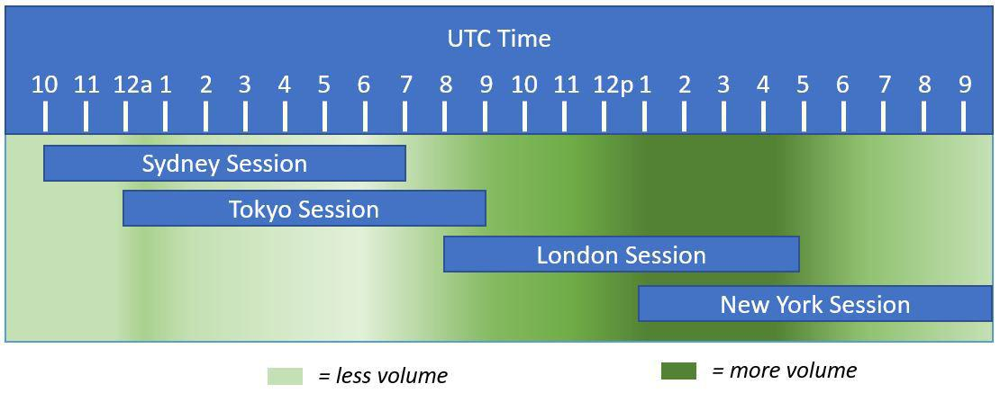

The foreign exchange (forex) market stands as the pinnacle of financial trading arenas, being the largest and most fluid market globally. It distinguishes itself from traditional markets, such as stock exchanges, primarily due to its lack of a centralized location. Operating instead through a digital communication network, the forex market efficiently connects a myriad of banks, brokers, and traders from various corners of the world. This decentralized model facilitates continuous trading activity, enabling participants to engage in transactions 24 hours a day during the business week.

This article seeks to offer a comprehensive examination of the unique structure of the forex market. It will illuminate the decentralized trading environment, characterize the principal participants who facilitate trade, and assess the considerable influence of algorithmic trading within this domain. Through understanding these components, we observe how they synergize to form a vibrant and complex trading ecosystem. Moreover, the analysis will delve into the benefits and potential risks introduced by algorithmic trading systems, unveiling how these technological advancements shape the shifting landscape of forex trading. Ultimately, the discussion will extend to the prospective trends that are likely to redefine the forex market's operations, highlighting the pivotal role of emerging technologies and data-driven strategies.



## Table of Contents

## Understanding the Decentralized Nature of the Forex Market

The foreign exchange (forex) market's defining characteristic is its decentralized nature. Unlike stock markets, which are centralized and typically dominated by a major exchange such as the New York Stock Exchange (NYSE) or the London Stock Exchange (LSE), the forex market operates without a centralized exchange or clearing house. This decentralization is enabled by an electronic communication network that connects banks, brokers, and traders around the globe.

In the forex market, trading occurs continuously on a 24-hour basis due to its global dispersion. As financial centers in different parts of the world, such as London, New York, Tokyo, and Sydney, open and close, the market remains active. This rolling schedule ensures that currency trading is ongoing—across the Pacific, Asian, European, and American markets—providing liquidity and opportunities for traders at virtually any time of day or night.

The decentralized nature of the forex market allows for a diversity of trading platforms, where various brokers provide access to the market for individual and institutional traders. These platforms facilitate over-the-counter (OTC) trading, allowing participants to execute trades outside regulated exchanges. With no centralized location or governance, the forex market relies heavily on financial institutions' netting systems and bilateral credit agreements, ensuring efficiency and minimal counterparty risk.

The structure of the forex market leads to several unique characteristics, such as varied spreads and transaction costs, influenced largely by the trading platforms and market participants involved. The absence of a central clearing house eliminates the standardization found in other markets but contributes to the highly competitive nature of pricing and independent operation across different regions.

As a result of this continuous and decentralized operation, market participants can react almost instantaneously to geopolitical events, economic data releases, and market news, making the [forex](/wiki/forex-system) market particularly sensitive to external influences. This can lead to significant [volatility](/wiki/volatility-trading-strategies) and can also enhance the potential for profit, attracting a wide range of traders from across the globe.

## The Role of Major Market Participants

In the forex market, several key participants play crucial roles in facilitating trading activities, each serving distinct functions.

Retail forex brokers are the primary link between individual traders and the currency market. They provide access to trading platforms where individuals can buy and sell currencies. These brokers offer leveraged trading, enabling traders to control larger positions with a relatively small amount of capital. Their platforms often come equipped with analytical tools and educational resources to aid traders in making informed decisions.

Central banks are pivotal in influencing the forex market through monetary policy. By adjusting interest rates and regulating the money supply, central banks aim to stabilize their national currencies. This can involve interventions in the foreign exchange market where central banks may buy or sell their own currency to maintain desired exchange rate levels. For instance, if a currency is deemed too strong, a central bank might lower interest rates to reduce foreign investment, leading to a depreciation.

Commercial businesses engage in the forex market as they conduct international trade. These firms enter the market primarily to hedge against foreign exchange risks that arise from fluctuations in currency exchange rates. For example, an exporter selling goods abroad may engage in forward contracts to lock in an exchange rate for future revenue, thereby mitigating the risk of adverse currency movements.

The interbank market is the largest segment of the forex market, where major banks trade currencies among themselves. This market operates at a wholesale level, providing [liquidity](/wiki/liquidity-risk-premium) and facilitating large volumes of currency transactions. Banks in the interbank market quote prices for currency pairs and engage in currency swaps, forwards, and other derivative instruments to manage their foreign exchange exposure and maintain balance sheet stability.

Each participant in the forex market has a distinct role that contributes to the overall liquidity and efficiency of the market, allowing for continuous operation and dynamic price determination.

## Algorithmic Trading in the Forex Market

Algorithmic trading in the forex market utilizes computer algorithms to perform trading tasks at speeds and frequencies unattainable by human traders. These algorithms are designed to execute trades based on predefined criteria, such as timing, price, or quantity, and leverage various models that predict price movements. This automated approach enhances the speed and accuracy of executing trades, facilitating more efficient exploitation of market opportunities.

A significant advantage of [algorithmic trading](/wiki/algorithmic-trading) is its ability to remove emotion from the trading process, often a significant [factor](/wiki/factor-investing) in human trade errors. By automating decision-making, traders can focus on strategic adjustments, while the systems handle real-time trade executions. This approach is particularly valuable in the forex market, where quick responses to market fluctuations can lead to profitable outcomes.

Different strategies characterize forex algorithmic trading, each tailored to particular market conditions and trader objectives:

1. **Trend-Following Strategies**: These strategies seek to capitalize on market momentum by identifying and trading in the direction of prevailing price trends. Using technical analysis tools like moving averages, algorithms can detect trend formations and generate buy or sell signals accordingly. For instance, a simple moving average crossover strategy might be implemented in Python as follows:

   ```python
   def moving_average_cross(prices, short_window=40, long_window=100):
       short_ma = prices.rolling(window=short_window).mean()
       long_ma = prices.rolling(window=long_window).mean()
       signals = (short_ma > long_ma).astype(int)
       return signals.diff()
   ```

2. **Statistical Arbitrage**: This strategy involves exploiting price discrepancies between correlated currency pairs. Algorithms analyze historical data to determine normal price relationships and execute trades when prices deviate from these norms. Implementing such strategies requires sophisticated statistical techniques, such as pair trading, which assumes mean reversion.

3. **Market Making**: Algorithms continually place both buy and sell orders to capture the spread between prices. This strategy enhances liquidity and allows traders to profit from small price changes rather than significant market movements.

4. **High-Frequency Trading (HFT)**: Algorithms execute a high volume of trades in fractions of a second, often leveraging small price changes. While highly efficient, HFT poses challenges due to increased transaction costs and the need for robust technological infrastructure.

Algorithmic trading in forex requires meticulous risk management and strategy fine-tuning to cope with the inherent volatility of currency markets. Advanced computational techniques and continuous model optimization are necessary to maintain a competitive edge, underscoring the importance of integrating big data and [artificial intelligence](/wiki/ai-artificial-intelligence) into trading systems for predictive analytics and refined decision-making.

## Benefits and Risks of Forex Algorithmic Trading

Algorithmic trading in the forex market provides several notable benefits, enhancing the efficiency and effectiveness of trading operations. One of the primary advantages is the ability to execute trades at high speeds, which is essential in a market where currency prices can change within milliseconds. These automated systems are capable of processing large volumes of data in real-time, allowing traders to swiftly identify and capitalize on market opportunities across different time zones due to the forex market's continuous 24-hour operation. This constant availability means traders can leverage liquidity at any time, streamlining operations and improving potential profitability.

However, the integration of algorithmic trading systems into forex trading strategies is not without its challenges. A significant risk includes the reliance on technology, which can lead to system failures—situations where software bugs, unexpected market conditions, or network issues could disrupt trading activities, potentially resulting in financial losses. Additionally, the lack of human oversight in purely algorithmic systems may lead to suboptimal decisions, especially in volatile or unforeseen market circumstances where human intuition and experience could provide an edge.

To mitigate these risks, it is crucial for traders to develop robust risk management strategies. This involves regular maintenance and updates of their trading algorithms to address potential vulnerabilities, alongside continuous monitoring of market conditions. Furthermore, implementing fail-safes, such as circuit breakers, can help minimize potential damages in the event of system errors. By understanding these trade-offs and applying comprehensive risk management practices, traders can more effectively integrate algorithmic systems into their trading strategies, balancing the potential rewards against the inherent risks of technological reliance.

## Future Trends in Forex Market and Algo Trading

As technology continues its rapid advancement, the role of artificial intelligence (AI) and [machine learning](/wiki/machine-learning) in forex algorithmic trading is expected to expand significantly. These technologies enable traders to process vast amounts of data quickly, enhancing the accuracy and efficiency of predictive models and trading strategies.

One of the primary areas where AI and machine learning are making significant strides in the forex market is in the development of predictive algorithms. Machine learning models can identify patterns and trends in historical data that may not be immediately apparent to human traders. These patterns can be used to forecast future price movements, thereby optimizing trading strategies. For example, algorithms can be trained using supervised learning techniques where historical price data (features) and corresponding price movements (labels) are used to create predictive models.

Python libraries such as TensorFlow or PyTorch facilitate building complex neural networks that can learn intricate patterns in data. The model training process might look something like this:

```python
import tensorflow as tf
from tensorflow.keras.models import Sequential
from tensorflow.keras.layers import Dense, LSTM

# Example of creating a simple LSTM model for forex prediction
model = Sequential()
model.add(LSTM(50, return_sequences=True, input_shape=(X_train.shape[1], X_train.shape[2])))
model.add(LSTM(50, return_sequences=False))
model.add(Dense(25))
model.add(Dense(1))

model.compile(optimizer='adam', loss='mean_squared_error')
model.fit(X_train, y_train, batch_size=1, epochs=1)
```

Additionally, big data analytics is playing a crucial role in enhancing prediction models. By processing and analyzing large datasets, traders can gain insights into broader market trends and improve their decision-making processes. Big data allows the incorporation of diverse data sources, including economic indicators, news analytics, and social media sentiment, providing a more holistic view of market conditions.

Further, the integration of blockchain into forex trading systems is expected to bring about increased transparency and reduced counterparty risks. Blockchain technology can provide a secure and immutable ledger of transactions, which helps in verifying trade execution and compliance. This technology could ultimately bolster trust between market participants, making the market more efficient.

In essence, these technological advancements are setting the stage for a more intelligent and responsive forex market, where the use of AI, big data, and blockchain promises to fundamentally transform trading operations and strategies. As these trends continue to evolve, they will offer new opportunities and challenges for traders, necessitating an agile approach to incorporate cutting-edge technology into traditional forex trading methodologies.

## Conclusion

The forex market offers a dynamic and competitive environment for traders, characterized by unmatched liquidity and significant profit potential. This arena is constantly evolving, driven by technological advances that continue to reshape trading methodologies. A pivotal element in this transformation is algorithmic trading, which introduces new levels of efficiency and complexity to trading strategies. By utilizing sophisticated algorithms, traders can execute trades with unprecedented speed and precision, navigating the 24/5 availability of the market with enhanced agility.

Algorithmic trading optimizes the execution process, reducing human error, minimizing biases, and allowing traders to capitalize on fleeting opportunities that manual trading might miss. However, this also introduces new challenges, such as the need to maintain systems effectively, manage technological risks, and continuously refine algorithms to remain competitive. 

Success in the forex market requires more than just technological proficiency; traders must stay vigilant, keeping abreast of market developments and technological innovations. Continuous learning and adaptation are essential to respond proactively to shifts in market conditions, ensuring that trading strategies remain robust and effective. Thus, the forex market exemplifies an arena where both adaptability and technological integration are crucial for sustained success.

## References & Further Reading

[1]: ["Foreign Exchange Market Overview"](https://www.investopedia.com/terms/forex/f/foreign-exchange-markets.asp) by Bank for International Settlements 

[2]: ["Algorithmic Trading: The Basics and Beyond"](https://www.wallstreetzen.com/blog/what-is-algorithmic-trading/) on Investopedia

[3]: ["Forex Trading: A Beginner’s Guide"](https://mister.forex/en/how-to-trade-forex/) on Investopedia

[4]: ["Advances in Financial Machine Learning"](https://www.amazon.com/Advances-Financial-Machine-Learning-Marcos/dp/1119482089) by Marcos Lopez de Prado

[5]: King, M. R., & Rime, D. (2010). ["The $4 trillion question: What explains FX growth since the 2007 survey?"](https://www.bis.org/publ/qtrpdf/r_qt1012e.pdf) BIS Quarterly Review

[6]: ["Machine Learning for Algorithmic Trading"](https://github.com/stefan-jansen/machine-learning-for-trading) by Stefan Jansen

[7]: ["Quantitative Trading: How to Build Your Own Algorithmic Trading Business"](https://www.amazon.com/Quantitative-Trading-Build-Algorithmic-Business/dp/1119800064) by Ernest P. Chan